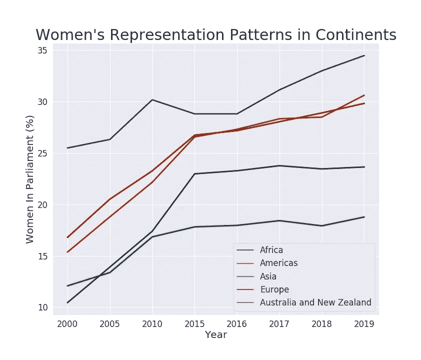
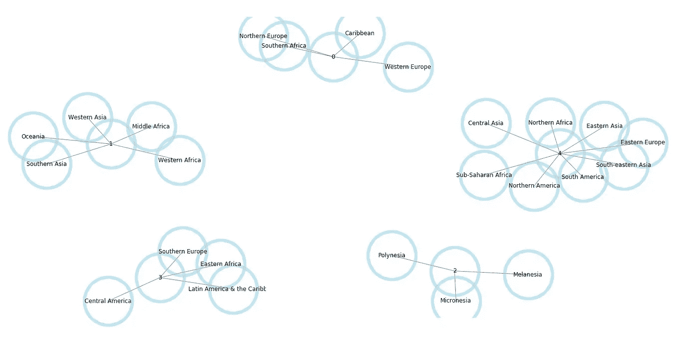
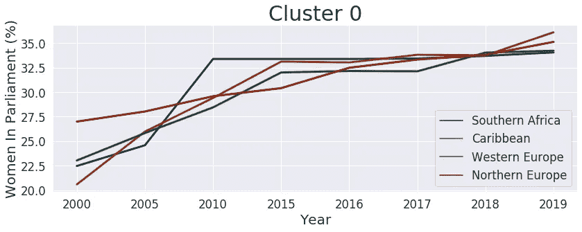
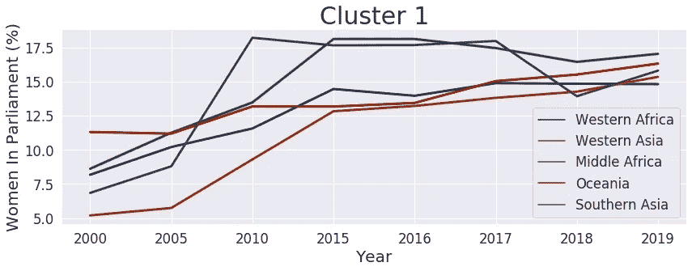
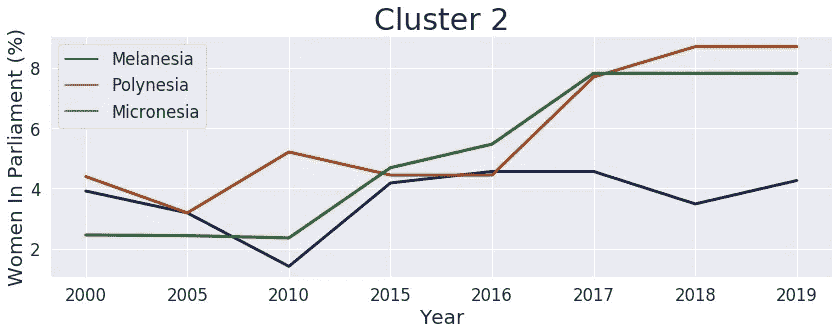
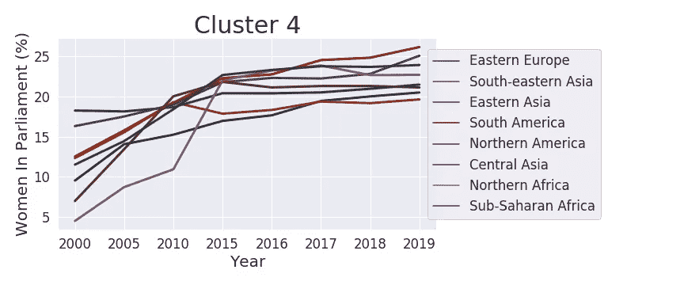
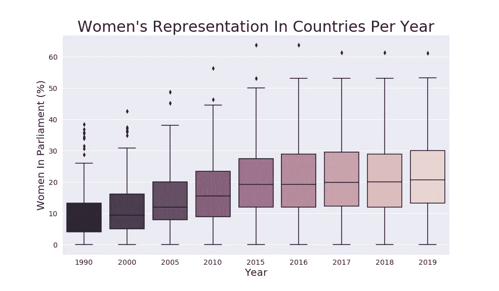
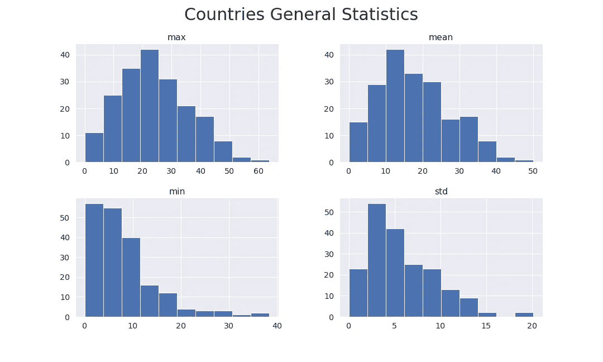

# 数据故事——过去 30 年议会中的妇女

> 原文：<https://towardsdatascience.com/women-in-parliament-worldwide-in-the-past-30-years-data-driven-analysis-272dbc88f6f7?source=collection_archive---------22----------------------->

## 基于联合国数据集对 1990 年以来世界各国议会中女性代表情况的探索性分析

当我们结束 2000 年代的第二个十年时，我发现回顾过去 30 年各国议会中的女性代表情况很有意思。为了了解我们从哪里来，我们去了哪里，我使用了联合国的数据集，并在非洲大陆和国家一级进行了分析，然后深入研究了有突出数字的国家，并试图了解它们是如何发生的，以及如果我们希望在其他地方看到类似的表现，我们应该从中吸取什么教训。在分析过程中，我发现了几个有趣的、令人惊讶的和令人鼓舞的发现，我将在这篇博文中展示和讨论这些发现，所以废话不多说，让我们开始吧。

# 各大洲——总体趋势是积极的，澳大利亚和新西兰在代表性方面领先

我首先好奇的是各大洲的趋势。得知全世界的总体趋势无一例外都是积极的，我感到惊讶和高兴。此外，有趣的是，看到非洲和亚洲开始时非常接近，但分开了，在这一时期结束时，非洲比亚洲表现出更高的代表性，然而，他们的趋势非常相似。欧洲和美洲的接近也很有趣——我希望看到这两个地区的不同模式。最后但同样重要的是，澳大利亚和新西兰显示出独特的模式，在整个期间，妇女在议会中的代表比例最高，在 2015-2016 年期间略有下降，然后是稳定的积极趋势，我希望这一趋势在未来继续下去。

然后，我查看了每年所有分支机构的代表情况。这方面的趋势也是积极的——在 90 年代初，我们勉强抓住了女性所占席位的四分之一，而在 2019 年，次大陆的最高平均水平超过了 35%。这不是最理想的，但似乎我们正在慢慢实现。然而，需要注意的一件重要事情是每个盒子的底线——一些次大陆仍然保持着平均低于 5%的女性席位。

然后，我将各大洲分成五个组，因为我预计同一个大洲的子大陆会聚集在一起。令人惊讶的是，这种情况并没有发生，从结果中可以看出，例如，我们将北欧和西欧以及加勒比海和东非放在同一个群集 0 中，而在另一个群集 0 中，我们将南亚和西亚与中非、西非和大洋洲放在一起(群集 1)。不同的次大陆显示的模式与它们的邻居不一样，但与地球上其他地方的次大陆相似。

观察每个集群会发现一些有趣的模式:

第一个集群将最初占 20-28%的子大陆组合在一起，缓慢但稳定地上升，并在 2019 年达到 33%以上。有趣的是，我们在这里可以看到，加勒比海地区开始时的比例最低，略高于 20%，结束时的比例最高，略高于 35%，而南部非洲开始时为 22.5%，在最初的十年里有了很大的飞跃，并在过去十年里保持了大约 33%的稳定比例。

第二类是不太同质的子大陆，从低于 12%的相对较低的代表开始，有一个小的飞跃和下降，然后集中在 16%左右。

在第三组中，我们有相邻的美拉尼西亚、波利尼西亚和密克罗尼西亚，它们各自显示出相当独立的模式，我假设它们由于与所有其他次大陆相比的独特性而聚集在一起。请注意一路走来的小代表，在 2000 年抓到 5%,现在保持在 10%以下。

第四个聚类对 2000 年至 2015 年间代表人数大幅增加的次大陆进行了分组，然后在过去四年中保持稳定的代表人数，其中一些次大陆的代表人数有所增加。**如果有人想知道如何扩大女性在议会中的代表性，那么这个集群中的次大陆是值得学习的地方**，特别是南欧的代表在 2000 年至 2015 年间增加了两倍，中美洲的代表在同一年间增加了一倍，并且在过去四年中继续增加。

最后一组相当混乱，没有一个明确的模式。我们确实在这里看到了在 2015-2019 年间保持稳定的国家，以及在此之前几年上升的国家。有趣的是，东南亚和南美洲(橙色和红色线)在 2000 年至 2010 年间的代表性和上升率几乎相同，但随后又有所不同，后者的代表性有所下降，而第一名的代表性最高。另一个值得学习的次大陆是北非，在 2000 年至 2015 年期间，这一比例增加了 4 倍，然后在过去 4 年保持稳定。

# 国家——我们能从卢旺达和玻利维亚学到什么

然后我放大了这些国家。我想知道的第一件事是，基于更高分辨率的每年的盒状图是否会很快显示出一些有趣的东西——答案是肯定的。在这个图中，有更好的消息，范围的上限从 1990 年的 30%以下延伸到现在的 50%以上，异常值在 1990 年达到 40%，现在超过 60%。在这里，注意每年的下限也很重要——过去和现在都有国家的议会中没有女性代表。

研究这些国家的描述性统计数据会发现更多有趣的事实。从最大值直方图(左上角)中，我们可以看到，只有 11 个国家(数据集中总共 195 个国家)达到了低于 10%的最大代表比例，根据最小值直方图(左下角)，大多数国家在观察期间至少有一次由妇女担任的席位不到 10%。平均直方图(右上角)显示，在大多数国家，平均比例超过 10%,其中一些国家的比例超过 40%,这一事实使人们有理由乐观地认为这一趋势将持续下去。标准差直方图显示，大多数国家都有稳定的代表率。

然后我想看看自 1990 年和 2010 年以来取得的进步。为此，我计算了每个国家在 2019 年和 2010 年、2000 年和 1990 年之间的代表性差异(即过去 10 年、20 年和 30 年的差异)。下面的直方图总结了差异的总体趋势。

我们可以看到，许多国家做出了微小的改变(如果有的话)，少数国家做出了重大的积极改变，而一些国家在观察期间出现了下降。

然后，我放大了具体的国家，检查了哪些国家在过去 10 年、20 年和 30 年中女性比例上升幅度最大。

有趣的是，这些国家大多是发展中国家，卢旺达、玻利维亚和格林纳达名列前茅。
这些飞跃的主要原因之一是**配额**——这种制度的核心思想是招募女性担任政治职务，并确保她们不只是政治生活中的一些象征，通常是通过为女性保留特定数量的席位。这种制度自 1997 年起在玻利维亚实施，随着性别平等是国家基本价值观之一的新《宪法》的通过，以及 2012 年该国通过的《禁止对妇女的政治暴力和骚扰法》的通过，这种制度促进了代表人数的增加。在卢旺达，这一进步主要归功于 1995 年的种族灭绝，当时大约 65%的人口是女性，也归功于保罗·卡加梅——自 2000 年起担任卢旺达总统，他领导了对平等的呼吁。卢旺达妇女人数上升的其他因素是，该国于 2003 年通过了新宪法，规定 30%的议会席位将保留给妇女(配额)，并努力教育女孩和任命妇女担任领导职务[【3】](#_ftn3)。**相反，格林纳达**已经取得了重大进步，尽管该国没有采取任何措施来实现这一进步[【4】](#_ftn4)。

还有这个比率的另一面——代表率变化最小的国家，其中一些国家出现了负变化，这意味着他们的代表率在几十年间下降了。有些下降是因为开始时比例很高，有些是因为政府不太愿意处理平等代表权的问题。

我停留在单个国家的决议中，检查了 1990 年、2000 年、2010 年和 2019 年女性所占席位百分比最高和最低的国家是谁。

在 20 世纪 90 年代代表性最高的国家(左图)中，除了冰岛，还有两个前苏联国家(土库曼斯坦和亚美尼亚)以及圭亚那、罗马尼亚、古巴和阿尔巴尼亚。在右边的图中，我们看到了代表率最低的国家，在观察的年份都是 0%。

在 2000 年，斯堪的纳维亚人仍然在左边的列表中占据首位，这里几乎所有的国家都是欧洲和/或属于发达国家。在右边的图中，我们仍然可以看到没有代表的国家，但有四个国家的议会中有一些女性，这是一个小小的鼓舞。

2010 年，我们在左图中看到了更多的非洲国家和更少的欧洲国家，女性占据了更高比例的席位。卢旺达今年已经以多数票高居榜首(！)议会中的女性。在右边，我们看到议会中没有女性的国家更少，这里的最高值高于前十年同一列表中的最高值。

然后我们就到了现在。**至于 2019 年，世界上有三个国家的女性在议会中占多数——卢旺达、古巴和玻利维亚**。纵观最高代表的名单，我们看到更多的非洲国家和更少的欧洲国家(只有两个)，这一荣誉不是由斯堪的纳维亚人保持的，令人惊讶的是——尽管头条新闻——芬兰甚至没有进入前十名。在右边，我们看到只有两个国家的妇女任职人数为零，这两个国家的妇女任职人数也高于十年前。

我从这四个数字得出的主要结论是，情况仍然不是最佳的，但总体上正在改善。此外，通过深入研究数字背后的故事，我得出结论，妇女代表人数的增加通常是具体行动的结果，而在政府忽视平等代表问题的地方，数字很低，在一些地方还在下降。

最后，我画出了当今世界每个国家的女性代表。我希望这一数字将提醒我们，尽管上述总体趋势是积极的，但我们仍有很长的路要走。

(要查看每个国家/地区的地图和图示，请按 Run Pen 并将鼠标悬停在地图上)。

**方法**

我分析的数据集包含了 1990 年、2000 年、2005 年、2010 年和 2015 年至 2019 年期间世界各国议会中女性所占席位的百分比，以及 2000 年、2005 年、2010 年、2015 年至 2019 年期间各大洲和次大陆的平均百分比。

我为分析写的数据集和代码可以在[这里](https://github.com/meiruv/Women-In-Parliament)找到。

**参考文献**

[【1】](#_ftnref1)[https://www.idea.int/data-tools/data/gender-quotas/quotas?FB clid = iwar 0 ekcthhoewxfs 0 ysgnskagottpro _ omtj 1 pr-yudhl 44 tnmsicfkdeehe # what](https://www.idea.int/data-tools/data/gender-quotas/quotas?fbclid=IwAR0EkcThHOEWXFs0YSgNsKaGotTpro_omTJ1PR-yudhl44TnmSIcFkDeehE#what)

[【2】](#_ftnref2)[https://www . idea . int/news-media/news/Bolivian-elections-result-more-women-parliament？FB clid = iwar 1 fu 1 ejentso 2 fejp 3 peoplz 7 ei 7 pmeezgts 5 lt-qwskwwehntjnua 10kc](https://www.idea.int/news-media/news/bolivian-elections-result-more-women-parliament?fbclid=IwAR1FU1eJENtSOi2fejP3eOPlz7Ei7PMEezGts5LT-qWskwWeHnTJNUA10kc)

[【3】](#_ftnref3)[https://www . NPR . org/sections/goatsandsoda/2016/07/29/487360094/invisibilia-no-one-thought-this-all-woms-debate-team-can-crush-it](https://www.npr.org/sections/goatsandsoda/2016/07/29/487360094/invisibilia-no-one-thought-this-all-womans-debate-team-could-crush-it)

[【4】](#_ftnref4)[https://iknow politics . org/sites/default/files/JM _ where _ are _ the _ women _ CARICOM . pdf](https://iknowpolitics.org/sites/default/files/jm_where_are_the_women_caricom.pdf)