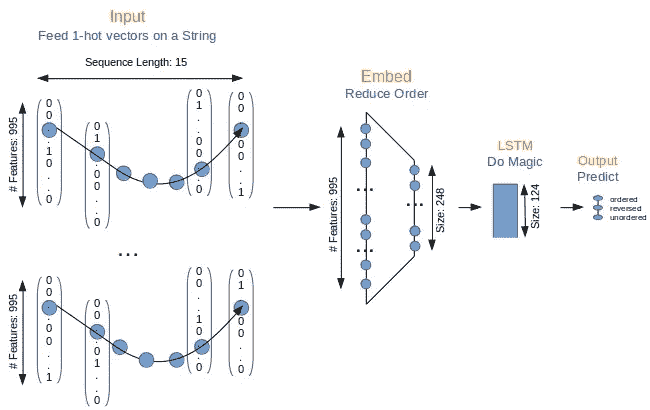
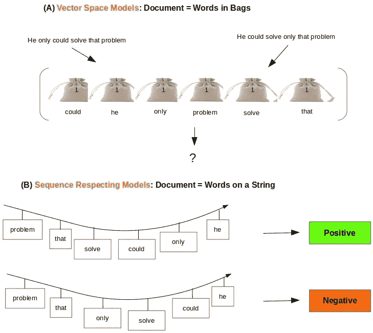
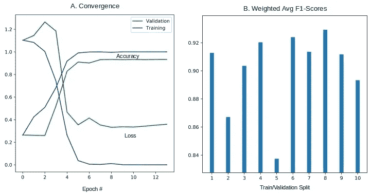
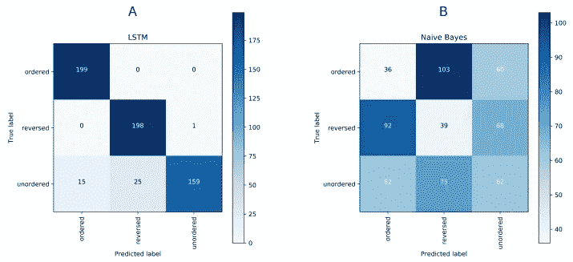

# 用于文本分类的词袋与词序列

> 原文：<https://towardsdatascience.com/word-bags-vs-word-sequences-for-text-classification-e0222c21d2ec?source=collection_archive---------10----------------------->

*当所述序列对分类重要时，序列尊重方法比词袋实现具有优势。在合成文本语料库上，针对具有 tf-idf 向量的朴素贝叶斯评估具有单词序列的长短期记忆(LSTM)神经网络的分类有效性。*



想想这两句俏皮话:“*为了活着而吃饭*”和“*为了吃饭而活着*”。它们包含相同的单词，但顺序不同——导致意思上的巨大差异。基于单词包的模型不能区分这些文档，因此将它们放在相同的聚类或分类桶中。单词嵌入没有任何帮助，因为预先训练或定制的单词向量只是单词的函数，而没有考虑单词在句子中的位置。我们在以前的文章中考虑的所有 NLP 练习([分类](http://xplordat.com/2018/10/09/word-embeddings-and-document-vectors-part-2-classification/)，[聚类](http://lordat.com/2018/12/14/want-to-cluster-text-try-custom-word-embeddings/))都使用了这种单词袋方法将文档转换成数字向量(有或没有单词嵌入)，因此也有同样的缺陷。这就是长短期记忆(LSTM)神经网络深度学习的前景可以得到检验的地方。



Figure 1\. (A) The meaning implied by the specific sequence of words is destroyed in a bag-of-words approach. (B) Sequence respecting models have an edge when a play on words changes the meaning and the associated classification label

LSTM 神经网络是递归神经网络(RNN)的一个分支，其标志是从序列中学习和预测——例如由单词序列组成的句子/语音，或者监控随时间演变的数据。LSTM 神经网络弥补了从长序列中学习的一些缺点，因此比 RNN 更有效。关于 RNN 和 LSTM 网络，已经有很多文章了，所以我们在这里就不深究细节了。参见 [Karpathy 的](http://karpathy.github.io/2015/05/21/rnn-effectiveness/)文章， [Colah 的博客](http://colah.github.io/posts/2015-08-Understanding-LSTMs/)对 rnn、LSTMs 及其功能的精彩介绍。当然还有许多关于[媒体](https://towardsdatascience.com)的文章以及 Jason Brownlee 在[机器学习大师](https://machinelearningmastery.com)上写的文章。

这篇文章尝试使用 tf-idf 向量，用 LSTM 和朴素贝叶斯对合成单词序列进行分类。LSTM 通过 [Keras](https://keras.io/) 和 [Tensorflow](https://www.tensorflow.org/) 后端实现。朴素贝叶斯是通过 [SciKit](https://scikit-learn.org/stable/index.html) 实现的。当我们在这里浏览一些代码片段时，可以从 [github](https://github.com/ashokc/word-bags-vs-word-sequences-for-text-classification) 下载重现结果的完整代码。主要进口如下。

```
import numpy as np
import os
import json
from sklearn.metrics import classification_report, confusion_matrix
from sklearn.model_selection import StratifiedShuffleSplit
import random as rn
import keras
import tensorflow as tf
os.environ['TF_CPP_MIN_LOG_LEVEL']='2'
```

在下面的代码片段中，我们修复了 numpy 和 tensorflow 的随机种子，这样我们就可以获得可重复的结果。此外，在运行模拟之前，我们将 PYTHONHASHSEED=0 设置为 shell 中的环境变量。

```
#All this for reproducibility
np.random.seed(1)
rn.seed(1)
tf.set_random_seed(1)
session_conf = tf.ConfigProto(intra_op_parallelism_threads=1,inter_op_parallelism_threads=1)
sess = tf.Session(graph=tf.get_default_graph(), config=session_conf)
keras.backend.set_session(sess)
```

## 1.构建一个文本语料库

这篇文章是为了说明的目的。我们想强调的一点是，当面对必须对文本进行分类时，基于单词包的分类器会严重失败，其中单词序列是类之间的主要区分因素，如上图 1 所示。为了轻松做到这一点，我们*构建*一个文本语料库，而不用担心所构建句子的含义。

*   挑选一组单词，如[前 1000 个最常用的单词](https://gist.github.com/deekayen/4148741)，并对它们进行排序。获得 995 个唯一单词。第 2–6 行
*   用这些单词造 3 个独立的句子。
*   **有序**:取 15 个字，顺序如 0..14, 1..15, … 995..13 等…从这个列表。我们得到 995 个属于这个*有序*类的句子。第 9–14 行
*   **反转:**以上每一个序列都是反转的。第 16–18 行
*   **无序 *:*** 随机选取 25 个单词组成一个序列。又是 995 个这样的序列，所以三个类都是平衡的。第 19–22 行
*   混洗和分割以获得训练和测试数据集。我们留出所有数据的 20%专门用于测试。第 23–24 行

以下是用这种方法形成的几个样本序列及其所属的类。

**有序:** ['一'，'能'，'约'，'上'，'行'，'加'，'怕'，'后'，'又'，'反对'，'年龄'，'前'，'同意'，'空气'，'所有']

**反转:** ['所有'，'空气'，'同意'，'以前'，'年龄'，'反对'，'再次'，'以后'，'害怕'，'添加'，'行为'，'以上'，'关于'，'能干'，'一']

**无序:** ['原子'，'安逸'，'尝试'，'船'，'睡眠'，'烦恼'，'见'，'推'，'拿'，'谁'，'冷'，'选择'，'冬天'，'自己'，'身边']

## 2.文档=一串单词

每个文档都是一串单词，我们构建的数据结构可以被 Keras 库中的各种序列相关模型(如 RNN、LSTM 等)用作输入。

## 2.1 编码

对所有的句子/序列使用 Keras 文本处理器，这样它可以生成一个单词索引，并相应地对每个序列进行编码(下面的第 2 -4 行)。注意，我们不需要填充，因为所有序列的长度正好是 15。

```
# Encode the documents
kTokenizer = keras.preprocessing.text.Tokenizer() # **Line 2**
kTokenizer.fit_on_texts(X)
Xencoded = np.array([np.array(xi) for xi in kTokenizer.texts_to_sequences(X)])                # **Line 4**
labels = np.array(labels)
```

## 2.2 LSTM 实施

我们使用最简单的 LSTM 模型，包括嵌入层、LSTM 层和输出层，如下图 2 所示。


Figure 2\. A simple model for LSTM. Input sequences of length 15 are fed in batches of 32 The embedding layer reduces the size of the 1-hot vectors, while the magic of LSTM results in softmax predictions for the 3 possible classes.

顺序的 15 个字(其中每个字是 1-hot 向量)被抽取作为嵌入层的输入，该嵌入层学习用于从 995 长到 248 长的数值向量的降阶的权重。这个 248 长的向量序列被馈送到 LSTM 层，通过 softmax 激活输出层产生 3 长的数值向量。然后，最大值的索引是预测的类别

*   第 5 行:嵌入层构建了一个单词向量，其大小是输入向量的 1/4。也就是说，在我们的例子中，LSTM 层被馈送一个大小约为 250 的数值向量，而我们的输入向量大小约为 1000。
*   第 6 行:LSTM 层输出一个 125 长的矢量，这个矢量在 softmax 激活时被输入到最后一层。
*   第 7 行:最终输出图层生成一个与标注数量一样长的矢量，该矢量的 argmax 是预测的类标注。

有了数据和模型，我们就可以训练模型并测试预测了。因为这是一个多类分类，所以我们在第 3–4 行将标签转换为 1-热点向量

```
train_x = Xencoded[train_indices]
test_x = Xencoded[test_indices]
train_labels = keras.utils.to_categorical(labels[train_indices], len(labelToName))
test_labels = keras.utils.to_categorical(labels[test_indices], len(labelToName))
```

在多次训练/验证模拟中，80%的数据被分成验证(这 80%的 20%，即总体 16%)和训练集(总体数据的 64%)。

*   第 2 行:如果确认损失在任何连续 5 个时期都没有减少，我们退出并停止训练。
*   第 3 行:我们设置了 10 个不同的训练/验证分割来循环。
*   第 7 行:培训以 32 个句子为一批，最多 50 个周期，如前所述，提前停止回拨。
*   第 11 行。从 softmax 输出向量中获取实际预测的标签。

## 3.文档=文字袋

使用 SciKit 的矢量器，从单词包方法中构建矢量非常简单。在之前的帖子中，我们已经多次这样做了。这里我们使用 tf-idf 矢量器进行编码。

## 3.1 编码

```
from sklearn.feature_extraction.text import TfidfVectorizer
vectorizer = TfidfVectorizer(analyzer=lambda x: x, min_df=1).fit(X)
Xencoded=vectorizer.transform(X)
```

上面第 2 行的结果是一个稀疏的 tf-idf 数值向量数组，它可以提供给任意数量的传统分类器，如朴素贝叶斯、支持向量机等。这里我们选择朴素贝叶斯，它们中最简单的一个。

## 3.2 朴素贝叶斯实现

我们在下面的代码片段中使用了 SciKit 的 API。用于 LSTM 的相同的训练/测试数据在这里被用于训练和预测。

# 4.结果

对于我们在这里对比的两种方法，完整的代码在 [github](https://github.com/ashokc/word-bags-vs-word-sequences-for-text-classification) 上以 *lstm.py* 和 *nb.py* 的名称下载。

## 4.1 LSTM

样品运行与

```
#!/bin/bash
PYTHONHASHSEED=0 ; pipenv run python lstm.py
```

产量:

```
Layer (type)                 Output Shape              Param #   
=================================================================
embedding_1 (Embedding)      (None, 15, 248)           247008    
_________________________________________________________________
lstm_1 (LSTM)                (None, 124)               185008    
_________________________________________________________________
dense_1 (Dense)              (None, 3)                 375       
=================================================================
Total params: 432,391
Trainable params: 432,391
Non-trainable params: 0
_________________________________________________________________
None
Train on 1910 samples, validate on 478 samples
Epoch 1/50
 - 3s - loss: 1.1036 - acc: 0.2890 - val_loss: 1.1027 - val_acc: 0.2322
Epoch 2/50
 - 3s - loss: 1.0813 - acc: 0.4429 - val_loss: 1.1533 - val_acc: 0.2343
Epoch 3/50
..
..
Epoch 11/50
 - 3s - loss: 8.5663e-04 - acc: 1.0000 - val_loss: 0.6081 - val_acc: 0.9079
Epoch 00011: early stopping

Confusion Matrix:

[[190   4   5]
 [  0 199   0]
 [ 14  28 157]]

Classification Report:

              precision    recall  f1-score   support

     ordered     0.9314    0.9548    0.9429       199
    reversed     0.8615    1.0000    0.9256       199
   unordered     0.9691    0.7889    0.8698       199

   micro avg     0.9146    0.9146    0.9146       597
   macro avg     0.9207    0.9146    0.9128       597
weighted avg     0.9207    0.9146    0.9128       59
```

显示在第 11 个时间点触发了提前停站，同时获得了 0.91 的 f1 分数。样本分割的收敛速度，以及通过 10 次不同分割获得的 f1 分数如下图 3 所示。



Figure 3\. Results with LSTM. (A) Training is essentially completed in 7 epochs but patience keeps us till 12 epochs or so. (B). Very good f1-scores in all cases. The average is close to 0.9

## 4.2 朴素贝叶斯

运行朴素贝叶斯也是类似的，其中*python hashseed = 0；pipenv 运行 python nb.py* 。不幸的是，正如我们在下面看到的，这产生了 0.23**的平均 f1 分数。这与 LSTM 获得的 0.9 相差甚远。**

```
Confusion Matrix:

[[ 36 103  60]
 [ 92  39  68]
 [ 62  75  62]]

Classification Report:

              precision    recall  f1-score   support

     ordered     0.1895    0.1809    0.1851       199
    reversed     0.1797    0.1960    0.1875       199
   unordered     0.3263    0.3116    0.3188       199

   micro avg     0.2295    0.2295    0.2295       597
   macro avg     0.2318    0.2295    0.2305       597
weighted avg     0.2318    0.2295    0.2305       597
```

图 4 展示了并排使用 LSTM 和朴素贝叶斯得到的混淆矩阵，以供比较。与朴素贝叶斯相比，LSTM 的对角优势表明它有更好的预测和更大的 f1 值。



Figure 4\. (A) LSTM does extremely well correctly predicting labels for ordered and reversed sequences. Some hesitation can be seen with predicting the label for unordered sequences. (B) Naive Bayes using tf-idf vectors has great difficulty figuring out the class and gets them mostly wrong.

## 5.结论和后续步骤

这就结束了我们的论证，即当所述序列对于手边的任务是重要的时，尊重序列的方法将在 NLP 任务中做得更好。因此，当单词序列很重要时，用于文档的单词串方法相对于传统的单词包方法具有优势。LSTM 等深度学习模型尊重单词的顺序，因此可以预期会做得更好。我们构建了一个合成文本语料库，并表明 LSTM 对 3 级 f1 得分达到了 90%以上，而使用 tf-idf 向量的朴素贝叶斯分类器仅产生了 0.23。

文本语料库的人工性质是朴素贝叶斯与 LSTM 相比表现极端不佳的原因。但是正如我们所说的，这篇文章的目的是说明性的，即强调什么时候&为什么尊重序列的方法比传统的单词袋方法有优势。在本系列的下一篇文章中，我们将对一些真实的文本语料库重复这些测试，看看我们的情况如何。

…

*原载于 2019 年 1 月 13 日*[*xplordat.com*](http://xplordat.com/2018/09/27/word-embeddings-and-document-vectors-part-1-similarity/)*。*