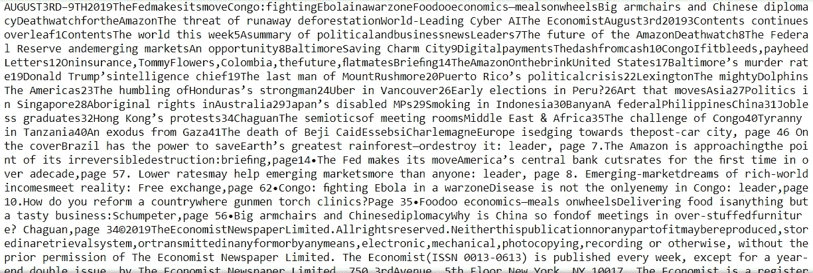
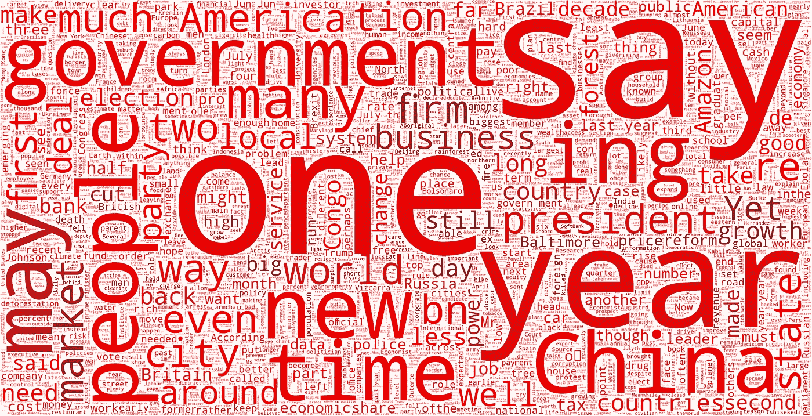

# Python 中的词云:综合示例

> 原文：<https://towardsdatascience.com/word-clouds-in-python-comprehensive-example-8aee4343c0bf?source=collection_archive---------9----------------------->

## 根据词频可视化文本——经济学家风格

Image from [Wikipedia](https://en.wikipedia.org/wiki/The_Economist)

这是一个简单的练习，将我的最新一期[的](https://www.economist.com/)[和《经济学人》的](https://shop.economist.com/products/the-economist-in-print-or-audio-august-3rd-2019)形象化在一个单词云中。我没有心情真正阅读这期杂志，所以我认为这是一种快速消化信息的有趣方式。

# 目录

*   PDF 到文本的转换
*   文本预处理
*   词云

# PDF 到文本的转换

该过程的第一步是将原始 PDF 文档转换为文本。我是用 [pdfminer.six](http://www.blog.pythonlibrary.org/2018/05/03/exporting-data-from-pdfs-with-python/) 完成的(python3 的)。

打印出来的文本是这样的:浏览整本书需要很长时间。对于像我这样忙碌的数据科学家来说，读起来太长了。这就是我们做这个词云的原因，宝贝。

# 文本预处理

现在我们需要清理数据，使图像中没有标点符号或无关紧要的单词:

# WordCloud

是时候把这些放在一起了！的。“面具”的 png 图像与本文开头的经济学人徽标相同。你会发现在最终的图像中它看起来很熟悉。

# 最终结果:

现在舅舅打电话给我说新闻的时候，我可以简单的把这个 wordcloud 里面最大的字读出来，显得知识渊博！注意单词 cloud 和 logo 的配色方案是一样的。如果你从电脑前走开，从远处看图像，你可以从色差中隐约看到《经济学人》。

如果您觉得这很有帮助，请订阅。如果你喜欢我的内容，下面是我做过的一些项目:

[*优步评论文本分析*](/uber-reviews-text-analysis-11613675046d)

[*Excel 与 SQL:概念上的比较*](/excel-vs-sql-a-conceptual-comparison-dcfbee640c83)

[*简单线性 vs 多项式回归*](/linear-vs-polynomial-regression-walk-through-83ca4f2363a3)

[*随机森林比 Logistic 回归好吗？*(一比较)](/is-random-forest-better-than-logistic-regression-a-comparison-7a0f068963e4)

[*基尼指数 vs 信息熵*](/gini-index-vs-information-entropy-7a7e4fed3fcb)

[*用 Python 中的逻辑回归预测癌症*](/predicting-cancer-with-logistic-regression-in-python-7b203ace16bc)

[二元逻辑回归示例(python)](/univariate-logistic-regression-example-in-python-acbefde8cc14)

[*【从零开始计算 R 平方(使用 python)*](/r-squared-recipe-5814995fa39a)

谢谢，

安德鲁