# Tableau 中的单词云:快速简单。

> 原文：<https://towardsdatascience.com/word-clouds-in-tableau-quick-easy-e71519cf507a?source=collection_archive---------0----------------------->

## 使用 Tableau 轻松创建单词云。


一个**字云，**也被称为**标签** **云**，是文本数据的可视化表示，通常用于描述网站上的[关键字元数据(标签)](https://en.wikipedia.org/wiki/Tag_(metadata))，或者可视化自由格式文本*维基百科*。单词云是一种流行的信息图表类型
，借助它我们可以显示数据中单词的相对频率。这可以通过数据中所选字段的大小或颜色来描述。它们是一个非常强大的功能，可以吸引人们对你的演讲或故事的注意

# 目标

[Tableau](https://www.tableau.com/) 是当今业界广泛使用的数据分析和可视化工具。Tableau 提供了一个本地特性，只需点击几下鼠标就可以创建单词云。这将是一篇非常短的文章，强调在 Tableau 中创建单词云所需的步骤。如果你想以 Tableau 开始一篇更详细的文章，请确保先阅读我的文章 [**数据可视化与 Tableau**](https://medium.com/@parulnith/data-visualisation-with-tableau-150f99a39bba)****。****

**尽管这篇文章关注的是单词云，但我也要提到一些关于使用单词云的可视化最佳实践。单词云看起来很酷，但有一些更好的替代品，以更清晰和准确的方式传达相同的信息。**

# **数据**

****

**[https://rogermooresmovienation.files.wordpress.com/2017/09/box1.jpg?w=640](https://rogermooresmovienation.files.wordpress.com/2017/09/box1.jpg?w=640)**

**[数据](https://www.vox.com/culture/2019/1/3/18165250/2018-box-office-top-movies-hollywood-netflix-black-panther)涉及 2018 年美国前 20 名电影，按国内票房收入数十亿美元排名。该数据还包含每部电影的 [**元符号**](https://en.wikipedia.org/wiki/Metacritic) 分数。Metacritic 是一个收集包括电影在内的媒体产品评论的网站。**

> **所有工作表和 Tableau 工作簿都可以从其关联的**存储库** [这里](https://github.com/parulnith/Data-Visualisation-libraries/tree/master/Data%20Visualisation%20with%20Tableau/Wordclouds%20with%20Tableau)访问。**

# **在 Tableau 中创建单词云**

## **按国内总收入计算的电影**

1.  **打开 Tableau 桌面并连接到数据源。你可以选择任何数据格式，但这里我们使用的是一个 [excel 文件](https://github.com/parulnith/Data-Visualisation-libraries/blob/master/Data%20Visualisation%20with%20Tableau/Wordclouds%20with%20Tableau/movies.xlsx)，其中有你想要的数据。**
2.  **将所需尺寸拖动到**标记**卡上的**文字**处。在这里，我将把**电影标题**拖到文本中，因为我想知道哪部电影在票房收入方面表现良好。**
3.  **将**国内总收益**拖动到**标记**卡上的**尺寸**上。**
4.  **现在将**国内总收入**拖到**标记**卡上的**颜色**上，因为我们希望颜色能够反映收入模式。**
5.  **将标记类型从**自动**更改为**文本**。**
6.  **接下来，你可以隐藏标题，根据你的喜好改变视图和背景，这样你的单词云就准备好了。**

****

**[Workbook](https://github.com/parulnith/Data-Visualisation-libraries/blob/master/Data%20Visualisation%20with%20Tableau/Wordclouds%20with%20Tableau/Word_cloud.twb)**

## **电影按照他们的元批评分数**

**步骤同上，除了我们使用**元临界分数**而不是收益。**

****

# **改进单词云**

**上述示例处理具有有限字段的简单且精炼的数据集。如果数据包含一本书的一个段落或一些段落，我们需要为此创建一个单词云，那会怎么样呢？让我们看一个这样的例子。**

## **资料组**

**出于演示的目的，我从我的一篇[中型文章](/image-segmentation-using-pythons-scikit-image-module-533a61ecc980)中选取了整篇文章。我复制了整个文本，不管内容如何，并把它放在一个`[text.txt](https://github.com/parulnith/Data-Visualisation-libraries/blob/master/Data%20Visualisation%20with%20Tableau/Wordclouds%20with%20Tableau/text.txt)`文件中。然后，我运行一个小的 python 脚本，将单词及其频率保存到一个 CSV 文件中。您可以使用自己选择的任何数据集。**

```
from collections import Counter
def word(fname):
        with open(fname) as f:
                return Counter(f.read().split())print(word_count("text.txt"))
```

**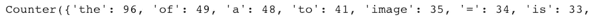**

```
import csv
my_dict = word_count("text.txt")
with open('test.csv', 'w') as f:
    for key in my_dict.keys():
        f.write("%s,%s\n"%(key,my_dict[key]))
```

**`[text.csv](https://github.com/parulnith/Data-Visualisation-libraries/blob/master/Data%20Visualisation%20with%20Tableau/Wordclouds%20with%20Tableau/test.csv)`是包含数据集的文件，如下所示:**

**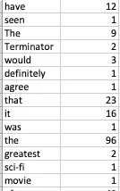**

**现在切换到画面。**

*   **使用`text.csv`文件中的单词创建一个单词云，如上所述。**

**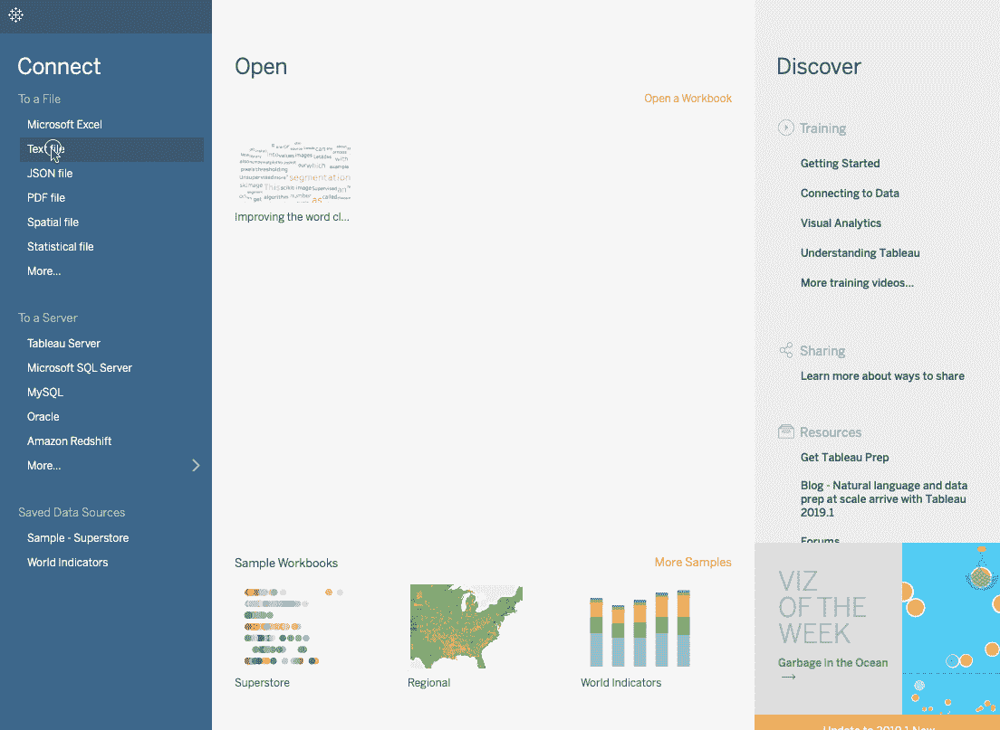**

*   **如果您想要限制条目的数量，可以使用单词计数作为过滤器，只显示出现频率最低的单词。**

**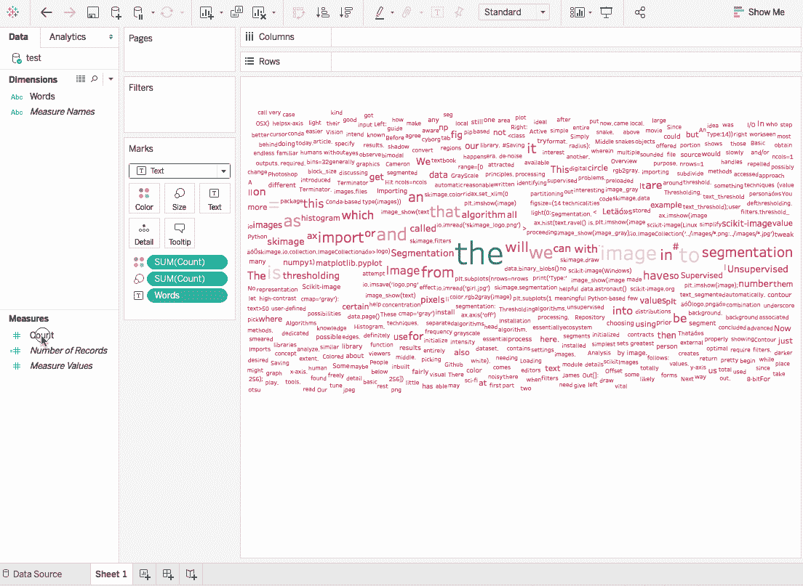**

*   ****去掉最常见的单词——**即使经过字数过滤，我们仍然看到像“**”、“**中”等没有太大意义的单词出现在整个工作表中。让我们摆脱他们。我们将首先创建一个英语常用词的[列表](https://en.wikipedia.org/wiki/Most_common_words_in_English)，可以从这里的[访问](https://github.com/parulnith/Data-Visualisation-libraries/blob/master/Data%20Visualisation%20with%20Tableau/Wordclouds%20with%20Tableau/common_words.xlsx)。该列表包含具有与其相关联的等级的单词，我们将使用该等级作为过滤的度量。**

**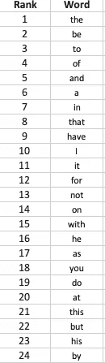**

**[common words in English](https://en.wikipedia.org/wiki/Most_common_words_in_English)**

*   **现在，让我们将此表添加到我们的工作簿中。这两个工作表将根据**单词**列进行混合，因为这是两个源所共有的。**
*   **创建一个新参数，命名为“**要排除的单词**”，设置如下:**

**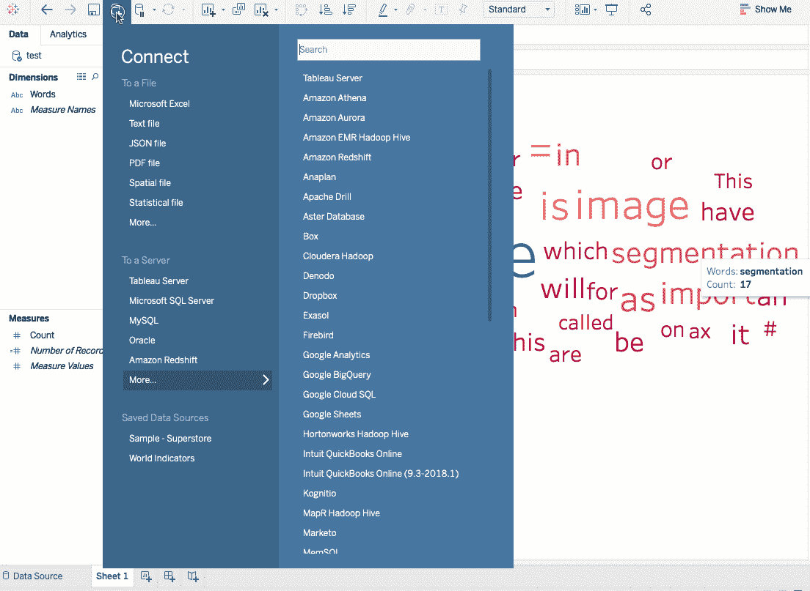**

*   **显示参数控件，通过过滤将最常用的词从云端排除。**

**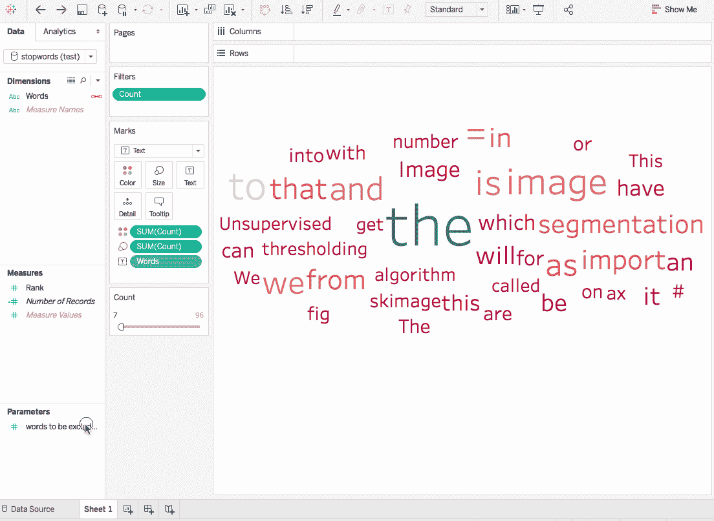**

**[Workbook](https://github.com/parulnith/Data-Visualisation-libraries/blob/master/Data%20Visualisation%20with%20Tableau/Wordclouds%20with%20Tableau/Improving%20the%20word%20cloud.twb)**

**现在调整设置，你可以有一个更好看的词云与过滤器选项。**

**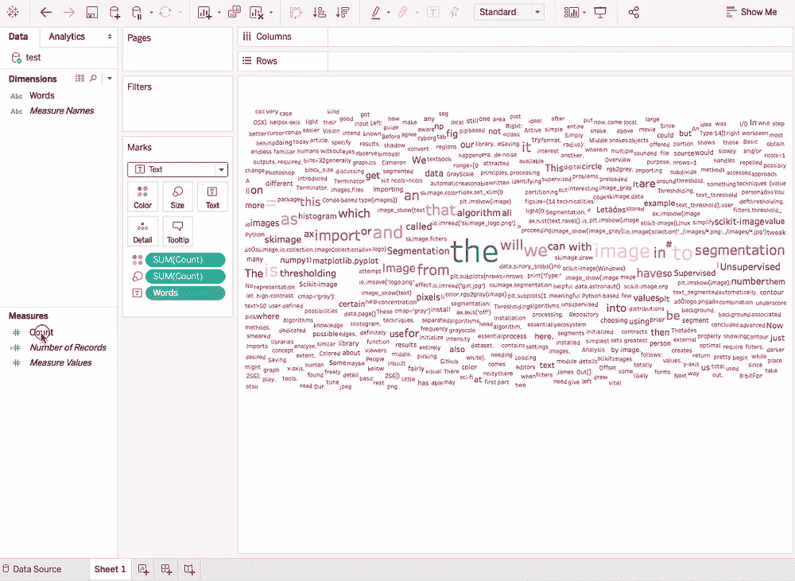****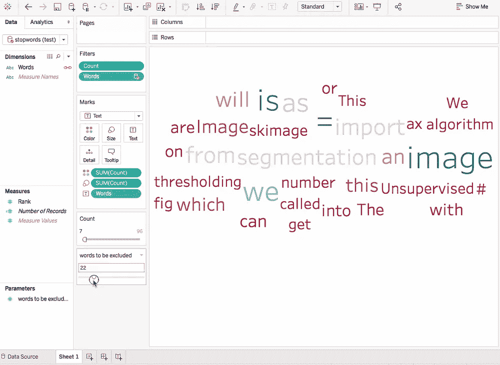**

**Before | After**

# **什么时候不要用词云**

**Marti A. Hearst 的客座博文[“标签云是怎么回事”](http://www.perceptualedge.com/articles/guests/whats_up_with_tag_clouds.pdf)在讨论词云时值得一读。单词云绝对引人注目，并提供了一种概览或第一视角，因为它们非常受欢迎，人们通常在他们的演示文稿中有一两个。**

**另一方面，与条形图不同，词云不提供相似大小的词之间的清晰区分。此外，属于同一类别的单词可能彼此相距甚远，较小的单词可能会被忽略。**

## **单词云的替代方案**

*   ****树形图****

**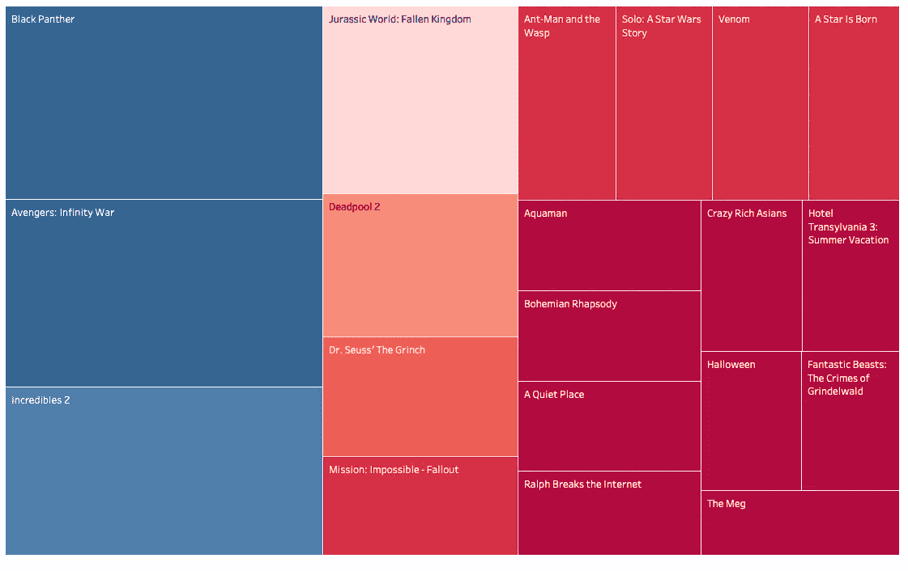**

**Tree Map**

**与单词云相比，树形图可能提供更好的想法，但不是最好的。**树形图有时被视为饼图的矩形表兄弟**，在显示详细信息时可能并不理想。**

*   ****条形图****

**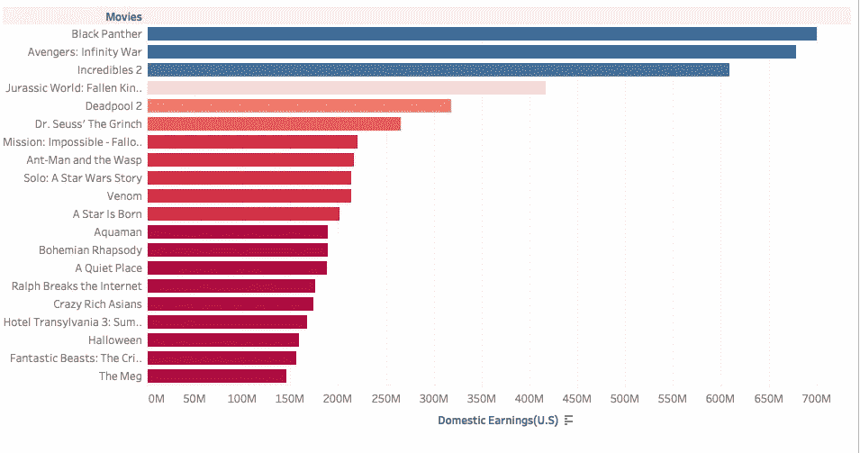**

**sorted Bar chart**

**排序后的条形图肯定能提供更好、更准确的信息，因为它给出了比较的基线。**

# **结论**

**文字云的确很吸引人，有助于展示更加精彩，但当涉及到严肃的数据分析时，有更好的工具可以尝试。然而，本文的主要目的是展示如何用最少的努力在 Tableau 中创建单词云。所以你可以试着用你选择的数据建立你自己的单词云。**