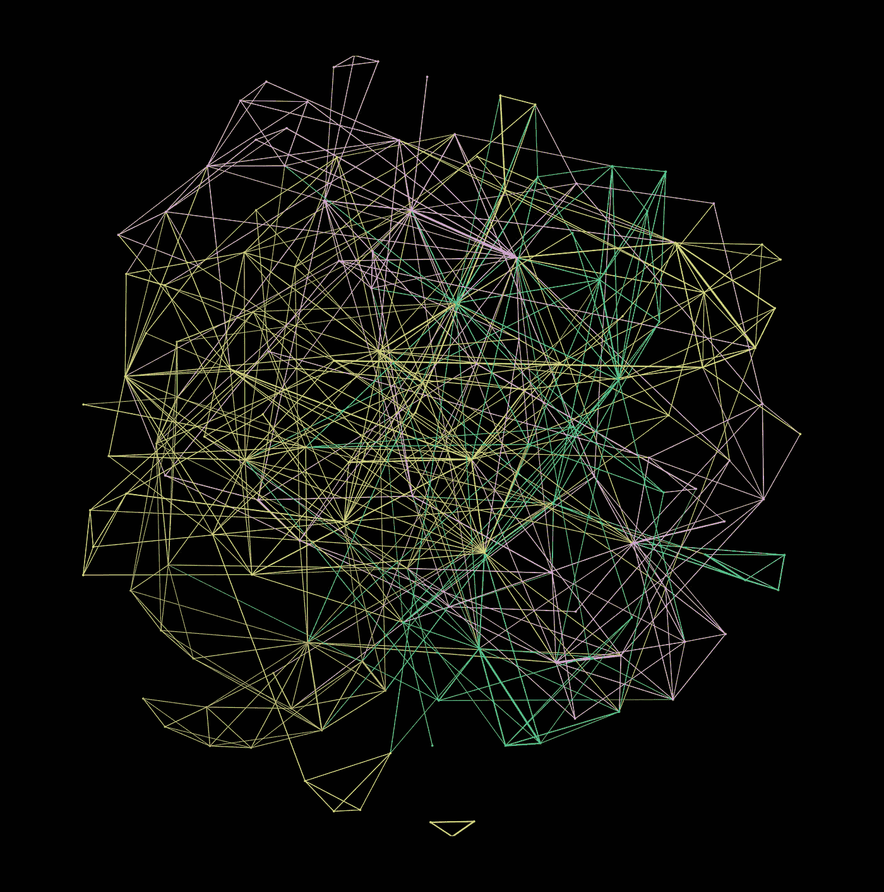
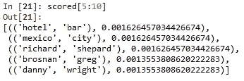
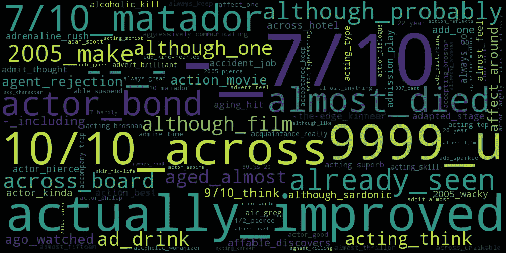
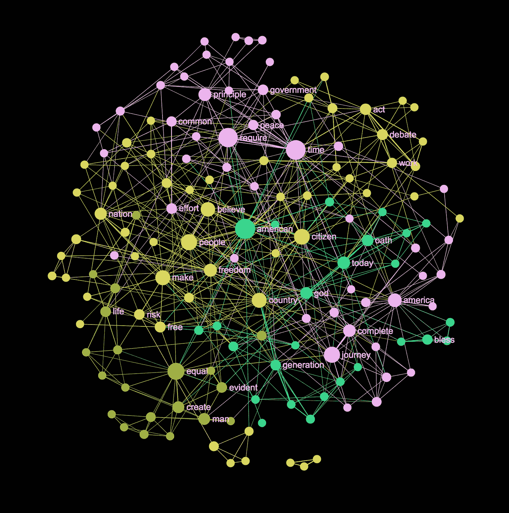
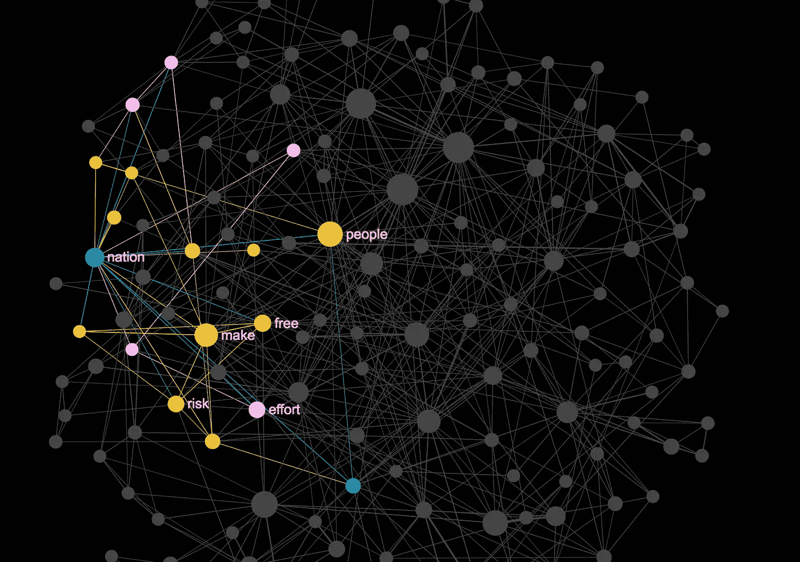
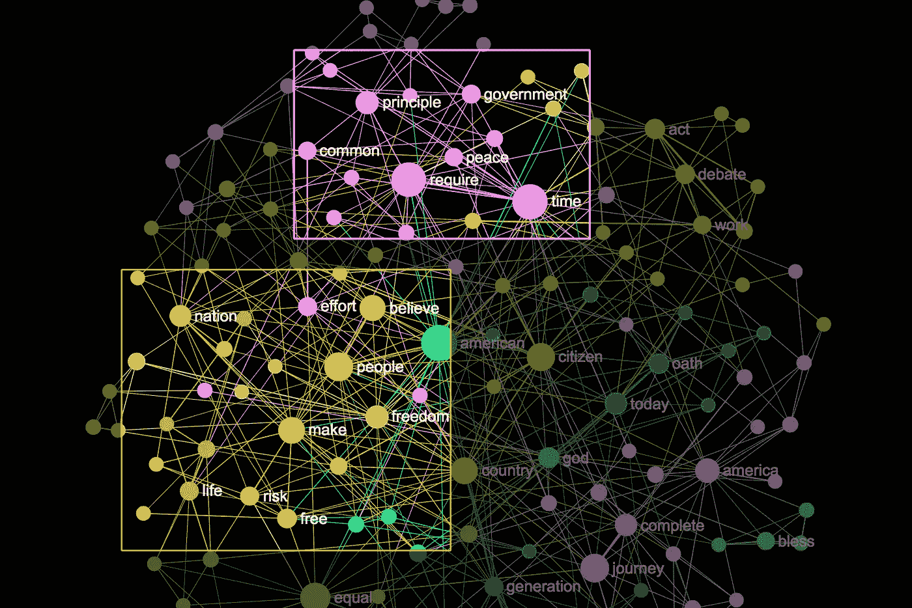
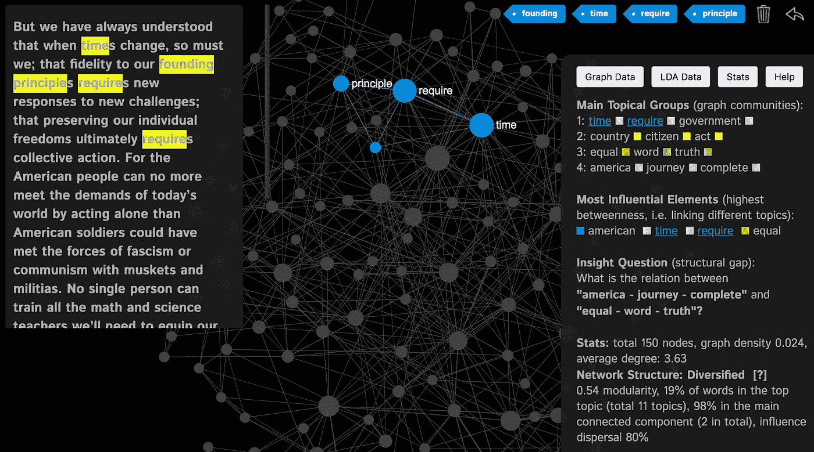

# 停止脱离上下文使用单词云

> 原文：<https://towardsdatascience.com/word-clouds-without-context-3a71b6dc3e2d?source=collection_archive---------15----------------------->

## 单词云不显示单词之间的关系，失去了上下文。文本网络可视化解决了这个问题。

Obama’s 2013 inauguration address word cloud generated with [Wordle](http://www.wordle.net/)

你在上面看到的是巴拉克·奥巴马 2013 年就职演说的文字云。我不知道单词 clouds 是否应该提供信息，希望不是，因为你从上面的单词 mess 中唯一能辨别的是关于“美国”、“人民”、“时间”和“国家”的东西。也许还有“公民”和“一代”。哦，他提到了一些关于“自由”的事情。相当明显，几乎没有任何信息。

如果文字云只是一个摆设，这就不是问题了。只不过它们经常被用作交流工具，帮助表达想法、提供观点、说服甚至推动议程。这使得它们非常危险，因为它们无处不在且易于使用。

> 单词云的主要问题是它们没有上下文。当失去了背景和细微差别，一切都变得面目全非。知识变得容易产生偏见和错误的解释，这在假新闻和后真相时代产生了更严重的后果。

词云显示没有关系。我们只是简单地看到最常见的较大的单词和一些颜色，它们主要是出于美观的原因。我们看不到任何模式，语言是由模式组成的。因此，文字云，至少以其目前的形式，应该被禁止出现在任何严肃的语境中，留给[装饰艺术](https://wordart.com/)和[儿童游戏](https://www.abcya.com/games/word_clouds)的领域，因为它们毕竟只是*娱乐*。

# 为什么词云无法修复

Abstract visualization of Obama’s inauguration address made with [InfraNodus](https://infranodus.com)

如果文字云如此糟糕，我们能对如此不完美呈现的现实做些什么？

答案就在“文本”这个词本身。它的起源是拉丁语*文本*或*‘编织’*，所以当我们写作时，我们是在编织线，把单词放在一起产生一个意思。如果我们想要形象化这个意思，我们不能仅仅放下单词之间的关系，它们必须被考虑进去。

一个可能的解决方案是在生成词云时考虑二元模型和 n 元模型。这个网上有[一些例子，主要涉及 R 和 Python。然而，这些是复杂的，上下文的问题仍然没有解决，因为使用 ngrams，你必须优先考虑某些单词的组合，所以最终信息会丢失。](https://avidml.wordpress.com/2017/08/03/word-cloud-with-frequently-occurring-bigrams-and-salient-bigrams/)

Making your own word cloud with n-grams in Python. Source: [https://avidml.wordpress.com/](https://avidml.wordpress.com/2017/08/03/word-cloud-with-frequently-occurring-bigrams-and-salient-bigrams/)

即使你设法得到有趣的结果，单词云表示本身也会把一切搞得一团糟，因为你必须根据上下文把这些短语一个接一个地排列起来，而没有一个框架能让你做到这一点。

Bigrams of words. Source: [https://avidml.wordpress.com/](https://avidml.wordpress.com/2017/08/03/word-cloud-with-frequently-occurring-bigrams-and-salient-bigrams/)

因此，让我们暂时忘记单词云、二元模型和 n-grams，再次思考它们之间的关系。

> 我们需要一种表示，让我们看到文本中最重要的术语，识别主要的主题簇，并显示它们之间的关系。
> 
> *文本网络分析让我们可以做到这一点。*

# 文本网络分析:带上下文的词云

Barack Obama’s 2013 inauguration speech represented as a text network graph with [InfraNodus.Com](https://infranodus.com). The bigger nodes are the words with a higher betweenness centrality, the colors indicate the topical clusters. The proximity of the words means the frequency of their co-occurrence.

[文本网络分析](https://noduslabs.com/wp-content/uploads/2019/06/InfraNodus-Paranyushkin-WWW19-Conference.pdf)是将每一个词表示为一个节点，将每一个词的共现表示为它们之间的一种关系的方法。(单词不一定要彼此相邻，它们也可以很近，并且可以用连接的权重来编码接近度)。然后创建单词节点和边的图。

> 文本网络图的好处是它们可以用定性和定量的方式进行分析。这意味着它们既可以被人类使用，也可以被机器使用。

使用该图，我们可以应用[社区检测算法](https://iopscience.iop.org/article/10.1088/1742-5468/2008/10/P10008/meta)来识别主题聚类，而 [Force-Atlas 布局算法](https://journals.plos.org/plosone/article?id=10.1371/journal.pone.0098679)可以被应用来在视觉上对齐彼此相邻的共现单词节点。节点的大小可以根据它们的频率(与它们的程度相关)进行调整。一个更有趣的衡量标准是[中间中心性](https://www.tandfonline.com/doi/abs/10.1080/0022250x.2001.9990249)，它表明单词在不同上下文之间出现的频率:意思的中心连接。

例如，我们可以从下面的文本网络中辨别出“民族”一词是与“人民”、“使”、“自由”、“风险”等词连用的。利用这一概念宣传让人们自由冒险的国家理念:

Selecting a node on the text network graph shows the other words it’s connected to

我们还可以检测单词共现的模式(基于社区检测算法，它们具有相同的颜色，并且基于 Force Atlas 布局，它们彼此更接近):

Nodes that are closer to each other and have the same color indicate topical clusters of co-occurring words.

最后，如果我们单击节点，我们还可以看到这个单词组合最常出现的实际文本。这对于标签云来说是不可能的，或者至少没有实现可以很容易地看到单词出现的上下文。

Clicking the words on the graph shows us the context where they appear in the text.

你自己判断吧，但我认为文本网络作为交流工具比标准的文字云更强大、更精确，最终也更有用。

> 每个单词节点的背景网络数据使得可以应用来自图论的各种方法来执行进一步的分析，并通过 API 将它传递给其他算法，这些算法可以更进一步。

现在，我要公开一件事。我对文字和网络着迷已经很多年了。这是我创建一个[开源](https://github.com/noduslabs/infranodus)工具 [InfraNodus](https://infranodus.com) 的部分原因，该工具用于为本文创建文本网络可视化。我喜欢在一幅图像中表现文本的复杂性，融合叙述展开所需的时间，展示文本编织的美，但又不失去上下文。此外，我们的大脑是网络，意义是相关的，所以使用这个比喻才有意义。

与此同时，通过我在 InfraNodus 工作时的经验和用户反馈，我了解到对于不习惯网络可视化的人来说，这可能很难理解(尽管这种情况正在迅速改变)。因此，将文字云的简单性与网络的力量结合起来可能会很有趣。这就是为什么 InfraNodus 即将发布的版本将提供一个词云应用程序，以便用户可以基于文本网络数据生成可嵌入的交互式词云，根据图形测量对词进行排序，并根据社区检测算法使它们更加接近。

如果你想探索文本网络，我鼓励你尝试一下开源工具[***【InfraNodus.Com***](https://infranodus.com)***】，我用它来做上面的可视化。***

***如果你对编码感兴趣，你也可以从***[***GitHub***](https://github.com/noduslabs/infranodus)***(你需要节点。Js、Java 和 Neo4J)甚至是 Python 版本(正在开发中)。非常感谢您的反馈和代码贡献！***

***你也可以在***[***【https://infranodus.com/politics/obamanew2013】***](https://infranodus.com/politics/obamanew2013)上使用上面奥巴马演讲的互动图