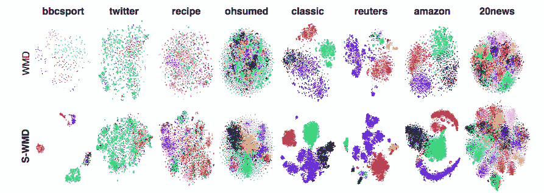
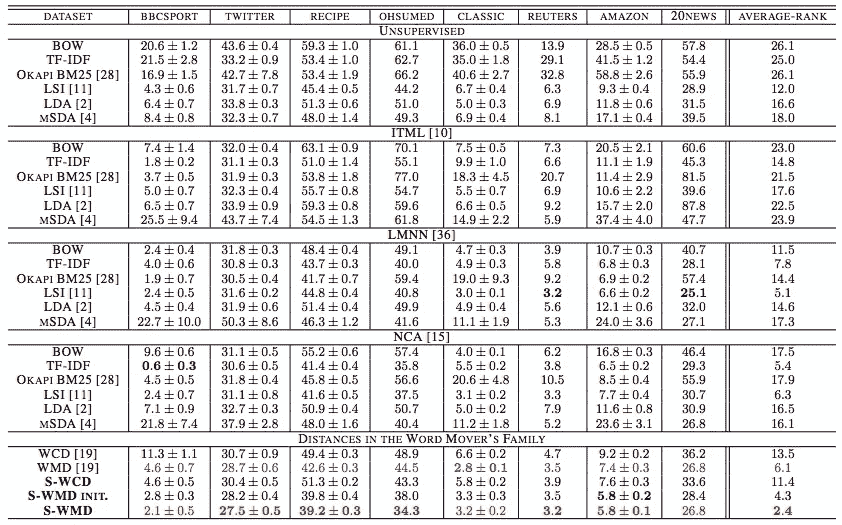

# 带权重的单词嵌入之间的单词距离

> 原文：<https://towardsdatascience.com/word-distance-between-word-embeddings-with-weight-bf02869c50e1?source=collection_archive---------16----------------------->

## 大规模杀伤性武器和半大规模杀伤性武器的区别

Photo by [Edward Ma](https://unsplash.com/@makcedward?utm_source=medium&utm_medium=referral) on [Unsplash](https://unsplash.com?utm_source=medium&utm_medium=referral)

在前面的故事中，我介绍了[单词移动器的距离(WMD)](/word-distance-between-word-embeddings-cc3e9cf1d632) ，它测量单词嵌入之间的距离。你可能会注意到单词之间没有加权机制。加权对 NLP 任务有什么帮助？为此，黄等人提出了一种改进方法，命名为监督字移动器距离(S-WMD)。

## 引入监督字移动器的距离(S-WMD)

在介绍[单词嵌入](/3-silver-bullets-of-word-embedding-in-nlp-10fa8f50cc5a)之前，[词袋(BoW)](/3-basic-approaches-in-bag-of-words-which-are-better-than-word-embeddings-c2cbc7398016) ，[潜在语义索引(LSI)和潜在语义分析(LSA)](/2-latent-methods-for-dimension-reduction-and-topic-modeling-20ff6d7d547) 是衡量 NLP 任务最有前途的技能。

[字动子的距离(WMD)](/word-distance-between-word-embeddings-cc3e9cf1d632)2015 年推出。它利用了 word emveddings (word2vec 于 2013 年推出)。它使用另一种方法，即推土机距离来测量向量之间的差异。一年后，黄等人提出了一种改进方法，称为监督字移动距离(S-WMD)。

The difference t-SNE plots of WMD and S-WMD (Huang et al., 2016)

简而言之，WMD 算法测量将两个文档中的一个单词向量传输到另一个向量的最小值。如果两个文档共享大量的单词，那么在两个文档之间传输只需要很小的移动。换句话说，这两个文档可以归类为相似文档。

# 加权机制

权重机制对 NLP 任务有什么帮助？通过引入权重，有助于解决文档分类问题。

直观上，预训练的单词向量应该非常好，因为它是在大量数据上训练的。然而，有一个已知的问题是，预先训练的向量可能不会很好地应用于某些问题。例如，预先训练的向量可以将所有可吃的食物放在一起，并将蔬菜和肉类混合在一起。如果分类问题是要分类它是不是织女星呢？

另一方面，两个文档共享大量的单词并不意味着它们都描述相同的主题。例如，“我去学校教学生”和“我去学校学英语”。可以是谈论学校的生活，也可以是在不同的团体中谈论学校的任务。换句话说，它确实依赖于 NLP 任务。它可能相关也可能不相关。

kNN test error (Huang et al., 2016)

# 关于我

我是湾区的数据科学家。专注于数据科学、人工智能，尤其是 NLP 和平台相关领域的最新发展。你可以通过[媒体博客](http://medium.com/@makcedward/)、 [LinkedIn](https://www.linkedin.com/in/edwardma1026) 或 [Github](https://github.com/makcedward) 联系我。

# 参考

黄高、郭川、库斯纳·马特 j、孙瑜、温伯格·基连 q、沙飞。2016.[https://papers . nips . cc/paper/6139-supervised-word-movers-distance . pdf](https://papers.nips.cc/paper/6139-supervised-word-movers-distance.pdf)

[Matlab 中的 S-WMD](https://github.com/gaohuang/S-WMD)(原文)

[python 中的 S-WMD](https://github.com/mkusner/wmd)