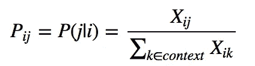
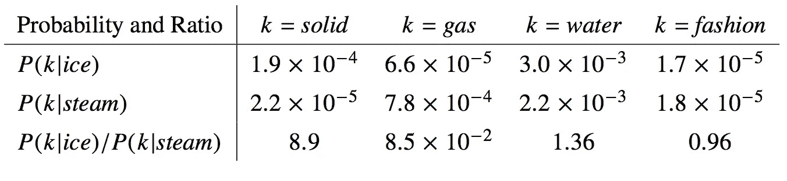
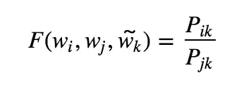
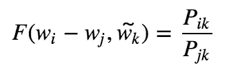
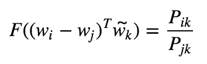
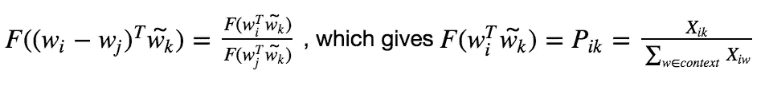
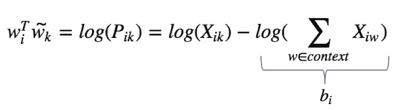
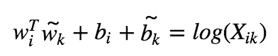
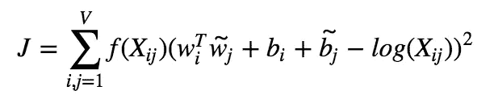

# 单词嵌入(第二部分)

> 原文：<https://towardsdatascience.com/word-embedding-part-ii-intuition-and-some-maths-to-understand-end-to-end-glove-model-9b08e6bf5c06?source=collection_archive---------9----------------------->

## 直觉和(一些)数学来理解端到端手套模型

The power of **GloVe**

NLP(自然语言处理)的原始问题是将单词/句子编码成计算机处理可理解的格式。向量空间中单词的表示允许 NLP 模型学习单词含义。在我们的[上一篇](https://medium.com/@matyasamrouche19/word-embeddings-intuition-and-some-maths-to-understand-end-to-end-skip-gram-model-cab57760c745)文章中，我们看到了**的跳格**模型，该模型根据单词在当地**的上下文**来捕捉单词的意思。让我们记住，我们所说的**上下文**是指围绕目标单词的大小为 *n* 的固定单词窗口。

在这篇文章中，我们将研究**手套**模型(全局向量),它被创建来查看单词的局部上下文和全局统计数据以嵌入它们。 **GloVe** 模型背后的主要思想是关注文本语料库中单词的**共现概率**(下面的等式 0)以将它们嵌入到有意义的向量中。换句话说，我们要看看在我们所有的文本语料库中，单词 *j* 在单词 *i* 的上下文中出现的频率。

为此，假设 **X** 是我们的单词-单词共现矩阵([共现矩阵示例](https://www.google.com/search?q=word-word+co-occurrence+matrix&safe=strict&source=lnms&tbm=isch&sa=X&ved=0ahUKEwjJt73es-vhAhVM4eAKHSvEBLYQ_AUIDigB&biw=1440&bih=789#imgrc=RGTzlslBGMJncM:))并且 **X_ij** 是单词 *j* 在单词 *i* 的上下文中出现的次数。

Equation 0: The co-occurence probability of a word **j** to occur given a word **i** is the the ratio of the number of times word **j** occurs in the context of word **i** and the number of times any word appears in the context of word **i**.

**GloVe** 会查看那些同现概率之间的**比率**来提取单词的内在含义。更具体地说，我们将关注图 1 中表格的最后一行。

Figure 1: The 2 first rows of the table show the probabilities of the words **solid**, **gas**, **water** and **fashion** to occur in the context of the words **ice** and **steam.** The last row shows the probabilities ratio which is the key learning under the hood of the **GloVe** model.

对于与"*冰"*相关但不与"*蒸汽*"像"*固体"*相关的词，比例会高。相反，对于与"*蒸汽*相关但不与"*冰*"相关的单词，该比率将较低，而对于与两者都相关或都不相关的单词，如"*水*"和"*时尚*"，该比率将接近 1。
乍一看，**同现概率比**收集了比原始概率更多的信息，并且更好地捕捉了“*冰”*和“*蒸汽”之间的关系。的确，只看原始概率，单词"*水*"最好地代表了"*冰"*和"*蒸汽"*的意思，我们将无法区分这两个单词的内在含义。*

既然我们已经理解了**共现概率比**捕获了关于单词关系的相关信息，那么 **GloVe** 模型旨在构建一个函数 ***F*** ，该函数将在给定两个单词向量 **w_i** 和 **w_j** 以及一个上下文单词向量 **w_k** 作为输入的情况下预测这些比率。

Equation 1: The **GloVe** model will learn meaningful word vectors representations **w_i**, **w_j** and **w_k** to feed **F** and correctly predict the probabilities ratios.

希望对 **GloVe** 有一个高层次的概述的读者可能想要跳过下面的等式(从等式 2 到等式 6 ),这些等式更深入地理解了 **GloVe** 模型如何构造这个 ***F*** 函数来学习单词向量表示。

让我们看看这个 ***F*** 函数是如何构建的，一步一步地去捕捉最终公式背后的逻辑，这个公式乍一看相当复杂(方程式 6)。

要比较向量 **w_i** 和 **w_j** 这两个向量是线性结构，最直观的方法就是通过相减，就这么做吧。

Equation 2: Comparing two vectors by making the difference.

我们有两个向量作为 ***F*** 的输入，一个标量在等式的右边，从数学上讲，如果我们保持这种方式，它会增加我们想要构建的线性结构的复杂性。将标量值与标量值关联起来更容易，这样我们就不必玩向量维数了。因此**手套**模型使用两个输入向量的点积。

Equation 3: Scalar values to scalar values thanks to the dot product.

一直以来，我们将单词向量与上下文单词向量分开。但是，这种分离只是一个角度的问题。的确，如果说“*水*”是“*汽*”的语境词，那么“*汽*”就可以是“*水*”的语境词。在构建***【F***时，必须考虑到 **X** 矩阵(我们的共生矩阵)的对称性，我们必须能够切换 **w_i** 和 **w_k** 。首先我们需要 ***F*** 是一个[同态](/emnlp-what-is-glove-part-iii-c6090bed114) (F(a+b)=F(a)F(b))。

Equation 4: Using the homomorphism property of **F** to associate word vectors dot product (which can be interpreted as similarities between words) to the probability they occur in a same context.

*exp* 函数是方程 4 的解，*exp*(a-b)=*exp*(a)/*exp*(b)，我们就用它吧。

Equation 5: Almost symmetric if there was not **b_i** term.

为了恢复对称性，为矢量 **w_k** 增加一个偏置 **b_k** 。

Equation 6: We can express our word vectors given corpus statistics and symmetry is respected (we can switch **w_i** and **w_k**).

由于我们的 ***F*** 函数，我们现在能够使用我们的词向量表示来定义成本/目标函数(等式 7)。在训练期间**手套**将学习正确的字向量 **w_i** 和 **w_j** 以最小化这个**加权最小平方**问题。事实上，必须使用权重函数 *f(X_ij)* 来限制非常常见的同现(如“this is”)的重要性，并防止罕见的同现(如“下雪的撒哈拉”)具有与平常相同的重要性。

Equation 7: Final **GloVe** Equation

总之，**手套**模型为我们要求他执行的单词类比任务使用了一个有意义的知识来源:同现概率比**。然后，它构建一个目标函数 ***J*** 将单词向量关联到文本统计。最后，**手套**最小化这个 ***J*** 功能通过学习有意义的单词向量来表示。**

瞧啊！

**参考资料和其他有用资源:** - [原始手套论文](https://nlp.stanford.edu/pubs/glove.pdf)
- [斯坦福 NLP 资源](https://web.stanford.edu/class/archive/cs/cs224n/cs224n.1184/syllabus.html)
- [很好解释的文章比较 Word2vec 与 Glove](http://mlexplained.com/2018/04/29/paper-dissected-glove-global-vectors-for-word-representation-explained/)