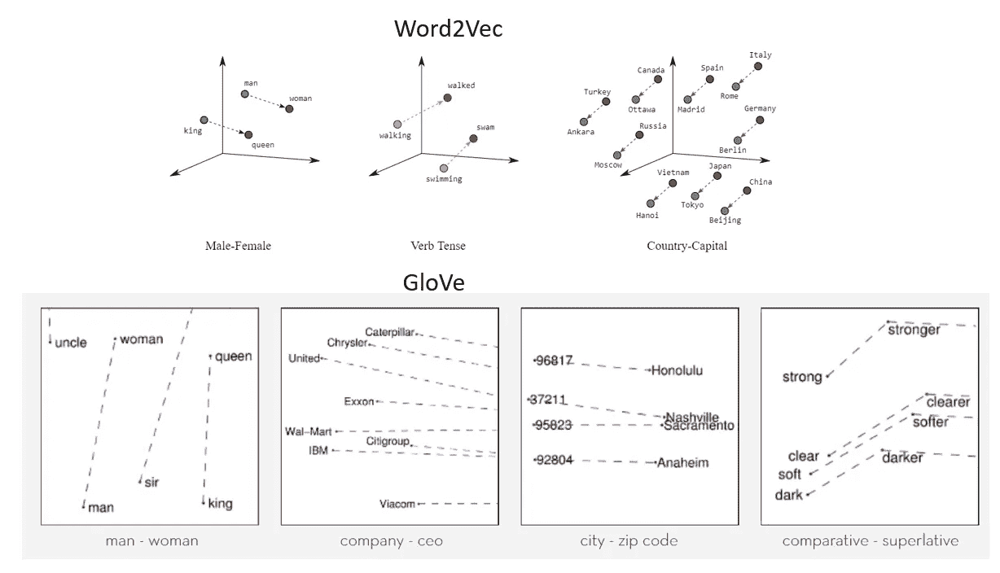
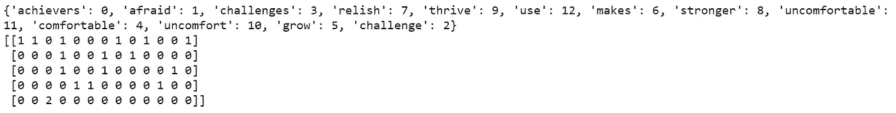
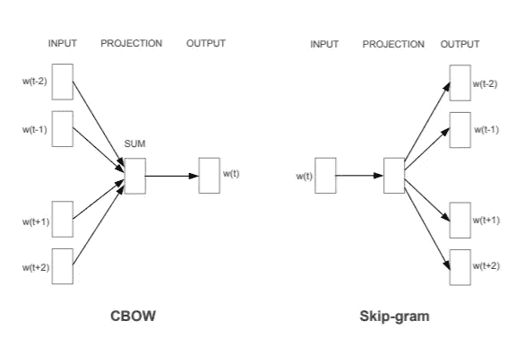
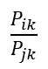
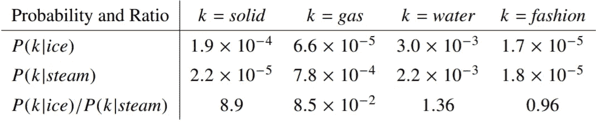
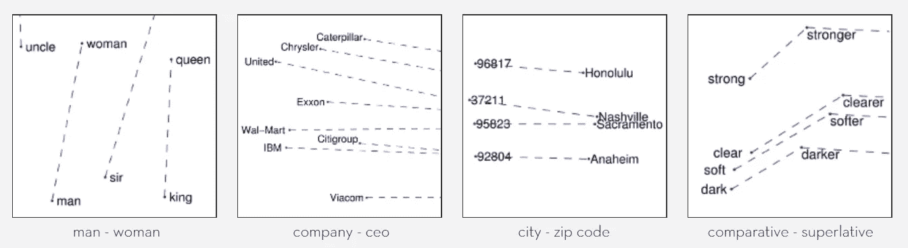

# 自然语言处理中的单词嵌入

> 原文：<https://towardsdatascience.com/word-embeddings-for-nlp-5b72991e01d4?source=collection_archive---------1----------------------->

## 理解单词嵌入及其在深层自然语言处理中的应用

在本文中，我们将了解如何处理文本，以便在机器学习算法中使用。什么是嵌入，为什么它们被用于文本处理？



word2vec and GloVe word embeddings

自然语言处理(NLP)是指旨在理解人类语言的计算机系统。人类语言，如英语或印地语，由单词和句子组成，NLP 试图从这些句子中提取信息。

NLP 用于的一些任务

*   文本摘要:提取或抽象的文本摘要
*   情感分析
*   从一种语言到另一种语言的翻译:神经机器翻译
*   聊天机器人

***机器学习和深度学习算法只接受数字输入，那么我们如何将文本转换成数字呢？***

## 单词袋(蝴蝶结)

单词包是一种简单而流行的文本特征提取技术。**单词包模型处理文本，找出每个单词在句子中出现的次数。这也称为矢量化。**

创建弓的步骤

*   将文本标记成句子
*   把句子符号化成单词
*   删除标点符号或停用字词
*   将单词转换为较低的文本
*   创建单词的频率分布

在下面的代码中，我们使用 ***CountVectorizer、*** it 标记一组文本文档，构建一个已知单词的词汇表，并使用该词汇表对新文档进行编码。

```
#Creating frequency distribution of words using nltk
**from nltk.tokenize import sent_tokenize
from nltk.tokenize import word_tokenize
from sklearn.feature_extraction.text import CountVectorizer****text="""Achievers are not afraid of Challenges, rather they relish them, thrive in them, use them. Challenges makes is stronger.
        Challenges makes us uncomfortable. If you get comfortable with uncomfort then you will grow. Challenge the challenge """**#Tokenize the sentences from the text corpus
**tokenized_text=sent_tokenize(text)**#using CountVectorizer and removing stopwords in english language
**cv1= CountVectorizer(lowercase=True,stop_words='english')**#fitting the tonized senetnecs to the countvectorizer
**text_counts=cv1.fit_transform(tokenized_text)**# printing the vocabulary and the frequency distribution pf vocabulary in tokinzed sentences
print(cv1.vocabulary_)
print(text_counts.toarray())
```



在文本分类问题中，我们有一组文本和它们各自的标签。我们使用单词袋模型来从文本中提取特征，并且我们通过将文本转换成文档中单词出现的矩阵来实现这一点。

c [简单文本摘要的颂歌](https://medium.com/datadriveninvestor/simple-text-summarizer-using-nlp-d8aaf5828e68)

***包话有什么问题？***

在单词袋模型中，每个文档被表示为一个单词计数向量。这些计数可以是二进制计数，一个单词可能出现在文本中，也可能不出现，或者将具有绝对计数。向量的大小等于词汇表中元素的数量。如果大多数元素都是零，那么单词包将是一个稀疏矩阵。

在深度学习中，我们将拥有稀疏矩阵，因为我们将处理大量的训练数据。由于计算和信息的原因，稀疏表示更难建模。

**巨大数量的权重:**巨大的输入向量意味着神经网络的巨大数量的权重。

**计算量大:**权重越大，训练和预测所需的计算量越大。

**缺乏有意义的关系，不考虑词序:** BOW 是在文本或句子中出现的具有字数统计的词的集合。单词包不考虑它们出现的顺序。

> 单词嵌入是解决这些问题的方法

**嵌入将大的稀疏向量转换到保持语义关系的低维空间**。

单词嵌入是一种技术，其中领域或语言的单个单词被表示为低维空间中的实值向量。

**通过将高维数据映射到一个更低维的空间来解决带有 BOW 的稀疏矩阵问题。**

通过将语义相似项的**向量彼此靠近放置**，解决了 BOW 缺乏有意义的关系的问题。这样，具有相似意思的单词在向量空间中具有相似的距离，如下所示。

*“国王对王后就像男人对女人一样”编码在向量空间中，动词时态和国家及其首都编码在低维空间中，保持语义关系。*


source: [https://developers.google.com/machine-learning/crash-course/embeddings/translating-to-a-lower-dimensional-space](https://developers.google.com/machine-learning/crash-course/embeddings/translating-to-a-lower-dimensional-space)

***语义相似的物品是如何靠近放置的？***

*让我们用推荐引擎中使用的协同过滤来解释这一点。*

推荐引擎基于具有相似兴趣的其他用户的历史购买来预测用户将购买什么。使用协同过滤

*亚马逊和网飞使用推荐引擎向用户推荐产品或电影*

**协同过滤**是将多个顾客购买的所有相似产品嵌入到一个低维空间的方法。这个低维空间将包含彼此接近的相似产品，因此，它也被称为**最近邻**算法。

这种最近邻技术用于将语义相似的项目彼此靠近放置

***我们如何将高维数据映射到一个更低维的空间？***

## **使用标准降维技术**

**像主成分分析(PCA)这样的标准降维技术可以用来创建单词嵌入**。PCA 试图找到高度相关的维度，这些维度可以使用 BOW 折叠成一个维度。

## **Word2Vec**

Word2vec 是 Google 发明的用于训练单词嵌入的算法。word2vec 依赖于**分布假设。**分布假设指出，经常具有相同相邻单词的单词倾向于语义相似。这有助于**将语义相似的单词映射到几何上接近的嵌入向量。**

分布假设使用连续词袋(CBOW)或跳过克。

**word2vec 模型是具有输入层、投影层和输出层的浅层神经网络。它被训练来重建单词的语言环境。**word 2 vec 神经网络的输入层采用更大的文本语料库来生成向量空间，通常有数百个维度。文本语料库中的每个唯一单词被分配给空间中的相应向量。

这种架构被称为连续单词包 CBOW，因为它使用上下文的连续分布式表示。它既考虑了历史上的语序，也考虑了未来的语序。

这有助于语料库中的常见上下文单词向量在向量空间中彼此靠近。



[Source](https://arxiv.org/pdf/1301.3781.pdf): Efficient Estimation of Word Representations in Vector Space by Mikolov-2013

**跳过克**

Skip gram 不基于上下文预测当前单词，而是使用每个当前单词作为具有连续投影层的对数线性分类器的输入，并预测当前单词前后一定范围内的单词。

## **GloVe:单词表示的全局向量**

手套是由潘宁顿等人在斯坦福开发的。它被称为全局向量，因为全局语料库统计数据是由模型直接捕获的。

它利用了这两者

*   用于生成低维单词表示的全局矩阵分解方法，如潜在语义分析(LSA)
*   局部上下文窗口方法，例如 Mikolov 等人的 skip-gram 模型

LSA 有效地利用了统计信息，但在单词类比方面做得不好，因此表明了次优的向量空间结构。

像 skip-gram 这样的方法在类比任务上表现得更好，但是很少利用语料库的统计数据，因为它们没有在全局共现计数上进行训练。GloVe 使用特定的加权最小二乘模型来训练全局单词共现计数，以有效地利用统计数据。

考虑热力学领域中的两个词***I =冰，j =蒸汽*** 。这些词的关系可以通过研究它们与各种 ***探测词 k*** 共现概率的比值来考察。



ratio of co-occurrence probabilities

探查像 ***水或者时尚*** 这种或者与 ***冰与蒸汽*** 都有关系，或者都没有关系的词，比例应该接近 1。探测词像 ***固体*** 与 ***冰*** 但不与 ***汽*** 有较大的比值



Source: [GloVe: Global Vectors for Word Representation](https://nlp.stanford.edu/pubs/glove.pdf) — Jeffrey Pennington

与原始概率相比，该比率能够更好地区分相关的词(固体和气体)和不相关的词(水和时尚),并且还能够更好地区分两个相关的词。



Source: [https://nlp.stanford.edu/projects/glove/](https://nlp.stanford.edu/projects/glove/)

区分*男人*和*女人*的是性别，类似于词对，比如*国王*和*王后*或者*兄弟*和*姐妹*。从数学上来说，我们可能期望矢量差*男人* : *女人*，*国王* : *王后*，以及*兄弟:姐妹*可能都大致相等。这个特性和其他有趣的模式可以在上面一组使用 GloVe 的可视化中观察到。

## 结论:

单词嵌入被认为是目前无监督学习的成功应用之一。它们不需要任何带注释的语料库。嵌入使用低维空间，同时保留语义关系。

## 参考资料:

【https://nlp.stanford.edu/projects/glove/ 

[手套:单词表示的全局向量](https://nlp.stanford.edu/pubs/glove.pdf)

[向量空间中单词表示的有效估计—托马斯·米科洛夫、程凯、格雷格·科拉多、杰弗里·迪恩](https://arxiv.org/abs/1301.3781)

[](https://developers.google.com/machine-learning/crash-course/embeddings/categorical-input-data) [## 嵌入:分类输入数据|机器学习速成班

### 估计时间:10 分钟分类数据指的是代表一个或多个离散项的输入特征…

developers.google.com](https://developers.google.com/machine-learning/crash-course/embeddings/categorical-input-data) [](https://en.wikipedia.org/wiki/Word2vec) [## Word2vec

### Word2vec 是一组用于产生单词嵌入的相关模型。这些模型很浅，有两层…

en.wikipedia.org](https://en.wikipedia.org/wiki/Word2vec) 

[https://blog . aylien . com/overview-word-embeddings-history-word 2 vec-cbow-glove/](https://blog.aylien.com/overview-word-embeddings-history-word2vec-cbow-glove/)