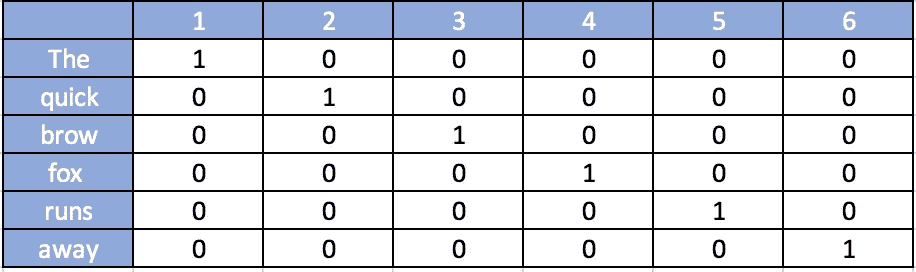
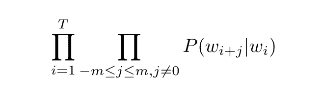
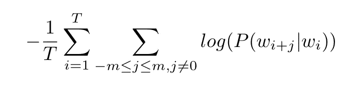
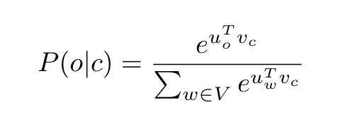
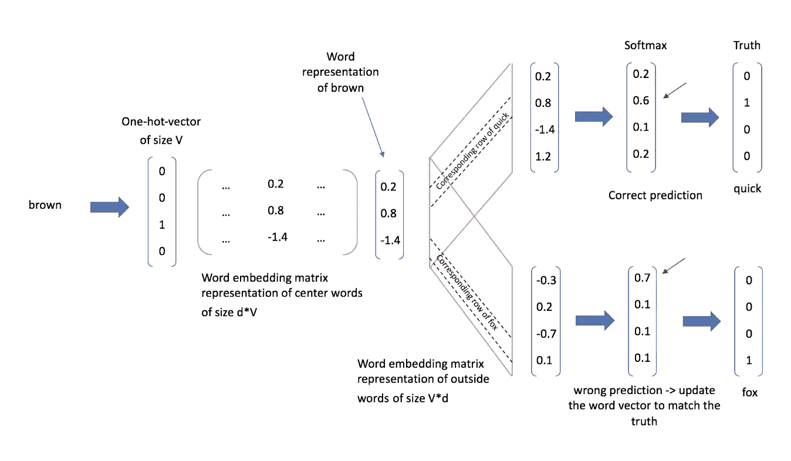

# 单词嵌入(第一部分)

> 原文：<https://towardsdatascience.com/word-embeddings-intuition-and-some-maths-to-understand-end-to-end-skip-gram-model-cab57760c745?source=collection_archive---------11----------------------->

## 直觉和(一些)数学来理解端到端跳格模型

Photo by [Susan Yin](https://unsplash.com/photos/2JIvboGLeho?utm_source=unsplash&utm_medium=referral&utm_content=creditCopyText) on [Unsplash](https://unsplash.com/search/photos/library?utm_source=unsplash&utm_medium=referral&utm_content=creditCopyText)

自然语言处理的最初问题是将一个单词/句子编码成计算机可理解的格式。向量空间中单词的表示允许 NLP 模型学习。如图 1 所示，将单词表示成向量的第一种简单表示法是一热编码法。

Fig 1: One-hot-vectors of each words from the sentence “The quick brown fox runs away.”

这种实现缺乏像单词的上下文(T2)这样的信息，我们所说的上下文是指给定单词与哪些其他单词相关。事实上，“布朗”和“福克斯”是正交的，因此给定我们的一次性编码是不相关的。最重要的是，one-hot-vector 的大小与词汇表一样，可以达到数千个单词，这使得它不切实际。

对这些限制的第一个解决方案将是:
1)考虑给定其**上下文**
的单词的含义 2)将它的表示维度减少到**更实际的大小**

**Skip-gram** 模型是最流行的单词嵌入模型之一，它旨在根据给定的上下文对单词进行编码。

> “从一个人和什么样的人交往，你就可以知道他是什么样的人”(弗斯，J. R. 1957)

引用 20 世纪语言学家弗斯的话，很好地说明了我们的担忧。通过“它保持的公司”或上下文，我们指的是在固定大小的窗口中出现在中心单词附近的单词。

Fig 2: Context words of “brown” within a one window size (one the right and one on the left).

这个想法是，出现在相似上下文中的单词将具有相同的单词表示。为了实现这个目标， **Skip-gram** 将作为给定中心单词的固定大小 *m* 的窗口内的上下文单词的预测器。因此，对于大小为 *T* 的词汇表，**跳格模型**将希望最大化以下预测准确性或可能性:

为了便于计算，并且因为在机器学习中我们更喜欢最小化函数而不是最大化它们，我们现在将考虑平均负对数似然性并将其最小化:

为了计算 P(w_{i+j} | w_{i})，我们将使用两个向量:
-当 w 是上下文词时 u _ { w }
-当 w 是中心词时 v_{w}

然后，我们将使用 softmax 函数计算给定中心词 **c** 的上下文词 **o** (外部词)的概率:

让我们来解释这个等式，以便更好地理解 **Skip-gram** 模型背后的直觉。中心单词和上下文单词之间的相似度越高，分子上的点积越高，因此上下文单词被预测为邻近单词的概率越高。
这里，我们强制 **Skip-gram** 模型学习那些 u_{w}和 v_{w}向量，以便做出正确的预测。

**Skip-gram** 模型可通过下图进行总结。

Fig 3: End-to-end Skip-gram model training on the sentence “The quick brown fox”. We choose the window dimension m=1 for representation ease.

一旦**跳跃式语法**模型已经训练了它的预测任务，单词表示在中心单词的单词嵌入矩阵表示中是可用的。

瞧啊！

现在，我们能够用**跳格**模型嵌入单词。然而，我们必须注意到 **Skip-gram** 在给定单词的本地上下文的情况下捕捉单词的意思，而没有考虑更全面的学习。例如，假设我们有这样一个句子:“狐狸……”，“the”和“狐狸”可能经常一起出现，但是 **Skip-gram** 不知道“The”是一个常用词还是一个与“狐狸”特别相关的词。

为了应对这个潜在的问题，已经创建了 **Glove** 模型来查看单词的本地上下文和全局统计。如果你想更深入地研究单词嵌入方法，这里有一个[简短演示](https://medium.com/@matyasamrouche19/word-embedding-part-ii-intuition-and-some-maths-to-understand-end-to-end-glove-model-9b08e6bf5c06)来快速理解这个**手套**模型。

**参考资料和其他有用的资源:** *-*-[原文 Skip-gram 论文](http://papers.nips.cc/paper/5021-distributed-representations-of-words-and-phrases-and-their-compositionality.pdf)
- [Standford NLP 资源](https://web.stanford.edu/class/archive/cs/cs224n/cs224n.1184/syllabus.html)
- [Word2Vec 教程](http://mccormickml.com/2016/04/19/word2vec-tutorial-the-skip-gram-model/)