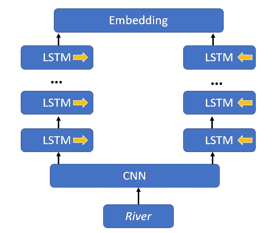
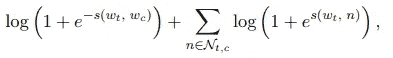

# 自然语言处理中的词表示第三部分

> 原文：<https://towardsdatascience.com/word-representation-in-natural-language-processing-part-iii-2e69346007f?source=collection_archive---------11----------------------->

在我的博客系列关于单词表示的 [**第二部分**](/word-representation-in-natural-language-processing-part-ii-1aee2094e08a) 中，我谈到了 Word2Vec 和 GloVe 等分布式单词表示。这些表示将单词的语义(意义)和相似性信息合并到嵌入中。然而，它们不能推广到不属于训练集的“词汇之外”的单词(OOV)。在这一部分，我将描述减轻这个问题的模型。具体说一下最近提出的两个模型:ELMo 和 FastText。ELMo 和 FastText 背后的想法是利用单词的字符和形态结构。与其他模型不同，ELMo 和 FastText 不将单词视为一个原子单位，而是其字符组合的联合，例如"*remaking->re+make+ing "*

## 以前模型的问题

诸如 Word2Vec 和 GloVe 的先前模型从字典中查找预训练的单词嵌入，因此没有考虑在特定上下文中使用的词义。换句话说，一词多义(单词的多重含义)没有被考虑在内。例如:

> "我的朋友正在考虑向银行贷款."
> 
> "降雨导致莱茵河决堤. "

如果使用 Word2Vec 或 GloVe，那么单词*“bank”*将只有一次嵌入。但在上面两句话里有不同的内涵。在第一句话中，它的意思是为客户提供金融服务的机构。在第二句中，它暗示了水体旁边的斜坡。

## ELMo:来自语言模型的嵌入

新模型 ELMo 能够通过将整个序列视为输入来解决以前模型的这个问题。它根据参照系动态地产生单词嵌入。该模型由三层组成:(1)卷积神经网络，(2)双向长短期记忆(LSTM)和嵌入。

**Figure 1**

ELMo 的模型输入(即 CNN 的输入)完全基于字符。所以最初，我们给 CNN 提供原始字符。然后 CNN 产生紧凑的嵌入，该嵌入被传递给双向 LSTMs。

b)双向 LSTM 层指示模型以正序和逆序在输入序列上运行。例如，让我们在下面的输入中获得单词“*后跟*的嵌入:

input = "多云的上午**紧接着**是一个阳光明媚的下午。"

context_straight= ['a '，'多云'，'早晨']

context_reverse = ['by '，' sunny '，' a '，'大部分'，' sunny '，'午后']

因此，对于每个目标单词，模型可以观察它周围的前面和后面的单词。从图 1 中可以看出，堆叠的 LSTM 构成了多层 LSTM。每个 LSTM 都将前一个的输出序列作为输入，除了第一个 LSTM 层从 CNN 获得字符嵌入。

c)嵌入层连接 LSTM 方向的隐藏状态，并产生依赖于上下文的嵌入。在论文中，作者将其定义为隐藏状态乘以特定任务模型权重的线性组合。它为模型正在使用的每个任务学习单独的 ELMo 表示。因此，ELMo 提高了许多 NLP 任务的性能。为了简单起见，我省略了细节。这里可以找到**。**

## **使用 Tensorflow-hub 的 EMLo**

**依赖关系:**

*   **Python 3.6**
*   **张量流 1.13.1**
*   **张量流-集线器 0.4.0**

**可以使用以下方式安装库:**

> **pip 安装张量流==1.13**

**从 ELMo 模块加载预训练的单词嵌入:**

**参数`trainable = False`因为我只想加载预先训练好的重量。但是图的参数不一定是固定的。通过将其设置为`True`，可以重新训练模型并更新参数。**

**从预先训练的 ELMo 获得单词嵌入:**

**默认输出大小为 1024，让我们在上面两句话中寻找单词*“bank”*的前 10 个维度:**

**正如我们注意到的，在不同的上下文中嵌入同一个单词是不同的。如前所述，ELMo 通过输入一系列字符来动态构建单词嵌入。它依赖于句子中当前周围的单词。**

## **FastText:子字模型**

**以前的模型的问题，他们不能为 OOV 生成单词嵌入(见上文)。这个问题不仅由 ELMo 解决，而且在子字模型中也解决了。此外，与 ELMo 相反，子词模型能够利用形态学信息。在子词模型中，具有相同词根的词共享参数。它被集成为 FastText 库的一部分，这就是它被称为 FastText 的原因。**

**子词模型是跳格模型(Word2Vec)的扩展，它产生给定一个词的上下文的概率。模型损耗定义如下:**

****

**损失函数的第一部分将所有上下文单词 *w_c* 视为正例，第二部分随机采样 *N_t，c* 作为位置 *t.* 处的*作为反例。一方面，目标是将共现和相似的单词放置在彼此靠近的位置。另一方面，它旨在定位向量空间中彼此远离的不同单词。子词模型以类似的方式训练，除了它将计算的 n 元语法添加到特征。n 元语法定义为给定数量的项目序列。例如，n=2 的 n 元模型将给出单词“banking”的以下输出:{ *ba，an，nk，ki，in，ng* }。***

**下面是另一个例子:**

> **“**河**岸”**

**在跳格模型中，单词" *river* "有两个上下文标记: *the* and *bank。*而 n-gram(n = 2)的子词模型有 13 个上下文标记: *th，eh，e_，_a，an，nd，d_，_b，ba，an，nk，the and bank。*在实际中，我们提取 3≤ n ≤ 6 的所有 n 元文法。这是一种非常简单的方法，可以考虑不同组的 n 元语法，例如，取一个单词的所有前缀和后缀。**

**这种 n 元语法信息用子词信息丰富了词向量，并使模型能够为看不见的词构建向量。这对于形态丰富的语言和包含大量生僻字的数据集非常有益。德语就是一个很好的例子，因为它有丰富的复合名词。“Tischtennis”这个词翻译过来就是乒乓球。这个单词的嵌入将通过简单的加法来构建，例如 Tisch + Tennis → Tischtennis。**

## **使用 Gensim 的快速文本**

**依赖关系:**

*   **Python 3.6**
*   **Gensim 3.7.2**

**可以使用以下方式安装库:**

> **pip 安装张量流==1.13**

**使用自定义数据创建模型**

**让我们得到一个不属于训练的单词的嵌入:**

**有 157 种语言使用 wiki 数据的预训练模型，这里 可以找到 [**。也可以使用 gensim 加载它们。**](https://fasttext.cc/docs/en/pretrained-vectors.html)**

## **拿走**

**ELMO 和子词是高级模型，能够为词汇表中存在和不存在的词产生高质量的嵌入。特别地，ELMo 能够在产生单词嵌入时考虑上下文信息。与其他现有模型相比，它具有更高的矢量质量。但是因为它在运行时进行预测，所以它有推理成本。另一方面，子字非常快，能够有效地合并 n 元语法。**