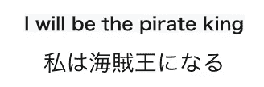

# 单词间没有空格的语言的分词

> 原文：<https://towardsdatascience.com/word-segmentation-for-languages-without-spaces-between-words-8b100c55124b?source=collection_archive---------28----------------------->

## Unigram 语言模型是一个良好的开端


Photo by [Brett Jordan](https://unsplash.com/@brett_jordan?utm_source=unsplash&utm_medium=referral&utm_content=creditCopyText) on [Unsplash](https://unsplash.com/s/photos/words?utm_source=unsplash&utm_medium=referral&utm_content=creditCopyText)

如果您正在处理一些与中文、日文和韩文相关的 NLP 任务，您可能会注意到 NLP 工作流不同于英文 NLP 任务。因为与英语不同，这些语言中没有空格来自然地分隔单词。所以分词对于这些语言来说非常重要。我对不同的分词方法做了一点研究。在这篇文章中，我将给出选择最佳方法的简单建议。

# TL；速度三角形定位法(dead reckoning)

使用 Unigram 语言模型。您可以从 [SentencePiece](https://github.com/google/sentencepiece) 中实现，这是一个独立于语言的子词标记器。无论你使用什么语言，这都是一个好的开始。

# 个案研究

英语中下面的句子用空格隔开，但是日语中的句子没有空格。



from One Piece

两种语言中对应的标记如下所示。

```
I -> 私
will be -> になる
the prirate king -> 海賊王
```

So how to extract the “海賊王” is the word segmentation problem we need to deal with. Usually, there are three levels we can use, the word level, character level, subword level. But in recent years, the subword level approach has shown its superiority over other approaches, so in this post, I will focus on the subword level.

# 子词级分割

这篇[帖子](https://medium.com/@makcedward/how-subword-helps-on-your-nlp-model-83dd1b836f46)很好地介绍了 3 个子字算法:

*   字节对编码(BPE)
*   文字片
*   单语法语言模型

Unigram 语言模型的作者还实现了一个库， [SentencePiece](https://github.com/google/sentencepiece) ，它包含两个子字算法，BPE 和 Unigram 语言模型。

在最近的强大的语言模型中，BERT 使用了 WordPiece 模型，XLNet 使用了 Unigram 语言模型。

Unigram 语言模型最大的优点就是这是一个独立于语言的模型。无论你使用什么语言，这都是一个好的开始。

> ***查看我的其他帖子*** [***中等***](https://medium.com/@bramblexu) ***同*** [***分类查看***](https://bramblexu.com/posts/eb7bd472/) ***！
> GitHub:***[***bramble Xu***](https://github.com/BrambleXu) ***LinkedIn:***[***徐亮***](https://www.linkedin.com/in/xu-liang-99356891/) ***博客:***[***bramble Xu***](https://bramblexu.com)

# 参考

*   [https://medium . com/@ makcedward/how-subword-helps-on-your-NLP-model-83 D1 b 836 f 46](https://medium.com/@makcedward/how-subword-helps-on-your-nlp-model-83dd1b836f46)
*   https://github.com/google/sentencepiece
*   【https://qiita.com/taku910/items/7e52f1e58d0ea6e7859c 
*   [https://techlife.cookpad.com/entry/2018/12/04/093000](https://techlife.cookpad.com/entry/2018/12/04/093000)
*   [https://qiita.com/mkt3/items/4d0ae36f3f212aee8002](https://qiita.com/mkt3/items/4d0ae36f3f212aee8002)
*   [https://yoheikikuta.github.io/bert-japanese/](https://yoheikikuta.github.io/bert-japanese/)
*   [https://qiita.com/hideki/items/56dc5c4492b351c1925f](https://qiita.com/hideki/items/56dc5c4492b351c1925f)