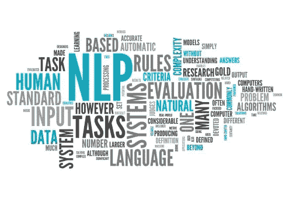
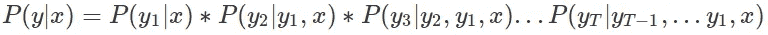
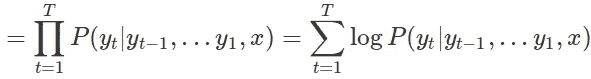
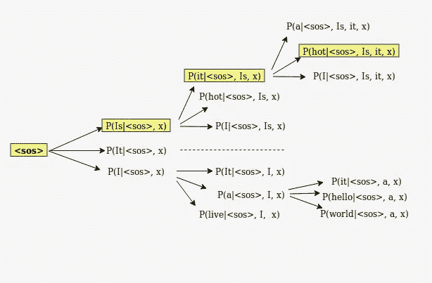
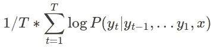
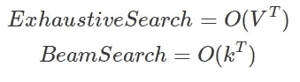
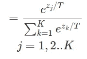

# Seq2Seq 架构中的字序列解码

> 原文：<https://towardsdatascience.com/word-sequence-decoding-in-seq2seq-architectures-d102000344ad?source=collection_archive---------39----------------------->

[Source](https://www.kdnuggets.com/wp-content/uploads/nlp-word-cloud.jpg)

[*自然语言生成*](https://en.wikipedia.org/wiki/Natural-language_generation)【NLG】是生成文本的任务。像机器翻译、摘要、对话系统这样的自然语言生成任务的核心部分是根据给定的输入生成单词序列作为输出。例如，对于机器翻译系统，给定一个英语输入句子，模型需要生成其法语翻译。今天，大多数这样的系统都是建立在编码器-解码器架构及其变体之上的。图 1 显示了这种架构的示意图。

Fig.1 from [Source](https://s3-ap-south-1.amazonaws.com/av-blog-media/wp-content/uploads/2019/01/enc_dec_2.png)

在上面显示的图像中，编码器负责捕获源/输入语言的完整上下文，而解码器负责使用该信息并输出所需语言的翻译。这种模型是用两种语言的巨大平行句子语料库来训练的。深入这种架构的本质已经超出了本博客的范围。请在此阅读更多[T5。此外，实际谷歌的 NMT 系统也有一个关注组件。要了解注意力网络，请](https://nlp.stanford.edu/~johnhew/public/14-seq2seq.pdf) [*阅读此*](https://medium.com/intel-student-ambassadors/attention-in-end-to-end-automatic-speech-recognition-9f9e42718d21) 。

在每个解码器时间步长，使用 [*Softmax 激活函数*](https://www.datacamp.com/community/news/how-softmax-activation-function-works-6qya1z8uxxx) 跨词汇输出概率分布是很常见的。在模型被训练之后选择最终的输出序列取决于所使用的解码策略。

在这里，我们将讨论在推理期间广泛使用的 3 种解码策略

## 1.贪婪搜索

该策略在每个解码时间步从模型的词汇中选择最可能的单词(**即 argmax** )作为输出序列的候选。

Decoder Segment

这种方法的问题是，一旦在任何时间步长 t 选择了输出，我们就不能灵活地返回并改变我们的选择。实践证明，贪婪解码策略在生成的文本中容易出现语法错误。这将导致在任何时间步长 t 选择最佳，但是当考虑整个句子语法正确和合理时，这不一定给出最佳。

## 2.具有固定波束大小的波束搜索

波束搜索策略试图找到具有最大可能性的输出序列。它通过将贪婪采样扩展到 *Top-k 采样*策略来实现这一点。在任何时间步 t，它将 top-k 最可能的单词视为该步的候选单词。这里，k 称为光束尺寸。在数学上，我们试图最大化下面提到的等式—

下图显示了在 **k=3** 的情况下实际上是如何发生的

Beam Decoding with k=3 at each time-step

这里，我们通过在解码时跟踪每个时间步长的**前 k 个**词汇输出来搜索高分输出序列。我们通常在到达句子结束标记(< eos >)时停止搜索，或者直到所有或至少一些 **n** 输出序列的时间步长 **t** 时停止搜索。我们还通过长度进行标准化，以避免在对任何序列评分时引起的任何偏倚。

Normalized Beam Search Scoring

这里，波束大小充当时间复杂度和精确度之间的折衷变量。让我们分析一下 **k** 可以取的最小值和最大值:

*   当 **(k=1)** —其行为类似于贪婪搜索，其中 argmax 在任何时间步 **t** 被馈送到后面的连续步骤。
*   当**(k =词汇的大小)** —其行为类似于穷举搜索，其中每个时间步的可能单词都是整个词汇，并且每个单词都给出了随后连续步骤的下一组词汇的概率分布。

Time Complexity Analysis

## 3.可变波束大小的波束搜索[1]

考虑到固定射束尺寸的限制，发展了可变射束尺寸的概念。固定的波束大小可能不一定是每个解码时间步长的最佳选择。

让我们用一个例子来理解它——让前 5 个词在任何时间步长 t 的概率值是可比较的。在这种情况下，固定波束大小(k)我们可能会错过相关的候选，导致信息丢失。然而，让前两个词在任何时间步长 t 都是可比的，其余的都很低。在这种情况下，固定波束大小(k ),我们可以通过添加不太相关的候选来添加噪声。

相反，波束大小应该是任何解码时间步长(t)的概率分布的函数。在[1]中，作者谈到了可以用来推导这种关系的各种技术。此外，如果你仔细注意，这也可以被视为一个宁滨问题，可以离散化的熵措施。请在这里阅读更多*。*

## *4.温度诱导最大值*

*这不是一个解码策略，但是可以和上面提到的任何搜索一起使用。在任何解码步骤中，我们通常使用 Softmax 激活函数来传递我们的词汇的概率分布。我们不使用普通的 Softmax，而是使用它的修改版本，如下所示*

**

*Temperature Induced Softmax*

*这里，T 是温度变量。很容易看出，较高的 T 值将导致肥胖分布(给所有人几乎相同的概率)，而较低的 T 值将导致峰值分布(给一些人高概率)。*

*虽然这个博客主要集中在谈论单词序列解码，但没有说这些推理时间解码序列算法可以用于任何序列解码任务。*

*实现上面提到的方法可以在这里找到**。***

***在*[*https://prakhartechviz.blogspot.com*](https://medium.com/@prakhar.mishra/word-sequence-decoding-in-seq2seq-architectures-d102000344ad)查看我的博客库**

## **进一步阅读**

1.  **[用于神经机器翻译的波束搜索策略](https://www.aclweb.org/anthology/W17-3207.pdf)**
2.  **[多样化波束搜索，改善复杂场景的描述](http://web.engr.oregonstate.edu/~leestef/pdfs/diversebeam2018aaai.pdf)**
3.  **[具有深度学习的 NLP](http://web.stanford.edu/class/cs224n/)**

***随时分享你的想法:)***