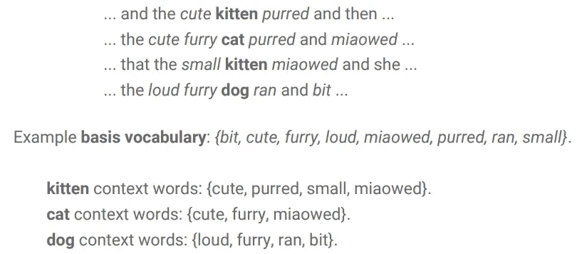
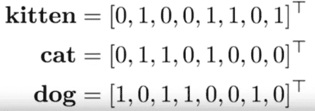

# 词向量和词汇语义——基于计数的向量介绍

> 原文：<https://towardsdatascience.com/word-vectors-and-lexical-semantics-part-1-c9dbc8932c1d?source=collection_archive---------23----------------------->

Image from Ryan Haggins via Unsplash

*以下是我基于 2017 年牛津大学举办的深度 NLP 课程的个人笔记。该材料可从[1]处获得。*

# 介绍

**单词向量** : *用向量格式表示单词。*

**词汇语义学** : *分析词义以及词义之间的关系。*

神经网络需要矢量表示作为输入。因此，需要将单词或句子转换成向量。

# 代表单词

文本仅仅是离散符号(即单词)的序列。一种简单的表示方法是对句子中的每个单词进行一次性编码。然而，这样做需要大量的内存/空间，因为向量空间(由一个热点编码向量组成)实际上就是你的词汇表的大小。

这种方法的问题是，由于每个向量都被定义为一个单词，因此每个向量都以一种相当正交的方式表示，在语义上彼此没有明确(弱)的关系。他们彼此之间也很稀疏。因此，需要能够表达语义相似性的更丰富的表示。

# 分布语义学

**分布语义学** : *发展和研究理论和方法的研究领域，这些理论和方法基于语言项在大量语言数据样本中的分布特性，对语言项之间的语义相似性进行量化和分类*【2】。

> *“从一个人所交往的人身上，你就可以知道他所说的话”——J . R .弗斯(1957)*

上面的引用和其他类似的类比指出，可以通过观察人们如何使用单词来理解单词的意思。

同时，我们也对减少向量空间的大小感兴趣。这可以通过产生密集矢量表示(与稀疏相反)来实现。

从计算角度来看，有 3 种主要方法可以做到这一点。

1.  基于计数的
2.  预言性的
3.  基于任务的

能够将单词指定为向量的优点是，可以开始客观地测量和比较单词向量，或者计算相似性、距离等。

让我们先介绍一下基于计数的方法。

## 计数法

定义要使用的基本词汇。通常它们是基于我们自己的经验/直觉或语料库的统计数据来选择的。这些词汇最好是信息丰富且有意义的。

通常词汇量是有限的。停用词通常被排除在外，因为它们在大多数可用的语料库中出现得很多。如果我们要包含它们，那么我们将很难确定它们之间的关系，因为停用词到处都在同时出现。

让我们看一个例子:

Credits to [1]

在上面的例子中，我们可以看到某些单词被选为我们感兴趣的基本词汇。还要注意像*、*、*、*这样的停用词不是基础词汇的一部分。

确定了目标单词及其上下文之后，我们现在可以将其表示为一个向量(如下所示)。

Example. Credits to 1\. Note that the value doesn’t have to ONLY be 1.

作为向量，现在可以分析单词，可能通过相似性(计算相似性的最流行的方法是余弦距离)、向量空间中的距离等。

然而，仍然有一些缺点:

*   不是所有的单词都具有同等的信息量，因为有些单词在不同的文本中出现的频率更高；并且由于这一点，不再能够唯一地与特定的上下文相关联。
*   例如，在描述各种四条腿动物的文本中，单词*跑*或*四条腿*将无法区分语料库中的动物类型。
*   然而，它们是克服这一点的方法，如 TF-IDF 或 PMI。

在我的下一篇文章中，我们将探索一种更简单的方法来解决这些问题。

# 参考

1.  [*https://github.com/oxford-cs-deepnlp-2017/lectures*](https://github.com/oxford-cs-deepnlp-2017/lectures)
2.  [*https://en.wikipedia.org/wiki/Distributional_semantics*](https://en.wikipedia.org/wiki/Distributional_semantics)