# 用 NumPy 从头开始 Word2vec

> 原文：<https://towardsdatascience.com/word2vec-from-scratch-with-numpy-8786ddd49e72?source=collection_archive---------3----------------------->

## 如何用 Python 和 NumPy 实现 Word2vec 模型

# 介绍

最近工作中一直在做几个和 NLP 相关的项目。其中一些与培训公司内部的单词嵌入有关。在工作中，这些任务大多是在 Python 库的帮助下完成的: [gensim](https://radimrehurek.com/gensim/) 。然而，我决定在 Python 和 NumPy 的帮助下从头实现一个 Word2vec 模型，因为重新发明轮子通常是一种深入学习的好方法。

# 单词嵌入

单词嵌入没什么新奇的，不过是用数字方式表示单词的**方法**。更具体地说，是将词汇映射到向量的方法。

最直接的方法可能是使用一键编码将每个单词映射到一个一键向量。

尽管一键编码非常简单，但也有一些缺点。最值得注意的一点是**不容易用数学方法测量单词之间的关系**。

[Word2vec](https://en.wikipedia.org/wiki/Word2vec) 是一种神经网络结构，通过在监督分类问题上训练模型来生成单词嵌入。这种方法首先在 Mikolov 等人于 2013 年发表的论文 [*对向量空间中单词表示的有效估计*](https://arxiv.org/pdf/1301.3781.pdf) 中介绍，并被证明在实现单词嵌入方面相当成功，该方法可用于测量单词之间的句法和语义相似性。

# Word2vec(跳格)

Mikolov 等人在 2013 年提出了两种模型架构，连续词袋模型和跳格模型。在本文中，我将深入探讨后者。

为了解释跳格模型，我随机引用了我正在读的一本书的一段文字，约翰·博格尔的《投资常识小书》:

> 扣除投资成本后，跑赢股市是输家的游戏。

正如我上面提到的，word2vec 模型试图优化的是一个监督分类问题。更具体地，**给定一个“上下文单词”，我们想要训练一个模型，使得该模型可以预测一个“目标单词”，其中一个单词出现在来自上下文单词的预定义窗口大小内。**

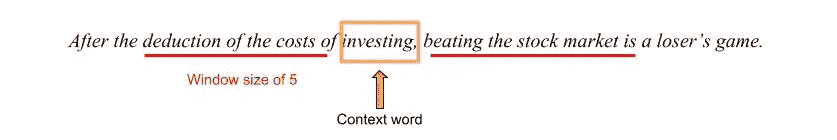

以上面的句子为例，给定一个上下文单词“investing ”,窗口大小为 5，我们希望模型生成一个底层单词。([扣除，的，成本，殴打，股票，市场]中的一个词是在这种情况下。)

## 模型概述

下图显示了 Mikolov 等人 2013 年论文中的原始图表。

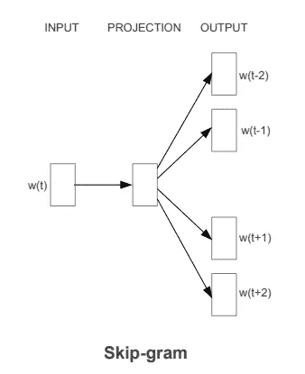

我做了另一个更详细的图表

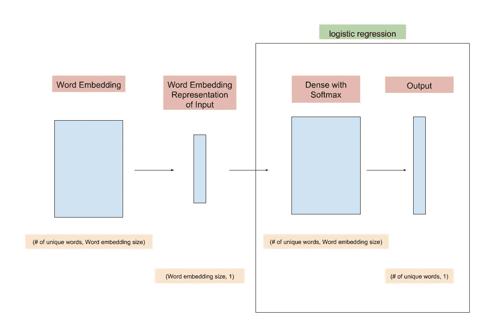

单词嵌入层本质上是一个形状为(语料库中唯一单词的数量，单词嵌入大小)的矩阵。矩阵的每一行代表语料库中的一个单词。单词嵌入大小是一个有待决定的超参数，可以认为是我们想要使用多少特征来表示每个单词。模型的后一部分只是神经网络形式的逻辑回归。

在训练过程中，单词嵌入层和密集层被训练，使得在训练过程结束时，给定上下文单词，模型能够预测目标单词。在用大量数据训练这样一个模型之后，单词嵌入层将最终成为单词的表示，它可以用数学方式展示单词之间的多种酷关系。(对更多细节感兴趣的可以参考原论文。)

# 使用 Python 从头开始实现

## 培训数据的准备

为了生成训练数据，我们首先对文本进行标记。当涉及到标记文本数据时，有许多技术，比如去掉出现频率很高或很低的单词。我只是用一个简单的正则表达式分割文本，因为本文的重点不是标记化。

接下来，我们给每个单词分配一个整数作为它的 id。另外，使用`word_to_id`和`id_to_word`记录映射关系。

最后，我们为模型生成训练数据。对于每个上下文单词`tokens[i]`，生成:`(tokens[i], tokens[i-window_size]), ..., (tokens[i], tokens[i-1]), (tokens[i], tokens[i+1]), ..., (tokens[i], tokens[i+window_size])`。以窗口大小为 5 的上下文单词`investing`为例，我们将生成`(investing, deduction), (investing, of), (investing, the), (investing, costs), (investing, of), (investing, beating), (investing, the), (investing, stock), (investing, market), (investing, is)`。注意:在代码中，训练(x，y)对用单词 id 表示。

以下是生成训练数据的代码:

## 培训流程概述

生成训练数据后，让我们继续研究模型。与大多数神经网络模型类似，训练 word2vec 模型的步骤是**初始化权重(我们要训练的参数)、向前传播、计算成本、向后传播和更新权重。**根据我们想要训练多少个纪元，整个过程将重复几次迭代。

## 待训练参数的初始化

模型中有两层需要初始化和训练，即**单词嵌入层**和**稠密层**。

字嵌入的形状会是`(vocab_size, emb_size)`。这是为什么呢？如果我们想用一个包含`emb_size`个元素的向量来表示一个词汇，并且我们的语料库中的词汇总数是`vocab_size,`，那么我们可以用一个`vocab_size x emb_size`矩阵来表示所有的词汇，其中**每行代表一个单词**。

密集层的形状将是`(vocab_size, emb_size)`。怎么会这样将在这一层中执行的操作是**矩阵乘法**。这一层的输入将是`(emb_size, # of training instances)`，我们希望输出是`(vocab_size, # of training instances)`(对于每个单词，我们希望知道该单词出现在给定输入单词中的概率)。注意:我不包括密集层中的偏差。

以下是初始化的代码:

## 前进传球

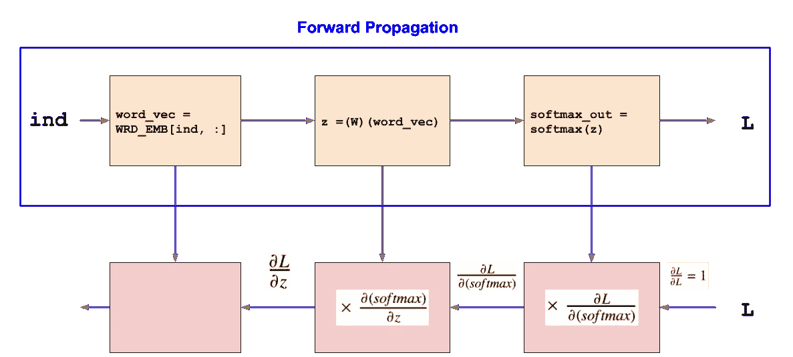

The Upper part shows the forward propagation.

正向传播有三个步骤，**从单词嵌入**获得输入单词的矢量表示，**将矢量传递给密集层**，然后**将 softmax 函数**应用于密集层的输出。

在一些文献中，输入被表示为一个热码向量(假设第 I 个元素为 1 的一个热码向量)。通过将单词嵌入矩阵和独热向量相乘，我们可以得到表示输入单词的向量。但是，执行矩阵乘法的结果本质上与选择单词嵌入矩阵的第 I 行相同。我们可以通过简单地选择与输入单词相关的行来节省大量的计算时间。

剩下的过程只是一个多类线性回归模型。

下图可用于回忆致密层的主要操作。

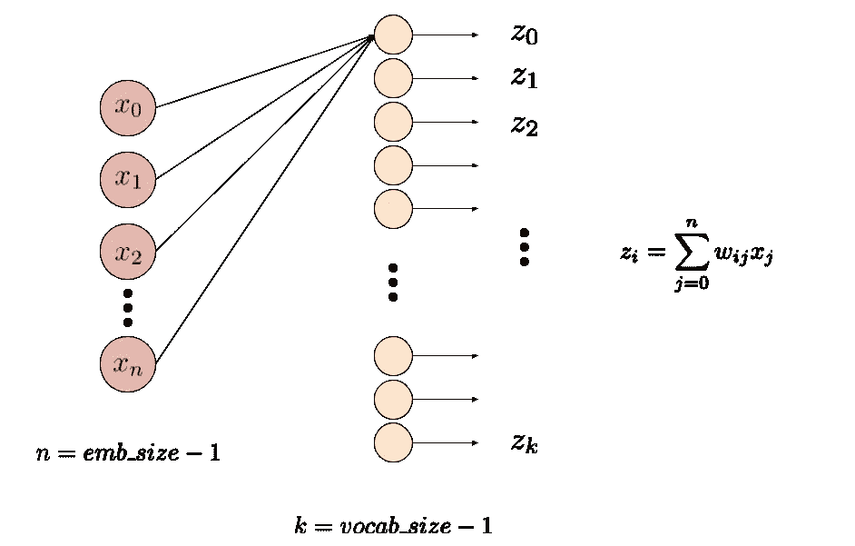

然后，我们将 softmax 函数应用于密集层的输出，这给出了每个单词出现在给定输入单词附近的概率。下面的等式可以用来提醒什么是 softmax 函数。

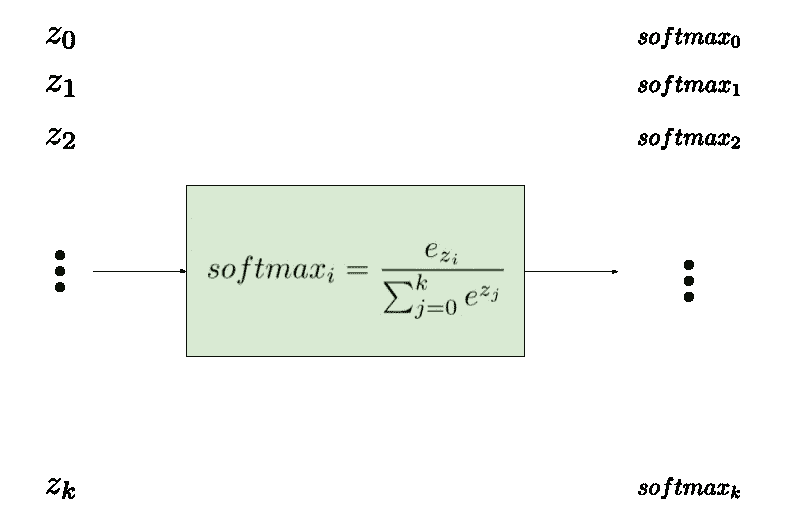

以下是向前传播的代码:

## 成本的计算(L)

这里，我们将使用交叉熵来计算成本:

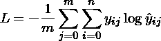

以下是成本计算的代码:

## 反向传递(反向传播)

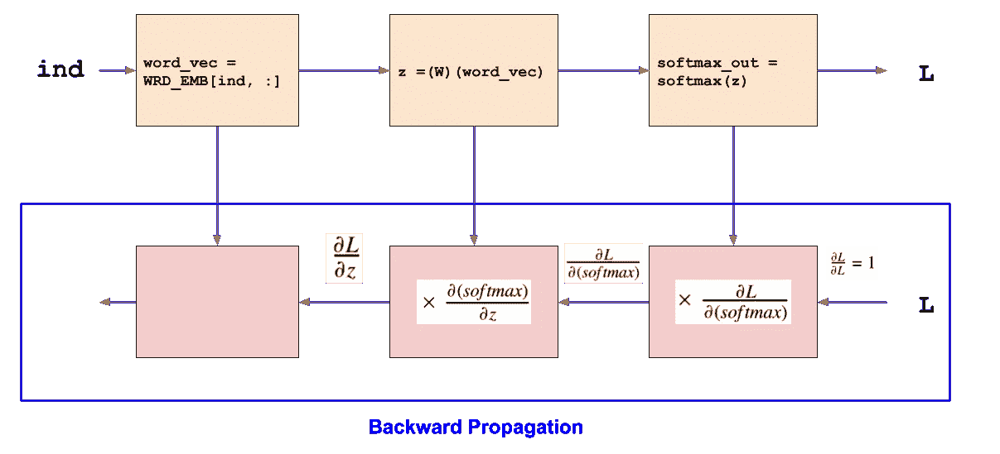

在反向传播过程中，我们希望计算可训练权重相对于损失函数的**梯度，并使用其相关梯度更新权重。反向传播是用来计算这些梯度的方法。除了微积分中的**链式法则**之外，没什么稀奇的:**

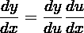

我们想要训练的是密集层和单词嵌入层中的权重。因此，我们需要计算这些重量的梯度:

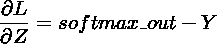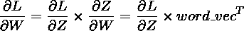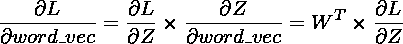

下一步是使用以下公式更新权重:

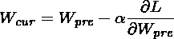

以下是向后传播的代码:

注意:你可能会奇怪为什么在`dL_dW`中有一个`1/m`的因子，而在`dL_dword_vec`中没有。在每一遍中，我们一起处理`m`训练示例。对于密集层中的权重，我们希望用`m`梯度下降的**平均值**来更新它们。对于单词向量中的权重，每个向量都有其自己的权重，这导致其自己的梯度下降，因此我们在更新时不需要聚集`m`梯度下降。

## 模特培训

为了训练模型，重复向前传播、向后传播和权重更新的过程。在训练期间，每个时期之后的成本应该有下降的趋势。

下面是为模型定型的代码:

## 估价

在用从上面的示例句子生成的数据训练模型之后，窗口大小为 3，5000 个时期(具有简单的学习率衰减)，我们可以看到，在给定每个单词作为输入单词的情况下，模型可以输出最多的相邻单词。

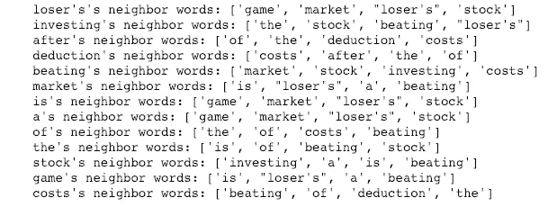

你可以在[这个笔记本](https://github.com/ujhuyz0110/wrd_emb/blob/master/word2vec_skipgram_medium_v1.ipynb)里找到端到端的流程。请随意下载并试玩。

这是我的第一个中等职位。谢谢你们的阅读。请随时向我提供反馈或向我提问。

在这里停止阅读是好的，但如果你对我在尝试用更大的数据集训练时发现需要的一些优化感兴趣，请继续阅读。

# 优化(空间)

当我试图用更大的数据集训练上面的模型时，我发现在训练过程中内存消耗不断增加，python 内核最终关闭。后来，我发现这个问题与我将标签`Y`输入模型的方式有关。

在原始代码中，每个标签都是一个 hot vector，它使用一串 0 和一个 1 来表示带标签的输出字。当词汇量越来越大时，我们浪费了太多的内存到那些不能给我们提供有用信息的零上。

在我开始只给标签添加相关的单词 ind 之后，内存消耗问题就消失了。我们把空间从 O(词汇量* m)减少到 O(m)。

以下是我的代码实现(只有 2 个地方需要修改):

为了优化训练时间，可以用**分级 softmax** 代替上述常规 softmax。然而，这篇文章有点太长了，所以我们下次再讨论这个话题。

感谢大家多阅读。同样，请随时向我提供反馈或向我提问。

# 更新

*   *【2019–02–17】*如果你对如何得出密集层的输出相对于损失的梯度感兴趣，这里有一个我的导数的书面笔记的链接:[https://github . com/ujhuyz 0110/written _ notes/blob/master/soft max _ gradient . pdf](https://github.com/ujhuyz0110/written_notes/blob/master/softmax_gradient.pdf)