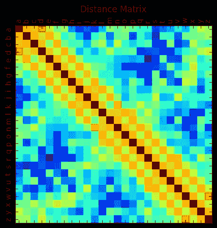

# Word2vec 变得简单

> 原文：<https://towardsdatascience.com/word2vec-made-easy-139a31a4b8ae?source=collection_archive---------7----------------------->

这篇文章是 word2vec 的一个简单而深入的指南。在本文中，我们将从头实现 word2vec 模型，看看嵌入如何帮助找到相似/不相似的单词。

# 介绍

Word2Vec 是 NLP(自然语言处理)的基础。托马斯·米科洛夫和他的研究团队于 2013 年在谷歌开发了这项技术。他们的方法首先发表在论文《向量空间中单词表示的有效估计》中。他们改进了他们的模型，通过使用像频繁词的二次抽样和采用负抽样这样的技术来提高表示的质量和计算的速度。这项工作发表在论文“单词和短语的分布式表示及其组合性”上。

Word2Vec 是一种将单词表示为向量的高效且有效的方式。整个文本被压缩在一个低维度的空间里。在这个空间中，所有向量都有一定的方向，并且可以明确地定义它们之间的关系。单词作为嵌入向量的分布式表示为以适合 NLP 中许多应用的方式找到单词提供了许多可能性。

# 履行

我们将保持语料库简单，因为它有助于我们轻松理解每一步，而且我们可以清楚地可视化关系，使其更加具体。CBOW(连续单词包)和 Skip-Gram 是两种最流行的单词嵌入框架。在 CBOW 中，在所选单词的上下文(周围单词)中出现的单词被用作输入，中间或所选单词被用作目标。在 Skip-Gram 中正好相反，这里中间的单词试图预测它前面和后面的单词。

考虑由从“a”到“z”的字符顺序组成的文本[a，b，c，d，e，f，g，h，I，j，k，l，m，n，o，p，q，r，s，t，u，v，w，x，y，z]，进一步让整数 0 到 25 代表相应的字母。在保持窗口大小为 2 的情况下实现 CBOW，我们可以看到“a”与“b”和“c”相关，“b”与“a”、“c”和“d”相关，依此类推。由此可见，表示输入单词的一个热向量的维数为[26，1]。在模型的帮助下，我们将找到大小为[10，1]的密集分布向量。嵌入向量的大小是任意选择的。

下图说明了上下文和目标词。


Left. Arrangement of CBOW and Skip-gram models. Right. Character and corresponding integers grouped into lists of input and targets. For each the first column represents the input character and the remaining items in each sub-lists are targets for the input.

想象关系的模式是很容易的。当它们在两个字符的范围内同时出现时，它们是相关的或者共现是真实的。下面的表格和地图描述了这种模式。


Left. Characters appearing together (not fully visualized). Right. The black color region implies no co-occurrence and white region implies characters occurring together given windows size of 2 #Also note the diagonal symmetry — implying that co-occurrence from a to b means co-occurrence from b to a but these relationships are depicted different axes.

Word2Vec 是一个概率模型。该模型的关键组件是两个权重矩阵。第一矩阵(w1)的行和第二矩阵(w2)的列分别嵌入输入单词和目标单词。给定所选择的输入单词，这两个单词向量的乘积然后被用于获得成为目标单词的概率。在训练时，使用梯度下降优化这些嵌入向量，使得真实目标的概率最大化。显然，矩阵 w1 和 w2 是因式分解的概率矩阵，它非常类似于共生矩阵。

下图对模型进行了说明和解释。


Schematic diagram of Word2Vec model. Input and Output vectors are of size V, while hidden vector (embedding) is of size N. (Source: [https://lilianweng.github.io/lil-log/2017/10/15/learning-word-embedding.html](https://lilianweng.github.io/lil-log/2017/10/15/learning-word-embedding.html))


In this illustration, the model is learning to embed 6 characters (‘a’ to ‘f’) into a 3-dimensional embedding vector. **A.** Co-occurrence Matrix of these characters with a window size of 2, co-occurrence is expressed as either present or absent. (size 6, 6) **B.** Weight matrix w1 — transposed. Each row of matrix w1 is embedding vector for the one word as one hot vector uniquely selects the corresponding row of w1 (or col of W1 transpose) **C.** Matrix of one hot vector, each column represents one word/item **D.** Product of w1 and input matrix results in matrix h (hidden layer). Here the whole input matrix is as an identity matrix and simply passes weight matrix w1 as hidden matrix h. However it is not necessary to be an identity matrix, the order and size of the input matrix(and hence hidden layer) could be different **E.** Weight matrix w2 — transposed (size 6,3). Each column of matrix w2 closely represents represents the target words **F.** Hidden layer — h, identical to w1 as described before **G.** Each row of w2 — transposed products with a column of hidden (that embeds an input word ) outputting scores of length of the size vocab **H.** As mentioned all rows of w2_transposed interacting with 1 column of hidden — results in one column of Score Matrix , total product of w2_transposed and h is the matrix S (size 6, 6) **I.** Softmax is applied to score matrix. Each entry in a column is converted into probabilities **J.** Probability matrix — each item in a column of this matrix represents probabilities for being a target word given an input word **L.** Error —Probability at the position of true indices are to be maximized, error is computed comparing this probability assigned to the index corresponding to true targets **M.** Back prop — At the start weights are initialized randomly and resulting probabilities are low and similar for all targets. After training, back propagation of gradients and optimization of weights, probabilities are dense around targets and close to 0 at other places.

# **py torch 中的实施**

从上面可以明显看出，网络是轻的，嗯模糊的。在这里，我们只需要为每个字母创建一个热点向量，并将其与所有目标配对。例如，字母“a”是[1。, 0., 0., 0., 0., 0., 0., 0., 0., 0., 0., 0., 0., 0., 0., 0., 0., 0., 0., 0., 0., 0., 0., 0., 0., 0.](调整为大小为 26，1)作为一个热向量，其目标索引为 1 和 2(“b”和“c”)。

网络有两个完全连接的层，分别计算隐藏层和输出层。没有使用偏倚，因为它们对于相似性度量是多余的。Softmax 是唯一的激活，它将输出分数转换为概率。这里的损失标准(nn。CrossEntropyLoss)实现 Softmax 并计算损失。优化权重时选择了 Adam 优化器。

```
#**Dependencies**import torch
import torch.optim as optim
import matplotlib.pyplot as plt#**Generating desired pair of inputs and targets**#Empty list that collects input and target in pairs
inp_target_list = []         

for i in range(26):
    temp = []
    a, b, c, d = i- 2, i - 1, i + 1, i + 2  #targets for input i
    temp.extend([a, b, c, d])#keep targets within range of 0 to 25
    for j in range(4):
        if temp[j] >=0 and temp[j] <=25:
            inp_target_list.append([i, temp[j]])print(inp_target_list[:5])
#[[0, 1], [0, 2], [1, 0], [1, 2], [1, 3]]**#Get one hot vectors for all inputs**#Initiate tensor with 0’s that holds all inputs in inp_target pairs
inp_tensor= torch.zeros(len(inp_target_list), 26)#Substitute 1 for 0, at position indicated by respective input   
for i in range(len(inp_tensor)):
    inp_tensor[i, np.array(inp_target_list)[i, 0]] =1#One_hot for 0 or letter 'a'
print(inp_tensor[0]) 
#tensor([1., 0., 0., 0., 0., 0., 0., 0., 0., 0., 0., 0., 0., 0., 0., 0., 0., 0.,0., 0., 0., 0., 0., 0., 0., 0.])**#Create Network** 
#2 fully connected layers with NO bias
#Embedding dimension is 10
#Softmax is implemented using loss criterion (nn.CrossEntropyLoss())fc1 = nn.Linear(26, 10, bias = False)
fc2 = nn.Linear(10, 26, bias = False)
params = list(fc1.parameters()) + list(fc2.parameters())LR = 0.001  #Learning rate
criterion = nn.CrossEntropyLoss()
optimizer = optim.Adam(params, lr = LR)**#Train**#Define inputs and target tensors
inp_tensor = inp_tensor
target_tensor = torch.tensor(inp_target_list)[:, 1]losses = []for i in range(10000):
    out_1 = fc1(torch.Tensor(inp_tensor)) #hidden layer
    out_2 = fc2(out_1)                    #Score matrix optimizer.zero_grad()                 #Flushing gradients 

    loss = criterion(out_2,               target_tensor.long().view(out_2.shape[0],))#Apply Softmax, get loss 

    loss.backward()                        #Getting grads
    optimizer.step()                       #Correcting parameters
    if i % 1000 == 0:
        losses.append(loss.item())
        print(loss.data)**#Loss printed**
tensor(3.2619) 
tensor(3.0980) 
tensor(2.7768) 
tensor(2.4193) 
tensor(2.1216) 
tensor(1.8937) 
tensor(1.7242)
tensor(1.6007) 
tensor(1.5130) 
tensor(1.4526) 
tensor(1.4121) 
.........
```

# 结果和推论

这里我们将回顾一系列矩阵。解释图片/图案要容易得多，这些图片/图案让我们对分布在整个矩阵中的数字有一个清晰的概念。

下面每个热图的内容都在各自的标题中进行了讨论和解释。得分矩阵中的每一行都是单词作为输入和单词作为目标的嵌入向量的乘积。乘积被视为概率矩阵中的概率。两个字符的窗口内的相邻字符具有更高的值和密集概率。

距离矩阵是从输入单词的每个嵌入向量到作为输入的单词的所有嵌入向量(包括其自身)的余弦距离。热对角线值是其自身的乘积，距离为 1。接近对角线的值是暖的，表示它们是每个对角线元素的近邻。当矩阵被绘制为 1 时，这种模式得到了很大的增强，正距离和负距离与平滑距离一样。

```
#Note: As there is no transposition of weight matrices in forward #propagation columns represent the embedding vectors#**Score Matrix**
plt.matshow((fc1.weight.t() @ fc2.weight.t()).detach().numpy())#Probability Matrix
plt.matshow(nn.Softmax(dim = 1)(fc1.weight.t() @ fc2.weight.t()).detach().numpy()) #**Distance Matrix**
dist_matrix = torch.zeros(26, 26)
for i in range(26):
    for j in range(26):
        dist = torch.nn.functional.cosine_similarity(fc1.weight.t()[i, :], fc1.weight.t()[j, :], dim = 0, eps = 1e-8)
        dist_matrix[i, j] = dist #**Smoothed distances** 
if dist_matrix[i, j] ==1 --> 1
if dist_matrix[i, j] < 0 --> -0.5
if dist_matrix[i, j] 0 to 0.99 --> 0.5
```


A. Score matrix: Product of each context vector with each word vector. Cells corresponding to co-occurrence have high score and rest have low scores, closely resembles co-occurrence matrix. B. Probability Matrix: Obtained applying softmax to score matrix. Each row corresponds to a probability of target word for the index word (chars here). a,z have two targets, assigned probs are 0.5 each b, y have 3 targets, assigned probs are 0.33 each rest have 4 targets, assigned probs are 0.25 each This matrix also represents the prediction of model given any word. (same cells represent prediction with assigned probs) Prediction involves both matrices of the model and Softmax as end activation. Symmetry is consequence of reciprocity ie. context and target words have reciprocal relationship in this example.



`Left. Cosine distance calculated from each character to other. The distance between a word with itself is 1 (maximum) The similarity distances with neighbors are large and non- neighbors are small. Prediction and distances are not the same. Distances are computed from the word vectors (weight matrix 1) alone. B. Smoothed Distances: Here distances are smoothed Distance of 1 → 1, Pos distances < 1 → 0.5 , Neg Distances → 0.5\. Map clearly identifies the neighboring cells with higher similarity distances.

**嵌入向量**

首先，让我们看看 w1 中的‘a’和 w2 中的‘b’的嵌入，它们分别代表输入/周围单词和目标/中间单词。“a ”(作为输入)和“b ”(作为目标)之间的向量积是 18.217，这是一个相对较大的正数，而对于所有其他字符来说，它很小或为负数(除了“c”)。这意味着“b”(和“c”)将有更高的概率。另一方面，从 w1 中取两个矢量，作为输入的矢量“a”和作为输入的矢量“b”之间的余弦相似度是 0.4496 或大约 63 度，这意味着一些相似性。

```
**#Embedding for ‘a’ and ‘b’**
vec_a = fc1.weight.t()[0].data        #select 'a' from w1
vec_b = fc1.weight.t()[1].data        #select 'b' from w1
vec_b_as_target = fc2.weight[1].data  #select 'b' from w2#vec_a 
[1.7211128,   -1.8706707,   0.15043418,   -1.7761097,   0.25396731,   0.17291844,   0.11687599,   -2.0173464,   1.4879528,   -1.6174731],#vec_b
[-1.8015, -0.6789, -1.3880, -1.6618,  1.5363, -1.8415,  1.9647, -1.5331,          2.0684, -1.7526] #vec_b_as_target
[1.9113195,   -1.9370987,   1.349203,   -1.5565106,   1.1705781,   -0.78464353,   -1.7225869,   -1.7434344,   1.9383335,   -1.2209699]#Cosine similarity between two characters
torch.nn.functional.cosine_similarity(vec_a_as_input, vec_b_as_input, dim = 0, eps = 1e-8)  #0.4496 or 63 degrees#vector product between input and target vectors --> raw score
vec_a@vec_b_as_target         #18.217
```

**余弦相似度**

在不同的距离度量中，余弦相似度更直观，在 word2vec 中使用最多。它是两个向量的归一化点积，这个比值定义了它们之间的角度。具有相同方向的两个向量的余弦相似度为 1，90°的两个向量的相似度为 0，直径方向相反的两个向量的相似度为-1，与它们的大小无关。


Top left: Equation for cosine distance Top right: Cosine distance varies from 1 to -1 and corresponding angle varies from 0 to 180 degrees. Bottom left: Cosine distances from ‘c’ to all the characters. Bottom right: Same distances expressed as angles. Note ‘c’ is most similar to itself.

**矢量组合并寻找它的邻居**

一旦单词用向量表示，寻找相似或不相似单词的任务就变得容易了。任何矢量组合都会产生新的矢量，余弦距离或其他相似性度量可以像以前一样使用。这些操作构成了著名等式“国王-男人+女人=王后”的基础。

**用于降维的 t-SNE**

t-SNE(t-分布式随机邻居嵌入)有助于进一步将向量的维数降低到 2 或 3 维，使得可以可视化向量及其空间排列或分布。下面的代码是嵌入向量从 10 维到 2 维的 t-SNE 变换的一个例子。

```
from sklearn.manifold import TSNE
tsne_2d = TSNE(n_components=2).fit_transform(fc1.weight.t().detach().numpy())#First five 2d vectors
print(tsne_2d[:5])
array([[-1.11534159e-04,  1.24468185e-04],
        [-8.66758155e-05, -1.63095172e-04],
        [-5.46419301e-05,  6.82841112e-05],
        [ 1.30452306e-04,  1.16242307e-04],
        [-2.39734325e-05,  1.93809960e-04]])
```


Left. For the selected combination [c + d -e], most similar characters ‘c’ and most dissimilar character is ‘w’. Right — Scatter plot of characters in 2D after t-SNE transformation of embedding. As expected no clusters are observed as data is evenly spread.

# 结论

word2vec 实现的关键是构造两个互补的权重矩阵，将单词表示为输入和上下文或目标。嵌入维度可以是任意维度，这取决于词汇表的大小。模型的输出或预测不同于相似性或距离。当模型学习从输入到输出的映射时，嵌入捕获它们彼此的相对位置。Softmax 适用于较小的语料库，但随着词汇量的增加，它会变得低效，因为它涉及到对整个词汇长度的分数求和。负采样 Skip gram 是首选算法。
最后，Gensim 是一个受欢迎的免费库，我们可以很容易地使用它进行单词嵌入和文本分析。但是了解了基本原理，使用这些工具就变得更加清晰和容易了。

# 数学推导供参考

符号和等式:

x:一个热向量输入(大小:vocab，1)

w1:权重矩阵 1(大小:vocab，嵌入 dim)

h:隐藏层(大小:嵌入尺寸，1)

Vc:单词输入的向量嵌入(在 CBOW 中，输入单词是上下文单词)

w2:权重矩阵 2(大小:嵌入 dim，vocab)

Vw_i:第 I 个目标单词的向量嵌入(在 CBOW 中，给定所选的周围单词，我们试图预测中间的单词)。尺寸(嵌入尺寸，1)

S 和 S_i : S_i 是 h(或 Vc 或 w1 的选定行)和 Vw_i(或 w2 的第 I 列)的向量积。s 代表每个 Vw 的 Vc 得分。(大小:S_i 是标量，S 的分数和 vocab 一样多)

Y_i: Softmax 将得分 S_i 转换为概率 Y_i(或第 I 个目标词的概率)。这样做 Softmax 需要对所有分数求和

Vw_prime:对所有目标词求和

P(w|c):给定上下文或输入单词的目标单词的概率

L(theta):参数的似然性(theta 表示 w1 和 w2，它们又是语料库中所有单词的 Vc 和 Vw 的集合)

l(θ):θ的对数似然

rho:学习率

*注意:以下等式一次使用一个字符或一个单词向量(Softmax 标准化期间除外),但在算法中实现时会处理一批或全部词汇。*

**正向传播**


**似然和反向传播**


参考资料:

[1]托马斯·米科洛夫，程凯，格雷格·科拉多，杰弗里·迪恩，向量空间中词表示的有效估计(2013)，arXiv:1301.3781 [cs .CL]

[2]米科洛夫、托马斯、伊利亚·苏茨基弗、程凯、格雷戈里·科拉多和杰弗里·迪恩。"单词和短语的分布式表示及其组合性." *NIPS* (2013)。

另请查看:[阿里·高德西，Lec 13: Word2Vec Skip-Gram](https://www.youtube.com/watch?v=GMCwS7tS5ZM&t=1292s)

请通过以下方式连接:

邮件:mnshonco@gmail.com 或

领英:[https://www.linkedin.com/in/mrlakhey/](https://www.linkedin.com/in/mrlakhey/)