# 激励人心的话，TED 演讲上的数据科学项目

> 原文：<https://towardsdatascience.com/words-that-will-inspire-a-data-science-project-of-ted-talks-5077a50fa2b5?source=collection_archive---------28----------------------->

“激励人心的话语”是对 2500 多个 TED 演讲的分析，使用文本分析和 R 上的机器学习来寻找使一些演讲比其他演讲更受欢迎的因素。

做这个项目的动机是什么？
我是伦敦一个名为 Data Scientist speakers 的 meetup 小组的成员，该小组定期开会练习数据科学演讲，并接收反馈以提高公众演讲水平。

俱乐部每年都会举办一场比赛，看谁能带来最好的数据科学故事。我参加了这个比赛，并希望参与一些特别的事情:我想结合我的数据科学技能来分析著名的演讲或会谈，并使用这些见解来构建一个全新的演讲或会谈。

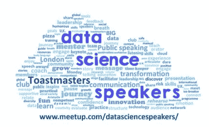

**灵感的来源是什么？**
我以我最喜欢的三篇演讲开始了我的分析，它们是由最杰出的公共演说家发表的，他们的演讲激励了数百万人塑造我们今天生活的世界。

你能从下面的片段中认出这些演讲和他们的演讲者吗？

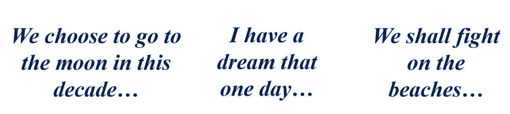

我说的是约翰·肯尼迪、马丁·路德·金和温斯顿·丘吉尔。

**信封背面的计算** 对于这三篇演讲，我分析了他们使用的词的频率，我得到了一个大惊喜…每篇演讲中使用最多的词是相同的！你能在单词云的中间看到它吗？

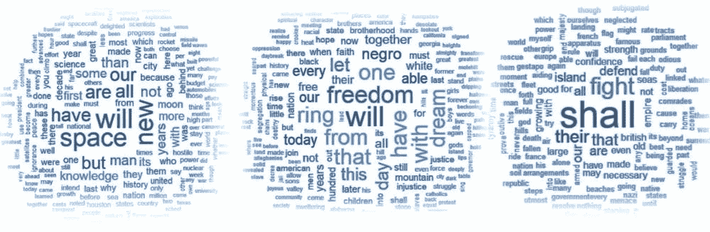

三位演讲者用得最多的词是“Will”(温斯顿·丘吉尔用的是 Shall，妥妥的英式风格！).他们可能会用“Will”这个词来激励人们采取行动，或者表示未来会发生变化。除了这种相似性，三位演讲者还使用了一种叫做结构重复的东西。他们多次重复同一句话来制造影响和记忆。

但是我们需要更多的数据！这些巧合让我想到，单词中可能存在潜在的模式，可以让演讲更具启发性。但三次演讲肯定不足以得出结论，这促使我寻找一组合适的演讲来进行分析。理想情况下，要进行数据分析，会谈应包括:

*   足够数量的会谈进行分析
*   理想情况下，采用相同的形式和风格，以避免因谈话形式不同而产生的强烈偏见
*   应该有可用的抄本，因为这将减少时间和精力
*   对于机器学习的使用，应该有一种方法来跟踪受欢迎程度的进展，以检测更鼓舞人心的谈话和不太鼓舞人心的谈话

**突然灵机一动**
看来，要找到一套考虑到这些因素的谈判方案可能是一项艰巨的任务。然而，我很快意识到已经有具备所有这些特征的演讲了:Ted 演讲！

类似风格的 Ted 演讲有成千上万个，他们记录受欢迎程度，他们有可用的抄本和其他信息，比如他们网站上的浏览量和评论。为了让事情变得更容易，数据科学竞赛网站 Kaggle 已经公布了所有这些数据，并允许任何人以合适的格式下载它们。

**数据科学方法**
有了现在可用的数据，我就可以进行分析了，分析可以分为三个阶段:

一.数据提取和特征工程

二。数据分析和模型集成

三。模型洞察力

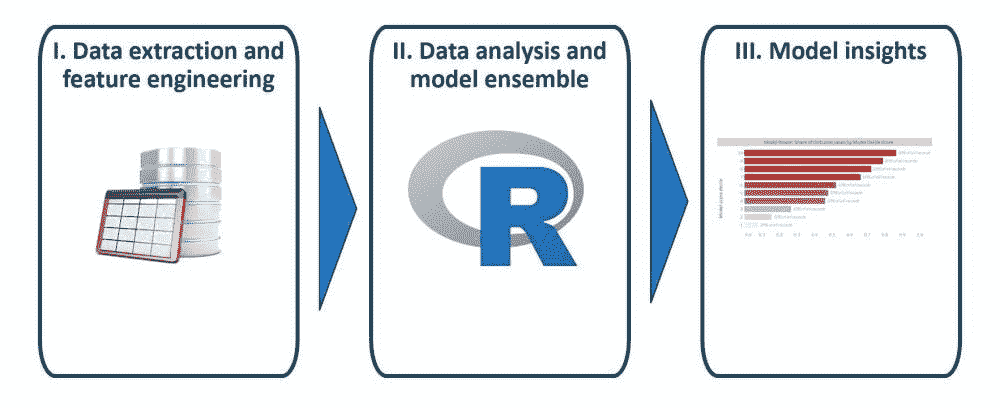

**一、数据提取和特征工程**

Kaggle 提供的数据集包含大量数据，需要首先进行转换才能执行分析。我是 R 的常客，但对文本分析不是很熟悉，所以基本上我遵循了“用 R 进行文本挖掘”这本书上的所有内容。这本书绝对是使用 r 进行文本分析的来源。

该数据集包含了所有 TED 演讲活动及其所有的文字记录，以及你可以在他们的网页上看到的任何其他数据。一个非常好的地方是，它还包括数据提取的日期，每个 ted 演讲在网站上的发布日期以及它们的拍摄日期。这些特征对于通过使用机器学习算法在模式搜索中执行预测分析将变得很重要

我构建了 50 多个特征作为潜在因素，来测试为什么有些演讲比其他演讲更受欢迎。这些原始因素组中的大多数与字数的频率分析相关，例如:

*   通过使用每分钟的单词数、他们说的句子数和每句话的单词数来判断说话者的语速
*   观众的反应利用了一个在记录中发现的有趣特征，包括观众笑的具体场合，掌声，提问的次数
*   我还加入了许多最常见的 n-grams，看看是否有他们倾向于重复的特定单词

有了这些因素，我的目标是一个分类问题来预测一个 ted 演讲是否会流行

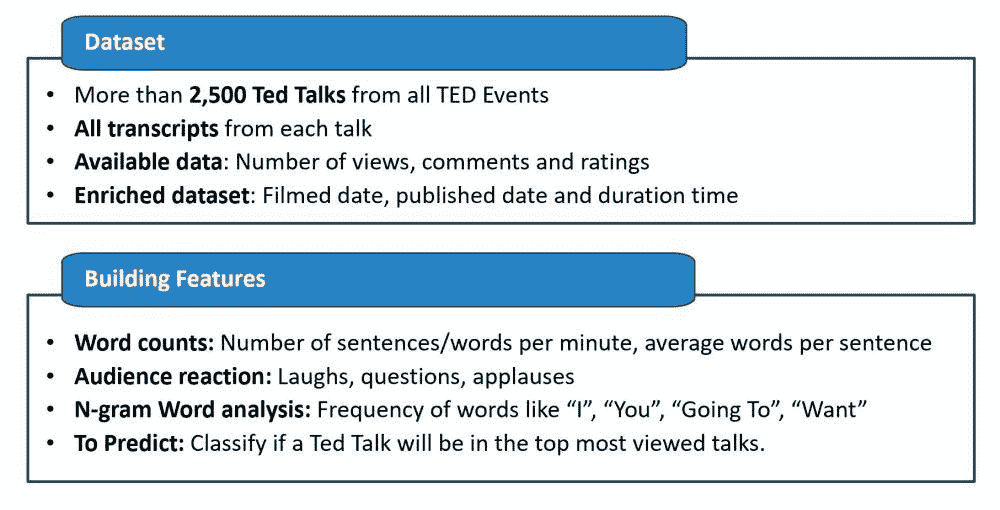

**二。数据分析和模型集成**

这个阶段可以概括为以下步骤

**1。描述性分析:**该分析的一个关键特征是以某种方式标准化了在线观看 Ted 演讲的时间。一个 TED 演讲在网站上出现的时间越长，被浏览的机会就越多。因此，我将每月的平均指标标准化，而不是使用总数。

**2。相关性分析:**许多变量将倾向于与其他变量相关。因此，我使用的一种技术是仅使用最具预测性的变量(在单变量水平上),并丢弃预测性较低的变量。

**3。额外的特征工程:**一些 n-gram 在它们之间是相关的，因为它们使用相同的单词，所以我将那些有用的相似的 n-gram 组合成一个变量。

**4。模型评估:**我开始使用逻辑回归分析单变量水平的数据，以找到最相关的变量，并丢弃完全没有预测性的变量。使用前 20 个最相关的单个变量，我开始通过调整 hyper 参数、变量箱和不同的变量选择方法，手动开发几种类型的模型，包括逻辑回归、随机森林和 XGBoost。

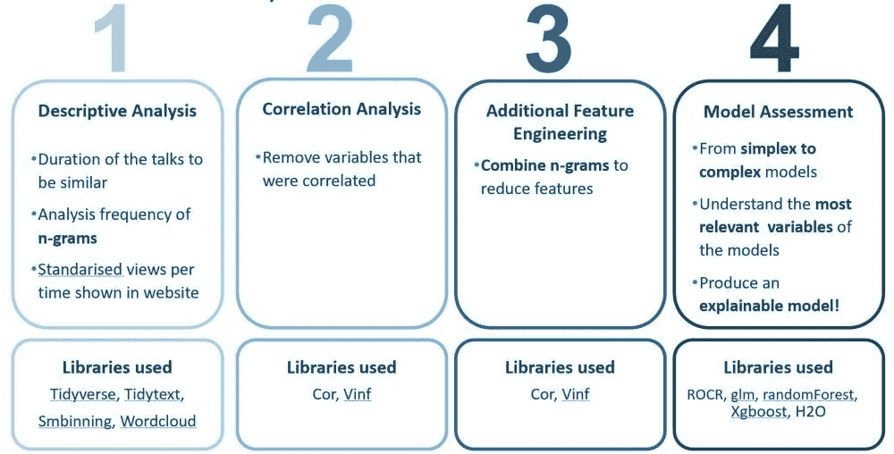

除了手动开发的模型，我还使用了 H2O 的 AutoML 功能，该功能可以自动开发多种类型的模型，如堆叠模型、深度学习和其他梯度推进方法。这种自动建模技术将帮助我参考其他类型的模型如何与我手工开发的模型进行比较。

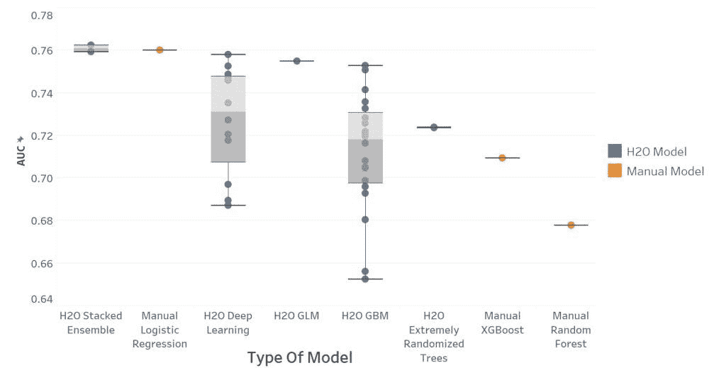

**三世。模型洞察**

令人惊讶的是，H20 开发的不同类型的模型在性能方面与人工逻辑回归模型相差不远。因此，我决定使用逻辑回归来更容易地解释预测是如何建立的。为了使模型更容易理解并避免任何异常值问题，我在最终建模阶段将独立变量分成四分位数。最终的模型有七个变量，AUC 为 76%,正确预测流行话题的准确率为 73%。

赢家模型的洞察力告诉我:

*   持续时间较短的会谈比持续时间较长的会谈更有效
*   **慢慢说**更有效，这是通过计算每分钟的字数来衡量的，使用的是说话的总字数及其持续时间
*   在谈话过程中提问更有效。这是通过识别记录中的问号来衡量的
*   让观众发笑更有效。这是通过识别文字记录中笑声标题的出现来衡量的

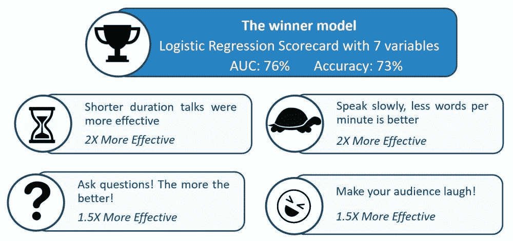

对于这个最终模型，我还检查了最高和最低的预测分数，并查看了模型的排名。在这里，从左到右，我们从表现不好的谈话到表现较好的谈话(当然，不要低估得分最低的人！).

*   在排名最低的模特中，我发现伊森·祖克曼的“倾听全球之声”节目表现不佳。这个人在每一个变量上都得分最低(持续时间长，语速快，几乎没有笑的问题)
*   谷歌的谢尔盖·布林和拉里·佩奇得分也很低
*   杰夫·贝索斯关于“网络未来的电隐喻”的演讲也得分较低
*   在模特的谈话中得分最高的是**斯蒂芬·霍金**，他的谈话是“质疑宇宙”。这个演讲在模型的变量中得分很高，因为这个演讲是关于问很多问题的，并且说得很慢(因为辅助声音很慢！)
*   其中一个很好的演讲是来自**的 Alan Smith** 的演讲“为什么你应该热爱统计学”。这给了我希望，统计学家可以成为一个真正优秀的演讲者！

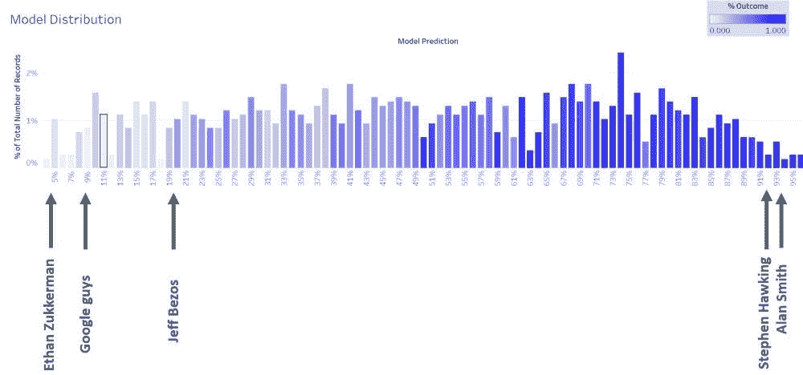

现在有了一个开发好的模型，为什么不让每个人都可以使用它呢！我用 Shiny 和 ShinyApps 部署了一个在线工具，你可以在这个网站的[分析你的谈话](https://speakthedata.com/inspiring-tool/)部分使用。请按照说明，你需要做的只是把一个演讲，并会排名它会有多好，你可以做些什么来改善它！

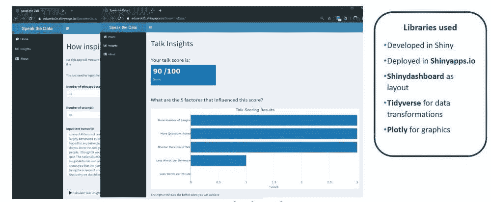

**我从这个项目中学到了什么？**

我发现有一些因素可以帮助预测一个演讲是否会受欢迎，这些因素基于诸如提问、慢慢说、使用幽默和简洁等词语的使用。

我还了解到，使用工作中的副业项目也非常有趣，可以尝试和学习新的数据科学主题以及如何进行更好的演讲！

我也有机会在伦敦的两个不同场合展示这个项目。我已经在 2019 年 6 月 25 日的伦敦会议和 2019 年 9 月 11 日在伦敦举行的 EARL 2019 会议上介绍了它。这里有一些事件的照片

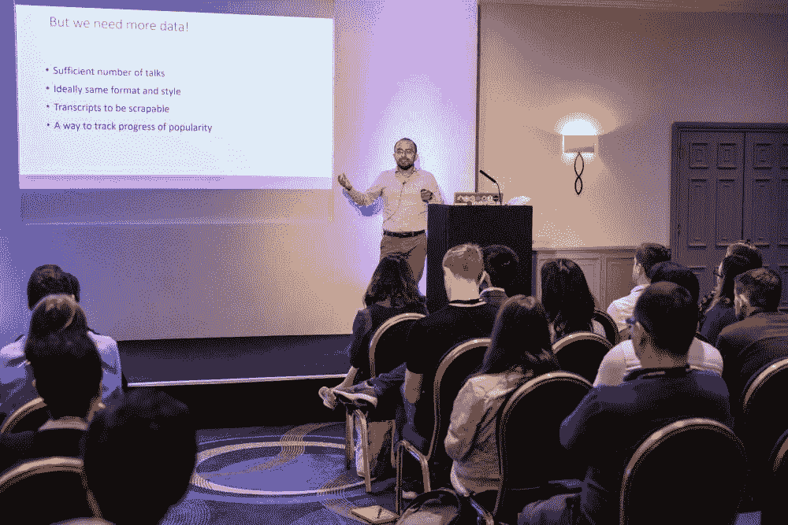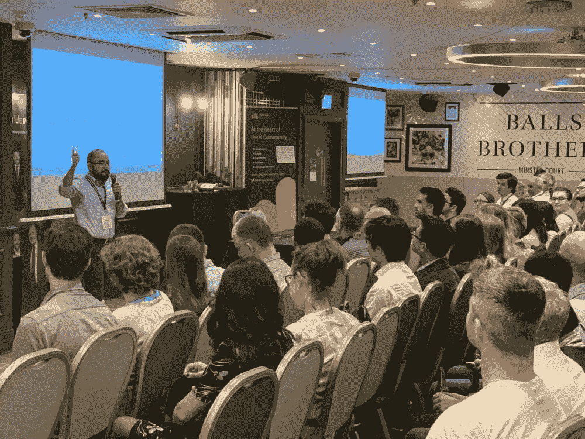

干杯，

爱德华多

*原载于 2019 年 10 月 15 日*[*http://www.speakthedata.com*](https://speakthedata.com/2019/07/16/words-that-will-inspire-at-londonr/)*。*