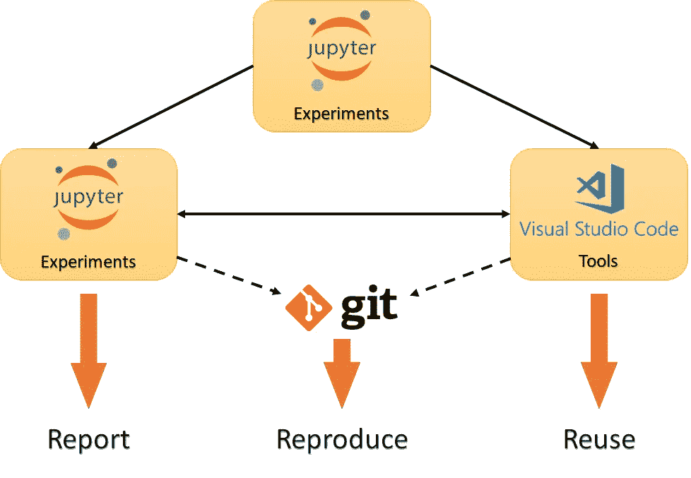
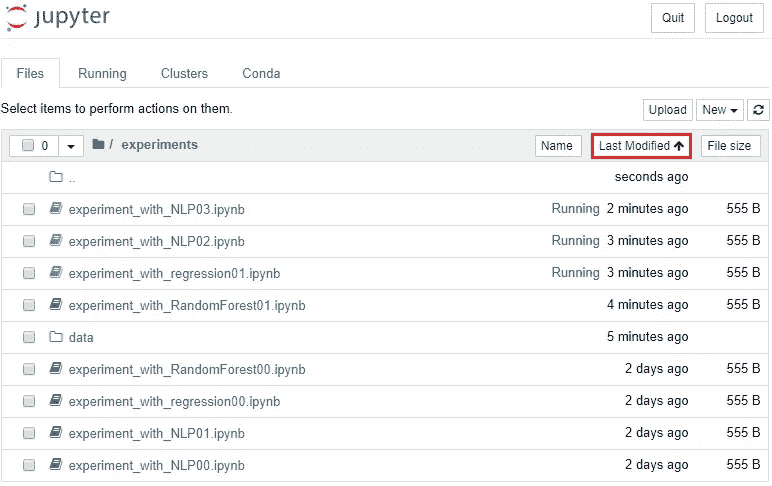
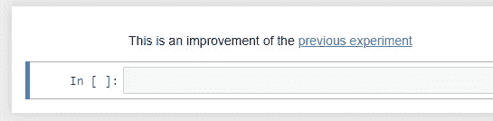

# 如果你是科学家，如何用 Python 组织代码

> 原文：<https://towardsdatascience.com/workflow-for-reportable-reusable-and-reproducible-computational-research-45d036c8a908?source=collection_archive---------2----------------------->

## 可报告、可重复使用和可再现的计算研究工作流程



如果你从事计算研究或数据科学，并且你没有计算机科学背景，你可能产生了惊人的科学知识，但是你写的代码并不完全符合学术标准。你可能需要一周的时间让你的脚本再次做同样的事情。即使你是一个经验丰富的程序员，你可能会发现很难同时做好开发人员和科学家的工作。

作为一名研究生，我自己也面临过这个挑战。虽然我参加了软件工程的课程，但我发现很难从交给我的研究问题中转移出来，去思考如何从我的代码中创建有用的工具。经过一些尝试和错误，我设计了一个方法来帮助我无缝地进行转换，现在我作为一名数据科学家在我的探索性工作中使用它。

在这篇文章中，我分享了我组织编码工作流的方式，给你一些提示和技巧，并向你展示我使用的工具堆栈。目标是使从实验到工具开发的过渡更加容易。

# Jupyter 笔记本:数字实验室笔记本

为了让研究成为可重复的**，你需要记录你正在做的所有事情。如果您只想尽可能快地进行实验并进行特别分析，这可能是一个负担。**

**我做实验用的工具是 Jupyter Notebook。交互式编程接口允许您即时检查您的代码做了什么，因此您可以一步一步地构建算法。此外，您可以使用 Markdown 单元格来写下您的想法和结论，以及代码。这使得记录和报告你所做的一切变得非常容易。**

**你可以在网上找到大量的 Jupyter 教程。我建议熟悉一下**键盘快捷键**(它们在编辑器的帮助菜单下有描述)，因为它们会显著加快你的工作。**

## **关于循环的实验**

**在数字实验中，循环实验变量非常简单。毕竟，计算机的能力来自于它们不断重复做事情的能力。**

**我在下面的代码中构建了正式的实验。**

**为了透明起见，我将当前实验的所有重要变量都放在文件开头的列表中。**

**这里要考虑的一件事是如何处理每次迭代的输出:你应该把它处理成一个可视化，计算一个度量还是存储它？应用和期望的报告形式决定了这种选择。**

## **集中化和交叉引用**

**应该为每一个重要的实验创建一个笔记本文件，由你来决定这意味着什么。每当我使用不同的参数或新的做事方式重复一个实验时，我都会保存一个相关的标题和版本号。**

**这与版本控制不同，因为我保留了我工作的所有记录，而不仅仅是它的最新版本。而且，我把所有的实验放在同一个文件夹里，不管它们被分配到哪个项目。**

****

**Example of how to organize experiments in the same folder**

**虽然这会创建一大堆文件，但是通过按修改日期排序，您可以很容易地将相关的文件放在最上面。**集中化**通过简单的搜索就可以轻松找到特定的文件，而不是在你不记得逻辑的文件夹层次中穿行。**

**把东西放在一起的最大好处是你可以在笔记本内部和之间实现**交叉引用**。这可以通过 Markdown 中的 html 链接来实现。**

**若要创建对笔记本中某一节的引用，请在被引用部分之前的 Markdown 单元格中添加以下代码:**

```
<a id='label_of_your_choice'></a><!--referenced section in file experiment00.ipynb-->
```

**现在，在您希望显示引用链接的地方，编写以下内容之一:**

```
[description](#label_of_your_choice) <!--to make link in the same notebook-->[description](experiment00.ipynb#label_of_your_choice) <!--to make link in another notebook-->
```

**例如，`[previous experiment]
(experiment00.ipynb#label_of_your_choice)`产生链接:**

****

**Example of a cross reference to a previous experiment**

**现在，您可以一键直接跳转到旧实验中的引用部分。**

**报告应该只是你实验的最佳版本的总结和附带的评论。快速查找你的记录是你工作的可报告性的关键，如果交叉引用设置到位，这是一个点击笔记本的问题。**

## **处理数据**

**有时您需要保存一些数据结果，用于报告、共享或在其他实验中使用。文件格式由您和具体情况决定。在这种情况下，我将数据保存在实验文件夹内的**数据文件夹**中，并为它们命名，以表明它们来自哪个实验以及该实验的版本号。**

**为了使事情易于处理，我在电子表格中记录日志，在那里我列出了我所有实验的数据输入和输出。**

# **包装功能**

**您可能熟悉在脚本中编写函数，以使代码整洁，增强理解，最重要的是**干(不要重复)**。随着实验的发展，您的功能也在发展，在其中封装了越来越多的逻辑和其他功能。**

**如果你遵循了我的方法，你开始将你的实验分成多个笔记本文件，每个实验和它的版本一个。当你从一个实验带到另一个实验的(功能)包袱显著增长时，是时候开始考虑代码的**可重用性**了。如果您可以像处理其他 Python 库一样，将通过时间考验的函数顺利导入到您的代码中，这不是很好吗？**

**您应该简单地从在**中保存函数开始。py 文件**连同你的实验。你可以在你最喜欢的 IDE 中编辑这些文件(我用的是 VS 代码)。然后，您可以**在文件名**上使用导入语句，将所有这些功能放回您的实验中:**

```
# if you save the experiment_with() function in the
# experiment_functions.py file in the same folder as 
# your experiment, you can import it into your codefrom experiment_functions import experiment_with
```

## **默认隐藏复杂性**

**随着您的功能变得更加复杂和灵活，它们将需要大量的输入，这变得难以管理。幸运的是 Python 方便了设置函数参数的**默认值。使用默认值可以大大加快实验过程，隐藏不必要的复杂性。这也有助于刚接触你的职能的人立即上手。****

**有时您会遇到需要将默认值定义为其他参数的函数的情况。在这种情况下，我使用的策略是**将默认值设置为 None** ，并立即在函数体中检查要设置的参数是否在调用时定义。如果不是，那么我相应地给它赋值。请参见下面的示例。**

## **面向对象编程的灵活性**

**当函数变得如此之大，以至于它们封装了整个算法，并且有许多参数需要优化时，函数的简单接口可能是不够的。在这种情况下，我更喜欢面向对象方法的灵活性。**

**通过将**算法包装成对象**，您可以**通过将参数定义为类的属性来随时改变参数**。您可以设置非常具体的配置，并根据需要对算法进行微小的调整。**

**类也可以用来构建特定于您的应用程序的数据结构并封装与它们相关的功能。使用面向对象的设计模式是一门完整的科学。**

## **版本控制而不破坏可再现性**

**既然您的**可重用函数位于与实验代码分离的模块**中，保持事物的可处理性和可再现性可能会变得具有挑战性。您可能希望修改代码中可重用的部分，使它们及时变得更好。**

**这是**再现性**和**可重用性**发生冲突的时刻。如果你想用你的超级进化算法重现你两年前的实验，你可能会得到完全不同的结果。因此，您希望将您在实验中使用的模块的确切版本与您使用它们的笔记本文件保存在一起(除非您希望掩盖您过去做过的一些蠢事)。如果你为你所做的每一个修改保存一个编号的文件，并把它和实验记录在一起，事情会变得非常复杂。**

**进入版本控制。软件工程师通过版本控制和使用环境来保持事物的兼容性，从而使事物具有可复制性。完全相同的想法可以应用于我们的实验。您可以在改进函数和类时开始对它们进行版本控制，同时**在实验文件**中维护对相应版本的引用。**

**这是我的做法。我整理出那些**。将文件复制到名为< project > _func 的项目文件夹**中，在其中我建立了存储库并用 git 启动**版本控制。如果你之前没用过 git，继续找 git 教程，然后再回来。****

**每当我创建一个新的实验文件时，我都确保我已经提交了我正在使用的代码版本，并在实验文件顶部的一个单元格中写下以下几行:**

```
%%bash 
cd <project>_func # move inside the directory where you have the         
                  # repository you need
git checkout <git commit id> # restore the version of the code
                             # you will use
```

**然后在实验中，我根据需要导入我的函数。例如，假设我最近搬到了法国，现在我用法语写所有的报告。导入并运行该功能的最新版本**

```
from magic_func.magic import do_some_magicdo_some_magic()
```

**印刷品:**

```
Salut Le Monde!
```

**问题是，我有一个生成英文报告的旧实验脚本，我想重新运行它。幸运的是，我在实验笔记本的顶部引用了提交 id，如前面所示:**

```
%%bash
cd magic_func
git checkout cff052f7c36bb09ccc101d9ce3652dce87f2acbc
```

**在这个上下文中，上面的相同代码的输出是:**

```
Hello World!
```

**瞧啊。版本控制和编写良好的记录的魔力。**

## **Python 包与世界共享**

**最终，你会想要**打包。将文件复制到适当的 Python 包中**。然后，您将能够与其他人共享它们，并将它们安装在您在实验笔记本中使用的 Ipython 内核的环境中。**

**可以跟着官方的 [Python 打包指南](https://packaging.python.org/tutorials/packaging-projects/)学习如何打包代码和这个[教程](https://medium.com/@joel.barmettler/how-to-upload-your-python-package-to-pypi-65edc5fe9c56)上传到 PyPi 上。要在 Jupyter Notebook 中使用您的软件包的特定版本，我建议您将其安装在 [conda 环境](https://docs.conda.io/projects/conda/en/latest/user-guide/tasks/manage-environments.html)中。然后，如果您遵循 [nb_conda_kernels](https://github.com/Anaconda-Platform/nb_conda_kernels) 扩展的安装说明，您就可以在那个环境中运行 Jupyter 内核。**

# **从实验到单元测试**

**当你向你的包中添加功能时，你可以**采用测试驱动的开发哲学**。它指出，在编写单元测试代码之前，应该先编写单元测试。通过这种方式，你可以使你想从你的包中实现的任务具体化。**

**你可能已经在实验文件中摆弄过你的模块了。你可以**在你的笔记本**中设计测试，然后将它们的代码粘贴到单元测试的正式结构中。对于我的包，我使用 pytest 框架。**

**当你达到这一点时，你就不再只是一个实验主义者了。你也是一名开发者，你需要**分享、维护和改进你创造的工具**。祝编码愉快！**