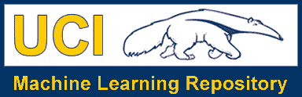

# 机器学习项目的工作流程

> 原文：<https://towardsdatascience.com/workflow-of-a-machine-learning-project-ec1dba419b94?source=collection_archive---------1----------------------->

# 介绍

在这篇博客中，我们将讨论机器学习项目的工作流程，这包括从头开始构建合适的机器学习项目所需的所有步骤。

我们还将讨论数据预处理、数据清洗、特征探索和特征工程，并展示其对机器学习模型性能的影响。我们还将介绍一些有助于提高模型性能的预建模步骤。

完成任务所需的 Python 库:
1。Numpy
2。熊猫
3。Sci-kit Learn
4。Matplotlib

Overview of the Workflow of ML

# 了解机器学习工作流程

我们可以将机器学习工作流程定义为 3 个阶段。

1.  收集数据
2.  数据预处理
3.  研究最适合该数据类型的模型
4.  训练和测试模型
5.  估价

好的，但是首先让我们从基础开始

## **什么是机器学习模型？**

机器学习模型不过是一段代码；工程师或数据科学家通过数据训练让它变得聪明。因此，如果你给模型垃圾，你将得到垃圾作为回报，即训练好的模型将提供错误或错误的预测。

# 1.收集数据

收集数据的过程取决于我们想要做的项目的类型，如果我们想要做一个使用实时数据的 ML 项目，那么我们可以建立一个使用不同传感器数据的物联网系统。数据集可以从各种源收集，例如文件、数据库、传感器和许多其他这样的源，但是所收集的数据不能直接用于执行分析过程，因为可能有许多丢失的数据、非常大的值、无组织的文本数据或有噪声的数据。因此，要解决这个问题，需要做好数据准备。

我们也可以使用一些互联网上的免费数据集。 [**Kaggle**](http://www.kaggle.com) 和 [**UCI 机器学习库**](https://archive.ics.uci.edu/ml/datasets.html) 是制作机器学习模型使用最多的库。Kaggle 是访问量最大的网站之一，用于练习机器学习算法，他们还举办比赛，人们可以参加比赛，测试他们的机器学习知识。

# 2.数据预处理

数据预处理是机器学习中最重要的步骤之一。这是最重要的一步，有助于更准确地建立机器学习模型。在机器学习中，有一个 80/20 法则。每个数据科学家都应该花 80%的时间进行数据预处理，20%的时间实际执行分析。

## **什么是数据预处理？**

数据预处理是清理原始数据的过程，即数据是在现实世界中收集的，并被转换为干净的数据集。换句话说，无论何时从不同来源收集数据，都是以原始格式收集的，这些数据对于分析是不可行的。因此，执行某些步骤将数据转换成一个小的干净数据集，这部分过程称为数据预处理。

## **我们为什么需要它？**

众所周知，数据预处理是将原始数据清洗成干净数据的过程，这样可以用来训练模型。因此，我们肯定需要数据预处理，以从机器学习和深度学习项目中的应用模型中获得良好的结果。

大多数真实世界的数据是杂乱的，其中一些类型的数据是:

1.**缺失数据:**当缺失数据不是连续创建的，或者由于应用程序(IOT 系统)中的技术问题，可以找到缺失数据。

2.**噪声数据:**这种类型的数据也称为异常值，这可能是由于收集数据时的人为错误(人为手动收集数据)或设备的某些技术问题造成的。

3.**不一致的数据:**这种类型的数据可能是由于人为错误(名称或值的错误)或数据重复而收集的。

## 三种数据类型

1.数字，如收入、年龄

2.分类，如性别、国籍

3.序数，例如低/中/高

## 如何进行数据预处理？

这些是可用于转换原始数据的一些基本预处理技术。

1.**数据的转换:**我们知道机器学习模型只能处理数字特征，因此分类和序数数据必须以某种方式转换成数字特征。

2.**忽略缺失值:**每当我们在数据集中遇到缺失数据时，我们可以根据需要删除该行或该列数据。众所周知，这种方法很有效，但是如果数据集中有大量缺失值，就不应该执行这种方法。

3.**填充缺失值:**每当我们在数据集中遇到缺失数据时，我们可以手动填充缺失数据，通常使用平均值、中值或最高频率值。

4.**机器学习:**如果我们有一些缺失的数据，那么我们可以通过使用现有的数据来预测哪些数据应该出现在空的位置。

5.**异常值检测:**我们的数据集中可能存在一些错误数据，这些数据与数据集中的其他观察值有很大差异。【例:人的体重= 800 斤；由于打错了额外的 0]

# **3。研究最适合数据类型的模型**

我们的主要目标是使用预处理的数据，尽可能训练出性能最佳的模型。

## **监督学习:**

在监督学习中，人工智能系统提供了带标签的数据，这意味着每个数据都标记了正确的标签。

监督学习分为另外两类，即“**分类**和“**回归**”。

## 分类:

**分类**问题是当目标变量是**分类的**(即输出可以分类——属于 A 类或 B 类或其他)。

一个分类问题是当输出变量是一个类别时，例如“红色”或“蓝色”，“疾病”或“无疾病”或“垃圾邮件”或“非垃圾邮件”。

Classification [| GIF: www.cs.toronto.edu](https://www.cs.toronto.edu/~frossard/post/classification/)

如上图所示，我们在图上绘制了两个类别，即红色和蓝色，分别表示为‘setosa flower’和‘versicolor flower’，我们可以将 X 轴想象为‘萼片宽度’,将 Y 轴想象为‘萼片长度’,因此我们尝试创建[最佳拟合线](https://mathbits.com/MathBits/TISection/Statistics1/LineFit.htm),将两类花分开。

这些是一些最常用的分类算法。

*   **K-最近邻**
*   **朴素贝叶斯**
*   **决策树/随机森林**
*   **支持向量机**
*   **逻辑回归**

## 回归:

而**回归**问题是当目标变量**连续**(即输出为数值)时。

Regression | GIF: techburst.io

如上图所示，我们可以想象图中的 X 轴是“考试成绩”，Y 轴代表“智商”。因此，我们试图在给定的图表中创建[最佳拟合线](https://mathbits.com/MathBits/TISection/Statistics1/LineFit.htm)，这样我们就可以使用这条线来预测给定数据中不存在的任何近似智商。

这些是一些最常用的回归算法。

*   **线性回归**
*   **支持向量回归**
*   **决策树/随机森林**
*   **高斯渐进回归**
*   **集成方法**

## 无监督学习:

在无监督学习中，人工智能系统呈现的是未标记、未分类的数据，系统的算法在没有事先训练的情况下对数据进行操作。输出取决于编码算法。让系统接受无监督学习是测试人工智能的一种方式。

无监督学习分为另外两类，即“**聚类**和“**关联**”。

## 聚类:

一组输入将被分成组。与分类不同的是，这些组事先并不知道，因此这通常是一项无人监督的任务。

Clustering

用于聚类的方法有:

*   **高斯混合**
*   **K-均值聚类**
*   **助推**
*   **层次聚类**
*   **K 均值聚类**
*   **谱聚类**

## 类别下的模型概述:

Overview of models

# 4.根据数据训练和测试模型

为了训练模型，我们最初将模型分成 3 个部分，即'**训练数据**'、**验证数据**和'**测试数据**。

您使用'**训练数据集**训练分类器，使用'**验证集**调整参数，然后在看不见的'**测试数据集**上测试您的分类器的性能。要注意的重要一点是，在训练分类器期间，只有训练和/或验证集是可用的。在训练分类器期间，不得使用测试数据集。测试集仅在测试分类器期间可用。

**训练集:**训练集是计算机学习如何处理信息的材料。机器学习使用算法来执行训练部分。用于学习的一组数据，即拟合分类器的参数。

**验证集:**交叉验证主要用在应用机器学习中，在看不见的数据上评估机器学习模型的技能。使用来自训练数据的一组看不见的数据来调整分类器的参数。

**测试集:**一组不可见的数据，仅用于评估完全指定的分类器的性能。

一旦数据被分成 3 个给定的部分，我们就可以开始训练过程。

在数据集中，训练集用于建立模型，而测试(或验证)集用于验证所建立的模型。训练集中的数据点从测试(验证)集中排除。通常一个数据集在每次迭代中分为训练集、验证集(有人用‘测试集’代替)，或者在每次迭代中分为训练集、验证集、测试集。

该模型使用我们在第 3 步/第 3 点中选择的任何一个模型。一旦模型被训练，我们可以使用相同的训练模型来使用测试数据(即，看不见的数据)进行预测。一旦这样做了，我们就可以开发一个混淆矩阵，它告诉我们我们的模型训练得有多好。一个混淆矩阵有 4 个参数，分别是'**真阳性'**，**，【真阴性'**，**，【假阳性】，**假阴性'**。我们更喜欢在真阴性和真阳性中获得更多的值，以获得更准确的模型。混淆矩阵的大小完全取决于类别的数量。**

*   **真阳性:**这些是我们预测为真且预测输出正确的情况。
*   **真否定:**我们预测错误，预测输出正确。
*   **误报:**我们预测为真，但实际预测输出为假。
*   **假阴性:**我们预测的是假的，但实际预测的输出是真的。

我们还可以使用混淆矩阵来确定模型的准确性。

> 准确度=(真阳性+真阴性)/(类别总数)

即对于上面的例子:

准确度= (100 + 50) / 165 = 0.9090(准确度为 90.9%)

## 5.估价

模型评估是模型开发过程不可或缺的一部分。它有助于找到代表我们的数据的最佳模型，以及所选模型在未来的工作情况。

为了改进模型，我们可以调整模型的超参数，并尝试提高准确性，同时查看混淆矩阵，尝试增加真阳性和真阴性的数量。

# 结论

在这篇博客中，我们讨论了机器学习项目的工作流程，并给了我们一个应该如何解决这个问题的基本想法。

一个机器学习项目的工作流程实现:[https://github.com/NotAyushXD/Titanic-dataset](https://github.com/NotAyushXD/Titanic-dataset)