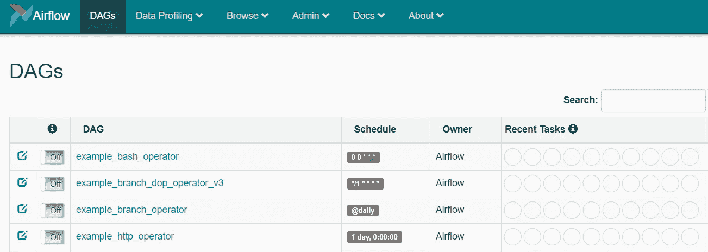

# ML 管道的工作流工具

> 原文：<https://towardsdatascience.com/workflow-tools-for-model-pipelines-45030a93e9e0?source=collection_archive---------13----------------------->


Source: [https://www.flickr.com/photos/rauckhaus/8638556209](https://www.flickr.com/photos/rauckhaus/8638556209)

## 第 5 章“生产中的数据科学”节选

*Airflow 正在成为创作数据工程和模型管道工作流程的行业标准。我的书的这一章探讨了将一个运行在单个 EC2 实例上的简单管道带到一个负责调度任务的完全管理的 Kubernetes 生态系统的过程。这篇文章省略了 GKE 和 Cloud Composer 的全面管理解决方案的部分。*

[](https://leanpub.com/ProductionDataScience) [## 生产中的数据科学

### 从初创公司到数万亿美元的公司，数据科学在帮助组织最大化…

leanpub.com](https://leanpub.com/ProductionDataScience) 

模型管道通常是提供数据源(如湖泊和仓库)和数据存储(如应用程序数据库)的更广泛的数据平台的一部分。在构建管道时，能够安排任务运行、确保管道的所有依赖项都已完成，并在需要时回填历史数据是非常有用的。虽然可以手动执行这些类型的任务，但是已经开发了各种工具来改进数据科学工作流的管理。

在本章中，我们将探索执行一系列任务的批处理模型管道，以便为倾向模型训练和存储结果。这是一个与我们到目前为止所探索的部署不同的任务类型，我们所探索的部署侧重于将实时模型预测作为 web 端点。在批处理过程中，您执行一组存储模型结果的操作，这些结果稍后将由不同的应用程序提供。例如，批处理模型管道可以预测游戏中的哪些用户可能会流失，游戏服务器为开始会话的每个用户获取预测并提供个性化报价。

在为生产系统构建批处理模型管道时，确保管道问题得到快速解决是非常重要的。例如，如果模型管道由于数据库的上游故障而无法获取一组用户的最新数据，那么拥有一个系统是很有用的，该系统可以向拥有管道的团队发送警报，并且可以重新运行部分模型管道，以便解决先决数据或模型输出的任何问题。

工作流工具为管理模型管道中的这类问题提供了解决方案。使用工作流工具，您可以指定需要完成的操作，确定操作之间的依赖关系，然后安排工具执行的操作。工作流工具负责运行任务、提供资源和监控任务的状态。有许多用于构建工作流的开源工具，包括 AirFlow、Luigi、MLflow 和 Pentaho Kettle。我们将重点关注气流，因为它正在被各公司和云平台广泛采用，并且还提供完全受管理的气流版本。

在这一章中，我们将构建一个作为 Docker 容器运行的批处理模型管道。接下来，我们将使用 cron 安排任务在 EC2 实例上运行，然后使用 Kubernetes 探索 cron 的托管版本。在第三部分中，我们将使用 Airflow 来定义要执行的操作的图表，以便运行我们的模型管道，并探索 Airflow 的云产品。

# 5.1 SKLearn 工作流程

批处理模型管道的常见工作流是从数据湖或数据仓库中提取数据，根据历史用户行为训练模型，针对更近的数据预测未来用户行为，然后将结果保存到数据仓库或应用程序数据库。在游戏行业，这是一个我见过的用于建立购买可能性和流失可能性模型的工作流，其中游戏服务器使用这些预测根据模型预测向用户提供不同的待遇。通常像 sklearn 这样的库用于开发模型，PySpark 这样的语言用于扩展到完整的玩家基础。

对于模型管道来说，在管道可以在最近的数据上运行之前，通常需要在数据平台中运行其他 ETL。例如，数据平台中可能有一个上游步骤，将 json 字符串翻译成模式化的事件，用作模型的输入。在这种情况下，可能有必要在 json 转换过程出现问题的那天重新运行管道。在本节中，我们将通过使用静态输入数据源来避免这种复杂性，但是我们将探索的工具提供了处理这些问题所需的功能。

据我所知，在游戏行业部署的批处理模型管道通常有两种类型:

*   **持久:**一个单独的训练工作流用于训练模型，而不是用于建立预测的模型。模型在训练运行之间保持不变，并加载到服务工作流中。
*   **瞬态:**相同的工作流用于训练和服务预测，并且不是将模型保存为文件，而是为每次运行重建模型。

在这一节中，我们将构建一个瞬态批处理管道，每次运行都会重新训练一个新的模型。如果训练过程是重量级的，这种方法通常会导致使用更多的计算资源，但它有助于避免模型漂移的问题，我们将在第 11 章中讨论。我们将创建一个执行以下步骤的管道:

1.  从 GitHub 获取数据集
2.  训练逻辑回归模型
3.  应用回归模型
4.  将结果保存到 BigQuery

管道将作为执行所有这些步骤的单个 Python 脚本来执行。对于您希望使用跨多个任务的步骤的中间输出的情况，将管道分解为通过工作流工具(如 Airflow)集成的多个流程是很有用的。

我们将通过首先编写一个在 EC2 实例上运行的 Python 脚本来构建这个脚本，然后将脚本进行 Dockerize，以便我们可以在工作流中使用该容器。首先，我们需要安装一个库，用于将 Pandas 数据框写入 BigQuery:

```
pip install --user pandas_gbq
```

接下来，我们将创建一个名为`pipeline.py`的文件，它执行上面确定的四个管道步骤..下面显示的脚本通过加载必要的库来执行这些步骤，将 CSV 文件从 GitHub 提取到 Pandas 数据框中，将数据框拆分为训练和测试组以模拟历史和最近的用户，使用训练数据集构建逻辑回归模型，为测试数据集创建预测，并将结果数据框保存到 BigQuery。

```
import pandas as pd
import numpy as np
from google.oauth2 import service_account
from sklearn.linear_model import LogisticRegression
from datetime import datetime
import pandas_gbq ***# fetch the data set and add IDs*** gamesDF = pd.read_csv("https://github.com/bgweber/Twitch/raw/
                       master/Recommendations/games-expand.csv")
gamesDF['User_ID'] = gamesDF.index 
gamesDF['New_User'] = np.floor(np.random.randint(0, 10, 
                                            gamesDF.shape[0])/9)***# train and test groups*** train = gamesDF[gamesDF['New_User'] == 0]
x_train = train.iloc[:,0:10]
y_train = train['label']
test = gameDF[gamesDF['New_User'] == 1]
x_test = test.iloc[:,0:10]***# build a model*** model = LogisticRegression()
model.fit(x_train, y_train)
y_pred = model.predict_proba(x_test)[:, 1]***# build a predictions data frame*** resultDF = pd.DataFrame({'User_ID':test['User_ID'], 'Pred':y_pred}) 
resultDF['time'] = str(datetime. now())***# save predictions to BigQuery*** table_id = "dsp_demo.user_scores"
project_id = "gameanalytics-123"
credentials = service_account.Credentials.
                          from_service_account_file('dsdemo.json')
pandas_gbq.to_gbq(resultDF, table_id, project_id=project_id, 
                  if_exists = 'replace', credentials=credentials)
```

为了模拟真实世界的数据集，脚本为每条记录分配一个`User_ID`属性，它代表一个惟一的 ID 来跟踪系统中的不同用户。该脚本还通过分配一个`New_User`属性将用户分为历史组和最近组。为每个最近的用户构建预测后，我们创建一个包含用户 ID、模型预测和时间戳的结果数据框。为了确定管道是否成功完成，对预测应用时间戳是很有用的。若要测试模型管道，请在命令行上运行以下语句:

```
export GOOGLE_APPLICATION_CREDENTIALS=
         **/**home/ec2-user/dsdemo.json
python3 pipeline.py
```

如果成功，该脚本应该在 BigQuery 上创建一个名为`dsp_demo`的新数据集，创建一个名为`user_users`的新表，并用用户预测填充该表。要测试 BigQuery 中是否实际填充了数据，请在 Jupyter 中运行以下命令:

```
from google.cloud import bigquery
client = **bigquery.Client**()sql = "select * from dsp_demo.user_scores"
**client.query**(sql)**.to_dataframe**()**.head**()
```

这个脚本将设置一个连接到 BigQuery 的客户机，然后显示提交给 BigQuery 的查询结果集。您还可以浏览到 BigQuery web UI 来检查管道的结果，如图 [5.1](/5-1-sklearn-workflow.html#fig:ch5-BQ) 所示。我们现在有一个脚本，可以获取数据，应用机器学习模型，并将结果保存为单个过程。


FIGURE 5.1: Querying the uploaded predictions in BigQuery.

使用许多工作流工具，您可以直接运行 Python 代码或 bash 脚本，但是最好为执行脚本建立隔离的环境，以避免不同库和运行时的依赖冲突。幸运的是，我们在第 4 章中探索了一个工具，可以将 Docker 与工作流工具结合使用。将 Python 脚本包装在 Docker for workflow tools 中很有用，因为您可以添加可能没有安装在负责调度的系统上的库，可以避免 Python 版本冲突的问题，并且容器正在成为工作流工具中定义任务的常用方式。

为了将我们的工作流容器化，我们需要定义一个 Dockerfile，如下所示。因为我们正在从头构建一个新的 Python 环境，所以我们需要安装 Pandas、sklearn 和 BigQuery 库。我们还需要将 EC2 实例中的凭证复制到容器中，这样我们就可以运行`export`命令向 GCP 进行身份验证。这适用于短期部署，但是对于长期运行的容器，最好在实例化的容器中运行导出，而不是将静态凭证复制到映像中。Dockerfile 列出了运行脚本所需的 Python 库，复制执行所需的本地文件，导出凭证，并指定要运行的脚本。

```
FROM ubuntu:latest
MAINTAINER Ben Weber RUN apt-get update \  
  && apt-get install -y python3-pip python3-dev \  
  && cd /usr/local/bin \  
  && ln -s /usr/bin/python3 python \  
  && pip3 install pandas \
  && pip3 install sklearn \  
  && pip3 install pandas_gbq  

COPY pipeline.py pipeline.py 
COPY /home/ec2-user/dsdemo.json dsdemo.jsonRUN export GOOGLE_APPLICATION_CREDENTIALS=**/**dsdemo.jsonENTRYPOINT ["python3","pipeline.py"]
```

在将该脚本部署到生产环境之前，我们需要从该脚本构建一个映像，并测试一个示例运行。下面的命令显示了如何从 Docker 文件构建映像，列出 Docker 映像，并运行模型管道映像的实例。

```
sudo docker image build -t "sklearn_pipeline" .
sudo docker images
sudo docker run sklearn_pipeline
```

运行最后一个命令后，容器化管道应该更新 BigQuery 中的模型预测。我们现在有了一个模型管道，可以作为单个 bash 命令运行，我们现在需要安排它以特定的频率运行。出于测试目的，我们将每分钟运行一次脚本，但实际上模型通常每小时、每天或每周执行一次。

# 5.2 Cron

模型管道的一个常见需求是以固定的频率运行任务，例如每天或每小时。Cron 是一个为运行 Linux 操作系统的机器提供调度功能的实用程序。您可以使用 crontab 实用程序设置一个计划任务，并分配一个 cron 表达式来定义运行该命令的频率。Cron 作业直接在使用 cron 的机器上运行，并且可以利用安装在系统上的运行时和库。

在生产级系统中使用 cron 有许多挑战，但是这是开始调度少量任务的一个很好的方法，并且学习许多调度系统中使用的 cron 表达式语法也很有好处。cron 实用程序的主要问题是它运行在一台机器上，不能与版本控制等工具进行本地集成。如果您的机器停机，那么您需要在一台新机器上重新创建您的环境并更新您的 cron 表。

cron 表达式定义了运行命令的频率。它是一个由 5 个数字组成的序列，定义了不同时间粒度下的执行时间，并且可以包含通配符，以便总是在特定时间段内运行。下面的代码片段显示了一些示例表达式:

```
***# run every minute*** * * * * * ***# Run at 10am UTC everyday*** 0 10 * * * ***# Run at 04:15 on Saturday*** 15 4 * * 6
```

在开始使用 cron 时，最好使用工具来验证您的表达式。Cron 表达式用于 Airflow 和许多其他调度系统。

我们可以使用 cron 来安排我们的模型管道以固定的频率运行。要计划运行命令，请在控制台上运行以下命令:

```
crontab -e
```

该命令将打开 cron 表格文件，在`vi`中进行编辑。要安排管道每分钟运行一次，请将以下命令添加到文件中并保存。

```
***# run every minute*** * * * * * sudo docker run sklearn_pipeline
```

退出编辑器后，cron 表将使用要运行的新命令进行更新。cron 语句的第二部分是要运行的命令。在定义要运行的命令时，包含完整的文件路径非常有用。使用 Docker，我们只需要定义要运行的映像。要检查脚本是否真的在执行，浏览到 BigQuery UI 并检查`user_scores`模型输出表上的`time`列。

我们现在有了一个实用程序，可以定期调度我们的模型管道。然而，如果机器停机，那么我们的管道将无法执行。为了处理这种情况，最好探索具有 cron 调度功能的云产品。

# 5.3 工作流程工具

Cron 对于简单的管道是有用的，但是当任务依赖于其他可能失败的任务时，就会遇到挑战。为了帮助解决这个问题，任务有依赖关系，只有部分管道需要重新运行，我们可以利用工作流工具。Apache Airflow 是目前最流行的工具，但也有其他开源项目提供类似的功能，包括 Luigi 和 MLflow。

在一些情况下，工作流工具比直接使用 cron 更有优势:

*   **依赖关系:**工作流工具定义了操作的图形，这使得依赖关系显式化。
*   **Backfills:** 可能有必要在一系列不同的日期对旧数据运行 ETL。
*   **版本化:**大多数工作流工具都集成了版本控制系统来管理图表。
*   **告警:**这些工具可以在出现故障时发出邮件或者生成页面任务告警。

工作流工具在不同团队安排任务的环境中特别有用。例如，许多游戏公司都有数据科学家来安排模型管道，这些管道依赖于由单独的工程团队安排的 ETL。

在本节中，我们将安排任务使用托管的 Airflow 运行 EC2 实例，然后在 GCP 上探索一个完全托管的 Airflow 版本。

# 阿帕奇气流

Airflow 是一款开源工作流工具，最初由 Airbnb 开发，于 2015 年公开发布。它有助于解决许多公司面临的一个挑战，即调度具有许多相关性的任务。该工具的核心概念之一是定义要执行的任务以及这些任务之间关系的图表。

在 Airflow 中，一个图被称为 DAG，它是有向无环图的缩写。DAG 是一组要执行的任务，其中每个任务有零个或多个上游依赖项。其中一个限制是不允许循环，两个任务在上游相互依赖。

Dag 是使用 Python 代码设置的，这是与 Pentaho Kettle 等其他工作流工具的区别之一，Pentaho Kettle 以 GUI 为中心。气流方法被称为“代码配置”，因为 Python 脚本定义了要在工作流图中执行的操作。使用代码而不是 GUI 来配置工作流是有用的，因为这使得与版本控制工具(如 GitHub)的集成变得更加容易。

要开始使用 Airflow，我们需要安装库，初始化服务，并运行调度程序。要执行这些步骤，请在 EC2 实例或您的本地计算机上运行以下命令:

```
export AIRFLOW_HOME=**~/**airflow
pip install --user apache-airflow
airflow initdb
airflow scheduler
```

Airflow 还提供了一个 web 前端，用于管理已调度的 Dag。要启动此服务，请在同一台计算机上的新终端中运行以下命令。

```
airflow webserver -p 8080
```

这个命令告诉 Airflow 在端口 8080 上启动 web 服务。您可以在本机的这个端口打开网页浏览器，查看气流的网页前端，如图 [5.3](/5-3-workflow-tools.html#fig:ch5-home) 所示。



FIGURE 5.3: The Airflow web app running on an EC2 instance.

Airflow 预装了许多示例 Dag。对于我们的模型管道，我们将创建一个新的 DAG，然后通知 Airflow 更新。我们将使用以下 DAG 定义创建一个名为`sklearn.py`的文件:

```
from airflow import DAG
from airflow.operators.bash_operator import BashOperator
from datetime import datetime, timedeltadefault_args = {
   'owner': 'Airflow',
   'depends_on_past': False,
   'email': 'bgweber@gmail.com',
   'start_date': **datetime**(2019, 11, 1),
   'email_on_failure': True,
}dag = **DAG**('games', default_args=default_args,
        schedule_interval="* * * * *")t1 = **BashOperator**(
    task_id='sklearn_pipeline',
    bash_command='sudo docker run sklearn_pipeline',
    dag=dag)
```

这个 Python 脚本中有几个步骤需要调用。该脚本使用一个`Bash`操作符来定义要执行的动作。Bash 操作符被定义为脚本中的最后一步，它指定要执行的命令。DAG 用许多定义工作流设置的输入参数来实例化，例如当任务失败时向谁发送电子邮件。cron 表达式被传递给 DAG 对象来定义任务的调度，DAG 对象被传递给 Bash 操作符来将任务与这个操作图相关联。

在将 DAG 添加到 airflow 之前，检查代码中的语法错误是很有用的。我们可以从终端运行以下命令来检查 DAG 的问题:

```
python3 sklearn.py
```

此命令不会运行 DAG，但会标记脚本中存在的任何语法错误。要使用新的 DAG 文件更新 Airflow，请运行以下命令:

```
airflow list_dags-------------------------------------------------------------------
DAGS
-------------------------------------------------------------------
games
```

此命令会将 DAG 添加到 Airflow 中的工作流程列表。要查看 Dag 列表，请导航到 Airflow web 服务器，如图 [5.4](/5-3-workflow-tools.html#fig:ch5-dag) 所示。web 服务器将显示 DAG 的时间表，并提供工作流过去运行的历史记录。要检查 DAG 是否真的在工作，请浏览 BigQuery UI 并检查新的模型输出。


FIGURE 5.4: The sklearn DAG scheduled on Airflow.

我们现在已经启动并运行了一个气流服务，我们可以用它来监控工作流的执行。这种设置使我们能够跟踪工作流的执行情况，填补数据集中的任何空白，并为关键工作流启用警报。

Airflow 支持各种操作，许多公司编写了供内部使用的自定义操作符。在我们的第一个 DAG 中，我们使用 Bash 操作符来定义要执行的任务，但是其他选项也可用于运行 Docker 映像，包括 Docker 操作符。下面的代码片段展示了如何将 DAG 改为使用 Docker 操作符而不是 Bash 操作符。

```
from airflow.operators.docker_operator import DockerOperatort1 = **DockerOperator**(
    task_id='sklearn_pipeline',
    image='sklearn_pipeline',
    dag=dag)
```

我们定义的 DAG 没有任何依赖关系，因为容器执行模型管道中的所有步骤。如果我们有一个依赖项，比如在运行模型管道之前运行一个`sklearn_etl`容器，我们可以使用如下所示的`set_upstrean`命令。这个配置设置了两个任务，其中管道任务将在 etl 任务完成后执行。

```
t1 = **BashOperator**(
    task_id='sklearn_etl',
    bash_command='sudo docker run sklearn_etl',
    dag=dag)t2 = **BashOperator**(
    task_id='sklearn_pipeline',
    bash_command='sudo docker run sklearn_pipeline',
    dag=dag)**t2.set_upstream**(t1)
```

Airflow 提供了一组丰富的功能，我们只是触及了该工具所提供功能的皮毛。虽然我们已经能够通过托管和托管云产品来安排模型管道，但通过气流来安排任务对于改进监控和版本控制非常有用。随着时间的推移，工作流工具的前景将会改变，但是许多气流的概念将会转化为这些新的工具。

# 5.4 结论

在本章中，我们探索了一个批处理模型管道，用于将机器学习模型应用于一组用户，并将结果存储到 BigQuery。为了使管道可移植，以便我们可以在不同的环境中执行它，我们创建了一个 Docker 映像来定义管道所需的库和凭证。然后，我们使用批处理命令、cron 和 Airflow 在 EC2 实例上运行管道。我们还使用 GKE 和 Cloud Composer 通过 Kubernetes 运行容器。

工作流工具的设置可能很繁琐，尤其是在安装集群部署时，但是它们提供了许多优于手动方法的优点。其中一个主要优势是能够将 DAG 配置作为代码进行处理，从而支持工作流的代码审查和版本控制。获得配置为代码的经验是很有用的，因为这是对另一个概念“基础架构为代码”的介绍，我们将在第 10 章中探讨。

本·韦伯是 Zynga 的一名杰出的数据科学家。我们正在[招聘](https://www.zynga.com/job-listing-category/data-analytics-user-research/)！