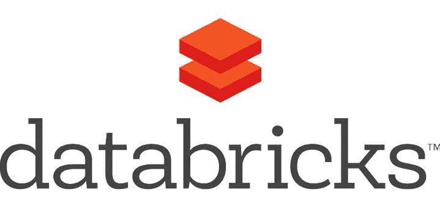
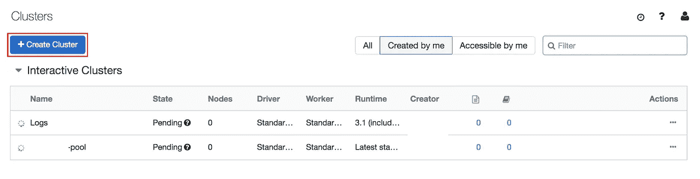
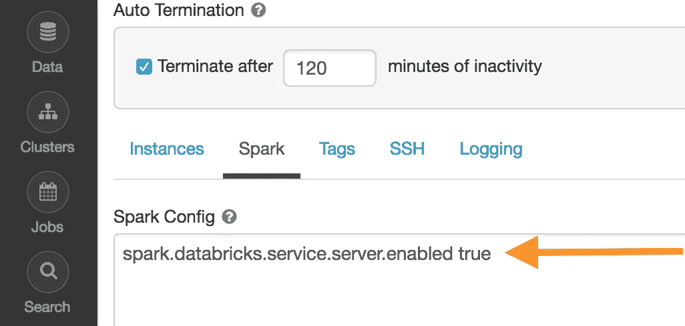
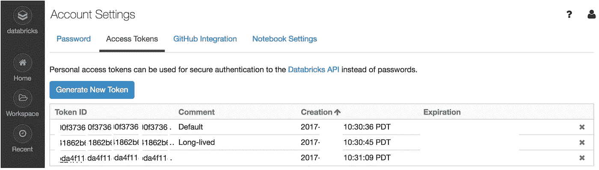
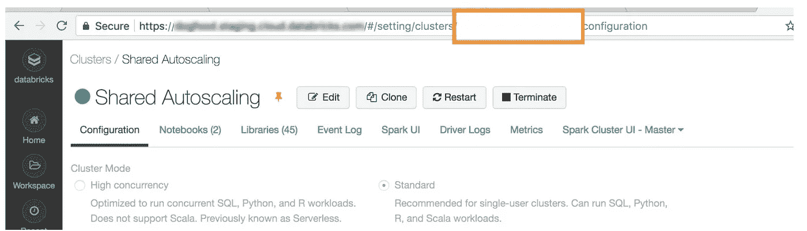

# 从远程机器上处理 Databricks 集群

> 原文：<https://towardsdatascience.com/working-on-a-databricks-cluster-from-a-remote-machine-c09d5a468ae3?source=collection_archive---------19----------------------->

## 简单的方法。

[Databricks](https://databricks.com/).com

想象一下下面的场景，您有一台专用的机器，并且希望在 Databricks 集群上远程运行您的作业。如果您在 Databricks 平台上工作，通常在 Databricks 集群上运行作业是相当容易的，因为集群已经配置好了。但是，从远程机器上运行作业需要一些设置。在这篇文章中，我将解释如何成功地远程运行集群作业。

就可用性而言，配置很简单，[以前](/how-to-install-pyspark-on-a-remote-machine-a3c86e76729d)我必须在我的机器上安装 PySpark，这需要在 shell 中进行大量的修改。此外，这并没有给我在 Databricks 集群上运行作业的能力。

以下是使用 [Databricks 文档](https://docs.databricks.com/user-guide/dev-tools/db-connect.html)的总结。它几乎被埋没了，没有立即在谷歌上出现。所以，希望这个帖子有所帮助。

## 安装和配置

> 1.pip 卸载 pyspark
> 2。pip 安装-用户数据块-cli
> 3。pip install-user-U data bricks-connect = = 5.5。*

确保你安装的版本和你的集群一样，对我来说，是 5.5。您可以在集群页面上查看它们，查看运行时列，如图 1 所示。

Figure 1: Clusters page, Logs monitoring is using runtime version 3.1.

注意:如果您的运行时是如图 3 所示的用户 toke。

> 3.集群 ID:您创建的集群的 ID。您可以从 URL 获取集群 ID。这里，橙色框 中的集群 ID 是 ***，如图 4 所示。***

Figure 2: special configuration for runtime<5.3.

1.  安装

配置***data bricks-connect***客户端将非常容易，您需要接受协议，输入 url(包括 [https://)，](/),)输入令牌，输入集群 ID 并按两次 enter 键以接受 Org ID 和端口问题的默认值。

Figure 3: User Token Creation, Databricks Documentation.

你接受上述协议吗？[y/N] y
设置新的配置值(将输入留空以接受默认值):
数据块主机[无当前值，必须以 https://]开头:<数据块-url >
数据块令牌[无当前值]: <数据块-令牌>
集群 id(例如 0221-009411-jello 819)[无当前值]: <集群 id >
组织 IDo = URL 中的 orgId)[0]:<org-id>
Port【15001】:<Port>

Figure 4: Cluster ID

## 下一步是测试连接客户机。

数据块-连接配置

> 对我来说，这导致了一个错误:

/home/username/。local/lib/python 3.5/site-packages/pyspark/bin/spark-class:第 71 行:/usr/lib/java/bin/java:没有这样的文件或目录

> 我通过添加安装 java 8 并在~/中添加下面一行来解决这个问题。bashrc

sudo 安装 openjdk-8-jdk

> 导出 JAVA_HOME=/usr/

然后:

> 来源~/。bashrc
> 
> 测试

接下来，您需要运行以下命令:

> 数据块连接测试

## 如果一切工作正常，它将参与集群，在启动它并进行几次测试后，您应该准备好从您的机器向您的集群发送作业。

密码

> 从 pyspark.sql 导入 spark session
> spark = spark session . builder . getor create()

从 IPython.core.magic 导入 line_magic，line_cell_magic，magics_class

## [@ Magics _ class](http://twitter.com/magics_class)
class databrickconnectmagics(Magics):

> [@ line _ cell _ magic](http://twitter.com/line_cell_magic)
> def SQL(self，Line，cell = None):
> if cell and Line:
> raise value error(" Line 必须为空才能进行单元格魔术"，Line)
> try:
> from autovizwidget . widget . utils import display _ data frame
> import error:
> print("请运行` pip install autovizwidget `以启用可视化小部件。")
> display _ data frame = lambda x:x
> 返回 display _ data frame(self . get _ spark()。sql(单元格或行)。toPandas())
> 
> def get _ spark(self):
> user _ ns = get _ ipython()。user_ns
> 如果 user_ns 中的" spark ":
> 返回 user_ns["spark"]
> else:
> from pyspark . SQL 导入 spark session
> user _ ns[" spark "]= spark session . builder . getorcreate()
> 返回 user _ ns[" spark "]
> 
> IP = get _ ipython()
> IP . register _ magics(databrickconnectmagics)
> 
> 从 pyspark.sql 导入 spark session
> spark = spark session \
> 。构建器\
> 。getOrCreate()
> 
> print(" Testing simple count ")
> # Spark 代码将在 Databricks 集群上执行。
> 打印(spark.range(1000)。count())
> 
> 输出应该是:
> 
> 测试简单计数
> 1000
> 
> 非常感谢你阅读这篇文章，希望它能帮助你设置你的系统而不会有太多的问题。

参考

> [数据渴求](https://datathirst.net/blog/2019/3/7/databricks-connect-finally)

[数据库连接](https://docs.databricks.com/user-guide/dev-tools/db-connect.html)

## [数据库认证](https://docs.databricks.com/api/latest/authentication.html#token-management)

1.  [所以](https://stackoverflow.com/questions/52012006/databricks-cli-not-installing-on-ubuntu-18-04)
2.  [安装 java 8](https://www.digitalocean.com/community/tutorials/how-to-install-java-with-apt-on-ubuntu-18-04)
3.  [找到 java 主页](https://www.baeldung.com/find-java-home)
4.  Ori Cohen 博士拥有计算机科学博士学位，主要研究机器学习。他是 TLV 新遗迹公司的首席数据科学家，从事 AIOps 领域的机器和深度学习研究。
5.  [install java 8](https://www.digitalocean.com/community/tutorials/how-to-install-java-with-apt-on-ubuntu-18-04)
6.  [Find java home](https://www.baeldung.com/find-java-home)

Dr. Ori Cohen has a Ph.D. in Computer Science with a focus on machine-learning. He is a lead data-scientist at New Relic TLV, doing machine and deep learning research in the field of AIOps.