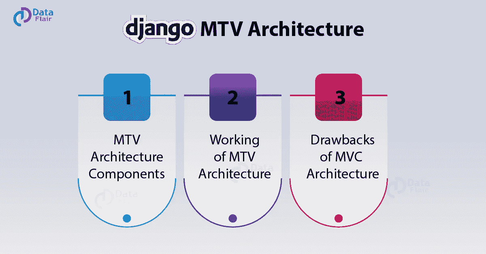
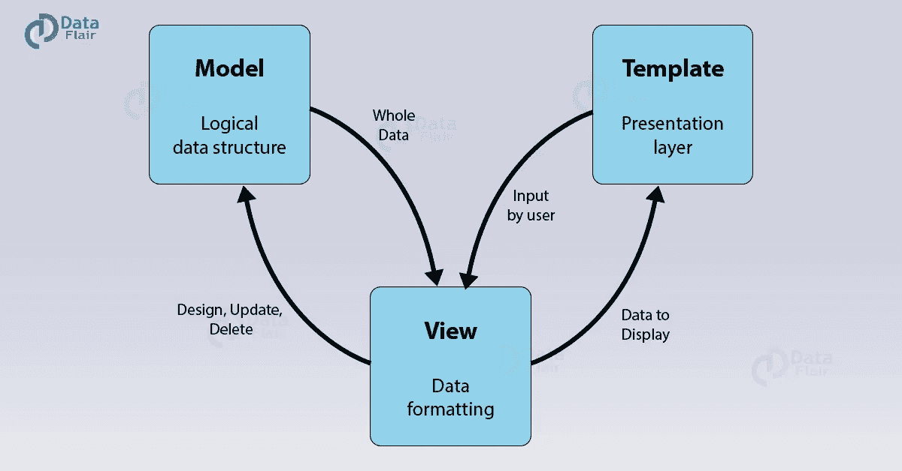
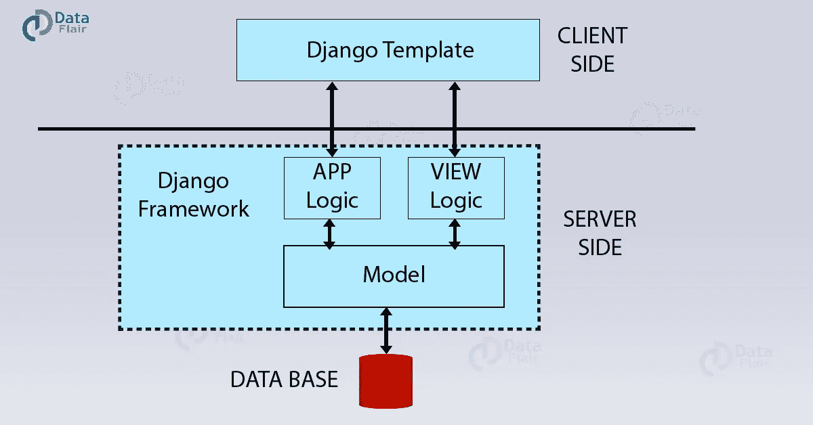

# Django MTV 架构的工作结构

> 原文：<https://towardsdatascience.com/working-structure-of-django-mtv-architecture-a741c8c64082?source=collection_archive---------9----------------------->

# MTV 架构组件(模型、模板和视图)

这是 MVC 模式的一个变种，正如你在首字母缩略词中看到的，Template 关键字代替了 Controller。但是，模板并不完全起控制器的作用，并且具有一些与控制器不同的属性。

模型的定义仍然保持不变，即模型包含项目的[逻辑文件结构，是数据库和视图之间的中间件&数据处理器。该模型定义了来自视图的数据格式如何存储在数据库中，反之亦然，即从数据库中检索的信息以可显示的格式传输到视图。](https://data-flair.training/blogs/django-project-layout/)

MTV 架构中的视图可能看起来像控制器，但它不是。这个 MTV 架构中的视图通过模型格式化数据。反过来，它与数据库通信，并将数据传输到模板进行查看。

如果 everything View 首先实现的是什么模板？

嗯，模板让前端开发人员的生活变得简单，这是肯定的。它还提供了比传统 MVC 架构更快的开发速度。

那么，它是怎么做到的呢？

模板的主要目标是保存浏览器呈现的所有内容。模型的数据来自服务器的不同部分，当用户与网站交互时，这些数据被集成在一起。这里，Django 中的模板层更类似于 MVC 模式中的视图层。这一层更加集中，有了 [Django 框架](https://data-flair.training/blogs/django-tutorial/)，它为前端开发者提供了比 MVC 架构更多的可扩展性。

# MTV 架构的运作

现在为了更好地理解 Django 是如何实现这个过程的，以及在这个 MTV 架构中真正重要的是什么。我们可以检查下面的 Django 架构图来理解它。

如上图所示，我们有一些组件和两个区域，即服务器端和客户端。这里您会注意到视图在服务器端，而模板在客户端。

现在，当我们请求网站时，我们用来通过浏览器进行请求的界面就是模板。然后，请求者将视图文件传输到管理服务器。

Django 实际上是请求和响应之间的游戏。因此，每当我们的模板更新时，它是我们从这里发送的输入(请求),它在服务器上被视图看到。然后，它传输到正确的 URL。这是 Django MTV 架构的重要组成部分之一。在那里，Django 中的 URL 映射实际上是在正则表达式中完成的。这些表达方式比 IP 地址更容易理解。这也有助于我们在 Django 特性教程中讨论的 SEO 任务。

现在，在向正确的 URL 发送请求后，应用程序逻辑，模型开始对给定的请求做出正确的响应。然后，特定的响应被发送回视图，视图再次检查响应，并将其作为 HTTP 响应或所需的用户格式进行传输。然后，它再次通过模板由浏览器呈现。

上述功能的一个更简单的实际工作是——

当你登录一个网站(基于 [Django](https://www.djangoproject.com/start/) ，你打开登录页面。它再次发生而不需要模型。这是因为视图将处理请求并将其发送到登录页面的 URL。然后，它将是服务器的响应，从那里到浏览器。

之后，在给定的模板 HTML 表单中输入您的凭证。从那里，数据再次被发送到视图，这一次这个请求被纠正，模型被给予数据。然后，模型读取并验证用户在连接的数据库中提供的数据。

如果用户数据匹配，它将发送相关的用户数据，如个人资料图像，名称和(其他事情取决于网站的类型)的看法。然后，它将在期望的响应中格式化相同的内容，并将相同的内容传输给客户端。

否则，模型将向视图发送一个否定的结果。接下来，它会再次将其路由到登录页面，并显示一条错误消息。

这就是 Django MTV 架构的实际工作方式。

阅读更多关于[流行 Django 应用列表](https://data-flair.training/blogs/django-apps/)

# MVC 架构的一些缺点

## 一.两个组件控制视图

在 MVC 模式中，视图是网页的 UI/显示逻辑。但在这种 MTV 架构中，它由两个组件生成/控制，模型和控制器。这使得 View 的测试过程有点困难。为了充分测试这一点，我们实际上必须首先编写所需的模型和控制器。

## 二。模型组件负载过大

模型完成所有的工作，无论是从数据库传输数据还是向数据库传输数据，以及对数据库进行操作。还通过应用业务逻辑给出适当的结果。单一组件完成所有这些任务。

## 三。开发复杂性很高

如果我们在较小的项目上实现 MVC 架构的方法，那么这将是一个漫长的开发过程。我们总是需要理解项目结构，并且必须小心使用的约定。

这对较小的应用程序有相反的影响，因为它们可能不太具有可伸缩性。它可以像一些大学生的 ERP 网站，办公室私人服务器等。这种方法可能会使系统更慢而不是更快。

这些是 MVC 架构的一些主要缺点。尽管 MTV 架构解决了这些缺点中的一些。但是，为了使用这种技术进行开发，您仍然需要熟悉 Django 的项目/文件结构。

# 摘要

在本教程中，我们了解了 Django MTV 架构的基本组件是什么，这些组件创建了 Django 项目。本教程是 Django 的基础，如果你打算在更小的项目中使用 Django，你必须掌握这些知识。