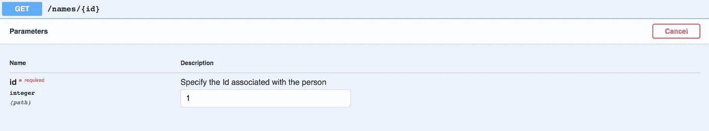

# 使用 Flask、Flask-RESTPlus 和 Swagger UI 处理 API

> 原文：<https://towardsdatascience.com/working-with-apis-using-flask-flask-restplus-and-swagger-ui-7cf447deda7f?source=collection_archive---------0----------------------->


Photo by [andrew welch](https://unsplash.com/@andrewwelch3?utm_source=medium&utm_medium=referral) on [Unsplash](https://unsplash.com?utm_source=medium&utm_medium=referral)

在从事机器学习项目时，我决定开发完整的应用程序。这将需要开发 API，这样我们就可以发布值并获得预测的响应。这就是 Flask 和 Flask-RESTPlus 的用武之地。

[Flask](http://flask.pocoo.org/) 支持将 Python 函数公开为 API。Flask-RESTPlus 是 Flask 的扩展，改进了它的功能。它不仅允许我们定义 REST APIs，还为所有 API 引入了 Swagger UI。

在本文中，我将解释如何用几个 API 和虚拟数据开发 Flask 应用程序。该项目可以作为一个 GitHub 库使用。

# 装置

我通过使用`pipenv`创建一个虚拟环境开始了这个过程。你可以在我的关于虚拟环境比较的文章中读到更多。我安装了 Flask 和 Flask-RESTPlus。

```
pipenv install flask
pipenv install flask-restplus
```

然而，如果您不希望在一个`pipenv`环境中工作，您可以简单地使用下面的命令。

```
pip install flask
pip install flask-restplus
```

# 基础


Photo by [Aaron Burden](https://unsplash.com/@aaronburden?utm_source=medium&utm_medium=referral) on [Unsplash](https://unsplash.com?utm_source=medium&utm_medium=referral)

## 导入

我开始是从`flask`进口`Flask`。从`flask_restplus`中，我导入了`Api`来定义 app 和`Resource`，后者作为参数被接收到项目中定义的各个类中。

## 定义应用程序

我使用方法`Flask()`将应用程序定义为 flask 应用程序，该方法使用`__name__`设置名称。接下来，我将使用`Api`来初始化应用程序。

我在这里定义了一个`namespace`。概念很简单。每当在给定的名称空间下定义 API 时，它们都会出现在 Swagger 中的给定标题下(我们将在本文后面探讨 Swagger)。在`namespace`中，第一个变量定义路径，第二个变量定义该空间的描述。

在上面的例子中，名称空间的 url 是`http://127.0.0.1:5000/main`，在 Swagger 中描述为**主 API**。

## 定义 API

最后，我定义了端点。由于我们的名称空间是`name_space`，我将通过 route 定义 url 为`@name_space.route("/")`。接下来，Flask-RESTPlus 要求我们定义一个类中给定路径下的所有端点。方法可以是`get()`、`put()`等等。

在上面的例子中，可以通过路径`http://127.0.0.1:5000/main`访问 API。类名设置为`MainClass`，有`get()`和`post()`两种方法。无论何时，当我进行 GET 调用时，我得到的回复是字段为`status`的`Got new data`，而对于 POST 调用，我得到的回复是`Posted new data`。

## 运行应用程序

现在，一切都准备好了。文件保存为 [basic.py](https://github.com/kb22/Understanding-Flask-and-Flask-RESTPlus/blob/master/basic.py) 。我使用`pipenv`通过以下命令运行应用程序。

```
pipenv shell
FLASK_APP=basic.py flask run
```

使用 pip，您可以使用以下命令。

```
FLASK_APP=basic.py flask run
```

## Swagger UI

Flask-RESTPlus 最好的部分是它自动记录我们创建的 API，并且它们在 Swagger UI 中是可见的。转到`http://127.0.0.1:5000/`可以看到所有的 API。


Swagger UI

这两个 API 都可以在名称空间`main`下看到，描述为`Main APIs`。我们可以通过点击`Try it out`按钮来尝试任一 API 并检查其功能。

## 尝试 API

我使用 [curl](https://curl.haxx.se/docs/manpage.html) 从终端发出 GET 和 POST 请求。


Making API Requests

使用`curl`命令时，首先使用单词`curl`，然后在字符`-X`后使用方法。最后，指定端点。看一下我们的 curl 响应，我们看到我收到了正确的`GET`和`POST`API 数据。

# 更上一层楼


Photo by [Markus Spiske](https://unsplash.com/@markusspiske?utm_source=medium&utm_medium=referral) on [Unsplash](https://unsplash.com?utm_source=medium&utm_medium=referral)

Flask 和 Flask REST-Plus 还有更多功能。让我们更深入地探索它们，更好地理解它们。下面的代码在 GitHub 资源库中以`[app.py](https://github.com/kb22/Understanding-Flask-and-Flask-RESTPlus/blob/master/app.py)`的名字提供。

我们可以使用 POST 请求来发送数据并保存它。然后，我们可以使用 GET 请求来获取数据。假设我们有一个管理个人姓名并存储它们的项目。我们创建一个 GET 端点来使用`id`获取名称，创建一个 POST 端点来根据`id`保存名称。

在这里，我已经创建了路径为`http://127.0.0.1:5000/names/<int:id>`，在这里我们每次都会经过`id`。为了存储名字，我创建了一个对象`list_of_names`，用于获取和接收数据。

## 导入更多库

我们已经导入了 Flask、Api 和资源。我们也从`flask`包中导入`request`。这有助于我们获得请求对象，然后从中检索信息，比如 JSON 数据。我们还从`flask_restplus`包中导入`fields`来定义元素的类型，比如*字符串*。

## 添加申请信息

我们还可以在 Flask 应用程序中添加额外的信息。这些信息非常有用，显示在 Swagger UI 中。

我们可以定义应用程序的`version`、`title`和`description`。我们只设置了一个名称空间，即`names`。Swagger UI 标题现在看起来如下图所示。


Swagger UI Header

## 定义模型

每当我们想要接收或发送特定格式(JSON)的信息时，我们都要借助`model`来完成。我们指定模型的名称。接下来，我们描述它期望的信息和每个期望值的属性。

我们将型号名称定义为`Name Model`。它包括一个参数，即`name`，为必填字段，定义其描述和帮助文本。将使用这个模型的 API 将期待一个带有关键字`name`的 JSON。

为了跟踪所有的名字，我将它们存储在`list_of_names`中。

## 定义 API

让我们将上面的代码片段分解成更小的部分，以便更好地理解它。我们将探索`POST`端点。`GET`的功能将非常相似。

**定义路线和等级**

我们使用`name_space`命名空间来定义路由，即`http://127.0.0.1:5000/main/<int:id>`。它期望 Id 以整数形式发送。out 类的名称是`MainClass`，它有一个参数`Resource`。

**为 API 定义文档**

使用`doc`,我们可以在 Swagger 中定义 API 的文档。`responses`键定义了各种可能的 HTTP 状态代码。对于每个状态代码，我们还定义了向用户描述它的文本。`params`键定义预期的参数。API 期望 URL 中有`id`，我们为用户指定一个帮助文本。Swagger UI 如下图所示。


POST API (Swagger UI)

参数在顶部定义。所有预期的响应及其描述出现在下半部分。

**定义方法**

我们现在可以定义我们的方法了。在我们的方法之前，我们添加了行`expect(model)`，它定义了 API 期望的`model`。我们将代码包装在一个`try`块中，并捕捉所有可能发生的错误。`request.json['name]`获取我们收到的名称，我们可以保存它，并在响应中将其发送回去。如果`name`键丢失，我们得到`KeyError`并发送状态代码 500。在其他情况下，我们发送状态代码 400。

## 尝试应用程序

让我们启动应用程序。

```
FLASK_APP=app.py flask run
```

**POST**
我们解析来自请求的响应，读取`name`并将它存储在`list_of_names`中的`id`中。我们还返回新添加人员的状态和姓名。


POST Request with id = 1 and name = Karan Bhanot


Response of POST Request

**发布请求中的错误**

比方说，我们忘记了在数据对象中提供`name`参数。在这种情况下，我们会得到一个错误。


POST without **name** key


500 Error

由于没有提供密钥`name`，我们收到了状态代码为 500 的错误和消息`Mapping key not found.`

**GET**
我们只需传递我们想要获取其姓名的`id`，如果可用的话，我们将获取该人的状态和姓名。



GET Request with id = 1


Response of GET Request

**获取请求时出错**

比方说，我们没有人反对 Id 2。如果我们试图检索这些信息，它会抛出一个错误。


GET to fetch data against Id 2


500 Error

由于没有找到那个特定的 Id，我们得到状态代码 500 和消息`Mapping key not found.`

# 结论

在本文中，我们探索了使用 Flask 和 Flask-RESTPlus 创建 API。这两个都是很好的开发库，可以用 Python 编写 API 文档，并使用 Swagger 与 API 进行交互。

请随时分享你的想法和想法。