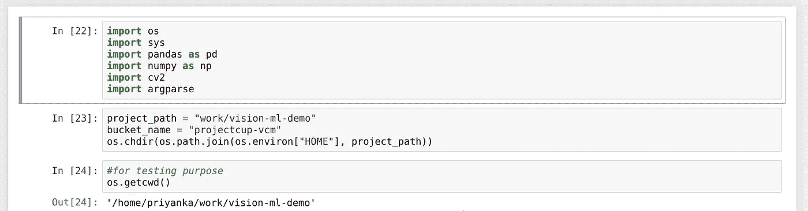
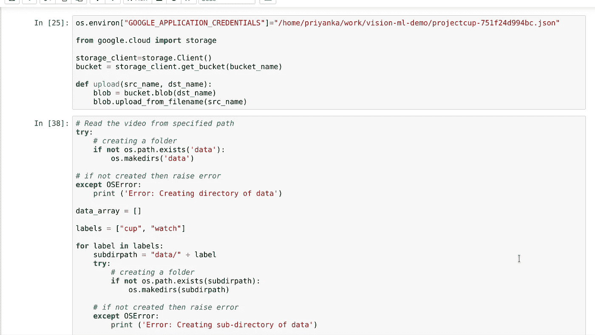
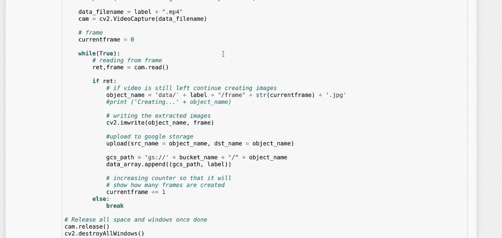
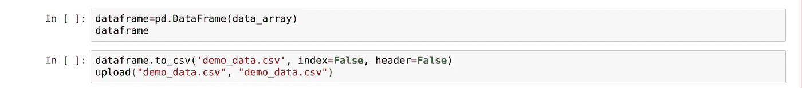
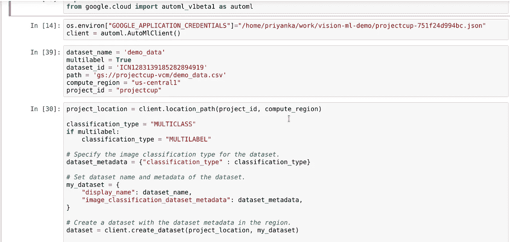
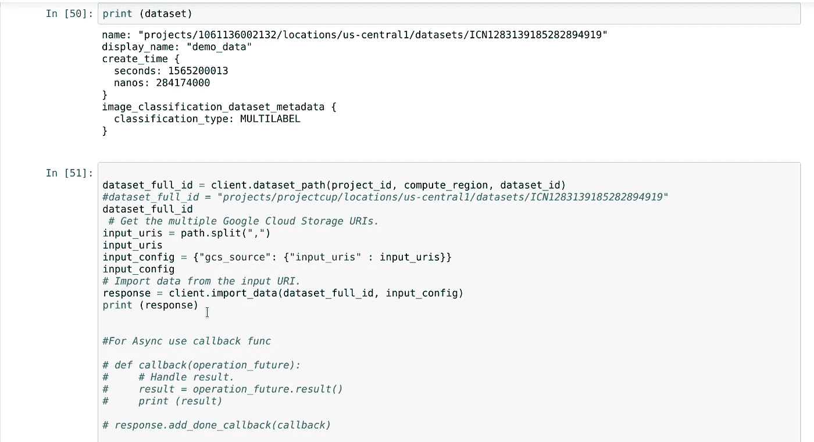
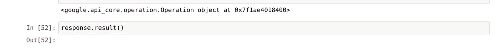
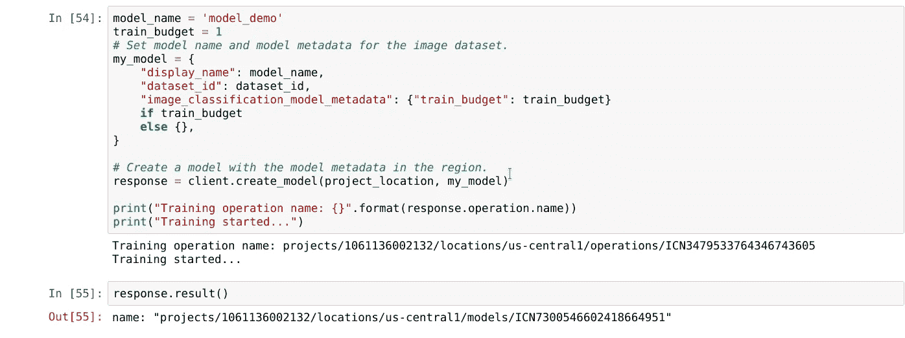

# 在 Python 中使用 Google Cloud AutoML

> 原文：<https://towardsdatascience.com/working-with-google-cloud-automl-in-python-614395ab66b3?source=collection_archive---------13----------------------->

拥有一个 CSV 文件并在各种 ML 模型中实现它是很容易的。但是，困难在于完全使用 Python 来实现 e2e 过程，即获取视频、提取图像、将它们上传到谷歌云存储，然后对它们执行 AutoML。现在，大多数公司都有自己的内置模型；如果没有，那么他们使用谷歌 ML 模型或其他。

我将与你分享这个过程:

1.  从对象的视频中提取帧(使用 OpenCV)
2.  用正确的文件夹结构将图片上传到谷歌云存储中。
3.  准备一个带标签的 CSV 数据集并上传到 Google 云存储。
4.  使用上述 CSV 将数据集从 Google 云存储导入 AutoML。
5.  在 AutoML 中训练数据并创建所需的分类模型。
6.  在模型上测试随机图像。

上述过程的逐步指南

**从对象的视频中提取帧(使用 OpenCV) :**

我拍了 2 段视频，每段大约 25 秒，用来解决我的问题。在 Google Cloud 中，你需要准备一个桶用于你的项目。但是对于所有的事情，我都是用 Python 来做的，而不是使用控制台。我用 Jupyter 笔记本写的 Python 代码。

在上面的命令中，我们导入所需的库，使用项目路径和项目 Id、存储桶名称以及所需的修改来创建项目。

**用正确的文件夹结构将图片上传到 Google 云存储:**

以下命令帮助我从没有 ffmpeg 功能的视频中提取图像，并直接上传到 Google Cloud 上。我使用 openCV 库从视频中提取图像。OpenCV-Python 是一个强大的 Python 绑定库，旨在解决计算机中的视觉问题。在提取图像时，我在主任务文件夹下分别创建了两个子文件夹`cup`和`watch`，以便于对它们进行分类。

**准备带标签的 CSV 数据集并上传到 Google 云存储:**

最后，这将创建一个带有谷歌存储位置 URIs 和相应标签(`cup`和`watch`)的`demo_data.csv`文件，并将它上传到谷歌云存储。

**使用上述 CSV 将数据集从 Google 云存储导入到 AutoML:**

在上面提到的代码中，随着数据集的生成，将提供一个`dataset_id`，我们将使用它将图像从 CSV 导入到 Google Cloud。不要担心，导入数据需要一些时间。

在代码中，我们可以看到某些信息必须从我们这边提供，比如- `compute_region`，默认情况下是用于 AutoML 处理的`us-central1`。在这里，我的数据集中有两个标签，因此，当使用上面的 CSV 从 Google 云存储导入数据集到 AutoML 时，我设置了`multilabel=True`。

对于异步数据，我们需要提供回调函数，否则可能会抛出错误。在准备导入代码时，我得到了一个代码为 504 的错误，它指出了最后期限异常。如果您遇到这样的错误，您可以专门提到超时，因为默认情况下，任务花费的时间是 60 秒。一旦所有数据都被导入，它将打印以下输出:

**在 AutoML 中训练数据并创建所需的分类模型:**

在训练模型时，所需的第一个参数是需要由我们定义的数据集，我们将从上一步中获得相同的参数。其次，我们需要提供一个模型名。最后，培训预算。培训预算是用于模型的培训时数。在我的任务中，最多需要 1 小时。

接受训练需要一些时间，同时你可以去喝杯咖啡。一旦你回来，你的模型就可以接受测试了。

**在模式下测试随机图像:**

现在，在谷歌云的控制台中，你可以去查看数据集的统计数据，在那里你可以评估你的数据。如果你认为你做错了什么，你可以进行必要的修正，并在数据集最终准备好接受测试之前再次重新训练数据集。

在我的数据集中，我拍摄了两个视频——一个杯子和一个手表。此外，在测试原始数据(即这里的图像)时，我可以得到特定的结果。一旦训练完成，我拍了几张图片来测试我的模型，我得到的结果几乎和我的图片一样准确。

# 结论:

我们看到了如何在不使用 Google Cloud 控制台的情况下，用 Python 将原始视频转换为图像并制作 CSV 数据集，以及导入和训练数据。现在，当从谷歌云中的 CSV 文件导入数据时，可能会出现一些其他问题(除了我提到的问题)。您需要了解错误，并为调试该错误进行研究。我希望这将消除您的一些疑虑，同时让您轻松使用 Google Cloud。

完整的代码可以在我的 github 回购:[https://github.com/Priktopic](https://github.com/Priktopic)

万事如意。

资源:[https://cloud.google.com/vision/automl/docs/](https://cloud.google.com/vision/automl/docs/)