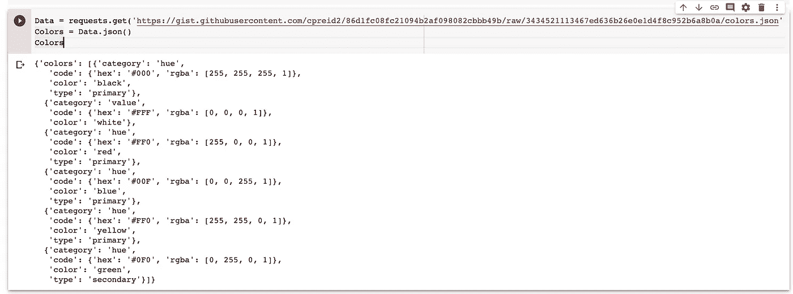
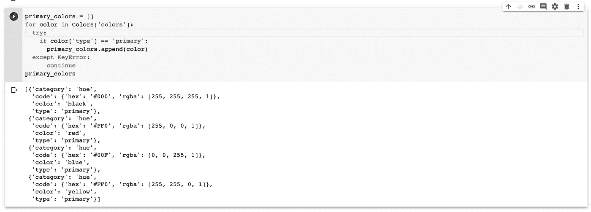
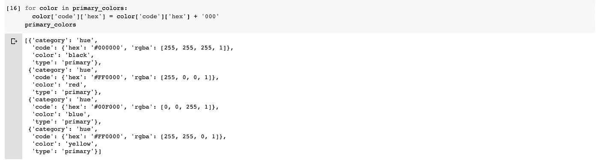
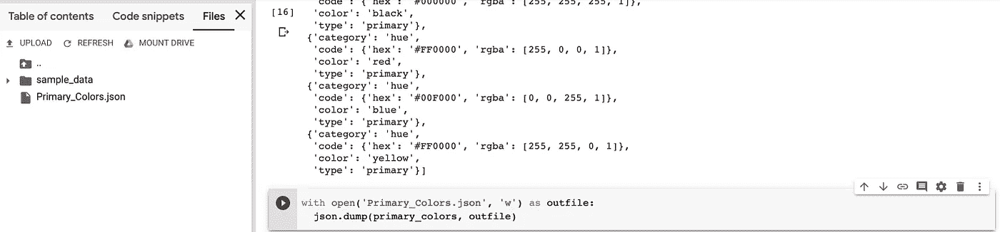
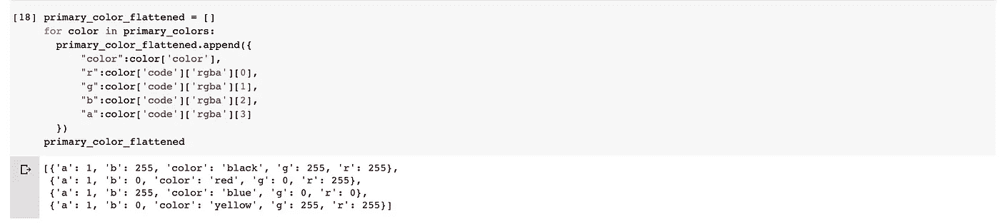
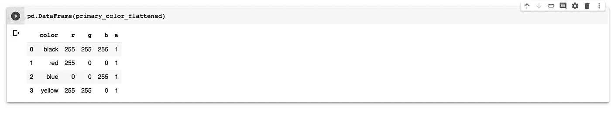
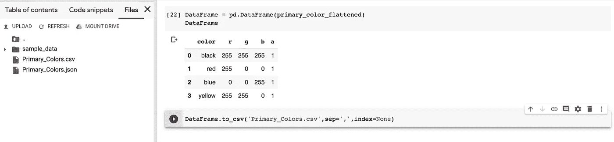

# 使用 Python 回答问题:“我如何在 Excel 中打开这个 JSON 文件？”

> 原文：<https://towardsdatascience.com/working-with-json-files-answering-the-age-old-question-of-how-do-i-open-this-json-file-in-excel-8d2845944fc1?source=collection_archive---------31----------------------->

> 在这篇文章中，我描述了在 python 中使用 JSON 文件的一个非常入门/基本的过程:1)加载一个 JSON 文件，2)进行一些数据操作，然后 3)将一些数据保存到一个像 CSV / Excel 这样的二维格式中。


[https://www.flaticon.com/authors/smashicons](https://www.flaticon.com/authors/smashicons)

当我开始接触编程和数据科学时，我害怕不是 csv 或 Excel 表格的文件格式。

如果你递给我一个 JSON 文件，我会跑去躲起来。如果您找到我并让我使用 JSON，我将不得不做一些不可复制的乱七八糟的查找和替换。

在使用 JSON 并学习了更多 python 之后，我可以告诉你，它并没有看起来那么糟糕。请跟我一起踏上旅程，我将介绍一些使用 Python 对 JSON 文件进行数据操作的简单方法，并向您展示如何使用 Excel 打开 JSON。

## JSON 是什么

JSON 代表**J**ava**S**script**O**object**N**rotation，是用于在网络上存储和交换数据的主要文件格式。

与以二维矩阵显示数据的 CSV 文件不同，您可以将数据存储为复杂的嵌套结构。这些嵌套结构可以处理当今编程中的所有主要数据类型(如字符串、数字、列表、字典)。

如果你曾经打开过一个 JSON 文件，它看起来有点像这样:

如果您检查上面的 JSON，您可以开始推断其结构:

*   包含 6 种颜色列表的“颜色”键
*   列表中的每个词典都是一种具有特定属性的颜色
*   在“代码”属性中，这是指包含 rbga 列表和十六进制表示的字典

我能够推断出上述情况，因为我知道:

*   [ ]代表一个列表
*   {}表示这是一个字典
*   :表示字典的键/值对

一旦你推断出了结构，你就可以开始提取你需要的部分或者做一些数据操作。

## 用 Python 读取 JSON 文件

对于这个例子，我将使用 Google Colab 笔记本。

> Google Colab 笔记本基本上是一个托管在 Google 服务器上的 Jupyter 笔记本。我喜欢这一点，因为你不必担心任何技术问题——你只需去[https://colab.research.google.com/](https://colab.research.google.com/notebooks/welcome.ipynb#recent=true)就可以发布一款新笔记本

加载新笔记本后，我可以导入三个模块:

```
import requests
import json
import pandas as pd
```

*   **请求**让我从网络上获取数据
*   **json** 提供了所有使用 json 文件的方法
*   熊猫是我最喜欢的数据处理包

JSON 文件可以作为一个单独的文件下载，但是通常 JSON 是作为 API 请求的结果返回的。

我想加载一个我在网上找到的颜色的 json，这样我就可以使用请求模块来获取它:

```
Data = requests.get('https://gist.githubusercontent.com/cpreid2/86d1fc08fc21094b2af098082cbbb49b/raw/3434521113467ed636b26e0e1d4f8c952b6a8b0a/colors.json')Colors = Data.json()
```

如果我将 Colors 变量打印到屏幕上，我可以看到 JSON 的结构:



如果您正在加载一个本地 json 文件，您应该这样做:

```
with open('data.json') as json_file:     
  data = json.load(json_file)
```

## 解析出数据

假设我们只对这个数据集中的原色感兴趣(type = 'primary ')？ ***我们怎么只选择那个数据*** ？

答案是使用 python 中的[循环](https://www.tutorialspoint.com/python/python_for_loop.htm)——我们可以遍历整个 JSON，检查 type 属性是否设置为‘primary’。如果是真的，我们可以把这个数据附加到一个新的变量上。

可以使用相应数据类型的 python 选择方法来选择 JSON 的各个部分:

*   [**dictionary**](https://www.tutorialspoint.com/python/python_dictionary.htm)**{ }—***dictionary _ name【key】，*其中 key 为字符串
*   [**list**](https://www.tutorialspoint.com/python/python_lists.htm)**[]—***list _ name【I】*，其中 I 是一个数字，代表列表中该项从 0 开始的索引

例如，如果您想获取 JSON 文件中的第一种颜色，您可以编写如下代码:

```
Colors['colors'][0]
```

如果你想得到第四种颜色的十六进制值，你应该这样写:

```
Colors['colors'][3]['code']['hex']
```

了解了 JSON 中的值是如何被访问的，您可以编写以下代码来只选择原色:

```
primary_colors = []**for** color in Colors['colors']: **try**: **if** color['type'] == 'primary': primary_colors.append(color) **except** KeyError: **continue**primary_colors
```

将这个新的 primary_colors 变量打印到屏幕上显示，它只获取了四种原色:



通过在 for 循环或 if/then 语句中添加更多约束，您可以在过滤中获得更高级的效果。

## 操纵数据

在我加载的 JSON 中，我注意到十六进制字段缺少三个尾随的 0，以使它成为完整的十六进制代码。如何将文本添加到十六进制值中？

您可以使用类似的 for 循环过程来实现。我在列表中循环，并在每个十六进制值后追加“000”。下面的代码实现了这一点:

```
for color in primary_colors: color['code']['hex'] = color['code']['hex'] + '000'primary_colors
```

打印此变量表明列表中的“十六进制”字段已更新:



这是一个简单的例子[很多 python 字典的数据操作方法都有](https://www.pythonforbeginners.com/dictionary/dictionary-manipulation-in-python)。

## 保存回 JSON 格式

要将原色保存回 JSON 文件，可以使用以下代码引用新创建的“primary_colors”变量:

```
with open('primary_colors.json', 'w') as outfile:
  json.dump(primary_colors, outfile)
```



## 将 JSON 中的自定义字段保存为 CSV 文件

通常情况下，您需要为从 JSON 文件中获得的一些数据创建一个 CSV 文件。

在本例中，我只想提取 json 中的颜色字段和 rgba 字段中的 r、g、b、a 值，作为 csv 文件中的一个单独的列。我可以通过再次执行另一个 for 循环来获取我感兴趣的每个字段，并将其“展平”为一个可以转换为数据框的简单列表。下面的代码实现了这一点:

```
primary_color_flattened = []for color in primary_colors: primary_color_flattened.append({ "color" : color['color'], "r" : color['code']['rgba'][0], "g" : color['code']['rgba'][1], "b" : color['code']['rgba'][2], "a" : color['code']['rgba'][3]})
```

上面我遍历了所有的颜色，并为每种颜色添加了一个新的字典条目到一个名为‘primary _ color _ flattened’的列表中



然后，可以将该变量读入 pandas 数据框，如下所示:



您可以使用 pandas to_csv 方法将此 csv 保存到文件中:



然后，您应该能够在类似 Excel 的东西中打开这个 csv。

这是一个非常肤浅的观点，说明当你转向脚本/编程思维模式时会发生什么。您将更倾向于为数据操作构建一个可再现的管道。

我在这里附上了 Colab 笔记本，因此如果您是 python 编程新手或一般编程笔记本的新手，您可以尝试一下。

[](https://colab.research.google.com/drive/1HSB8ZUnaTbfbZbMaxxPNUJBqYuY3d0oX) [## 谷歌联合实验室

### JSON 到 CSV 示例—colab.research.google.com](https://colab.research.google.com/drive/1HSB8ZUnaTbfbZbMaxxPNUJBqYuY3d0oX)