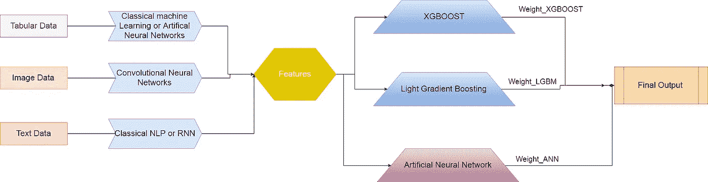

# 在机器学习的单个问题中处理多种类型的数据

> 原文：<https://towardsdatascience.com/working-with-multiple-types-of-data-in-a-single-problem-in-machine-learning-31b667930179?source=collection_archive---------1----------------------->

在我之前的一篇[帖子](/my-first-data-science-interview-bccc006ba2c8)中，我提出了 3 个在面试中被问到的主观问题。在这篇文章中，我将回答第三个问题。当我有时间的时候，我可能也会写下其他人的答案。到那时，请分析这个有趣的问题和解决方案。

 [## 我的第一次数据科学面试

### 今天，我将分享我第一次参加数据科学面试的经历，那是在一所顶尖的…

towardsdatascience.com](/my-first-data-science-interview-bccc006ba2c8) 

# 问题

*你给病人提供病史。您拥有包含数字数据(血压、血糖、心率、血脂等)的所有测试报告，包含图像+文本报告(医生根据图像得出的结果)的放射报告，以及包含有关患者健康的主观和客观信息的护理报告。患者数据以报告的形式出现，即时间序列数据。基于这些报告，你必须计算 3 件事:*

*a)病人存活的几率有多大，他要在医院呆多少天。你将使用哪种算法，为什么？*

*b)死亡率是多少，即一个人在接下来的一周内是否会死在 ICU。你会选择哪种算法，为什么？*

*c)定义一些对你的问题有用的额外特征，这些特征是问题中所没有的。如果这是一个人工智能驱动的医生，它将如何向病人的家人传达当前的状况？*

# 解决办法

在这种类型的问题中，你应该简明扼要地回答对方到底在寻找什么是明智的。此外，图表充分说明了你的理解能力，所以请画一个图表来描述你的解决方案管道。

问题中的数据类型:

1.  表格数据:报告包含数字历史数据*(血压、血糖、心率、血脂等)。*
2.  图像数据:放射学报告(医学成像数据集)
3.  文本数据:护士记录加上来自图像数据的医生发现(放射学元数据)

## 表格数据
ML 方法:经典机器学习

对于表格数据，我们必须使用经典的机器学习方法。这种方法首先涉及到特征工程，在这种工程中，我们可以组合特征以形成新的特征或者丢弃一些不重要的特征。

Example for 1 Report

考虑到这是数据准备步骤中的时间序列数据，我们需要定义一个窗口大小。窗口大小是您希望将历史中的多少观测值作为要素包括在内。例如:

如果您有最后 5 个报告，并且您的窗口大小为 5，则在最终表中，一个单一特征列可以有 5 个条目，如-

Remember to take previous columns as the features.

如果窗口大小为 2，那么最终的表格将具有如下特征:

If we take window size = 2

## 图像数据
ML 方法:卷积神经网络

对于图像数据，我们使用卷积神经网络来提取特征或标签。这可以通过两种方式中的任何一种来实现:

1.  假设我们有一个标记的医学数据集，它突出显示了肺部受肺炎影响的部分。这个数据集有 2 个标签，如果这个人有肺炎或没有。在这种情况下，我们可以对图像进行二进制分类，并将最终标签作为特征列添加到表格数据中。

Binary Classification on the Image

Classification result added as a feature column with Tabular data

2.如果我们没有一个标签数据集，我们可以通过一个预先训练的 CNN 比如 Densenet-121 来传递图像。这样做是为了从图像中提取特征。请确保不要运行完整的 Densenet-121 模型，而是在完全连接的层中断开它，在该层中，我们有一个 256 矢量的特征。下一步是将这些要素作为列添加到表格数据中。

[Densenet-121 Architecture](/understanding-and-visualizing-densenets-7f688092391av)

Features Extracted from DenseNet-121 added as feature columns with tabular data

## 文本数据
ML 方法:经典的自然语言处理和/或 RNN

对于文本数据，我们使用经典的自然语言处理或 RNN。必须对文本进行解析，以删除被称为标记化的单词。则需要将这些字编码为整数或浮点值，以用作 ML 算法的输入。在这个数据中，我们也有两个选择:

1.  使用 tfidf vectorizer:tfidf vectorizer 代表*词频—逆向文档。* TF-IDF 是词频分数，试图突出更有趣的词，例如，在文档中频繁出现但不跨文档出现。使用 TF-IDF，我们可以将单词转换为特征，并将它们附加到我们的表格数据中，以便进行最终分类。

The TF-ID vectors appended as feature columns with tabular data

2.如果我们已经标记了报告的情感数据集，那么我们可以使用 LSTM/RNN 来执行分类，并且获得作为表格数据中的特征的最终标签。

Final Pipeline of this problem.

*问题 3-a:患者存活的几率有多大，需要住院多少天。你将使用哪种算法，为什么？*

回答:为了进行这种回归预测分析，我假设我有一个带标签的数据集。

正如我所解释的，从不同类型的数据中提取特征，我们可以将所有东西组合成表格数据，最后使用经典的机器学习。我将使用的算法是 **XGBoost 和 Light Gradient Boosting，因为它们组合了许多弱回归器/分类器来给出最终输出。**

或者，最好的方法是创建一个人工的完全连接的神经网络，并传递这些特征，以获得关于%机会和住院天数的最终答案。

*问题 3-b:死亡率是多少，即一个人在接下来的一周内是否会死在 ICU。你会选择哪种算法，为什么？*

回答:一个人在接下来的一周内是否会死在 ICU，这是一个分类问题。对于这种分类问题，最好的算法还是 XGBoost/ LGBM 或人工神经网络。

c)定义一些问题中缺少的对你的问题有用的额外特征。如果这是一个人工智能驱动的医生，它将如何向病人的家人传达当前的状况？

问题中缺少的特征是患者的年龄、性别和既往病史。大部分治疗取决于患者的性别和年龄。

作为一名人工智能医生，我们可以向家庭成员展示回归结果，以便他们可以确定未来会发生什么。比如，如果在过去的 5 天里，存活的机会从 40%增加到 60%,那么给他们一个积极的信号，病人正在好转！

我希望这篇文章对你有所帮助。如有更多疑问，您可以通过 LinkedIn 与我联系。