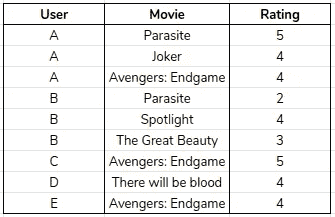
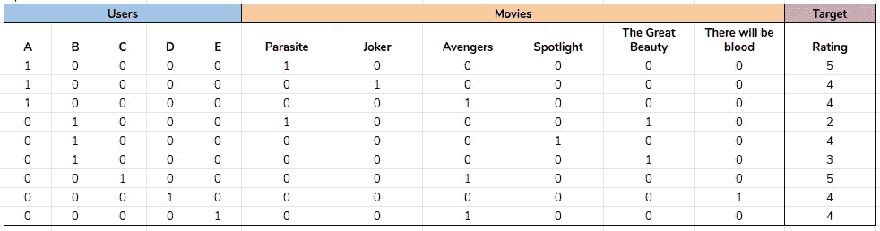
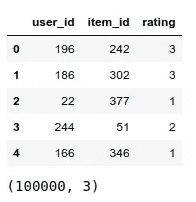
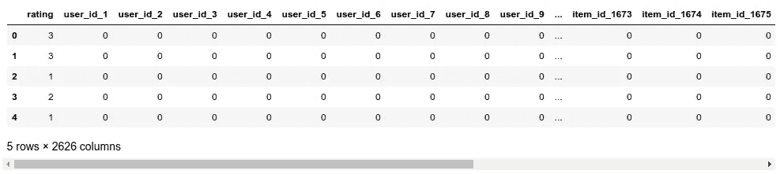

# 在 pandas 和 sklearn 中使用稀疏数据集

> 原文：<https://towardsdatascience.com/working-with-sparse-data-sets-in-pandas-and-sklearn-d26c1cfbe067?source=collection_archive---------0----------------------->

在机器学习中，有几种情况下我们会遇到稀疏数据集。以下是一些例子:

*   推荐系统的用户评级
*   用户点击内容推荐
*   自然语言处理中的文档向量


Photo by [David Dvořáček](https://unsplash.com/@dafidvor?utm_source=unsplash&utm_medium=referral&utm_content=creditCopyText) on [Unsplash](https://unsplash.com/?utm_source=unsplash&utm_medium=referral&utm_content=creditCopyText)

稀疏数据集通常很大，很难使用标准的机器学习 python 工具，如 pandas 和 sklearn。普通本地机器的内存不足以存储或处理大型数据集的情况并不罕见。即使内存足够，处理时间也会显著增加。

在本文中，我们将给出一些简单的技巧，在使用 python 进行机器学习项目时，我们可以遵循这些技巧。

## 什么是稀疏矩阵？

稀疏矩阵是大部分元素为零的矩阵。相反，大多数元素都不为零的表称为稠密表。我们将矩阵的稀疏性定义为零元素的数量除以元素的总数。稀疏度大于 0.5 的矩阵是稀疏矩阵。

> 将稀疏矩阵作为密集矩阵处理通常是低效的，会过度使用内存。

使用稀疏矩阵时，建议使用专用的数据结构来实现高效的存储和处理。我们将在接下来的章节中引用 Python 中的一些可用结构。

通常，我们从包含分类变量的密集数据集开始。通常，我们必须对这些变量应用一键编码。当这些变量具有高基数(大量不同的值)时，一键编码将生成一个稀疏的数据集。

**例子**

考虑下面的用户电影评级表



Dense matrix

其中“评级”是多类分类问题的目标变量。

现在假设我们想要训练一个因式分解机器分类器。因子分解机器(FMs)是一种通用的预测器，能够在高稀疏性的问题中表现良好，如推荐系统。根据最初的[论文](https://www.csie.ntu.edu.tw/~b97053/paper/Rendle2010FM.pdf)我们需要将数据集转换成以下格式:



Sparse matrix

在上面的结构中，两个输入属性(用户和电影)都是一次性编码的。对熊猫来说，这是一个简单的单行转换。然而，在大型数据集的情况下，这可能会非常麻烦。

下面我们将展示一些在 pandas 和 sklearn 中促进这种数据集的转换和处理的方法。

## 数据集

我们将使用 *MovieLens 100K* 公共数据集，在这里[可用](https://grouplens.org/datasets/movielens/100k/)。培训文件包含 943 个用户对 1682 个项目的 100，000 个评级。对于这个分析的范围，我们将忽略*时间戳*列。

让我们将数据加载到熊猫数据框中。



## 一键编码

假设我们想要将这个数据集转换成上一节中所示的格式，我们必须对列 *user_id* 和 *item_id* 进行一次性编码。对于转换，我们将使用[*get _ dummies*](https://pandas.pydata.org/pandas-docs/stable/reference/api/pandas.get_dummies.html)pandas 函数，它将分类变量转换为指示变量。

在应用转换之前，让我们检查一下原始数据框的内存使用情况。为此，我们将使用[*memory _ usage*](https://pandas.pydata.org/pandas-docs/stable/reference/api/pandas.DataFrame.memory_usage.html)pandas 函数。

```
Memory usage of data frame is 2.4 MB
```

现在，让我们应用转换并检查转换后的数据帧的内存使用情况。

在一次性编码之后，我们为每个用户创建了一个二进制列，为每个项目创建了一个二进制列。因此，新数据帧的大小为 100.000 * 2.626，包括目标列。



```
(100000, 2626)Memory usage is 263.3 MB
```

我们看到，与原始数据帧相比，转换后的数据帧的内存使用量显著增加。这是意料之中的，因为我们增加了数据框的列数。然而，新数据帧中的大多数元素为零。

> 技巧 1:使用 pandas 稀疏结构来存储稀疏数据

## 熊猫稀疏结构

Pandas 提供了有效存储稀疏数据的数据结构。在这些结构中，零值(或任何其他指定值)实际上并不存储在数组中。

> 仅存储非零值及其位置是存储稀疏数据集的常用技术。

我们可以使用这些结构来减少数据集的内存使用。您可以将此视为“压缩”数据帧的一种方式。

在我们的示例中，我们将把 one-hot 编码列转换成[*SparseArray*](https://pandas.pydata.org/pandas-docs/stable/reference/api/pandas.SparseArray.html#pandas.SparseArray)*s*，这是一个一维数组，其中只存储非零值。

```
rating                     int64
user_id_1       Sparse[uint8, 0]
user_id_2       Sparse[uint8, 0]
user_id_3       Sparse[uint8, 0]
user_id_4       Sparse[uint8, 0]
                      ...       
item_id_1678    Sparse[uint8, 0]
item_id_1679    Sparse[uint8, 0]
item_id_1680    Sparse[uint8, 0]
item_id_1681    Sparse[uint8, 0]
item_id_1682    Sparse[uint8, 0]
Length: 2626, dtype: objectMemory usage is 1.8 MB
```

如果我们检查新数据帧的 *dtypes* ，我们会看到我们转换的列现在属于类型 *Sparse[uint8，0]* 。这意味着不存储零值，非零值存储为 *uint8* 。转换成*稀疏数组*时可以设置非零元素的数据类型。

此外，我们看到我们已经成功地显著减少了数据帧的内存使用。

到目前为止，我们已经设法减少了数据帧的内存使用，但是要做到这一点，我们首先要在内存中创建一个大型的密集数据帧。

> 技巧 2:在熊猫 get_dummies 中使用稀疏选项

使用熊猫 *get_dummies* 中的*稀疏*参数，可以直接创建稀疏数据框。该参数默认为*假*。如果*为真*，则编码列作为*稀疏数组*返回。通过设置 *sparse=True* ，我们可以直接创建一个稀疏数据帧，而无需在内存中预先存储密集数据帧。

```
rating                     int64
user_id_1       Sparse[uint8, 0]
user_id_2       Sparse[uint8, 0]
user_id_3       Sparse[uint8, 0]
user_id_4       Sparse[uint8, 0]
                      ...       
item_id_1678    Sparse[uint8, 0]
item_id_1679    Sparse[uint8, 0]
item_id_1680    Sparse[uint8, 0]
item_id_1681    Sparse[uint8, 0]
item_id_1682    Sparse[uint8, 0]
Length: 2626, dtype: objectMemory usage is 1.8 MB
```

在一键编码中使用稀疏选项使我们的工作流在内存使用和速度方面更加高效。

让我们继续分割输入和目标变量。我们将创建两组 X，y 向量，使用密集和稀疏数据帧进行比较。

## 分割 X，y

```
Memory usage is 262.5 MB
Memory usage is 1.0 MB
```

## 训练-测试分割和模型训练

接下来，我们转到 **sklearn** 对我们的数据集执行训练测试分割，并训练一个逻辑回归模型。虽然我们使用因子分解机器作为参考模型来创建我们的训练集，但这里我们将在 sklearn 中训练一个简单的逻辑回归模型，仅用于演示密集和稀疏数据集之间在内存和速度方面的差异。我们将在本例中讨论的技巧可转移到 Python FM 实现，如 [xlearn](https://xlearn-doc.readthedocs.io/en/latest/python_api/index.html) 。

```
Pandas dataframe
Train-test split: 6.75 secs
Training: 34.82 secs

Sparse pandas dataframe
Train-test split: 17.17 secs
Training: 41.69 secs
```

我们注意到，尽管 *X_sparse* 更小，但是的处理时间比密集的 *X* 要长。原因是 sklearn 不处理稀疏数据帧，根据这里的讨论[。相反，稀疏列在被处理之前会被转换为密集列，从而导致数据框大小激增。](https://github.com/scikit-learn/scikit-learn/issues/12800)

因此，到目前为止使用稀疏数据类型实现的大小减少不能直接转移到 sklearn 中。此时，我们可以利用 scipy 稀疏格式，将我们的 pandas 数据帧转换成 scipy 稀疏矩阵。

> 技巧 3:转换成 scipy 稀疏矩阵

## 稀疏矩阵

Scipy 包提供了几种类型的稀疏矩阵来实现高效存储。Sklearn 和 imblearn 等其他机器学习包接受稀疏矩阵作为输入。因此，在处理大型稀疏数据集时，强烈建议将我们的 pandas 数据帧转换为稀疏矩阵，然后再将其传递给 sklearn。

在本例中，我们将使用 *lil* 和 *csr* 格式。在 scipy docs 中，你可以看到每种格式的优缺点。为了有效地构建矩阵，建议使用 *dok_matrix* 或 *lil_matrix* 。[ [来源](https://docs.scipy.org/doc/scipy/reference/sparse.html) ]

下面我们定义一个函数来将数据帧转换成一个稀疏矩阵。我们首先按列构建一个 *lil* 矩阵，然后将其转换为 *csr* 。

```
Memory usage is 2.000004 MB
```

让我们用 csr 矩阵重复训练测试分割和模型训练。

```
Pandas dataframe
Train-test split: 0.82 secs
Training: 3.06 secs

Sparse pandas dataframe
Train-test split: 17.14 secs
Training: 36.93 secs

Scipy sparse matrix
Train-test split: 0.05 secs
Training: 1.58 secs
```

使用*X _ 稀疏*时，train_test_split 和模型训练都明显更快。因此，我们得出结论，使用稀疏矩阵是最有效选择。

稀疏矩阵的优势在较大的数据集或者稀疏度较高的数据集上会更加明显。

## 外卖食品

1.  在 pandas 中处理大型稀疏数据帧时，我们可以利用 pandas 稀疏数据类型
2.  我们也可以利用 ***get_dummies*** 中的 ***稀疏*** 选项，自动创建稀疏数据帧
3.  当使用机器学习库时，我们应该考虑将我们的数据转换成稀疏矩阵

# 参考

[](https://en.wikipedia.org/wiki/Sparse_matrix) [## 稀疏矩阵

### 稀疏矩阵的例子上面的稀疏矩阵只包含 9 个非零元素，有 26 个零元素。它的稀疏…

en.wikipedia.org](https://en.wikipedia.org/wiki/Sparse_matrix) [](https://docs.scipy.org/doc/scipy/reference/sparse.html) [## 稀疏矩阵(scipy.sparse) - SciPy v1.3.1 参考指南

### 用于数值数据的二维稀疏矩阵包。构建稀疏矩阵:保存和加载稀疏矩阵:稀疏…

docs.scipy.org](https://docs.scipy.org/doc/scipy/reference/sparse.html)  [## 稀疏数据结构-pandas 0 . 25 . 3+0 . g 43013d 49 f . dirty 文档

### 注意不推荐使用 SparseSeries 和 SparseDataFrame。他们的目的是同样服务于一个或稀疏…

pandas.pydata.org](https://pandas.pydata.org/pandas-docs/stable/user_guide/sparse.html) 

[https://www.csie.ntu.edu.tw/~b97053/paper/Rendle2010FM.pdf](https://www.csie.ntu.edu.tw/~b97053/paper/Rendle2010FM.pdf)