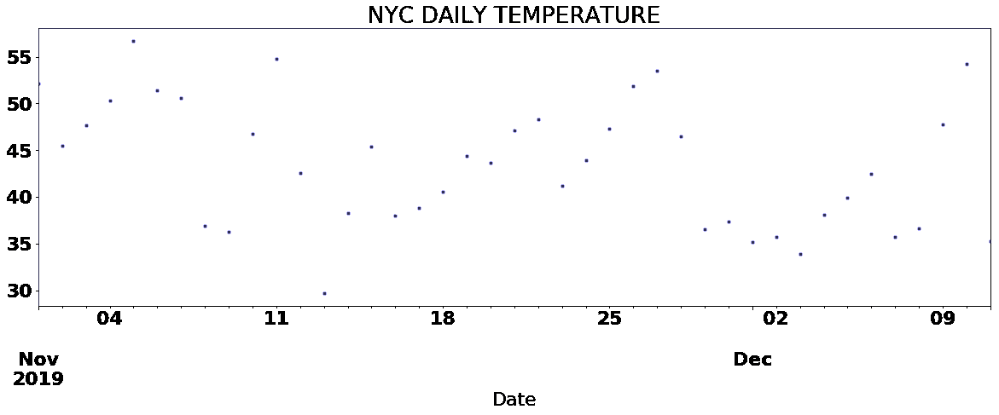
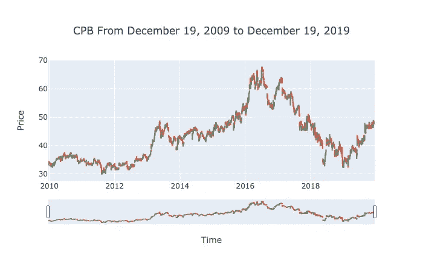
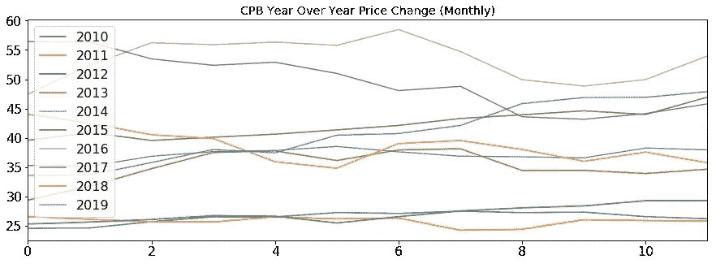
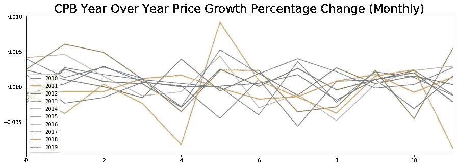

# 使用时间序列数据

> 原文：<https://towardsdatascience.com/working-with-time-series-data-a8872ebcac3?source=collection_archive---------8----------------------->

## 如何使用 Python 准备用于分析的时间序列数据

NYC’s daily temperature chart (November 1, 2019 to December 11, 2019) produced with Matplotlib

数据科学家研究时间序列数据，以确定是否存在基于时间的趋势。我们可以分析每小时的地铁乘客，每天的温度，每月的销售额，等等，看看是否有各种类型的趋势。这些趋势可以用来预测未来的观测。Python 有许多可以很好地处理时间序列的库。我研究了金宝汤公司过去十年的股票价格，前五个交易日如下:

Campbell Soup Company stock price obtained from [Yahoo Finance](https://finance.yahoo.com/quote/CPB/history?p=CPB) organized in a Pandas dataframe

# 准备数据

无论您的数据来自数据库、. csv 文件还是 API，您都可以使用 Python 的 [Pandas](https://pandas.pydata.org/pandas-docs/stable/user_guide/timeseries.html) 库来组织您的数据。一旦您将数据加载到 pandas 中，您将需要检查基于时间的列的数据类型。如果值是字符串格式，您需要将数据类型转换为 pandas datetime 对象。股票价格日期列是“年-月-日”格式的字符串数据类型我利用 pandas 的`[to_datetime](https://pandas.pydata.org/pandas-docs/stable/reference/api/pandas.to_datetime.html)`方法将该列转换为 datetime 对象:

`cpb.Date = pd.to_datetime(cpb.Date)`

*注意:我将数据存储在一个名为“cpb”的熊猫数据帧中*

一旦日期列被转换成适当的数据类型，那么您就可以用`set_index`方法设置数据帧的索引。

The data types of the ‘Date’ column before and after the to_datetime() and set_index() methods are applied. Note the change in the number of columns, this occurs when the index column is set.

您可能有多个时间间隔不同的数据帧。这就需要对数据的频率进行重新采样。假设您想要合并一个包含每日数据的数据帧和一个包含每月数据的数据帧。这就需要进行缩减采样，或者按月对所有每日数据进行分组，以创建一致的时间间隔。数据分组后，您需要一个兼容的指标，通常是更频繁的数据的平均值，以恢复一致性。这些步骤可以通过`.resample()`和`.mean()`方法在一行中完成:

`cpb[‘Adj Close’].resample(‘MS’).mean()`

`MS`参数对应每月重采样。如果重新采样的值比使用的参数更频繁，则这称为下采样。`.resample()`方法的有效间隔参数列表可在[这里](https://pandas.pydata.org/pandas-docs/stable/user_guide/timeseries.html#dateoffset-objects)的“日期偏移对象”表中找到。

Downsampling from daily values to monthly values with the .resample() method

如果重新采样的值没有所用参数频繁，这称为上采样。在创建新日期间隔的位置添加空值。我将每日价格的值向上采样到每日两次。在我们的股票价格场景中，pandas 会将原始价格分配给午夜时间戳，将 null 值分配给中午时间戳:

The stock price data upsampled to twice daily. Hourly time stamps have been added at midnight and noon.

Pandas 的向前填充和向后填充选项是处理这些 NaN 值的两种方法。`.ffill()`用当天早些时候记录的值填充 NaN 值:

Forward filling the NaN values. Each noon value was filled in with the value recorded before that time.

`.bfill()`用当天晚些时候记录的值填充 NaN 值:

Back filling the NaN values. Each noon value was filled in with the value recorded after that time.

# 形象化

我[以前写过](/ohlc-charts-with-python-libraries-c58c1ff080b0)关于 OHLC(开盘-盘高-盘低-收盘)图表，这篇文章包含复制下面图表的代码:

The Campbell Soup Company OHLC chart created with [Plotly](https://plot.ly/python/ohlc-charts/)

有几种图表可以用来分析时间序列数据。一个对价格数据有帮助的是跨周期图表。Campbells 的年度价格图表如下:

Campbell’s Year Over Year Price Change in monthly intervals

在 2016 年和 2017 年，金宝汤的名义调整后月度股价相对较高，就像我们在 OHLC 图表中看到的那样。今年的同比图表没有很好地揭示趋势，因为我们处理的是名义价格，而不是增长率变化(见下文):

The year over year growth percentage for the Campbell Soup Company in monthly intervals

金宝汤的股票价格在八月到九月间持续增长，在二月到四月间持续下跌。应该进一步分析这些潜在的趋势。

# 结论

利用 Python，数据科学家可以为分析准备时间序列数据。Pandas 有基于附近日期的值来填充缺失值的方法。通过上面这样的可视化，我们可以看到是否有值得进一步研究的趋势。一旦发现趋势，就可以用它来预测未来的观察结果。