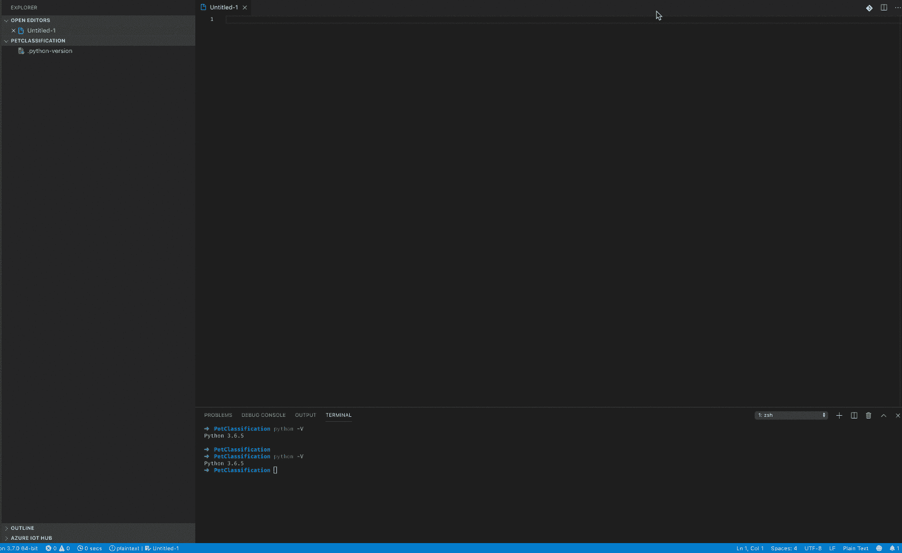
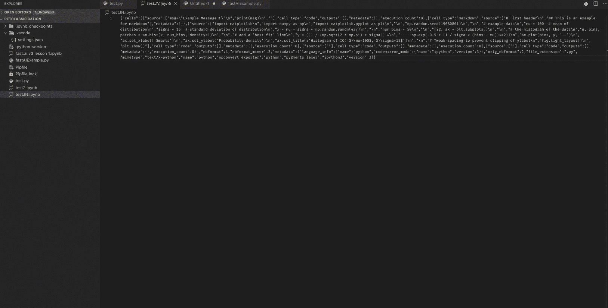
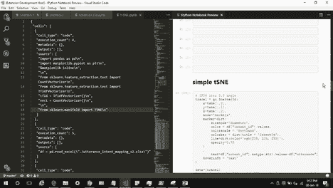

# 使用 VSCode 和 Jupyter 笔记本风格

> 原文：<https://towardsdatascience.com/working-with-vscode-and-jupyter-notebook-style-5ecaf47f9f84?source=collection_archive---------22----------------------->

Jupyter Notebook style in VSCode

如果你是机器学习算法入门，你会碰到 Jupyter Notebook。为了最大化效率，您可以将其概念与 VS 代码集成。因为这需要对如何设置 Python 环境有所了解，所以本文将提供一个介绍。

有几个原因可以解释为什么在单独的 IDE 中开发算法是有意义的。尽管 Jupyter 笔记本很棒，但是一旦代码变得越来越复杂或者项目越来越大，将所有代码放在一个文件中就不太方便了。VScode 提供了强大的 Jupyter 支持，允许将 python 代码转换成 Jupyter 笔记本代码，反之亦然。

# 目录

*   [设置本地 python 环境](https://github.com/Createdd/Writing/blob/master/2019/articles/JupyterVSCode.md#setup-a-local-python-environment)
*   [设置本地 pyenv](https://github.com/Createdd/Writing/blob/master/2019/articles/JupyterVSCode.md#set-a-local-pyenv)
*   [用 pipenv 安装依赖关系](https://github.com/Createdd/Writing/blob/master/2019/articles/JupyterVSCode.md#installing-dependencies-with-pipenv)
*   [使用具有 jupyter 功能的 python 文件](https://github.com/Createdd/Writing/blob/master/2019/articles/JupyterVSCode.md#using-python-files-with-jupyter-functionality)
*   [转换 python 文件和。ipynb 文件](https://github.com/Createdd/Writing/blob/master/2019/articles/JupyterVSCode.md#converting-python-files-and-ipynb-files)
*   [附加:在 Vscode 中预览笔记本(不推荐)](https://github.com/Createdd/Writing/blob/master/2019/articles/JupyterVSCode.md#additional-preview-a-notebook-in-vscode-not-recommended)
*   [结论](https://github.com/Createdd/Writing/blob/master/2019/articles/JupyterVSCode.md#conclusion)
*   [关于](https://github.com/Createdd/Writing/blob/master/2019/articles/JupyterVSCode.md#about)

# 设置本地 python 环境

首先，您需要设置 python 环境。有许多方法来组织 python 包/依赖项。这对一个初学者来说太难了。查看这篇文章，它解释了安装和管理 python 包的当前标准。非常准确地说，Gioele Barabucci 在安装软件包时会出现以下问题:

> *-您有足够的权限安装该软件包吗？也许你需要使用 sudo pip。这听起来不对。*
> 
> *-您的应用需要 2.0 版的 foolib。您系统中的另一个 Python 应用程序需要版本 1.8。糟糕，API 冲突。*
> 
> 其他将安装你的应用程序的人将需要 foolib。你需要把它记录在某个地方，例如 requirements.txt 中。但是使用 pip freeze 将会记录你现在正在使用的 foolib 的确切版本。2.x 系列的任何版本都可以，但是没有简单的方法告诉 pip 这一点。
> 
> 实际上所有这些都是没有实际意义的，因为你需要原生数据类型，而它们只在 Python 3.7 中可用。不幸的是，您的 Linux 发行版只提供 3.5 版本。

# 设置本地 pyenv

安装 pyenv 来管理 python 版本。检查[文档](https://github.com/pyenv/pyenv)以完成安装过程。

例如，你可以用`pyenv install 3.7.0`安装 Python 版本。

设置本地 python 环境后，您将能够在 VSCode 中设置新的 python 环境:

select the interpreter

如果您在设置解释器时遇到问题，请查看 [VScode 文档](http://recordit.co/fxFECb7aby)。

# 使用 pipenv 安装依赖项

之后你可以用`pipenv install jupyter`安装 jupyter 包。选择了正确的环境后，您将能够在 VSCode 中开发 jupyter 单元。

# 使用具有 jupyter 功能的 python 文件

在 VSCode 中，您可以将 jupyter 功能用作 python 文件中的单元格。执行单元格或运行命令`Run Current File in Python Interactive window`打开一个已执行的、类似笔记本的概览:

Run the cells like in Jupyter Notebooks

# 转换 python 文件和。ipynb 文件

VSCode 提供了将 python 文件(带有 jupyter 标记单元格)转换为 Jupyter 笔记本文件的功能。这样，您就可以将笔记本导入为 python 文件，并像平常一样运行单元格。

Convert Jupyter Notebook files into Python files

更多信息参见[文档](https://code.visualstudio.com/docs/python/jupyter-support#_export-a-jupyter-notebook)。

# 附加:在 Vscode 中预览笔记本(不推荐)

VSCode 有一个扩展，允许您显示*。ipynb 文件。它叫做 [VS Code Jupyter 笔记本预览器](https://marketplace.visualstudio.com/items?itemName=jithurjacob.nbpreviewer)。尽管在 VSCode 中显示完整的笔记本很好，但在编辑或更改任何东西时，都没有像在笔记本中一样的功能。所以这只是为了预览。

Source from the extension [docs](https://marketplace.visualstudio.com/items?itemName=jithurjacob.nbpreviewer)

当我使用这个扩展时，它干扰了我的 python 扩展。有一个问题是所有的 python 文件都不能重新加载了。卸载这个扩展再次为我解决了这个问题。参见此处讨论的相关问题[。](https://github.com/microsoft/vscode-python/issues/6392)

# 结论

总的来说，我们可以看到在 VSCode 中开发 jupyter 风格的单元格是很容易的。它允许你使用 VSCode editor 提供给你的所有特性(比如[片段](https://marketplace.visualstudio.com/items?itemName=SBSnippets.fastai-snippets)，从而提供丰富的开发体验。也许在这种环境下开发对你来说也是有意义的，而不是把所有的东西都写在笔记本上。；)

You can support me on [https://www.buymeacoffee.com/createdd](https://www.buymeacoffee.com/createdd)

# 关于

我认为自己是一个解决问题的人。我的强项是在复杂的环境中导航，提供解决方案并分解它们。我的知识和兴趣围绕商业法和编程机器学习应用发展。我在构建数据分析和评估业务相关概念方面提供服务。

连接到:

*   [领英](https://www.linkedin.com/in/createdd)
*   [Github](https://github.com/Createdd)
*   [中等](https://medium.com/@createdd)
*   [推特](https://twitter.com/_createdd)
*   [Instagram](https://www.instagram.com/create.dd/)

# 邮件