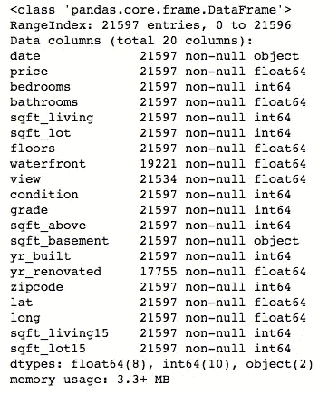
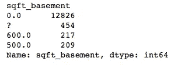
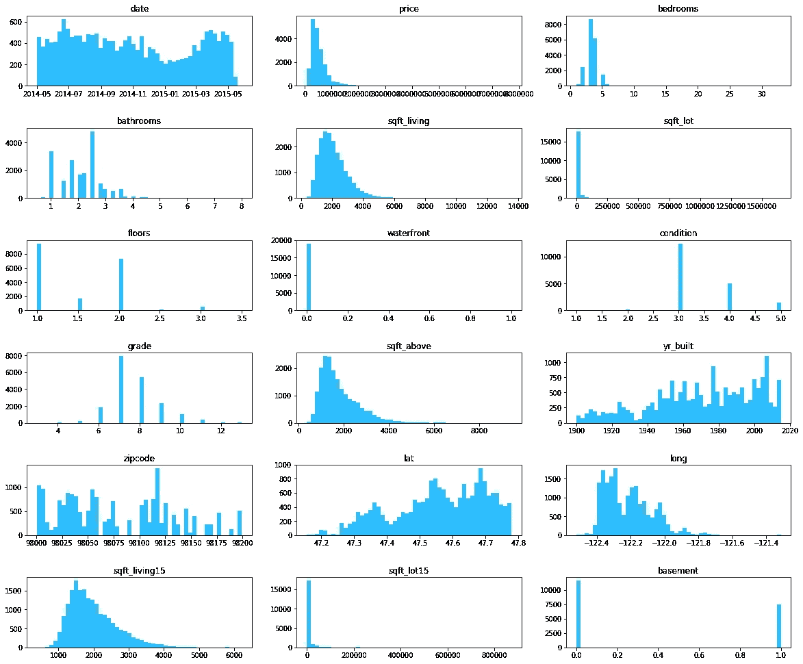
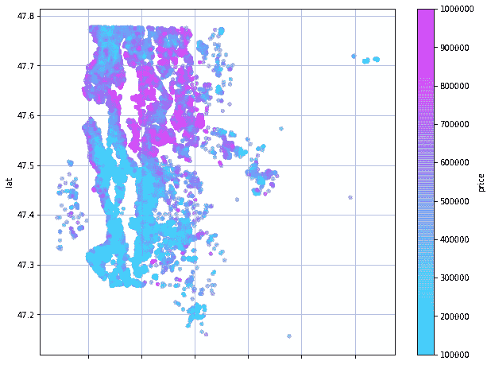

# 在西雅图不值钱？

> 原文：<https://towardsdatascience.com/worthless-in-seattle-9300b3594383?source=collection_archive---------18----------------------->

## 或者，再见蓝色星期一

公平地说，我以前的经理是个有钱人。除了在我之前的公司担任董事之外，他还有一份利润丰厚的房地产兼职。鉴于他的计算机科学背景，他能够从房地产网站收集数据，并分析房子的属性如何影响其价格。因此，他可以识别相对于预期被严重低估的资产，明智地投资，并在转售时获得可观的利润。

因此，一段时间以来(或者至少从他第一次带我去他在伦敦市中心的两个私人会员俱乐部中的一个开始)，与房地产销售的黑暗世界相关的任何类型的数据科学的商业案例对我来说都是显而易见的。


The Skyneedle — probably an outlier in King County’s property market…

我们在这里考虑的数据集是华盛顿金县的房产销售，它从西北部的西雅图延伸到东部的 Okanogan-Wenatchee 国家森林。这篇博客将探讨我们如何清理这个数据集，以期执行一个多变量线性回归模型来预测房地产的价格。

这项工作的 github 库可以在这里找到。

# 第一步。检查和理解数据

我们可以使用 Pandas 库导入数据(以 csv 文件的形式提供给我们),并使用。info()方法。

```
df = pd.read_csv(‘kc_house_data.csv’)
df.info()
```



这里的关键要点是:

*   我们有 21597 个观察值(每个代表一个销售交易)，所以这是一个不错的样本量。
*   数据是完整的，除了“海滨”和“yr _ renovated”栏。我们将需要调查这些，看看我们是否能填补空白。
*   “date”应该具有日期时间类型，以便于进一步分析。此外，“sqft_basement”具有“object”类型，这是我们不希望的(这应该是一个浮点数或整数)。这需要调查。
*   许多列标题都是不言自明的，尽管这并不普遍。我们可以利用(相当不错的) [King County 网站](https://info.kingcounty.gov/assessor/esales/Glossary.aspx?type=r)来更好地了解等级和状况等属性。
*   我们可能需要对数据集做进一步的研究，以掌握“视图”等属性，这些属性的含义并不明显。

在继续之前，我们还应该通过检查下面的代码返回 0 来检查我们没有重复的数据。

```
len(df[df.duplicated()])
```

# 第二步。调查不完整的数据

我们检查“waterfront”和“yr _ renovated”列，查看我们的行中有多少部分包含至少一个 NaN 值。

```
len(df.loc[(df[‘yr_renovated’].isna()) | (df[‘waterfront’].isna())]) / len(df)
```

这会返回 27% —数据集的一个大块，太大而无法彻底删除。让我们依次研究这些列，看看我们是否可以更加细致入微。首先看一下 renovation 列，让我们通过查看最常出现的值来感受一下数据。

```
df.groupby(by = ‘yr_renovated’)[‘yr_renovated’].count().sort_values(ascending = False).head()
```


因此，我们看到，除了缺失值之外，还有 17，011 行的“0”是最后一次翻新的年份。这表明房子从未翻修过，或者更有可能的是，没有相关数据。我们可以放弃这个专栏——鉴于这里未知的份额，它不会提供洞察力。

```
df.drop(‘yr_renovated’, axis = 1, inplace = True)
```

我们现在检查“waterfront”列，发现只有 11%的行有 N/a。

```
len(df.loc[(df[‘waterfront’].isna())]) / len(df)
```

这是示例中足够小的一部分，我们可以使用。dropna()方法。

```
df.dropna(inplace=True)
```

# 第三步。修复数据类型

当我们开始进行探索性分析时，确保数据被转换为最合适的类型是非常重要的——当我们试图使用甚至基本的函数时，错误类型的数据可能会引发错误(当然，计算字符串的平均值在概念上是不可能的)。

使用 to_datetime()方法可以很容易地处理日期列:

```
df[‘date’] = pd.to_datetime(df[‘date’])
```

这种格式将允许熊猫识别日期的星期几、月份数，并将使该功能“有序”——即我们将能够按时间顺序排列日期。

“sqft_basement”功能当前是“object”类型，这表明我们可以在列中使用字符串条目作为占位符。让我们看看最常见的值。

```
df.groupby(by = ‘sqft_basement’)[‘sqft_basement’].count().sort_values(ascending = False).head(4)
```



它看起来像问号“？”条目是给我们带来麻烦的原因。我们需要删除它们，但理想情况下，我们会用值来替换问号，而不是简单地删除行。

令人高兴的是，我们可以从总居住空间和“上面”居住空间之间的差异来计算地下室面积，这在“sqft_living”和“sqft_above”列中给出。

我们可以编写代码来隔离“？”的索引基础值，并用此计算替换它们。

```
for i in list(df.loc[df[‘sqft_basement’] == ‘?’].index.values):
    df.loc[i,’sqft_basement’] = df.loc[i,’sqft_living’] - df.loc[i,’sqft_above’]
```

完成这些后，我们可以将列转换为浮点数。

```
df[‘sqft_basement’] = df[‘sqft_basement’].astype(‘float64’)
```

# 第四步。寻找异常值

而最后几个步骤是相当客观的(一个地下室不可能有？平方英尺)，处理异常值需要更多的细微差别。完全有理由问:如果没有客观的方法来识别和消除离群值，那么为什么要做这一切呢？这个答案真正触及了我们正在做的事情的核心。

最终，我们需要决定我们希望我们的模型做什么。这通常包括在模型精度和模型范围之间进行权衡。换句话说，你想要:

1.  一个**非常** **精确**的模型，涵盖一个**种类广泛**的物业类型，或者:

2.一种**精确的**模型，涵盖**非常广泛的**财产类型。

通常，我们会选择第一个选项——更好的预测是我们所追求的，即使这意味着缩小一点范围。

那么我们如何选择丢弃什么呢？考虑到我们变得有点主观，我们可以从视觉上思考这个问题。特别是，直方图将显示长尾(例如，非常昂贵的属性)。



我们可以得出结论，超过 7 间卧室、超过 5 间浴室或超过 30 万平方英尺的房子不太可能代表样本。类似地，根据上面的直方图，售价超过 100 万美元(实际上是 10 万美元)的房产容易扭曲模型。

看看市场的低端——我们只能看到 21 栋 3 级或 4 级的房子(小木屋或不符合建筑标准的房子)。这些不太可能有代表性。我们也可以假设一处房产应该至少有一间浴室。

我们可以从数据集中删除这些房子。

```
to_drop = df.loc[(df[‘bedrooms’] > 7) | (df[‘bathrooms’] > 5) | (df[‘bathrooms’] < 1) | (df[‘sqft_lot’] > 300000) | (df[‘price’] > 1000000) | (df[‘price’] < 100000) | (df[‘grade’] < 5)].indexdf.drop(to_drop, inplace = True)
```

与此同时，显示经度和纬度的散点图可能会显示地理异常值，但这并不代表更广泛的样本。我们可以使用熊猫内置的散点图来显示价格。

```
ax = df.plot.scatter(‘long’,’lat’,c = ‘price’,cmap = ‘cool’, alpha = 0.6, figsize = (10,8), grid = True);
```



请注意我们如何将这种分散与金县的实际地图联系起来。注意图表右上角(东北)的点。根据下面的地图，这些似乎对应于巴林、葛洛托或斯凯科米什。


当然，我们可以将这些城镇的房屋销售留在数据集中，但它们相对于其他房产在地理上是如此孤立，因此它们可能不具有代表性。计算出该组的经度和纬度范围后，我们可以用通常的方法删除这些行。

```
far_east = df.loc[df[‘long’] > (-120–1.69)]
df.drop(far_east.index, inplace = True)
```

当然，我们可以对数据集设置任意数量的限制来剔除异常值。但是这些看起来是明智的步骤，可以确保我们在进行回归时，结果不会有偏差。