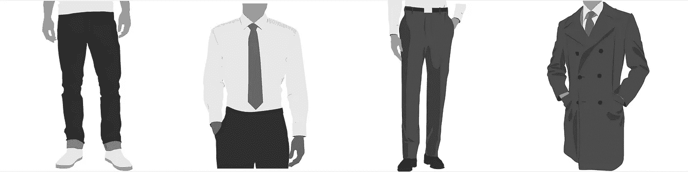
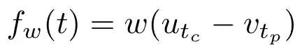
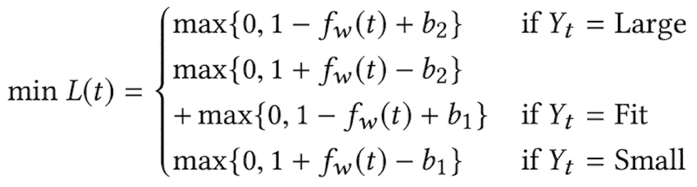
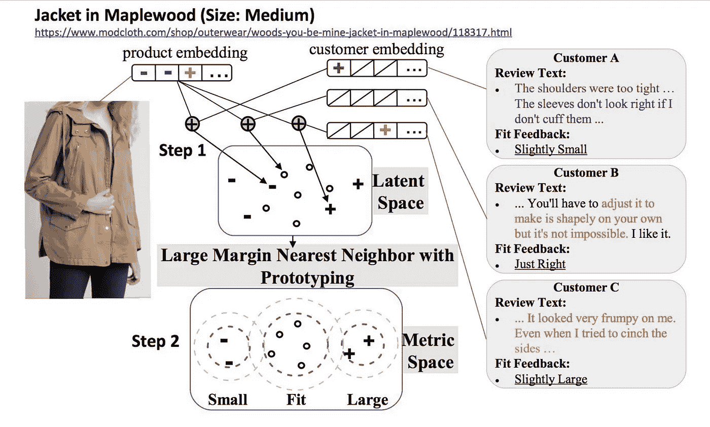
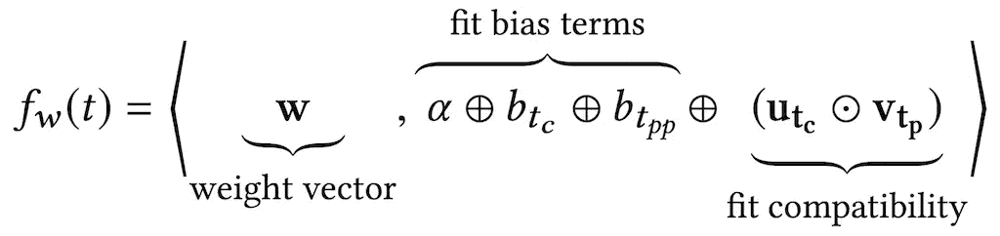
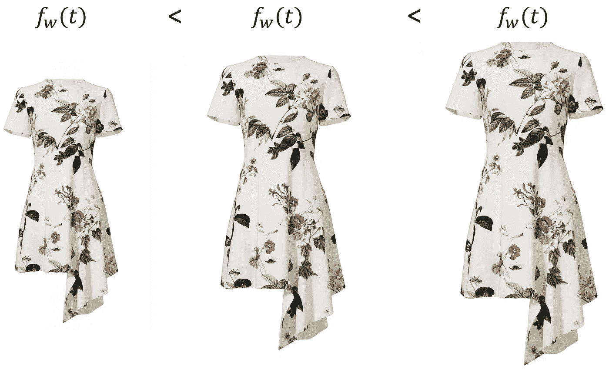
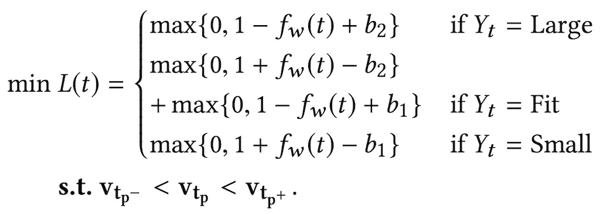
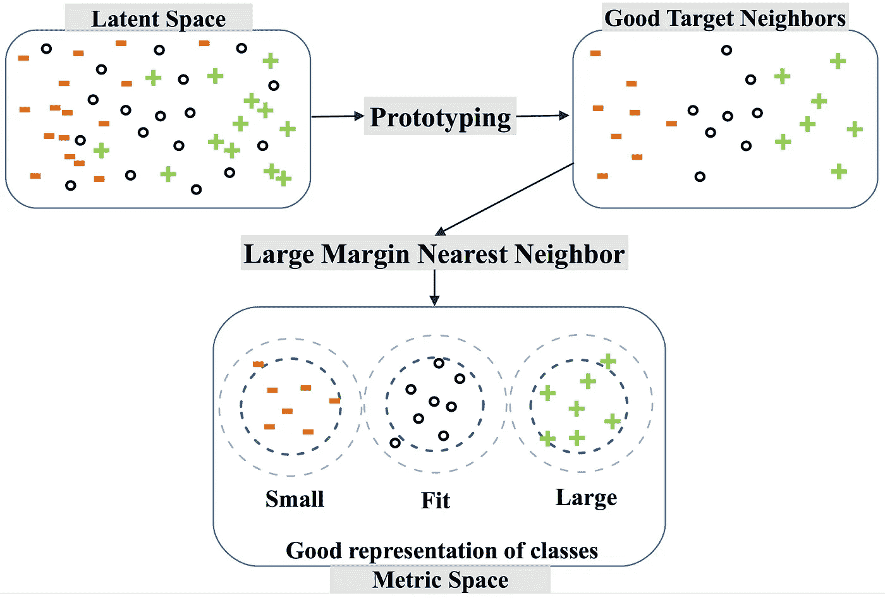
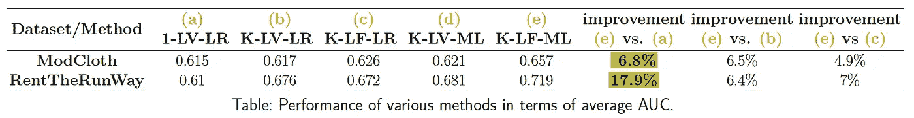
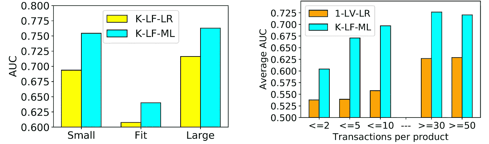

# 这件衣服适合我吗？

> 原文：<https://towardsdatascience.com/would-this-clothing-fit-me-5c3792b7a83f?source=collection_archive---------13----------------------->

## 了解机器学习如何用于向顾客推荐合适的服装尺寸

# 介绍

谁不爱网购？这是方便的，提供了广泛的产品选择，我们得到了很大的交易。零售商也受益于互联网提供的覆盖范围，并有机会建立自己的品牌。因此，网上时装业近年来出现了巨大的增长。然而，网上购物仍然很棘手，因为不同品牌的衣服尺码差异很大，这使得顾客很难找到合适的衣服。对于消费者来说，这会导致糟糕的购物体验，因为他们可能不得不退货，而对于零售商来说，这会导致金钱损失。

> 因此，自动提供准确和个性化的试穿指导对于改善在线购物体验和降低产品退货率至关重要。

## 先决条件

这篇文章假设读者熟悉以下概念。在继续下一步之前，您可以通过相关链接了解这些内容。

*   [潜在因素模型](http://www.ideal.ece.utexas.edu/seminar/LatentFactorModels.pdf)
*   [随机梯度下降](https://en.wikipedia.org/wiki/Stochastic_gradient_descent)
*   [有序回归](https://rishabhmisra.github.io/Machine-Learning-Glossary/#OR)
*   [铰链损耗](https://rishabhmisra.github.io/Machine-Learning-Glossary/#HL)

# 目标

我们知道，任何服装产品都有许多不同的目录尺寸。如今，许多在线零售商允许客户在退货过程中或留下评论时，对所购产品提供合适的反馈(如`Small`、`Fit`或`Large`)。

> 为了进行区分，我们将一个产品(例如 Northface 夹克)称为“父产品”，而将它的不同尺寸(例如小型/中型 Northface 夹克)称为“子产品”。

假设我们有交易数据，其中每笔购买可以表示为(`customer`、`child product`、`fit feedback`)的三元组，我们可以陈述我们的目标如下:

> 从顾客对购买的`child` 产品的反馈中了解顾客的合身偏好和`child` 产品的尺码相关属性，以便向顾客推荐更合身的产品尺码。

# 数据集

在前一节定义目标时，我们假设我们有表单(`customer`、`child product`、`fit feedback`)的事务数据。对于任何在线零售商来说，建立这种数据集都很容易，但对我来说却不是这样。

在网上进行大量搜索后，我发现了 [ModCloth](https://www.modcloth.com/) 和[renttherrunway](https://www.renttherunway.com/)网站，它们提供了解决这个问题所需的数据信号。这些数据集包含顾客自我报告的合身度反馈以及其他附带信息，如评论、评分、产品类别、目录尺寸、顾客测量值等。我使用 python 的 Selenium 包提取了数据集，并作为我研究的一部分公开发布了它们。你可以在他们的页面上了解更多。

# 它开始的地方

我们试图解决的问题是由亚马逊印度的[研究人员在 2017 年提出的产品尺寸推荐问题。他们专注于创建一个向顾客推荐鞋号的模型。由于鞋子的合适性可以通过 1 或 2 个维度(长度和/或宽度)来判断，从建模的角度来看，这是一个很好的起点。那么，我们先来了解一下他们提出的模型。](https://cseweb.ucsd.edu/classes/fa17/cse291-b/reading/p243-sembium.pdf)

## 简单的模型

对于每一个客户和子产品，我们考虑一个潜在的变量，并说它表示他们的真实大小。

> 由于不同品牌之间的尺寸差异，子产品的实际尺寸可能与零售商指定的目录尺寸不同。如果我们能够知道真正的尺寸，那么所有子产品的尺寸都将是相同的，这反过来会使测量适合度变得更容易。

假设`***u_c***`表示客户 ***c*** 的真实尺寸，而`***v_p***`表示子产品 ***p*** 的真实尺寸。直观上，如果有一笔交易( ***c*** ， ***p*** ，`Fit`)，那么真实大小`***u_c***`和`***v_p***`一定很接近，也就是说，|`***u_c***`-`***v_p***`|一定很小。另一方面，如果有一个事务( ***c*** ， ***p*** ，`Small`)，那么客户的真实大小`***u_c***`一定比子产品的真实大小`***v_p***`大得多，或者说，|`***u_c***`-`***v_p***`|一定很大。最后，对于( ***c*** ， ***p*** ，`Large`)类型的交易，`***v_p***`-`***u_c***`必须是大的。

为了量化子产品对客户的适合度，将每个交易 ***t*** 的适合度分数定义为:

equation 1

其中 ***w*** 为非负权重参数。由于该拟合分数是连续的，并且最终目标是基于该拟合分数将交易分类为三个拟合类别之一，研究人员使用 [*有序回归*](https://rishabhmisra.github.io/Machine-Learning-Glossary/#OR) 进行建模。

> 从概念上讲，我们定义了两个阈值参数`***b_1***`和`***b_2***`，它们将连续标度分成对应于三个拟合等级的三个部分。我们可以给这种划分赋予意义，使得大于`***b_2***`的拟合分数对应于`*Small*`，小于`***b_1***`的分数对应于`*Large*`，并且在`***b_1***`和`***b_2***`之间的分数对应于`*Fit*`。对于这三个部分中的每一个，我们可以认为大于阈值的分数在正面类中，小于阈值的分数在负面类中。解决这三个二进制分类问题将告诉我们一个事务属于哪个类。

为了学习潜在变量`***u_c***`和`***v_p***`，我们现在只需要两件事情:一个*损失函数*优化和一个*优化技术*。亚马逊作者使用 [*铰链损失*](https://rishabhmisra.github.io/Machine-Learning-Glossary/#HL) 用于序数回归中的每个二元分类问题。已知铰链损失最大化分类器的决策边界之间的余量。因此，任何交易的目标函数 ***t*** 都可以写成:

equation 2

总损失只是每笔交易的损失之和，当任何交易*具有合适的结果`***Y_t***`、`***Y_t*** = Large`的`***f_w*(*t*) *> b_2***`、`***Y_t*** = Small`的`***f_w*(*t*) *< b_1***`和`***Y_t*** = Fit`的`***b_1 < f_w*(*t*) *< b_2***`时，总损失最小。作者使用*随机梯度下降*来优化目标。*

## *预测和建议*

*由于在模型的离线评估中推荐产品是不可能的，作者考虑模型预测看不见的交易的拟合结果的能力作为模型推荐性能的代理。为此，他们将学习到的客户和子产品的潜在特征输入标准分类器，如*逻辑回归分类器*和*随机森林分类器*，以产生合适的预测。*

# *挑战*

*尽管上述模型在鞋子数据集上运行良好，但它可能不够灵活，无法解决以下挑战:*

*   *像连衣裙和衬衫这样的服装产品具有相对更多的尺寸来确定是否合身。此外，对于不同的产品类别，每个顾客的合身偏好可能会有所不同，例如，顾客可能更喜欢宽松一点的夹克，而湿西装则更合身。因此，每个子产品和客户的单个潜在特征可能不足以捕捉数据中的所有可变性。*
*   *由于大多数交易被报告为`Fit`，因此客户的适合度反馈分布不均匀，因此很难了解购买何时不是`Fit`。标准分类器不能处理标签不平衡问题，并导致有偏的分类，即在这种情况下，`Small`和`Large`类将具有较差的估计率。*

# *如何才能提高？*

*在我们的[研究工作](https://cseweb.ucsd.edu/~jmcauley/pdfs/recsys18e.pdf)中，我们应对上述挑战。为了应对第一个挑战，我们考虑了每个客户和子产品的多种潜在特性。直观地说，这使我们能够捕捉顾客对不同产品方面(如肩部、腰部等)的合身偏好。).为了解决第二个挑战，我们借助原型的度量学习技术。下图概述了该框架:*

**

*让我们深入研究一下方法论。*

# *学习适合的语义*

*为了对 fit 的语义进行建模，我们使用潜在因素模型公式(*最终帮助我们从数据*中提取更多信息特征)来分解 fit 反馈信号。为此，我们将拟合分数定义为:*

**

*equation 3*

*其中下标 ***pp*** 表示父产品，*和 ***v*** 是 k 维潜在特征， ***α*** 是全局偏差项， **⊕** 表示串联，**𕬙**表示元素式产品。偏见术语`***b_t_pp***`表达了这样一种观点，即某些母产品由于其固有的特征/构造而更容易被报道`unfit`，而偏见术语`***b_t_c***`表达了这样一种观点，即某些顾客对合身性高度敏感，而其他顾客可能更容易适应。**

> **虽然我们将能够从这个公式中学习到好的特性，但一个棘手的问题是，同一父产品的不同目录大小的拟合分数之间的顺序不能保证是一致的。这会使我们的模型变得无用。**

**我们希望，如果一个客户的子产品是`Small`(分别是`Large`)，那么相应父产品的所有较小(较大)尺寸也应该是`Small` ( `Large`)。**

****

**注意`equation 3`，我们看到父产品 ***pp*** 和客户 ***c*** 的适合度分数仅根据子产品的潜在特性`***v_p***`而变化。因此，为了解决这个问题，如果存在一个更小(更大)的目录产品***【p-***(***p+***)的潜在特征，强制要求子产品 ***p*** 的所有潜在特征严格大于(更小)下一个更小(更大)的目录产品***【p-**的潜在特征就足够了。*****

**既然我们已经公式化了事务的适合度，我们可以将我们的目标函数写成如下:**

****

**equation 4**

**这类似于`equation 2`,只是我们改变了拟合分数的定义并增加了单调性约束。我们可以使用*投影梯度下降*来优化该目标，该目标类似于*随机梯度下降*，不同之处在于每次更新后都会强制实施约束。**

# **处理标签不平衡**

**为了处理标签不平衡问题(即`Fit`标签的数据量比`Small`和`Large`多得多)，我们求助于一种结合原型的度量学习技术。**

> **原型技术的目标是从可用数据中创建一定数量的“原型”,使它们能够代表数据。原型可以是数据集中的一些关键数据样本，也可以是几个数据样本的组合。通常，创建的原型数量远远少于数据集中的数据样本数量。**

**简而言之，我们提出的原型技术首先通过从不同的类重新采样来改变训练数据的分布，这被证明在处理标签不平衡问题上是有效的。随后，我们采用*大间隔最近邻* ( **LMNN** )度量学习技术，该技术通过将具有相同 fit 反馈的事务移动得更近而具有不同 fit 反馈的事务移动得更远来改进局部数据邻域，从而帮助 k-NN 方法更好地分类。形象地说，这个过程可以描述为:**

****

## **度量学习技术**

**度量学习的目标是学习距离度量 ***D*** 使得 ***D* ( *k* ，*l*)*>D*(*k*， *m* )** 对于任何训练实例 ***(k，l，m)*** 其中事务【T24 在这项工作中，我们使用 **LMNN** 度量学习方法，除了使同类事务更接近之外，还旨在保持不同类事务之间的差额。这最终改进了分类。具体来说， **LMNN** 通过以下方式做到这一点:**

*   **识别每个事务的目标邻居，其中目标邻居是那些*期望*最接近正在考虑的事务的事务(即，来自同一类的事务)。**
*   **学习输入空间的线性变换，使得在变换空间中事务的结果最近邻居确实是其目标邻居。 **LMNN** 中的最终分类然后通过在变换(度量)空间中应用 **k** -NN 给出。 **LMNN** 使用的距离度量 ***D*** 就是 [*马氏距离*](https://en.wikipedia.org/wiki/Mahalanobis_distance) 。**

## **样机研究**

> ****LMNN** 中的一个警告是，它在运行之前为每个事务*固定 **k** 目标邻居。这允许在本地定义约束。然而，这也使得该方法对欧几里德距离选择相关目标邻居的能力非常敏感。***

**为了减轻欧几里德距离的这种限制并解决标签不平衡问题，我们开发了一种启发式方法，通过仔细地对事务进行采样来减少来自离群值和其他无贡献事务(如过于接近其各自类的质心或已经选择的事务)的噪声，从而为每个类提供良好的表示。**

> **你可以从我们的[研究论文](https://cseweb.ucsd.edu/~jmcauley/pdfs/recsys18e.pdf)中获取详细的算法。**

# **实验和结果**

## **实验装置**

**我们试验并比较了以下五种方法:**

*   *****1-LV-LR*** :亚马逊提出的鞋号推荐方法，如上所述。**
*   *****K-LV-LR***:1-LV-LR 的简单扩展，我们认为每个客户和子产品的潜在特征是 **K** 维度的。其他一切都保持不变。**
*   *****K-LF-LR*** :在“学习 Fit 的语义”一节中给出的建议潜在因素变化。我们将学习到的因素作为特征直接用于逻辑回归分类器，以产生合适的结果。**
*   *****K-LV-ML*** :该方法与 ***K-LV-LR*** 相似，不同之处在于它使用建议的度量学习方法，而不是逻辑回归，来产生最终的拟合结果。**
*   *****K-LF-ML*** :这是我们提出的方法。**

**这些方法旨在评估:**

*   **捕捉*配合语义*相对于*真实*尺寸的有效性。**
*   **学习良好潜在表征的重要性。**
*   **提出的度量学习方法在处理标签不平衡问题中的有效性。**

## **结果**

****

> **我们根据*平均 AUC* 指标来衡量所有方法的性能。平均 AUC 只不过是单个类的 AUC 分数的平均值。**

**从表中，我们观察到我们提出的模型大大改进了鞋号推荐模型( **e 对**)。*这可以归因于学习真实尺寸的合身语义*。我们还观察到 ***模块布*** 的改进相对小于 ***模块布*** 的改进。这可能是由于与*renttherrunway*相比 *ModCloth* 拥有相对更多的冷产品和客户(交易非常少的产品和客户)(参见[数据集页面](https://www.kaggle.com/rmisra/clothing-fit-dataset-for-size-recommendation/home)上的统计数据)。我们还注意到，当使用来自 ***K-LV*** 方法的表示( **d 对 b** )时，度量学习方法并没有显著提高性能。这强调了学习良好表达的重要性。最后，我们看到 ***K-LF-ML*** 在两个数据集上都大大优于所有其他方法。**

****

**除了学习良好的表示之外， ***K-LF-ML*** 的良好性能也可以归因于所提出的度量学习方法在处理标签不平衡问题方面的能力，如上面左侧图中所示。**

**此外，右侧图表描绘了 ***K-LF-ML*** 在冷启动和热启动情况下的表现。对于冷产品，我们注意到 ***K-LF-ML*** 的表现始终优于 ***1-LV-LR*** ，虽然它们的表现整体略差。当我们考虑事务较多的产品时， ***K-LF-ML*** 的性能提升很快，而 ***1-LV-LR*** 的性能只有在给定足够多的样本时才能显著提升。**

# **结束语**

**希望这篇文章能很好地概述产品尺寸推荐领域的当前研究。你可以在我的这个 [Github Repo](https://github.com/rishabhmisra/Product-Catalog-Size-Recommendation-Framework) 找到这篇文章中描述的方法的实现。这是一个非常实际的问题，需要很好地解决，并且有几个开放的方向。例如，进一步改进的一个方向可以是利用审查来提高模型的可解释性，因为目前很难理解每个潜在维度对应于什么。通过将语言模型与潜在因素模型相结合，为每个潜在维度(由相应的主题表示)赋予特定的含义，这是可能的，正如本文中所做的那样。如果你有其他改进的想法，请在评论中告诉我，我们可以讨论。**

**原贴@[https://rishabhmisra . github . io/Would-This-Clothing-Product-Fit-Me/](https://rishabhmisra.github.io/Would-This-Clothing-Product-Fit-Me/)**

**如果你喜欢这篇文章，并对我未来的努力感兴趣，可以考虑在 Twitter 上关注我:[https://twitter.com/rishabh_misra_](https://twitter.com/rishabh_misra_)**