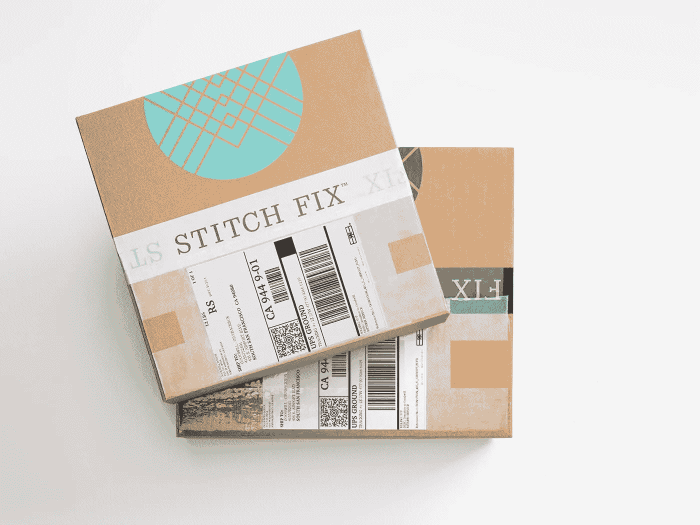
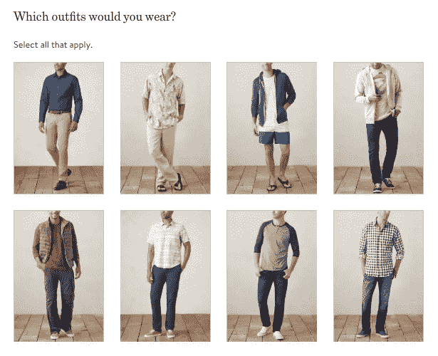

# 你会让电脑选择你的衣服吗？

> 原文：<https://towardsdatascience.com/would-you-let-a-computer-select-your-clothes-9d3e39b3005e?source=collection_archive---------22----------------------->

## 一个 AI 风格的盒子

不久前，人们普遍认为人们不会在网上买衣服——当然是书和 DVD，但不是你习惯看到、触摸和试穿的东西。然而现在，亚马逊是美国第二大服装零售商，最新的趋势是超越网上购物，现在是让算法为你购物。我不经常谈论时尚，因为我对它知之甚少，而且更喜欢坚持我对技术感兴趣的正常领域。但随着一项名为 Stitch Fix 的新服务(针对英国)的推出，这两个领域发生了碰撞，最终为像我这样的时尚挑战以及时间紧迫但有时尚意识的人带来了一些希望。

Stitch Fix 已经在美国获得了超过 300 万的活跃用户，现在可以在英国使用，这是它的第一次海外扩张。注册并完成你的个人资料不到 10 分钟，几天后，一箱由 Stitch Fix 的算法为你单独挑选并由他们(目前)的一位人类造型师精制的衣服会送到你的门口。对于懒惰的购物者或那些想得到私人购物者的建议但负担不起的人来说，Stitch Fix 是最方便的，还增加了一点时尚建议。

The kinds of questions that help Stitch Fix profile you

我的第一个盒子(或者他们称之为我的第一次“修复”)是成功的。尽管我对让算法向我推荐商品并不陌生，但我还是有点犹豫地打开了盒子——它们真的能挑选出我喜欢的衣服吗？作为算法的胜利，他们为我选择的一切都是合适的，是一个非常恰当的选择。(你可以要求他们突破你的风格界限，送你一些超出你正常衣柜舒适区的衣服)。如果你不想保留他们寄给你的所有东西，有一个免费的信封。我特别欣赏指导我如何组合物品的额外的风格建议。

我们购物的方式和地点正在迅速变化，Stitch Fix 是影响每个行业的不懈追求便利的又一个例子。我敢肯定，下一步 Stitch Fix 将与谷歌助手或亚马逊的 Alexa 合作，这样订购就像“嘿，谷歌，我想要一些新衣服”一样简单。在那之后，我想象我的谷歌助手将很快扫描我的日历，看到我可能需要一套新衣服的活动，并与 Stitch Fix 协调，及时为我找到另一个适合活动的修复。但是现在，您可以根据需要订购新的修复程序，或者安排每月或每季度更新一次。

> “[我们的顾客]来找我们是因为他们不想去购物。五年后，人们会说，‘还记得我们不得不逛商场寻找自己的东西吗？“这太疯狂了！”"
> 
> Eric Colson，首席算法官，Stitch Fix

也许带有一点自私的夸张，Stitch Fix 表明，在未来的几年里，我们曾经去服装店寻找我们喜欢的商品，这将显得很奇怪。算法可以在瞬间评估数百万件商品，并非常准确地将它们与我们的偏好匹配起来。我知道很多人喜欢购物，如果把购物委托给一个看不见的分派箱子的算法，他们会感到震惊。但是，箱子出现在你家门口的纯粹便利性，以及合理的价格、优质的衣服和准确的选择，可能会让相当多的人依赖这项服务来购买他们的大部分衣柜。所需要的只是对网上购物感觉如何的另一个小小的信念飞跃。