# 用线性回归破解 Ames 住房数据集

> 原文：<https://towardsdatascience.com/wrangling-through-dataland-modeling-house-prices-in-ames-iowa-75b9b4086c96?source=collection_archive---------6----------------------->

## 在数据世界里争吵

## 预测和统计推断的回归模型

Image of Ames, Iowa by Tim Kiser from Creative Commons

埃姆斯住宅数据集(2011)的特征丰富性既诱人又令人困惑。当试图揭示其模式时，很容易被其丰富的特征所吸引。首先，了解艾姆斯数据集符合历史悠久的 [*特征定价法*](https://stats.oecd.org/glossary/detail.asp?ID=1225) 来分析房价是非常有用的。一些领域知识会有很大帮助。

我之前学过一些详细的统计学/计量经济学。认识到“大数据”革命并被其前景所吸引，过去几个月我一直沉浸在编码和机器学习中。正是在这个过程中，我遇到了埃姆斯住房数据集。我结合了传统的计量经济学研究和机器学习工具。

我选择坚持使用**透明的线性模型**，在这种模型中，预测和统计推断的目标可以一起追求。这意味着运行普通最小二乘法(OLS)、岭和套索回归模型。请注意，我进行的分析是基于完整的**原始** Ames [数据集](http://jse.amstat.org/v19n3/decock/AmesHousing.txt)，而不是数据集的 Kaggle 版本。

# **特征定价法**

在计量经济学研究中，人们试图站在该领域前人的肩膀上拓展研究视野。没有哪两栋房子是完全相同的，特征价格模型的基本思想是特定社区和特定单元的特征有助于决定房价。

因此，重温一下影响房价的常见疑点是有用的。如果因变量(或目标变量)是销售价格，那么在其他条件不变的情况下，房子越大，价格自然越高。这应该和断言一个 18 英寸的披萨可能比一个 12 英寸的披萨更贵一样不言而喻。因此,**资产规模度量**将是关键变量，在 Ames 数据集中有几个这样的变量。一个更有趣的问题可能是，每平方英尺的价格如何以及为什么会因房屋而异，这就像问为什么某些比萨饼店能够收取更高的每片价格。房地产专业人士也倾向于关注每平方英尺(或每平方米)的价格，而不是整体价格。但这不是本文的目标。

任何一个购房者都会听说过这个表达**“位置，位置，位置”**，这也恰好是一个关于购房者的流行英国电视节目的标题，该节目已经连续播出了 19 年。因此，人们会认为社区“位置”和相关特征，如便利设施(如好学校、休闲设施)、交通网络(如地铁站附近)、社区美学(如绿树成荫的街道、漂亮的房子)以及社会经济声望等，会对房价产生影响。

另一组通常被认为对决定房价很重要的因素是房间的数量，尤其是卧室和浴室，以及厨房的条件。除此之外，房子的年龄和物理条件也很重要，建筑材料和任何结构改进也很重要。

影响房价的因素可以概括为**房产大小、位置吸引力、附近的便利设施、房间数量、建筑材料以及建筑的年龄和条件**。有了之前的研究，我开始使用 Python 分析数据。

# **数据清理&异常值**

第一项任务是数据清理，一如既往。数据集最初有 2930 个观察值，我立即删除了三个变量，每个变量的观察值都不到 300。我认为很重要的“LotFrontage”(与房产相关的街道的线性英尺数)变量缺少 490 个观察值。当按照它们各自的“LotShape”类别分组时，我用平均“LotFrontage”来填充缺失的值。

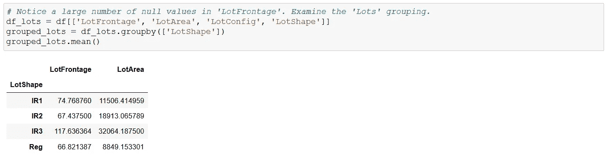

**Assign missing ‘LotFrontage’ by the mean value according to ‘LotShape’**

然后，我绘制了因变量**“销售价格”的直方图。很明显，它有极高的值(一个长的右尾)，并且不是正态分布的。这表明该数据包含大量异常值**。处理异常值可能很棘手，因为它们中的一些可能提供重要的信息，所以人们不希望过于宽松地定义异常值，然后将它们全部抛弃。****

****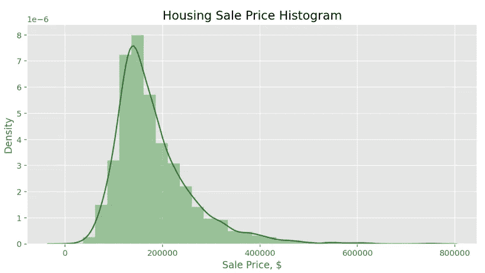****

******Very skewed sale price target variable******

****鉴于**物业规模指标**的重要性，我迅速放大“GrLivArea”、“LotSize”和“GarageArea”作为潜在的解释变量。在美国，将地下室面积包括在房产面积中是不常见的。事实上，房利美(Fannie Mae)和 ANSI 的指导方针禁止在评估房产居住面积时计算地下室的面积，尽管人们可以想象这仍可能对房产价格产生一些影响。因此，我选择将地下室大小度量分开，并从其他地下室度量中构造了一个完整的地下室面积变量“BaseLivArea”。****

****现在是时候寻找**离群值**了。我分别在“SalePrice”、“GrLivArea”和“BaseLivArea”中寻找那些低于或高于各自平均值的 **3** **标准差**的观察值。在“低于”类别中没有观察值，但是在所有三个变量的“高于”类别中有 **66 个观察值**。我从分析中删除了这 66 个观察值，约占样本的 2.3%。****

****然后，我查看了“SaleCondition”变量，它记录了每笔交易的销售类型，大多数观察结果属于“正常”销售类别，但有 **218 个观察结果**被记录为“异常”或“家庭”(家庭内部销售)。我放大了这些，注意到它们的平均售价和中值售价(以及每平方英尺的价格)都远低于整体样本。这促使我将这 218 笔不寻常的销售交易排除在分析之外。如果这些交易本质上不是主要的商业交易，那么将它们包含在数据集中会将**偏差**引入到试图估计住房特征和房价之间的经济关系的模型中。****

****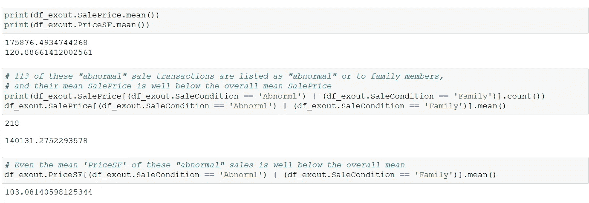****

******“Abnormal” and “Family” transactions had mean values that were well below the average sale price******

# ****特征工程****

****我现在已经把观察次数从最初的 2930 次减少到 2617 次。然后，在对“销售价格”进行**自然对数转换**之前，我构建了一个变量来表示房产的年龄“年龄”。原木销售价格的直方图看起来更加对称，没有太多的极端值。得到的模型是一个*对数线性*模型，意味着**是一个对数因变量，带有线性解释变量**。****

********

******Distribution of the log sale price is much more symmetrical******

****下一个问题是缺少一个**位置合意性变量**。“邻居”变量中列出了 28 个社区，但是不清楚如何对它们进行排序。根据每平方英尺的价格对这些社区进行排名，并以此作为位置合意性的衡量标准，这可能是显而易见的，但这种人为的构建自然会与房价相关联。这并不是一个好的研究方法，因为我们将构建一个部分由目标变量本身产生的复合特征变量。一个明显的位置合意性的代表**是根据平均家庭收入对每个社区进行排名，但是数据集没有这样的可用数据。******

****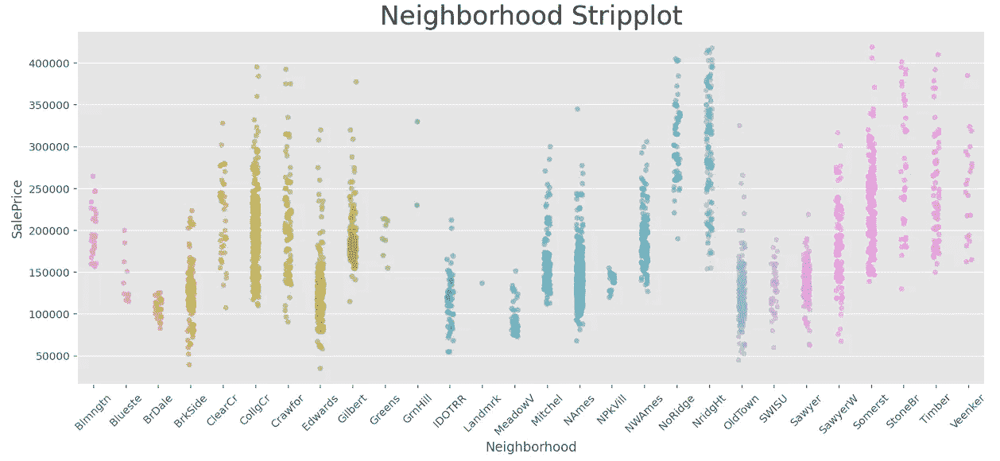****

******Too many neighborhoods and difficult to tell many of them apart by the price distribution******

****处理这个问题的一个简单方法是把这 28 个街区虚拟化，然后把它们都扔进模型里。为如此大量的社区设置单独的假人的问题是:****

1.  ****对于某些街区，只有少数**个观测值，其中 8 个不到 30 个观测值，在 2617 个样本观测值中，大多数不到 100 个；******
2.  ****在某些具有相似特征并因此具有相似房价分布的社区之间会有显著的**多重共线性**，正如在上面的剥离图中可以观察到的；和****
3.  ****如果一个人对**统计推断**感兴趣，那么在没有事先了解这些社区在合意性方面可能如何排名的情况下，他无法从这些假人中得出太多推断。****

****相反，我选择从数据集中的各种建筑质量和条件变量中构建一个**序数**邻域“位置”合意性变量，特别是“总体质量”、“总体成本”、“外部质量”、“外部质量”和“功能性”。我的方法背后的动机是假设**一个社区越令人满意，它的住房结构和条件的质量就越好**。****

****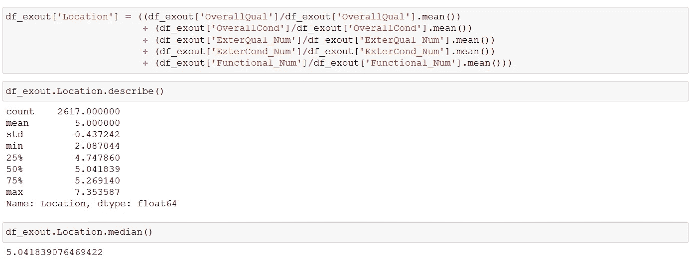****

******Crafting a “location” score out of the quality and condition variables******

****在没有额外信息或见解的情况下，我决定最好保持事情简单，只分配 **4 个序数值**用于“位置”合意性:1(低)、2(中低)、3(中高)和 4(高)。这 28 个街区按照它们的平均“位置”分数排序，我使用整体“位置”平均值将这些街区分为下半部分和上半部分。****

****平均“位置”值方便地将 28 个街区分成 14 个或以上的街区，以及 14 个以下的街区。然后，这两个组再次减半，这样，具有最低平均“位置”分数的七个邻域被指定为“位置”=1，随后的七个邻域被指定为“位置”=2，接下来的七个被指定为“位置”=3，剩下的七个被放置在“位置”=4。****

****完成这些任务后，我检查了每个“位置”排名的平均和中值“销售价格”和每平方英尺的价格，在“位置”得分和两个价格变量之间存在明显的正相关关系。这证实了所构建的“位置”变量可以是邻域合意性的良好代理。****

****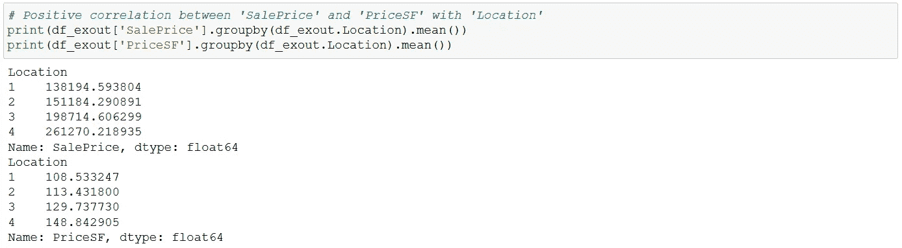****

******‘Location’ ordinal variable has positive correlation to the sale price******

****这是练习中使用单个变量最多的工作。我还创建了年度虚拟数据，因为这些数据跨越了对美国房价产生重大影响的 2008 年金融危机。此外，我为四个区域中的每一个创建了四个假人(“分区”)，一个假人靠近主干道或铁路线(“公路铁路”)，一个假人靠近积极的便利设施，如公园(“便利设施”)，一个用于车库(“车库”)，一个用于平屋顶(“平屋顶”)，一个用于高于一层楼的房屋(“两层楼”)，一个用于地产地块的平坦轮廓(“平坦轮廓”)。****

****就**室内机特有的**特性(除了尺寸变量)而言，我选择了“总质量”作为顺序变量，“总长度”作为顺序变量，“卧室”代表卧室数量，“浴室”代表浴室数量，“壁炉”代表壁炉数量，“中央厨房”代表有中央空调，1 代表“卓越厨房”。****

****俗称**【厨房卖房】**，壁炉尤为可取。所以我们会看到。****

# ****回归分析****

****所得工程数据的**相关矩阵**显示，所选**解释变量**之间的相关性一般在+/-0.50 以下。唯一显示相关性大于+/-0.70 的解释变量对是“GrLivArea-浴室”对。“浴室”也分别显示了与“年龄”和“整体质量”的高相关性(超过 0.50)。因此，我决定**从回归建模中去掉**的“浴室”变量，以减少**多重共线性**。****

****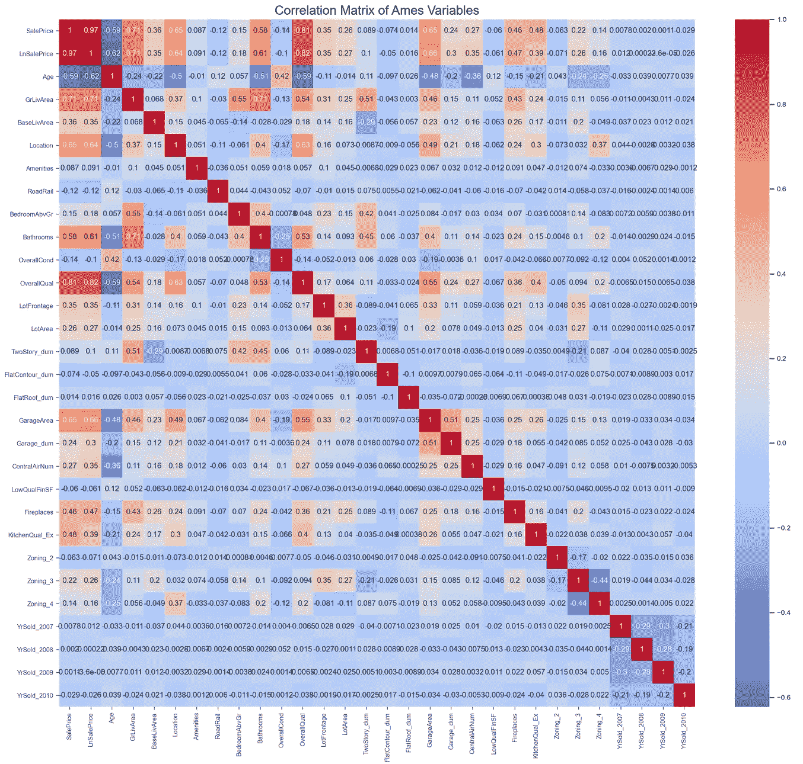****

****在运行回归分析之前，工程数据被分割。 **2010** 销售数据被保留为**保持测试集**，而**2006–2009**数据被用于**训练验证过程**。****

****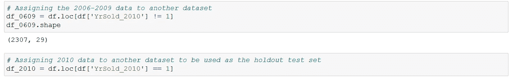****

******Separating the 2006–2009 data for train-validation, and reserving the 2010 data as the holdout test set******

****回归模型纳入了以下**解释变量**:年龄、GrLivArea、BaseLivArea、LowQualFinSF、车库面积、地段面积、地段临街面积、位置、卧室、壁炉、总面积、总面积、便利设施(虚拟)、道路轨道(虚拟)、两个仓库(虚拟)、平轮廓(虚拟)、平屋顶(虚拟)、车库(虚拟)、中央厨房(虚拟)、优秀厨房(虚拟)、Zoning_2(虚拟)、Zoning_3(虚拟)、Zoning_4(虚拟)和年度虚拟。****

****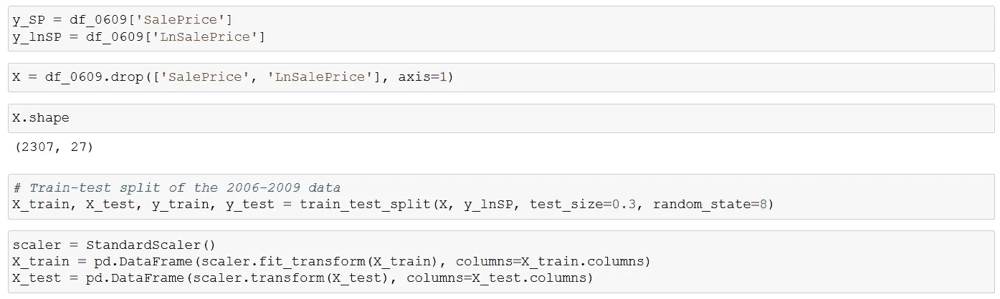****

******Splitting 2006–2009 data for train-validation procedure, and scaling them******

******目标变量**是“销售价格”的自然对数。对于 2006-2009 年的数据，我使用了 70-30 的训练验证分割。在进行回归之前，解释变量也被标准化。训练验证集随后通过 **OLS、岭和拉索线性回归模型**运行。所有三个线性模型都提供了 0.91–0.92 的训练测试**分数、大约 0.011 的 MSE 和大约 0.106 的 RMSE**。****

****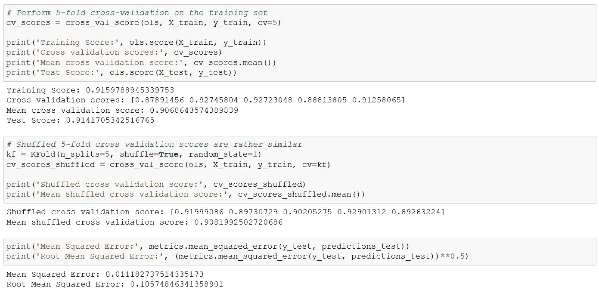****

******OLS regression scores, MSE and RMSE******

****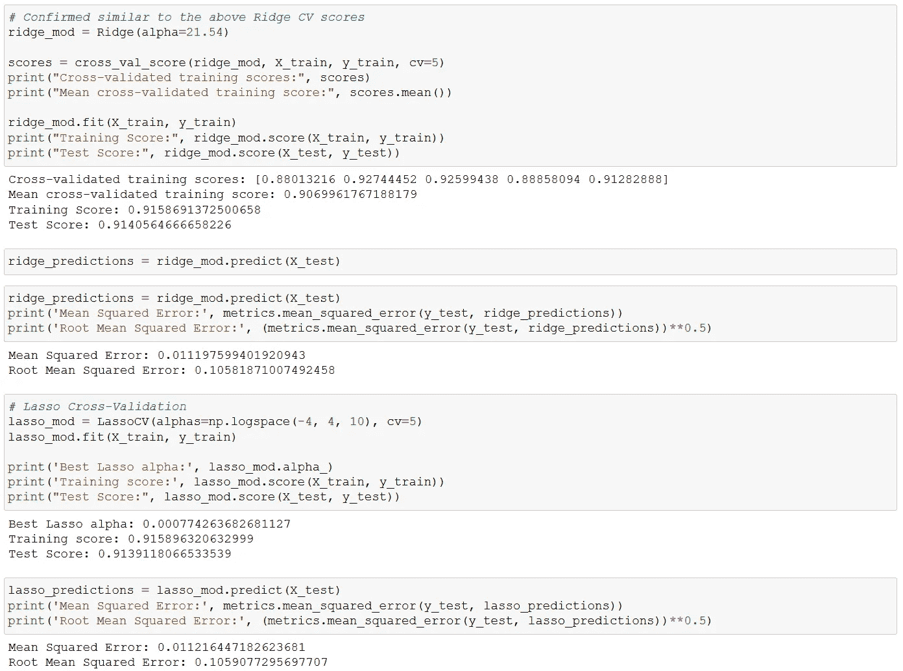****

******Ridge/Lasso regression scores, MSE and RMSE******

****因此，所有三个线性模型产生了相当一致的分数。这些系数在各个模型中也相当一致，如下所示。这些结果暗示了非常**稳定的模型参数估计**。模型系数暗示对 Ames 房价影响最大的六个因素依次为**地上居住面积**(正)**整体品质**(正)**房龄**(负)**整体状况**(正)**地下室居住面积**(正)和**区位排名**(正)。这六个变量在 95%的水平上也是**统计显著的**，我将在下面讨论。****

****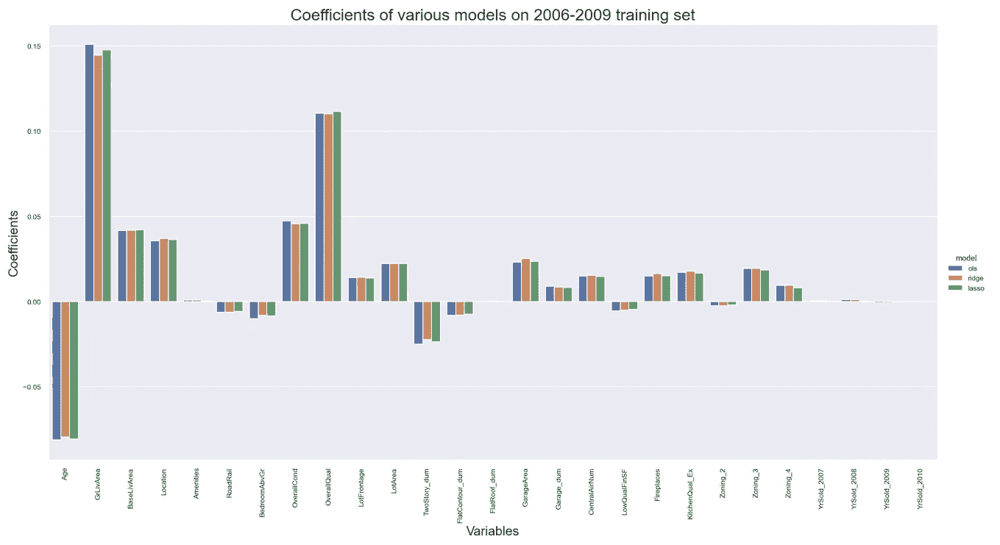****

******Consistent coefficients across the OLS, Ridge and Lasso regressions******

****普通最小二乘回归假设**残差**相互独立，具有正态分布、均值为零和同伦方差。**偏斜度和峰度**表明误差分布近似正态，均值为零。残差图还表明，关于残差分布的各种 OLS 假设可能成立。完整的残差分析可以在我的 GitHub 页面上找到，文章底部有链接。****

****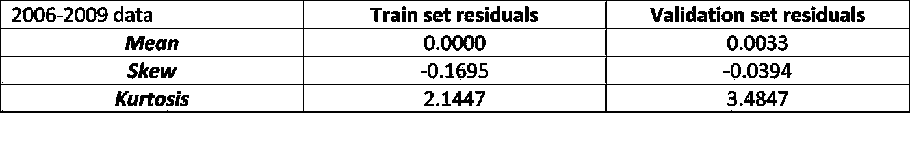********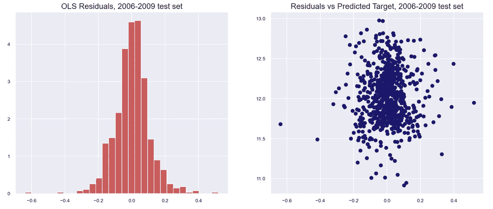****

******Residuals appear approximately normal and do not show a relationship with the target variable******

# ****坚持测试分数****

****在关键时刻，我在 2010 年的数据**上测试了这个模型。从训练(2006 年至 2009 年的全部)数据来看，2010 年抵制测试集的 R 平方略有下降(0.9014 对 0.9160)，但在 OLS、里奇和拉索模型中，得分再次相当一致**。在维持测试集上，OLS 回归的 MSE 和 RMSE 分数分别为 0.012 和 0.110，再次显示出比上面的训练验证结果略有下降。********

**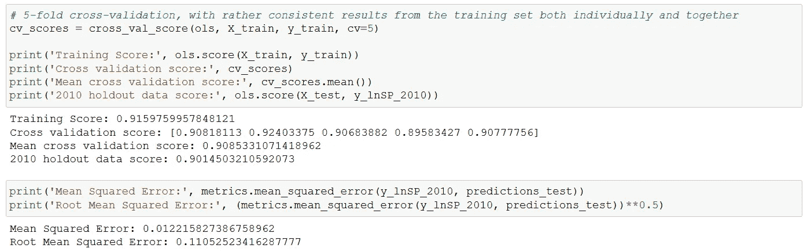**

****OLS scores on the 2010 holdout set****

**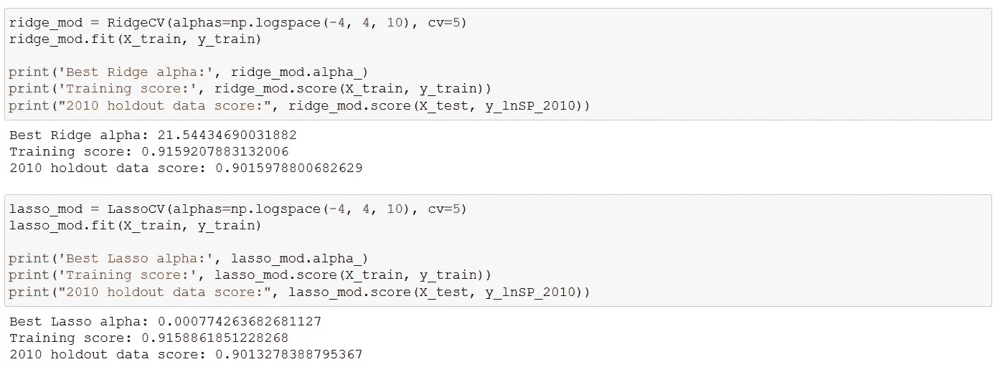**

****Ridge/Lasso scores on the 2010 holdout set****

**残差也近似正态分布，均值为零。测试残差的**分位数-分位数图** (qq-plot)特别显示了对正态分布的合理拟合。**

**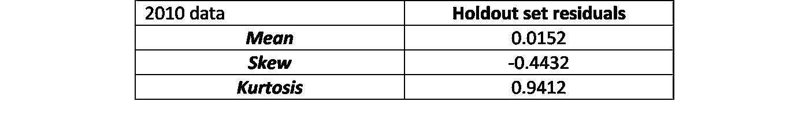****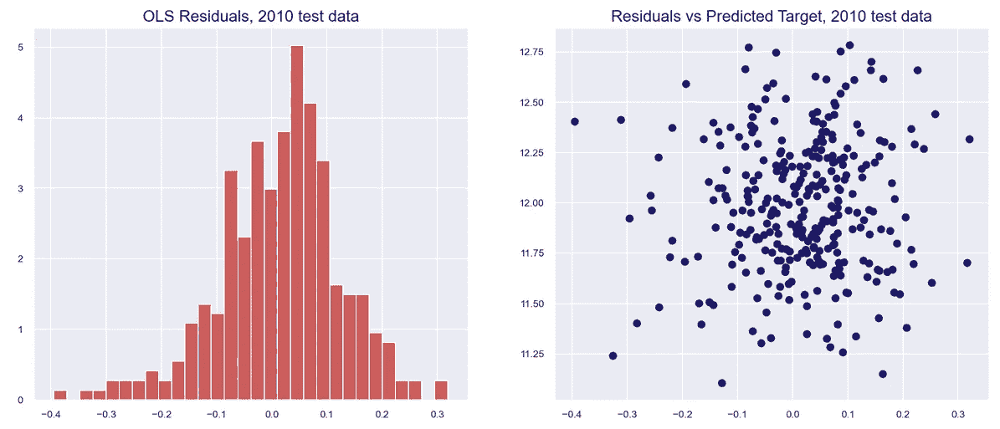**

****Residuals appear approximately normal and do not show a relationship with the target variable****

**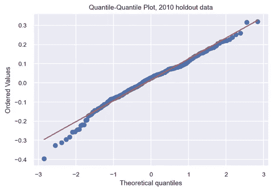**

# **统计推断**

**我利用**2006-2010 年的全部数据集**进行统计推断。这是为预测目的运行回归模型和为因果推断运行回归模型之间的主要区别之一。当我们为预测训练一个模型时，我们**分割数据**并分离一个测试集来评估模型预测的准确性(如上所述)。另一方面，在统计推断中，**完整数据集通常用于**得出参数估计值，并根据各种测试统计值进行评估。**

**该模型的 qq 图包含了 2006 年至 2010 年的全部数据，告诫人们不要过于乐观地使用该模型来预测房价。qq 图表明，该模型倾向于**低估最高分位数的房价，高估最低分位数的房价**。因此，虽然最终模型可以解释超过 91% (R 平方)的房价变化，但在处理价格范围的极端情况时，它并不可靠。该模型在针对价格在 **25%-75%四分位区间**的房产时最为有效。**

**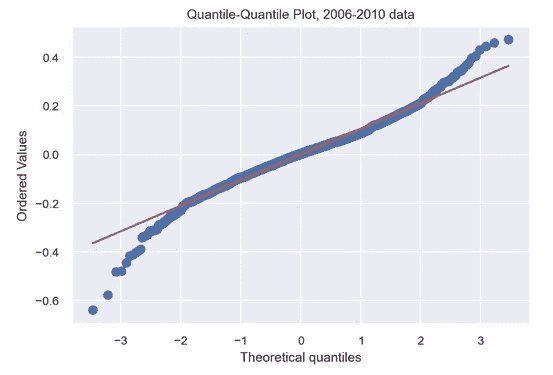**

****q-q plot of the residuals for the full 2006–2010 data indicates some sizeable skews****

**至于准确计算各种解释变量如何影响房价，我首先需要计算个体系数**标准误差**和 **p 值**，以确定某个特定变量是否具有统计显著性。我还需要回到最初的**非标准化解释变量**。下面是来自 *Statsmodels* 模块的**2006–2010 年全部数据**的 OLS 回归结果汇总表。**

**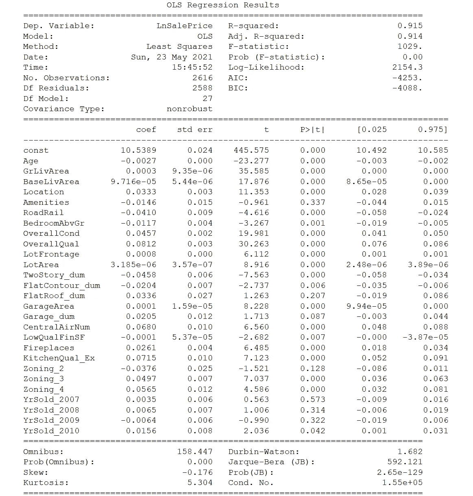**

****OLS regression on full 2006–2010 unscaled data****

**可以看出，OLS 模型中的绝大多数解释变量在 95%的水平上**具有统计显著性**(即 *p 值* < 5%)，如单个 t 统计和相关 p 值所示。例外情况是“RoadRail”和“LowQualFinSF”变量。如上所述，对房屋销售价格影响最大的六个变量都具有统计学意义。**

**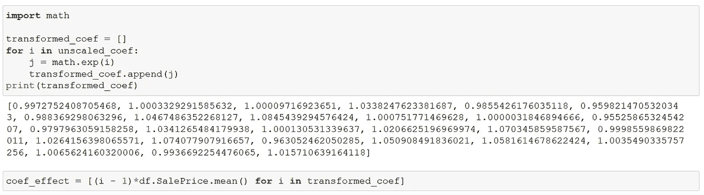**

****Transforming the log-linear coefficients back to their original units****

**提醒一下，模型是*对数线性*，其中目标变量是“销售价格”的自然对数。为了计算每个变量的单位变化对“销售价格”的影响，我们首先需要每个系数的**指数。此外，对数线性模型的系数意味着目标变量的**百分比变化**对于解释变量的小单位变化。要获得具体的美元影响，最好使用**平均值“销售价格”作为参考比较**。****

**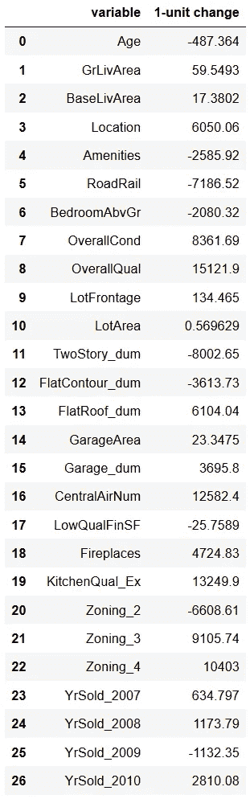**

****Dollar impact of variables on “SalePrice”****

**左边的表格列出了每个解释变量的一个单位变化对埃姆斯平均房价的**美元影响。为了简明扼要，我将只讨论那些在统计上有意义的变量。****

**例如，住房单元的**【年龄】**增加一年，平均房价将减少 487 美元，*，其他条件不变*。相比之下，**“位置”**(记住这是一个四类有序变量)增加一个类别将使平均房价增加 6050 美元(第四个变量)，*所有其他因素不变*。**

**此外，一个**壁炉**将使平均房价增加 4725 美元，而一个被评为“优秀”的**厨房将使价格增加 13250 美元(第 19 和第 20 个变量)。****

**所以确实“ ***厨房卖房子*** ”！**

# **结论**

**基于从关于房价的**享乐定价文献**中获得的见解，我放大了各种房产规模指标，认为它们可能是回归模型的重要特征。我还对高度扭曲的房价目标变量进行了**对数转换**。**

**随后，对各种结构和内部因素进行了广泛的功能工程设计，这些因素预计将成为房价的重要决定因素，主要是位置合意性变量、分区模型、建筑质量和条件、便利设施的接近度以及高评级厨房等。工程数据然后通过**三个线性回归模型** : OLS、里奇和拉索。**

****在三个线性模型中发现了稳定的结果和分数**。OLS 回归系数几乎与从岭回归和套索回归得到的系数相匹配。建模在训练验证集上实现了大约 91-92% 的 **R 平方，这在 OLS、岭和拉索回归中是一致的**。随后，它设法在 2010 年的维持测试集**中获得了 90%的分数，MSE 和 RMSE 的分数分别为 0.012 和 0.110。不同算法的结果也是一致的。****

**各种**房产大小变量**，即内部居住面积、地下室完工面积、地段面积和车库面积，都被发现与销售价格**正相关**和**统计显著**。建筑质量和条件也被发现是房价最重要的决定因素之一，同样重要的还有位置吸引力。**

**实现这些结果不需要任何深奥的黑盒算法。仅仅是简单的**线性回归**，即**透明且可解释的**，并且其中的单个解释变量可能要接受**假设检验**。因此，预测和统计推断的目标可以一起追求。更重要的是，在模型 ***和*** 个体变量水平上，线性回归结果可以很容易地传达给外行观众。**

**(本练习的完整 Python 代码和数据可以在我的 *GitHub* [资源库](https://github.com/at-tan/Cracking_Ames_Housing_OLS)中找到。如果直接渲染 GitHub 笔记本文件有问题，请使用 [nbviewer](https://nbviewer.org/) 。)**

**如果你看到了阅读这些文章的价值，你可以在这里订阅 Medium**来阅读我和无数其他作家的其他文章。谢谢你。****

*** [## 时间序列中的时间和季节性特征

### 以数据为中心，并在模型校准过程中包括季节性选项

towardsdatascience.com](/time-seasonality-features-in-time-series-7e8236f7b04a)  [## 揭开股票价格背后的潜在因素

### 美国大盘股的动态因素模型

medium.datadriveninvestor.com](https://medium.datadriveninvestor.com/uncovering-the-hidden-factors-driving-stock-prices-2891a1b99024)  [## 用预测概率处理不平衡数据

### 葡萄牙银行营销数据集的案例研究

towardsdatascience.com](/tackling-imbalanced-data-with-predicted-probabilities-3293602f0f2)  [## 外汇市场的等级聚类

### 使用无监督的机器学习来识别行为货币群

towardsdatascience.com](/a-hierarchical-clustering-of-currencies-80b8ba6c9ff3)***