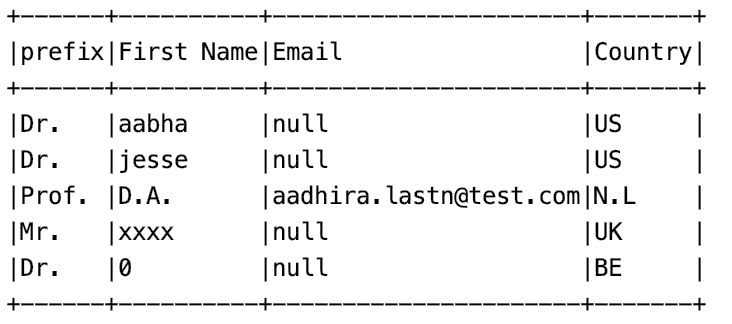
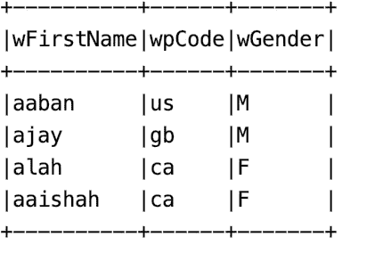
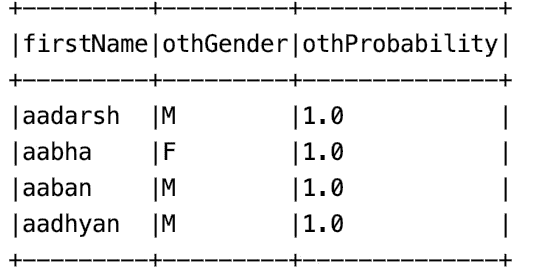
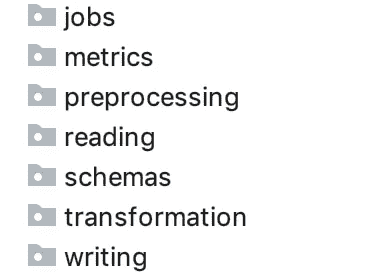

# 编写干净、可靠的 Scala Spark 作业

> 原文：<https://towardsdatascience.com/write-clean-and-solid-scala-spark-jobs-28ac4395424a?source=collection_archive---------6----------------------->

## 编写可扩展和可维护的 Spark 作业的指南，这些作业提高了数据团队的生产力，并保证了更好的产品。


Photo by [Andrew Ridley](https://unsplash.com/@aridley88?utm_source=medium&utm_medium=referral) on [Unsplash](https://unsplash.com?utm_source=medium&utm_medium=referral)

由于新工具和数据平台的发展，现在通过编写 spark 作业来创建数据管道变得更加容易，这些工具和平台允许多个数据方(分析师、工程师、科学家等)。)来着重理解数据，写逻辑来获得洞见。然而，像笔记本这样允许简单脚本编写的新工具，有时没有得到很好的使用，并可能导致新的问题:大量的数据管道被编写为简单的 SQL 查询或脚本，忽略了重要的开发概念，如编写干净和可测试的代码。因此，确保代码可维护和可扩展的设计原则可能会被打破，在我们的产品应该是动态的环境中导致进一步的问题。

我们将展示一个包含一组步骤和模式的过程，以一个基本的 spark 管道为例，帮助您创建更好的 spark 管道。

# 第一步:首先定义你的管道结构

在每个管道中，第一步也是最重要的一步(甚至比代码清洁更重要)是定义其结构。因此，应该在数据探索过程之后定义管道结构，该过程提供了从输入产生预期输出所需的阶段。

让我们来看一个基本的例子，并定义一个管道结构。因此，我们有三个数据集:

***userssourceexamples***包含用户的信息。



***gendersourceaexamples***从源“ *exampleA* ”中读取包含某个国家特定名称的性别。



***genderSourceBExampleDS***读取源“ *exampleB* ”并包含另一个按名称排列的性别列表。但是，在这种情况下，它不会根据国家进行区分，而是添加一个计算的概率。



然后，管道的目标是生成一个数据集，其中列性别被添加到***userssourceexamples***中，如下所示:

*   当后缀有明确的性别时，例如，*先生*或*女士*会立即在*性别*栏中添加性别。
*   如果后缀没有性别那么在***【gendersourceaexamples】****和* *上搜索姓名添加一个新列* ***来源 _ a _ 性别*** *。然后，在****genderSourceBExampleDS***上搜索名称，添加 ***source_b_gender* 列。**
*   最后，当 ***source_a_gender*** 不为空时，将此值设置为**gender*，否则只有当概率大于 **0.5** 时，才使用***source _ b _ gender***。*

*此外，一些指标(如男性百分比和女性百分比)会生成到指标存储系统中。*

# *管道结构*

*定义了以下阶段:*

*   ***数据读取:**从数据源读取。在这种情况下，数据存储在 **S3** 中。*
*   ***数据预处理:**正如我们在数据中看到的，没有唯一的 **ID** 来连接或搜索数据，那么使用列*名称*、*国家*和*后缀*中的文本。但是，这些列包含要删除的无效数据(NaN)、多个字母大小写、首字母缩略词和在此阶段预处理的特殊字符。*
*   ***数据丰富:**在数据被清理并准备好使用之后，它在这个阶段中被转换和解析。因此，在一些业务验证之后，会添加新的列。*
*   ***数据度量:**该阶段包含与对转换后的数据进行聚合和计算相关的任务。*
*   ***数据写入:**最后，这个阶段处理将性别化结果写入 S3，将指标写入外部工具。*

*是不是挺简单的？是的，我们知道你在想什么。使用 spark 可能很容易编写这个管道。您打开 spark 上下文，读取数据集，解析数据集，最后连接以获得最终结果，并将它们写入输出数据存储。这看起来像这样。*

*Writing pipeline with SQL queries*

*这个脚本运行得相当好；它使用一些广泛的 spark SQL，并对 3 个不同的源重复相同的逻辑。除此之外，让我们想象以下场景:*

*   *这只是管道的第一个版本，将来还会添加多个新的性别化来源。*
*   *将添加多个新的共享预处理和转换任务。*
*   *一些清洁功能必须单独测试。例如，删除首字母缩写词的函数。此外，应该测试每个中间步骤的输出。*
*   *新的扩展和测试将自动配置 CI/CD。*

*因此，前面的源代码在一些不需要扩展性的情况下变得很有用；否则将变得不可扩展、不可测试和不可维护。因此，建议采取以下步骤。*

# *步骤 2:保证一个合适的项目结构*

> *定义一个适合您管道阶段的项目结构，这将使您的管道成为一个数据产品。*

*a)为之前定义的阶段定义项目结构，如下所示:*

**

*b)定义你的项目依赖，避免循环/未使用的依赖，明确定义*测试*、【T2 提供】和*编译*之间的依赖范围。*

*c)开始在每个将要定义小函数和通用函数的包中添加一个通用助手。现在，在主类的一个伴随对象中定义其余的函数。*

*d)根据您的需求，定义您将使用哪个版本的 spark API:*RDDs*、 *datasets* 或 *dataframes* 。*

*e)当您有多个使用相同逻辑的作业时，考虑创建一个通用的 ***spark-utils*** 库，供您公司的所有作业共享。*

# *步骤 3:确保干净代码规则的符合性*

> *创造符合预期的工作岗位是不够的。目前，公司努力减少技术债务，并创建易于所有数据方阅读和维护的自我记录管道。*

*这里要讨论的有迷思:“我作为数据科学家写代码”或者“数据工程师太严格了，读不了代码”。我们应该开始为人类编写代码，并确保最低限度的整洁，以保证我们的数据团队的生产力。因此，下面列出了需要考虑的重要规则。*

***A)使用有意义的名称***

*在管道中使用有意义的名称至关重要。让我们关注 Spark 变量、函数和列。*

***基于 Spark 的变量:**始终使用不可变的变量，并停止用“df1”这样的名称来调用数据框。相反，使用代表 API 版本的有意义的名称和后缀。示例:*

```
*val **usersExampleDS** = ...
val **usersExampleDF** = ...
val **usersExampleRDD** = ...*
```

*不要使用 **var，**而是使用 ***transform*** 方法，我们将在后面展示。*

***函数:**连同有意义的名字，为你的函数创建一个带有动词前缀的白名单，比如 *clean，with，filter，transform/enrich，explode* ，它们是你的管道中唯一可能使用的单词。示例:*

```
*def **cleanAcronymsFromText**
def **enrichNameWithPrefix***
```

***栏目:**栏目名称要清晰统一。如果您使用 dataset API，那么最好使用 camelcase 列名来匹配 case 类，如果您喜欢使用数据库表示法，则使用下划线。作为一个例子，下面的名字清楚地表明性别概率大于 50。*

```
*gender_probability_**gt**_50*
```

*如果您希望使用 case 类来定义数据集架构，请在设置架构之前，在伴生对象上定义一个列映射器并修改列名。示例:*

```
***case** class **UserExample**(name: String,
                       email: String,
                       country: String)
object **UserExample** {
  def **columnstranslatorMap**: Map[String, String] = *Map*(
    **"First Name"** -> "name",
    **"Email"** -> "email",
    **"Country Code"** -> "country")
}*
```

*那么你可以这样读:*

```
*val **usersSourceExampleDS** = spark.read
  .option("header", "true")
  .csv(PATH)
  .select(**UserExample.columnstranslatorMap**.keys.toList.map(c => *col*(c).as(**UserExample.columnstranslatorMap**.getOrElse(c, c))): _*)
  .as[**UserExample**]*
```

*在某些情况下，列名在多个阶段和功能中使用。因此，用列名定义一个*特征*，并在主 spark 作业类中使用它。*

```
*trait **GeneralColumnConstants** {
   val **N*ameSourceColumn***= **"firstName"** }
object **NamesGenderizerJob** with **GeneralColumnConstants** {}*
```

*最后，只有在少数情况下，列应该是可变的，而不是使用带有 Column 函数的*向 dataframes 添加一个新列来跟踪原始数据。**

***B)避免副作用:**永远首选无副作用的手术。例如，最好使用一行三元运算符 always if/else。*

```
***if** (true) statement1 **else** statement2*
```

***C)明智地在 null 或 Option 之间做出决定:**我们被告知在 scala 中编写干净的代码 *match-pattern* 和 *Optional* 是强制性的。然而，在 spark *中，可选的*可能会成为瓶颈，因为这种评估会增加额外的成本。因此，这里的建议是在开始时使用可选的*，并且仅在性能可能受到影响的情况下将值更改为空*。***

*****D) *避免过度使用 scala implicit:*** 更喜欢始终使用 transform 函数来使用隐式转换数据帧，从而导致猴子修补。***

**尽可能避免 UDF:UDF 大部分时间都是黑盒，只有当你正在做的事情无法用 spark 优化的自定义 Spark 函数时才使用它们。然而，当你写 UDF 时，请确保你处理了所有的空情况。**

**避免过度使用累加器:累加器不是用来存储数据的，只有在需要少量计数时才使用，例如计算流水线中的错误数。**

# **步骤 4:保证可扩展和可维护的管道**

**到目前为止，我们可以使用适当的结构并遵循一些干净的代码原则来编写 spark 作业。这很棒，但这并不意味着我们的代码已经是可扩展和可测试的了。为了达到这种可扩展性，坚实的原则可以发挥关键作用。让我们通过例子来了解这些原则。**

# **单一责任原则**

> **一个类应该有且只有一个改变的理由。**

**所有的管道模块、类或函数都应该负责功能的一个部分，在简单的代码单元中分离责任。我们可以看到 ***Step1*** 中定义的阶段，每个阶段都是一个责任单元。此外，这些步骤中的所有内部函数也应该负责一件事，在更大的功能中是可测试的和可链接的。让我们关注一下示例数据集的通用数据清理器。**

**Simple Names Normalizer.**

**上面，我们有两个函数负责一件事 *removeUselessChars* 和*remove abstracts。*然后*，*一个名为*的链接函数清理*使文本正常化。因此，*namenormalizer*只负责规范化姓名文本。让我们为这些函数中的每一个单独编写测试。**

**Names Normalizer Test.**

****打开/关闭原理****

> ***你应该能够扩展一个类的行为，而不用修改它。这个原则是构建可维护和可重用代码的基础。
> 罗伯特·马丁***

**让我们看看如何为我们的示例编写一个更干净的模块。**

**Cleaner Service Code.**

**在这里，遵守这一原则的要点是:**

*   **抽象 *CleanerService* 定义了通用的清理函数模板。这个抽象对于修改是封闭的，但是对于扩展是开放的。**
*   **清洁器的多种实现，例如:*source cleaner*， *SourceBCleaner* ， *SourceUsersCleaner* 扩展抽象行为并添加具体实现。**
*   **然后，在我们必须使用清理器的地方，依赖注入是首选，我们将注入一个 *CleanerService* 实例，而不是一个低级类的实例。**
*   ***cleanerServiceHelper* 使用转换函数链接多个函数。**
*   **最后，再次参见*规格化文本*函数，它将循环关注点从规格化文本的函数中分离出来，简单地调用先前定义的*文本规格化器*。此外，使用 *foldLeft* 使功能易于重用，并保持一个干燥的代码库。**

**让我们看看它的可测试性:**

**Cleaner Service Test Example.**

# **利斯科夫替代原理**

> **派生类必须可以替换它们的基类。**

**为了用我们的例子更容易地解释这个原理，一些清理功能由所有的实现共享。在这种情况下，我们可以在通用结构中定义实现。例如，我们可以在 *cleanerServiceHelper* 中为*重复数据删除*定义一个通用行为，并且只在与其他实现不同时使用具体实现。**

# **界面分离原理**

> **不应该强迫客户实现他们不使用的接口。**
> 
> **罗伯特·马丁**

**不要在你有所有管道函数的地方写大的单体特征或助手。你还记得我们定义阶段的第一步吗？。这些在这里是有用的，我们应该只能够清理，或者例如清理和浓缩而不调用其余的阶段。因此，建议通过阶段创建一个非耦合的抽象。让我们看一个丰富函数的例子。**

**Enrich Service Example.**

**在这之后，一个作业的主类应该是这样的。**

**Main Job Example.**

# **从属倒置原则**

> **依赖抽象，而不是具体。**

**在前面的例子中，我们看到了如何注入 *CleanerService* 抽象。这是 Spark 中这个原理的一个很好的例子。然而，我们可以更进一步，看看如何使用我们的数据框架应用依赖注入。假设我们想要创建一个函数，将 *usersSourceExampleDS* 与性别化的源代码连接起来，并单独测试。让我们为此写一个函数。**

**Dataframe Injection Example.**

**然后看看我们测试起来有多简单。**

**Testing Dataframe Injection.**

# **结论**

*   **当生产 spark 作业并使它们可维护、可测试和可扩展时，这是一个需求；数据团队应该开始关注创建遵循干净代码原则并使测试任务更容易的管道。**
*   **一些产品开发概念适用于管道创建的开始，然后分析阶段和划分关注点是一个关键的活动。**
*   **干净的代码和坚实的原则适合 spark，通过使用它们我们可以保证团队生产力和代码质量保证。**