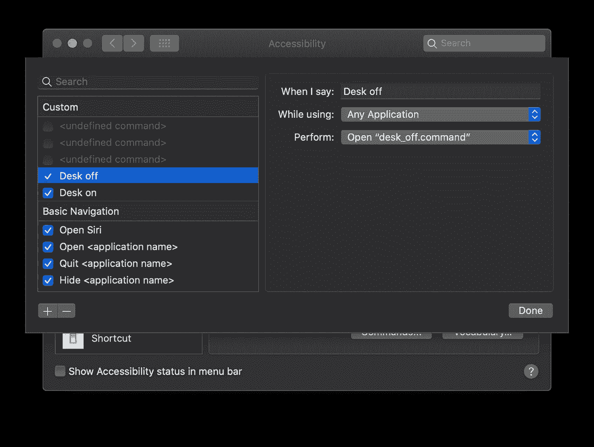

# 编写自定义脚本来语音控制您的 wifi 智能插件

> 原文：<https://towardsdatascience.com/writing-a-custom-script-to-voice-control-your-wifi-smartplug-cd512282ebd5?source=collection_archive---------38----------------------->

今天我们将使用一个 [TP-LINK HS100](https://www.tp-link.com/uk/home-networking/smart-plug/hs100/) 智能插头，直接从我们自己的电脑上控制它。(我个人用我的电脑关掉我电脑桌前所有的灯、扬声器和显示器。)

TP LINK 已经为 iOS 和 Android 提供了一个移动应用程序[“Kasa Smart](https://apps.apple.com/us/app/kasa-smart/id1034035493)”,但当我试图直接从我的电脑上进行操作时遇到了麻烦，因此我决定开发自己的程序。

先决条件(我用的是 Macbook):

*   一个 API 调试器(我用的是[失眠](https://insomnia.rest/)
*   TP-LINK HS100
*   您已经在智能手机上的 Kasa smart 应用程序中设置了您的设备
*   可以用来编写 shell 脚本的东西(默认的文本编辑打开就可以了)

首先，我们需要从失眠症向设备发送一个 API 请求，以获取设备信息。因为我们想要提交一个请求，所以我们选择“Post”作为方法，选择“[https://wap.tplinkcloud.com](https://wap.tplinkcloud.com)”作为我们想要发送请求的 URL。

对于要批准的请求，我们还必须添加我们的自定义参数，即“appType”、“cloudUsername”、“cloudPassword”和“terminalUUID”。apptype 将取决于您的操作系统，我的是“Kasa_iPhone”，cloudUsername & cloudPassword 将是用于登录移动应用程序的凭据，最后，terminalUUID 是一个自定义的 UUID，您可以自己指定(我建议使用这样的在线生成器:[https://www.uuidgenerator.net/](https://www.uuidgenerator.net/)，并记下您的 UUID)。

下面是我最终请求的照片，其中删除了敏感信息:

Our first post request, just fill in your personal information

完成后，我们可以点击右上角的“发送”,如果所有信息都正确，您应该会收到如下内容:

Our response from the POST request

这里我们感兴趣的是“token”参数，它是我们检索设备信息的安全令牌。所以，复制/写下你的令牌，保存起来以备后用。

现在我们有了设备令牌，我们可以发送另一个更完整的 Post 请求来接收关于设备的完整信息。与另一个请求类似，我们将发送一个 post 请求到之前相同的地址，将我们的令牌参数添加到 URL。它应该看起来像这样[https://wap.tplinkcloud.com？token =**XXXXXXXX-X**](https://wap.tplinkcloud.com?token=196aeb02-B4uSpUgDHG5STPdgSP6pYY0)**xxxxxxxxxxxxxxxxxxxxxxxxxxxxx**其中所有这些 X 都是您之前的个人令牌。包括

> {"method":"getDeviceList"}

在消息体中，我们准备发送。它应该类似于下面这样(去掉了我的令牌):

如果您做了所有正确的事情，您应该会收到一个没有错误的响应，应该是这样的:

Response from the request with sensitive information removed.

这里需要注意的是,“status”属性告诉我们智能插头的当前状态,“1”表示智能插头打开,“0”表示智能插头关闭。然而，我们感兴趣的，我需要你记下来的是“设备 Id”。

现在我们已经有了关于设备的所有必要信息，我们准备创建我们的脚本来打开/关闭 smartplug。

打开你最喜欢的文本编辑器(我只是使用 mac 默认的文本编辑器)，插入这段代码:

> curl—request POST "[https://wap.tplinkcloud.com？token =**X**](https://wap.tplinkcloud.com?token=196aeb02-B4uSpUgDHG5STPdgSP6pYY0)**XXXX**" \
> —data ' { " method ":" pass through "，" params ":{ " device id ":**XXXX**，" request data ":{ \ " system \ ":{ \ " set _ relay _ state \ ":{ \ " state \ ":0 } } " } ' \
> —header " Content-Type:application/JSON "

删除粗体 X 并插入您自己的参数。这个脚本将向您的特定设备发送一个请求，要求它将状态设置为您指定的任何状态。

如前所述，这个脚本用于关闭设备；“0”表示设备关闭,“1”表示设备打开，因此在上面的代码中将“状态”从 0 更改为 1，表示您想要打开设备。

将文件保存为“外壳文件”(文件扩展名为。命令，这样“终端”会自动打开并运行该脚本。).因此，将该文件命名为“desk_off.command”并保存它。创建另一个文件，从“desk_off.command”文件中复制代码，并将状态从 0 更改为 1，并将其命名为“desk_on.command”。

您应该有两个文件；一个用于打开智能插头，一个用于关闭智能插头。尝试运行这两个文件，检查是否一切正常，如果不正常，返回到前面的步骤，以确保您没有遗漏任何内容。

现在我们准备好启动这些基于语音命令的脚本。打开“系统偏好设置”,进入“辅助功能”选项卡>“语音控制”>“命令”,然后按左下角的小“+”符号来添加新命令。在这里，您可以选择您应该说什么来触发动作，如果它应该能够在使用特定应用程序时触发，最后，在“执行”选项卡下，选择“打开 finder 项目…”并选择脚本。应该是这样的:

现在试着说出你的命令并测试它是否有效:)