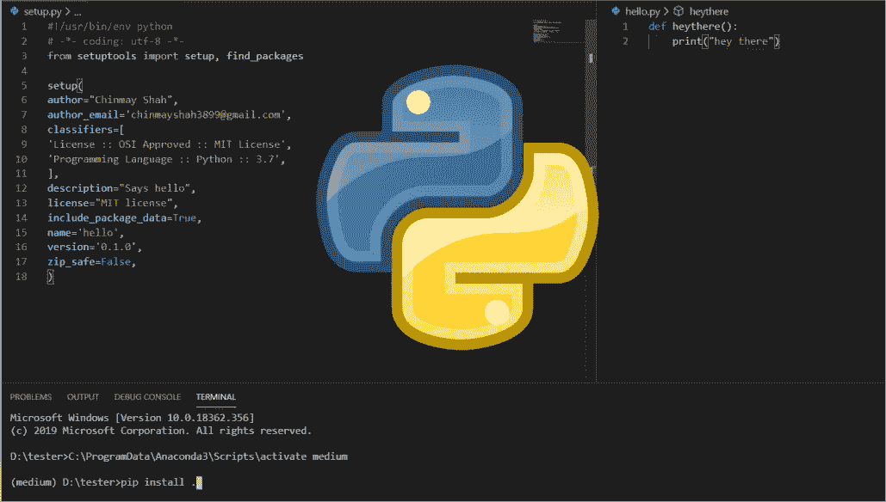
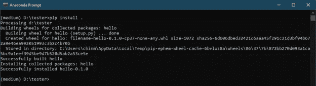
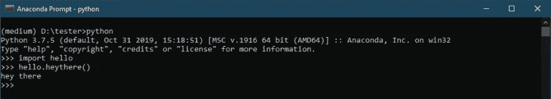

# 编写 Python 包

> 原文：<https://towardsdatascience.com/writing-a-python-package-561146e53351?source=collection_archive---------16----------------------->

## 对 Python 打包和编写您的第一个 Python 包的世界的温和介绍。

几年前当我键入`pip install opencv-python`时，几秒钟过去了，神奇的事情发生了——我能够使用 OpenCV 不需要从源代码构建它，不需要编译器，这绝对是惊人的。我可以安装任何我想要的包，而不用担心编译它的源代码/安装或配置系统变量。



Python Packaging

这些年来，我继续使用 pip，每次都让我着迷。这真的让我想知道一项技术可以有多简单。作为一名 Windows 用户，每次我安装新东西时，我都必须配置系统路径。所以这绝对让我的生活更简单了。

几个月前，我决定编写自己的 python 包。我一直觉得图形很有趣，并决定编写一个完整的图形库，于是我开始编写 [Grapho(这是正在进行的工作)](https://github.com/chinmayshah99/grapho)。

目录中的所有文件总是可以导入同一模块中的文件。但是，如果您想让您的模块在整个系统中都可用，该怎么办呢？

>*你添加一个 setup.py 到你的模块中(当然有相关的配置)。*

但是，如果您希望 python 包对全球每个人都可用，该怎么办呢？

你在 PyPI 上发布你的包。(所以大家可以 `*pip install your-package-name*` *)*

说够了，我们来写点代码吧。我们先写一个简单的函数，然后打包。

*# hello.py*

```
def heythere(): print("hey there")
```

*# setup.py*

```
#!/usr/bin/env python# -*- coding: utf-8 -*-from setuptools import setup, find_packagessetup( author="Chinmay Shah", author_email='chinmayshah3899@gmail.com', classifiers=[ 'License :: OSI Approved :: MIT License', 'Programming Language :: Python :: 3.7', ], description="Says hello", license="MIT license", include_package_data=True, name='hello', version='0.1.0', zip_safe=False,)
```

Setup.py 是 pip 在给定目录中查找的内容。它使用一种叫做 setuptools[1]的东西来实现打包。它包含软件包的名称、软件包的简要描述以及作者信息。不要忘记提到它是为哪个 python 版本制作的。所有这些元数据都很重要。

看起来简单？让我们试试这个东西。让我们安装它— `pip install .`



Installing your Package

但是我说它安装它是什么意思呢？

1.  首先，它创建了一个轮子。whl)文件；这是用于包分发的可接受文件。
2.  在安装过程中，它使用这个 wheel 文件，安装在`site-package` 目录下(Anaconda 使用这个)。
3.  如果从互联网下载，通常会在`pkgs`文件夹中创建一个本地缓存。



Running the installed module

## 但是什么是`pip`？

pip 是 Python 的一个包安装程序，用来安装(主要)来自 PyPI(Python 包索引)的包。作为`easyinstall`的升级版于 2008 年推出，尽管两者都是基于`setuptools`构建的。[1]

PyPI 是一个巨大的包索引，任何人都可以提交他们的包，全球的任何人都可以做`pip install your-package-name`。

请关注下一篇文章，在那里我将介绍如何编写包以及如何在 PyPI 上发布它。

有什么想法吗？在 [Twitter](https://twitter.com/chinmayshah899) 、 [Linkedin](https://www.linkedin.com/in/chinmayshah99/) 或[电子邮件](mailto:chinmayshah3899@gmail.com)上联系。

参考:

[1]设置工具—[https://setuptools.readthedocs.io/en/latest/](https://setuptools.readthedocs.io/en/latest/)