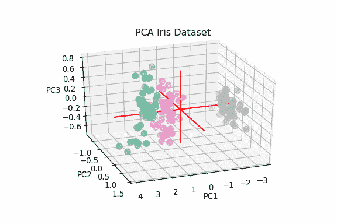

# 为迈向数据科学而写作:不仅仅是一个社区

> 原文：<https://towardsdatascience.com/writing-for-towards-data-science-more-than-a-community-6c9f0452b280?source=collection_archive---------21----------------------->

## 介绍如何开始撰写《走向数据科学》以及我迄今为止的经历。


Photo by [Patrick Fore](https://unsplash.com/@patrickian4?utm_source=medium&utm_medium=referral) on [Unsplash](https://unsplash.com?utm_source=medium&utm_medium=referral)

> “没有真正的结局。它只是你停止故事的地方。”
> 
> ―弗兰克·赫伯特

# 介绍

我现在即将开始为期八个月的《走向数据科学》(Towards Data Science，TDS)作家生涯，今天我决定回顾一下我迄今为止的旅程。

如今，拥有博士学位以便从事数据科学工作，尤其是研究工作，似乎越来越有必要了。因此，今年年初，我也考虑到这个机会，我决定写一份研究提案，并申请一个职位。

一个月后，我得到了这个角色。

此时，我开始思考这是否是我的正确选择，我决定拒绝这份工作。我想一定有其他方法可以继续我在数据科学方面的研究，并与更多的人分享我的成果。

在我申请博士职位之前的几个月里,《走向数据科学》一直是旅行的一个有价值的伙伴，它帮助我总是更深入地研究这个主题。因此，我决定试着给社区出版[一份我关于媒介](/need-for-explainability-in-ai-and-robotics-75dc6077c9fa)的研究提案的修订版。从那以后，多亏了[卢多维克·贝尼斯坦特](https://medium.com/u/895063a310f4?source=post_page-----6c9f0452b280--------------------------------)，我成为了《走向数据科学》的作者。

在过去的几个月里，促使我坚持写作的一些主要原因是:

*   “如果你不能简单地解释它，你就理解得不够好”( [**阿尔伯特·爱因斯坦**](https://www.brainyquote.com/authors/albert-einstein-quotes) **)。**
*   记录我的旅程。
*   建立新的联系。
*   每天挑战自己学习新的东西。
*   回馈社会。

现在，我将向您介绍一些关于写什么样的数据科学文章以及如何最好地编辑它们的建议。

# 作家的瓶颈

当考虑开始写作时，一个主要的顾虑是:

*   我的写作技巧是否足以让我的故事出版？
*   我这篇文章的题目值得发表吗？

为了回答第一个问题，我想引用理查德·巴赫的一句话:

> "专业作家是不放弃的业余作家."
> 
> —理查德·巴赫

因此，只有写作并从编辑和读者那里获得反馈，我们才能提高自己和我们的沟通能力。

每篇提交给《走向数据科学》的文章在出版前都要经过编辑的审核。通过这种方式，出版物可以确保只发布最好的内容，作家可以收到关于如何改进他们的故事的反馈。此外，TDS 还提供一般支持，以防作者寻求任何关于如何提高写作的一般建议。

为了回答第二个问题，我总是在开始写故事之前问自己 3 个问题:

*   我的故事如何能让我的读者受益？(赋予他们权力)
*   如果我在网上研究这个话题，找到好的相关内容会有多难？
*   我的故事能让不太懂技术的观众也能接触到基于研究的内容吗？

如果我能找到这三个问题的好答案，我就会开始写我的文章。

事实上，我的大部分文章想法都是在做一个项目的时候产生的，当时我很难在网上找到好的和最新的资料。

> “如果有一本书你想读，但它还没有被写出来，那么你必须写出来。”
> 
> ―托尼·莫里森

最后，如果你的内容是原创的，并为他们的读者带来价值，你总会找到有兴趣阅读它的读者。

> "如果这本书是真的，它会找到一个注定要阅读它的读者。"
> 
> 沃利·兰姆

# 一般准则

我现在给你一些建议，告诉你如何写一篇准备发表的好文章。

## 语法上

Grammarly 是一个 AI power 写作助手，通过安装它们的 [web 扩展](https://www.grammarly.com/)，可以在撰写中型文章时轻松使用。使用语法将使你的文章几乎不可能有拼写或习惯性错误。

## GitHub Gists

《走向数据科学》文章的很大一部分都包含代码。通过在 Windows 或 Mac 上同时按下 Control + Alt + 6，代码片段可以很容易地集成到 Medium Markdown 界面中。

```
This type of code snippet is commonly used to diplay code outputs
```

另一个选择是使用 [GitHub Gists](https://help.github.com/en/github/writing-on-github/creating-gists) 。git 非常容易创建，并且具有突出语法和更大格式灵活性的优势。如果你从未使用过 GitHub Gists，GitHub 文档是从[开始](https://help.github.com/en/github/writing-on-github/creating-gists)的好地方。为了在中型文章中嵌入要点，只要确保选择可共享链接选项而不是嵌入即可。

## 免费开放数据源

解释数据科学主题的一个很好的方法是提供易于重复的演练示例。为了做到这一点，使用开源数据集可能是一个好主意。通过这种方式，读者将能够自己尝试代码是如何工作的，以及改变它会如何影响整体结果。

寻找开源数据集和共享输出代码的最佳地方之一是 [Kaggle](https://www.kaggle.com/) 。其他可以下载免费数据集的网站还有 [UCI 机器学习库](https://archive.ics.uci.edu/ml/index.php)和 [data.world](https://data.world/) 。

## 交互式数据可视化

添加交互式图表和 GIF 动画是为你的文章增加价值的另一种方式，因为读者可以自己改变动画的一些参数。

下面的 GIF 就是一个有趣的数据可视化的例子。事实上，从图 1 中我们可以看到 PCA(主成分分析)图中 3 个主成分的方差是如何分布的。使用静态图，不可能在所有三个不同的轴上看到如此详细的结果。



Figure 1: PCA variance plot

下面显示了一个交互式数据可视化的例子。在图 2 中，我们可以检查(使用滑块)在考虑所选的 *min_split* 和 *min_leaf 参数*的情况下，改变随机森林分类器中估计器的数量会如何影响我们模型的整体精度。

通过更改 *n_estimators* 参数，放大和缩小图表，更改其方向，并将鼠标悬停在单个数据点上以获得关于它们的更多信息，您可以随意摆弄下面的图表！

Figure 2: Interactive Data Visualization

如果你想知道我是如何制作这两个动画的，更多信息可以在我的[交互式数据可视化](/interactive-data-visualization-167ae26016e8)和[超参数优化](/hyperparameters-optimization-526348bb8e2d)文章中找到。

## 策展人指南

每次一篇文章在 Medium platform 上发表，都会被策展人审核，以决定是否应该在 Medium 上和文章标签的任何主题中做广告。因此，满足策展人的指导方针是写一篇成功文章的非常重要的一步。

如果你有兴趣了解更多关于媒体的指导方针，这些可以在[这里](https://help.medium.com/hc/en-us/articles/360006362473-Medium-s-Curation-Guidelines-everything-writers-need-to-know)找到。此外，也朝着数据科学写了自己的[提交您的文章-清单](/post-for-writers-2-ebd32d1fac21)。

## TDS 提交

为了向《走向数据科学》提交你的第一篇文章，你所要做的就是在 Medium 上写一篇草稿，并阅读此处提供的指南。然后刊物会审核你的文章，再回来找你。

此外，走向数据科学最近还推出了一个 YouTube 频道，你可以在上面为创建自己的视频教程做出贡献(就像我为我的 [GPU 加速数据分析&机器学习](/gpu-accelerated-data-analytics-machine-learning-963aebe956ce)文章所做的那样)。更多信息请点击[这里。](/submit-your-video-to-towards-data-science-f8432d67a777)

***感谢阅读！***

# 联系人

如果你想了解我最新的文章和项目[，请在媒体](https://medium.com/@pierpaoloippolito28?source=post_page---------------------------)上关注我，并订阅我的[邮件列表](http://eepurl.com/gwO-Dr?source=post_page---------------------------)。以下是我的一些联系人详细信息:

*   [领英](https://uk.linkedin.com/in/pier-paolo-ippolito-202917146?source=post_page---------------------------)
*   [个人博客](https://pierpaolo28.github.io/blog/?source=post_page---------------------------)
*   [个人网站](https://pierpaolo28.github.io/?source=post_page---------------------------)
*   [中型简介](https://towardsdatascience.com/@pierpaoloippolito28?source=post_page---------------------------)
*   [GitHub](https://github.com/pierpaolo28?source=post_page---------------------------)
*   [卡格尔](https://www.kaggle.com/pierpaolo28?source=post_page---------------------------)