# 使用 Python 将 Google Sheets 数据写入 MySQL

> 原文：<https://towardsdatascience.com/writing-google-sheets-data-to-mysql-using-python-9cabe2ed88cd?source=collection_archive---------11----------------------->

在数据作业中，我们经常使用不同的方法来编写和分析数据。Google sheets 是一个协作输入和共享数据的好方法。对于较大的数据集，Google sheets 处理起来非常慢，一种解决方法是在行数太多时创建一个新的工作表。我的团队正在进行的一个项目每周创建 3000 行，这对于大多数标准来说并不是太多的数据，但是几周后就陷入了困境。团队成员开始归档工作表，这使得对数据进行汇总变得非常困难。我认为将我们所有的数据写入 MySQL 表是一个更好的主意，这也允许其他团队将我们的数据加入到他们正在处理的其他表中。我将带您了解使用 Python 完成这一过程。对于这个项目，我将在 Windows 机器上使用 Jupyter Notebook、Python 3.7.1 和 MySQL Workbench 8.0。

## 谷歌工作表中的数据

我用 Google sheets 为这个项目创建了一个小数据集。我包含了两个工作表，第一个看起来像:

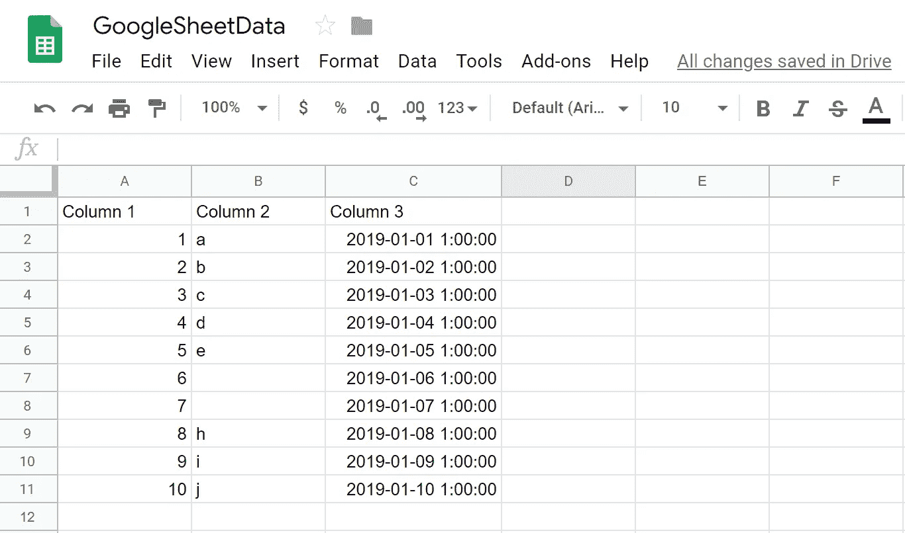

请注意，我故意在第 2 列中留出了两个单元格空白。这将是后面的一个例子。第二个工作表(底部的第二个选项卡)如下所示:

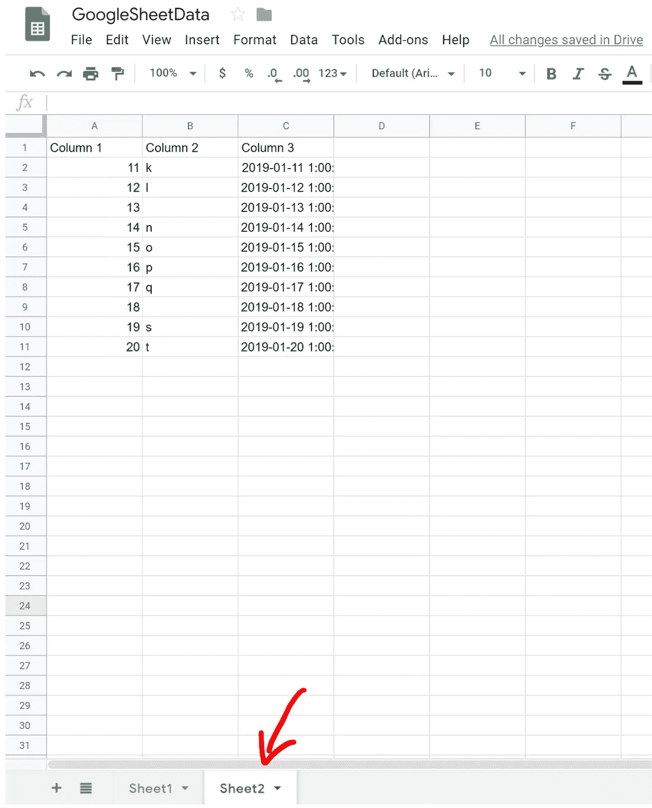

## 将 Google Sheets 连接到 Python

我们需要做的第一件事是使用 链接访问 [**谷歌开发者控制台。点击页面顶部的“创建项目”链接，创建一个新项目:**](https://console.developers.google.com/cloud-resource-manager?pli=1)

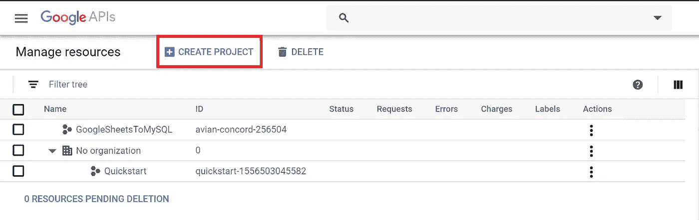

给项目起一个相关的名字，如下所示。

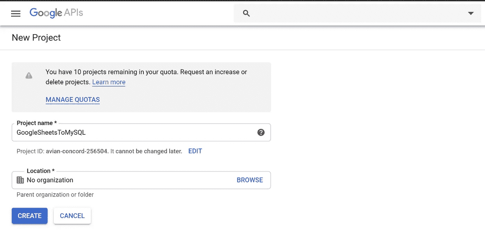

接下来，我们需要为项目创建一个服务帐户。点击页面左上角的导航菜单(3 条水平线，通常称为汉堡)，选择“服务账户”:

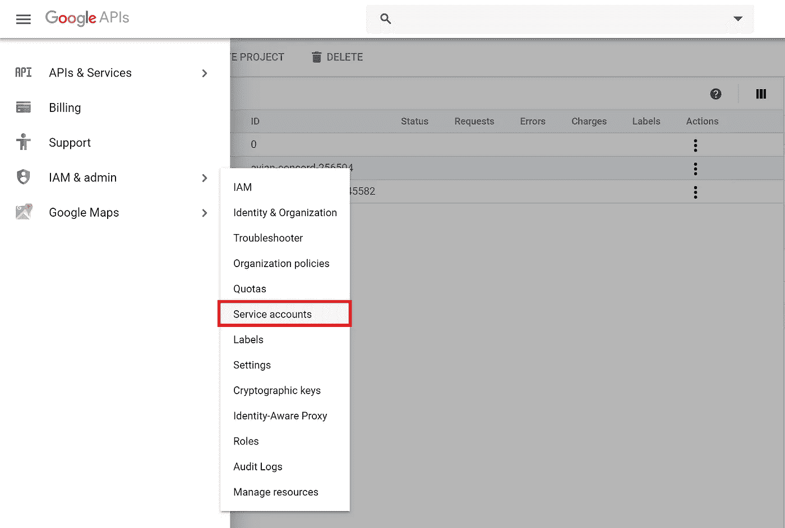

您需要从页面顶部选择您的项目(a)，然后点击“创建服务帐户”(b)。

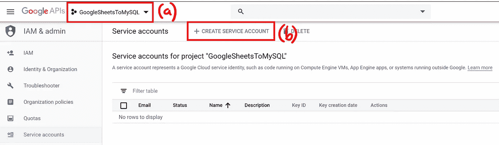

为服务帐户取一个有意义的名称，然后单击“创建”。接下来，我们将服务帐户权限角色设置为所有者，并单击“继续”。在下一页，我们将跳过“授予用户对此服务帐户的访问权限”部分，转到下面的“创建密钥”部分。这将打开一个侧栏，允许我们选择一个键类型。选择“JSON”并点击“创建”。这将把 JSON 文件保存到您的计算机上，我们将使用这个文件从。

使用类似 Notepad++的工具打开 JSON 文件。找到包含“客户电子邮件”的行，并将整个电子邮件地址(在引号之间)复制到剪贴板。接下来，回到您的 Google sheet，它包含了您想要写入 MySQL 表的数据。点击电子表格右上角标有“Share”的绿色按钮。将 JSON 文件中的电子邮件地址粘贴到字段中，然后单击“发送”。这将允许我们的 Python 程序访问这个 Google 工作表。

## 设置 Jupyter 笔记本

现在一切都设置好了，我们可以继续学习 Python 了！对于本教程，我使用的是 Jupyter 笔记本和 Python 3.7.1。如果您的机器上没有安装 Python，您将需要这样做。Jupyter Notebook 自带 Anaconda，这是 Python 的一个很棒的包。您可以通过在搜索栏(在 Windows 中，在任务栏上)中键入“Jupyter Notebook”来启动 Jupyter Notebook，或者您可以启动 Anaconda 提示符，提示符打开后，键入不带引号的“Jupyter Notebook”，但我们稍后将需要 Anaconda 提示符，所以我建议使用所描述的第一种方法。

Jupyter 笔记本将在您的浏览器中启动。您将被引导至您的工作目录。您可以导航到不同的文件夹，但现在我们将通过单击页面右上角的“新建”并选择 Python 3 笔记本来创建一个新笔记本:

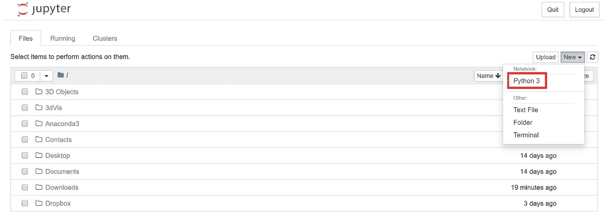

让我们通过点击页面顶部的笔记本名称(无标题)将笔记本重命名为“GoogleSheetsToMySQL”。接下来，我们需要将下载的 JSON 文件移动到我们的工作目录中。我相信默认目录在“C://users//your_username”下。

在我们开始编码之前，我们需要安装一些模块。要安装我们需要的模块，打开 Anaconda 提示符(您可以在任务栏的 Windows 搜索栏中找到它)。在 Anaconda 提示符下，您需要安装以下模块。通过键入以下命令并在每个命令后按 enter 键来使用 pip:

1.  pip 安装 gspread
2.  pip 安装 oauth 2 客户端
3.  pip 安装 mysql 连接器

我已经安装了这些，如命令提示符的输出所示(当试图安装 gspread 时):

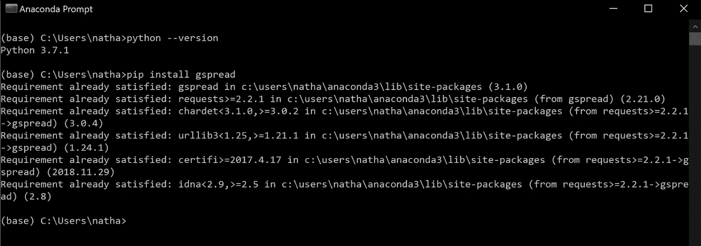

因为我们将访问一个 MySQL 数据库，所以不要在代码中暴露我们的登录凭证是很重要的。我们将创建一个 Python 文件(。py)并将这些凭证存储在那里。然后，我们可以轻松地将它们导入我们的 Jupyter 笔记本脚本。创建您的。py 文件是用 Notepad++写的。为此我使用了 PyCharm，但也可以使用您喜欢的 IDE。打开 IDE 并创建一个名为“MySQLCredentials.py”的文件。在这个文件中，我们只需要输入 4 行代码并保存到我们的工作目录中。我们需要:

```
user = (your username)password = (your password)host = (hostname)database = (database schema you will be using)
```

保存文件并将其放入您的工作目录。

## Jupyter 笔记本中的编码

现在，回到你的笔记本上。我们需要通过在第一个单元格中输入以下内容来导入将要使用的模块:

```
# import libraries**import** gspread**import** MySQLCredentials as mc**import** mysql.connector**from** oauth2client.service_account **import** ServiceAccountCredentials
```

运行单元，如果你没有得到任何错误，太好了！接下来，我们需要初始化一些变量来使用 gspread:

```
# initialize variables for gspreadscope **=** [‘[https://spreadsheets.google.com/feeds'](https://spreadsheets.google.com/feeds%27),[‘https://www.googleapis.com/auth/drive'](https://www.googleapis.com/auth/drive%27)]creds **=** ServiceAccountCredentials.from_json_keyfile_name(‘GoogleSheetsToMySQL.json’, scope)client **=** gspread.authorize(creds)
```

如果您将 JSON 文件命名为不同的名称，只需确保上面代码中的名称是正确的。现在我们需要定义一个从 Google 工作表中提取数据的方法:

```
# define method to pull data from spreadsheet**def** GetSpreadsheetData(sheetName, worksheetIndex): sheet **=** client.open(sheetName).get_worksheet(worksheetIndex) **return** sheet.get_all_values()[1:]
```

我们正在定义一个带有两个参数的方法。我们需要告诉它我们引用的工作表名称和工作表索引。工作表索引是指我们所引用的工作表标签。第一个选项卡的索引为 0，第二个选项卡的索引为 1，依此类推。在我们调用这个方法之前，我们不需要这些值，所以我们很快就会回来。该方法的返回类型是一个列表，它将返回该表上的所有值。然后我们使用[1:]分割列表，这将删除列表的第一个元素。因为 Google 工作表有一个包含列名的标题，所以我们只从工作表中提取数据。

在我们继续之前，让我们检查一下这个方法是否可以从工作表中获取数据。

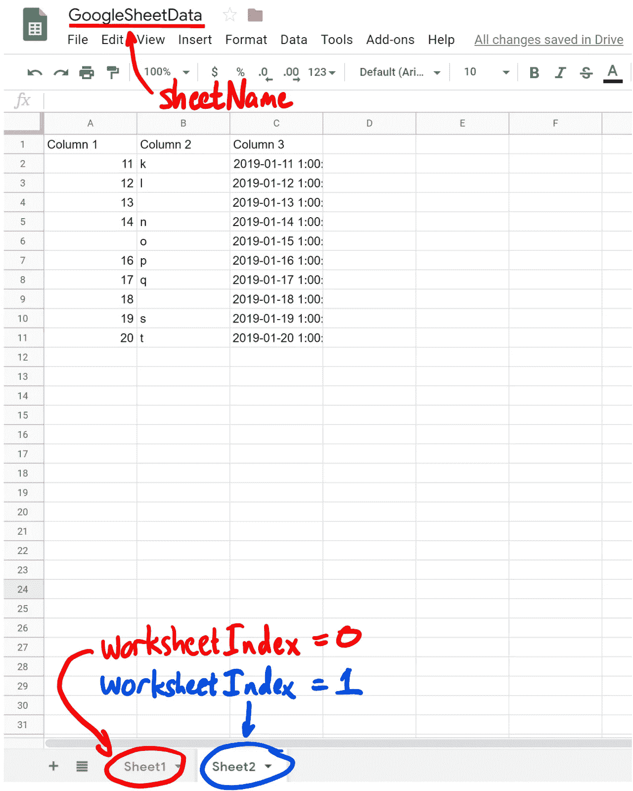

在笔记本的新单元格中，输入

```
data = GetSpreadsheetData(‘GoogleSheetData’, 0)
```

您可能会得到一个错误，提示您需要启用驱动器 API。它将提供一个链接，您可以单击该链接来启用驱动 API。现在，重新运行该单元，并确保不会出现任何错误。我不得不运行它几次来启用两个独立的 API，并且在它没有给我一个错误之前必须等待一分钟。您应该不需要再次这样做。好了，现在检查你有你期望的数据。您可以检查列表的第一行，以及列表的长度(在本例中，有多少行数据):

```
print(data[0])
print(len(data))
```

应该会回来

```
[‘1’, ‘a’, ‘2019–01–01 1:00:00’]
10
```

现在我们需要设置一个方法来将这些数据写入 MySQL。使用 try-except-finally 块在这里会很有用。有几个注释块，前面用#表示，只是为了澄清:

```
# define method to write list of data to MySQL table**def** WriteToMySQLTable(sql_data, tableName):# we are using a try/except block (also called a try/catch block in other languages) which is good for error handling. It will “try” to execute anything in the “try” block, and if there is an error, it will report the error in the “except” block. Regardless of any errors, the “finally” block will always be executed. **try**:# Here we include the connection credentials for MySQL. We create a connection object that we pass the credentials to, and notice that we can specify the database which is ‘sys’ in the MySQLCredentials.py file because I’m using since I’m using the default database in MySQL Workbench 8.0. connection **=** mysql.connector.connect( user **=** mc.user, password **=** mc.password, host **=** mc.host, database **=** mc.database )# This command will drop the table, and we could just have the table name hardcoded into the string, but instead I am using the name of the table passed into the method. {} is a placeholder for what we want to pass into this string, and using .format(blah) we can pass the string name from the variable passed into the method here. sql_drop **=** “ DROP TABLE IF EXISTS {} “.format(tableName)# Now we will create the table, and the triple quotes are used so that when we go to the next line of code, we remain in a string. Otherwise it will terminate the string at the end of the line, and we want ALL of this to be one giant string. When injecting data into VALUES, we use the placeholder %s for each column of data we have. sql_create_table = “””CREATE TABLE {}( 
            Column1 INT(11),
            Column2 VARCHAR(30),
            Column3 DATETIME,
            PRIMARY KEY (Column1)
            )”””.format(tableName)

        sql_insert_statement = “””INSERT INTO {}( 
            Column1,
            Column2,
            Column3 )
            VALUES ( %s,%s,%s )”””.format(tableName)# Here we create a cursor, which we will use to execute the MySQL statements above. After each statement is executed, a message will be printed to the console if the execution was successful. cursor **=** connection.cursor() cursor.execute(sql_drop) print(‘Table {} has been dropped’.format(tableName)) cursor.execute(sql_create_table) print(‘Table {} has been created’.format(tableName))# We need to write each row of data to the table, so we use a for loop that will insert each row of data one at a time **for** i **in** sql_data: cursor.execute(sql_insert_statement, i)# Now we execute the commit statement, and print to the console that the table was updated successfully connection.commit() print(“Table {} successfully updated.”.format(tableName))# Errors are handled in the except block, and we will get the information printed to the console if there is an error **except** mysql.connector.Error as error : connection.rollback() print(“Error: {}. Table {} not updated!”.format(error, tableName))# We need to close the cursor and the connection, and this needs to be done regardless of what happened above. **finally**: cursor.execute(‘SELECT COUNT(*) FROM {}’.format(tableName)) rowCount **=** cursor.fetchone()[0] print(tableName, ‘row count:’, rowCount) **if** connection.is_connected(): cursor.close() connection.close() print(“MySQL connection is closed.”)
```

为了测试这一点，让我们运行下面的命令(您将需要运行 GetSpreadsheetData()方法，否则您将没有“数据”定义。

```
WriteToMySQLTable(data, ‘MyData’)
```

输出应该是:

```
Table MyData has been dropped 
Table MyData has been created 
Table MyData successfully updated. 
MyData row count: 10 
MySQL connection is closed.
```

在 MySQL Workbench 中检查数据看起来很成功，但是有一个问题需要解决。以下是 MySQL Workbench 中的表格:

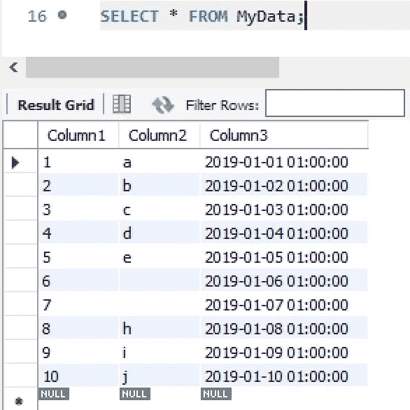

请注意，我们有两个可能的问题。最后一行全部为空，我们很可能不希望这一行包含在内。但更重要的是，Column2 中缺失的值不为 NULL！这是因为 Python 正在读取工作表数据，并看到一个空值，它很可能被解释为空字符串。我们可能不希望这里有空字符串，而是期望空值。因此，让我们编写一个方法来清理空字符串值，并将它们作为空值写入。

```
def PreserveNULLValues(listName):
    print(‘Preserving NULL values…’)
    for x in range(len(listName)):
        for y in range(len(listName[x])):
            if listName[x][y] == ‘’:
                listName[x][y] = None
    print(‘NULL values preserved.’)
```

这样做的目的是检查空字符串值(“”)，并用 Python 关键字“None”替换它们，这将作为空值写入 MySQL。让我们看看这个:

```
data = GetSpreadsheetData(‘GoogleSheetData’, 0)
PreserveNULLValues(data)
WriteToMySQLTable(data, ‘MyData’)
```

让我们在 MySQL Workbench 中查看一下这是什么样子的:

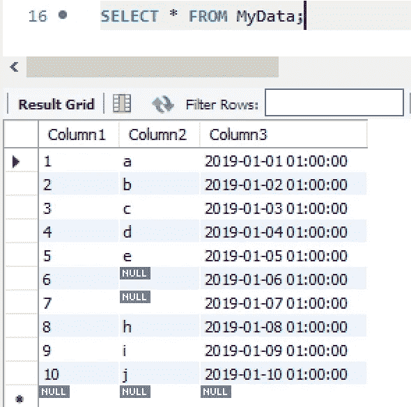

好多了！我通常不会在最后得到一个空行，但是如果需要的话，我们可以删除它。

现在，假设我们想用第二个工作表更新表，工作表索引= 1。这次我们不想掉表，只想插入表中。我们可以定义一个名为 UpdateMySQLTable 的新方法。我们将使用上述相同的方法(WriteToMySQLTable ),只是我们将删除以下代码行:

```
sql_drop = …
sql_create_table = …
```

使用新的工作表索引运行此方法:

```
data = GetSpreadsheetData(‘GoogleSheetData’, 1)
PreserveNULLValues(data)
UpdateMySQLTable(data, ‘MyData’)
```

现在，您将拥有一个包含 20 行的表格，每张表格包含 10 行。MySQL Workbench 中的结果表如下所示:

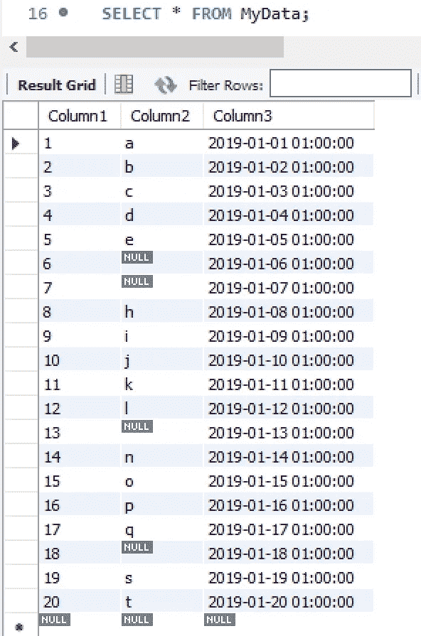

只要确保列名和顺序匹配即可，否则您将不得不重新排列它们。对于我的团队的数据，如果我们的方法发生变化，有时我们会在一个新的列中写入数据，我会返回并将空列插入到旧的选项卡中，然后重新导入所有数据。现在您可以利用 MySQL 中的数据库和 Google sheets 的功能了！下面是我的代码在 Jupyter Notebook 中的样子。编码快乐！

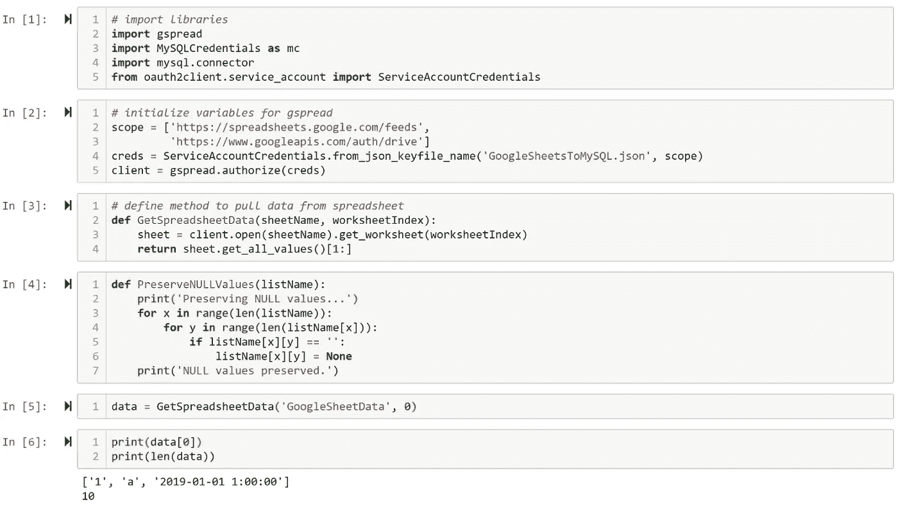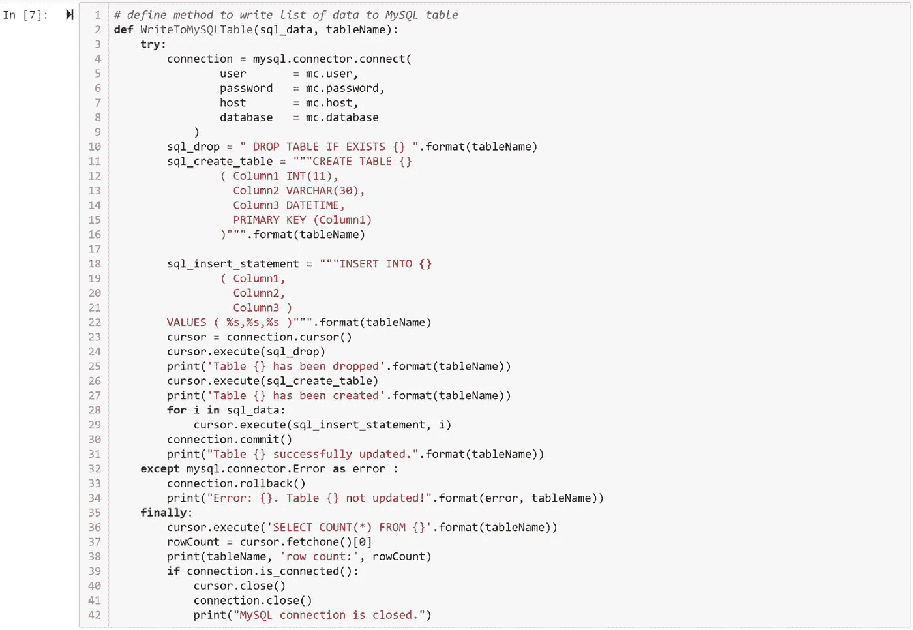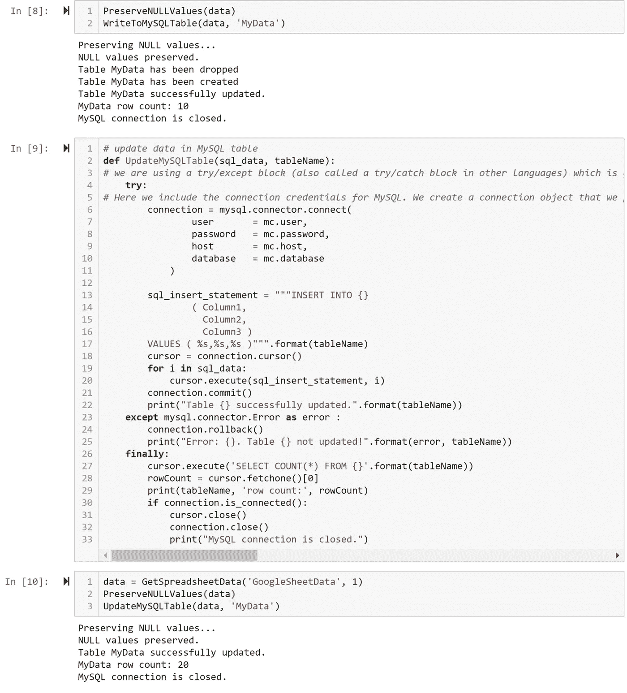