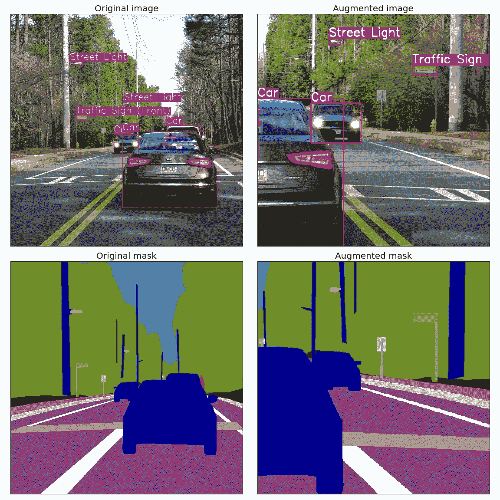

# 用 pytest 为白蛋白库编写测试

> 原文：<https://towardsdatascience.com/writing-test-for-the-image-augmentation-albumentation-library-a73d7bc1caa7?source=collection_archive---------26----------------------->



[https://github.com/albu/albumentations](https://github.com/albu/albumentations)

我的名字是弗拉基米尔·伊格洛维科夫。我是 Lyft 的高级计算机视觉工程师，Level5，将深度学习应用于自动驾驶汽车的问题。

我也是 [Kaggle 特级大师](https://www.kaggle.com/iglovikov)和图像增强库[相册](https://github.com/albu/albumentations)的作者之一。这个库是从 Kaggle Masters 的一系列计算机视觉竞赛的获奖解决方案中脱颖而出的: [Alexander Buslaev](https://www.linkedin.com/in/al-buslaev/) 、 [Alex Parinov](https://www.linkedin.com/in/alex-parinov/) 、 [Eugene Khvedchenya](https://www.linkedin.com/in/cvtalks/) 和我。

大约一年前，我们发布了该库的 alpha 版本。从那以后，它被工业、学术界的机器学习工程师和研究人员采用，当然也被竞争激烈的机器学习社区采用。在过去的八个月中，Kaggle 计算机视觉挑战赛中的所有或几乎所有顶级解决方案都使用了我们的图书馆。

在某个时候，Alex Parinov 写了一篇关于单元测试的[文本](https://albumentations.readthedocs.io/en/latest/writing_tests.html)，以及我们如何使用它们来检查我们实现的 60 多个不同的转换。目前，我们需要通过 4470 个单元测试，才能合并每个拉取请求。问题是如何编写这些测试来增加覆盖率并减少重复代码的数量。

在那篇文章中，Alex 向读者展示了一组例子，解释了如何编写测试。他从一个简单的用例开始，然后是更高级的夹具和参数化。

我认为该文档没有得到数据科学界的足够重视。因此，我把它复制到这个平台上，对原文做了一些修改。

我将假设读者熟悉这个库。如果没有，您可以查看一套 Jupiter 笔记本，其中涵盖了不同计算机视觉任务的应用:

*   [展柜](https://github.com/albu/albumentations/blob/master/notebooks/showcase.ipynb)
*   [分类](https://github.com/albu/albumentations/blob/master/notebooks/showcase.ipynb)
*   [物体检测](https://github.com/albu/albumentations/blob/master/notebooks/example_bboxes.ipynb)
*   [分割](https://github.com/albu/albumentations/blob/master/notebooks/example_kaggle_salt.ipynb)
*   [非 8 位图像](https://github.com/albu/albumentations/blob/master/notebooks/example_16_bit_tiff.ipynb)
*   [分割](https://github.com/albu/albumentations/blob/master/notebooks/example_kaggle_salt.ipynb)
*   [要点](https://github.com/albu/albumentations/blob/master/notebooks/example_keypoints.ipynb)
*   [自定义目标](https://github.com/albu/albumentations/blob/master/notebooks/example_multi_target.ipynb)
*   [天气变化](https://github.com/albu/albumentations/blob/master/notebooks/example_weather_transforms.ipynb)
*   [连载](https://github.com/albu/albumentations/blob/master/notebooks/serialization.ipynb)

# 写作测试

## 第一次测试

我们使用 **pytest** 来运行[白蛋白](https://github.com/albu/albumentations)的测试。包含测试的 python 文件应该放在`albumentations/test`文件夹中。文件名应该以`test_`开头。例如，`test_bbox.py`。测试函数的名称也应该以`test_`开头。例如`def test_random_brightness()`

假设我们要测试`brightness_contrast_adjust`函数。该函数将 NumPy 数组作为输入，将所有值乘以指定的参数`alpha`并返回结果数组。

让我们为这个函数编写第一个测试。测试将检查如果您向函数传递一个所有值都等于`128`且参数`alpha`等于`1.5`的数组，该函数将产生所有值都等于`192`的数组。`(128 * 1.5 = 192)`

在文件夹`albumentations/test`中，我们创建一个新文件`test_sample.py`

在文件的顶部，我们添加了所有必需的导入:

```
**import numpy as np****import albumentations.augmentations.functional as F**
```

测试本身:

```
**def** test_random_contrast():
    img = np.ones((100, 100, 3), dtype=np.uint8) * 128
    img = F.brightness_contrast_adjust(img, alpha=1.5)
    expected_multiplier = 192
    expected = np.ones((100, 100, 3), dtype=np.uint8) * expected_multiplier
    **assert** np.array_equal(img, expected)
```

为了运行来自`test_example.py`的测试，此时它只包含一个测试，我们执行以下命令:

`pytest tests/test_example.py -v .`

`-v`标志告诉 **pytest** 产生更详细的输出。

**pytest** 将显示测试已成功完成:

```
tests/test_example.py::test_random_brightness PASSED
```

# 测试参数化和@ pytest . mark . parameter ize 装饰器

上例中的函数很简单，它没有考虑到 8 位图像不能包含超过 255 =(2⁸-1)的值。

因此，我们希望函数`brightness_contrast_adjust`来处理这个问题，并截取超出[0，255]范围的值。

让我们写一个测试:

```
**def** test_random_contrast_2():
    img = np.ones((100, 100, 3), dtype=np.uint8) * 128
    img = F.brightness_contrast_adjust(img, alpha=3)expected_multiplier = 255
    expected = np.ones((100, 100, 3), dtype=np.uint8) * expected_multiplier
    **assert** np.array_equal(img, expected)
```

接下来，我们将从`test_example.py`开始运行测试:

`pytest tests/test_example.py -v`

输出:

```
tests/test_example.py::test_random_brightness PASSED
tests/test_example.py::test_random_brightness_2 PASSED
```

功能`test_random_brightness`和`test_random_brightness_2`看起来几乎一样。唯一不同的是`alpha`和`expected_multiplier`的值。为了消除代码重复，我们可以使用`@pytest.mark.parametrize`装饰器。有了这个装饰器，我们可以描述哪些值应该作为参数传递给测试， **pytest** 将多次运行测试，每次都从装饰器传递下一个值。

我们可以使用参数化将之前的两个测试重写为一个测试:

```
**import** **pytest****@pytest.mark.parametrize**(['alpha', 'expected_multiplier'], [(1.5, 192), (3, 255)])
**def** test_random_brightness(alpha, expected_multiplier):
    img = np.ones((100, 100, 3), dtype=np.uint8) * 128
    img = F.brightness_contrast_adjust(img, alpha=alpha)
    expected = np.ones((100, 100, 3), dtype=np.uint8) * expected_multiplier
    **assert** np.array_equal(img, expected)
```

该测试将运行两次，在第一次运行中，`alpha`将等于`1.5`，而`expected_multiplier`将等于`192`。在第二次运行中，`alpha`将等于`3`，而`expected_multiplier`将等于`255`。

让我们进行测试:

```
tests/test_example.py::test_random_brightness[1.5-192] PASSED
tests/test_example.py::test_random_brightness[3-255] PASSED
```

正如我们所见， **pytest** 在每次运行时打印测试参数值。

# 使用辅助函数简化对图像和遮罩都有效的函数的测试

假设我们想要测试`vflip`函数。此函数垂直翻转作为输入传递的图像或遮罩。面具的形状是`(height, width)`。

```
**def** test_vflip_mask():
    mask = np.array(
        [[1, 1, 1],
         [0, 1, 1],
         [0, 0, 1]], dtype=np.uint8)
    expected_mask = np.array(
        [[0, 0, 1],
         [0, 1, 1],
         [1, 1, 1]], dtype=np.uint8)
    flipped_mask = F.vflip(mask)
    **assert** np.array_equal(flipped_mask, expected_mask)
```

测试的结果:

```
tests/test_example.py::test_vflip_mask PASSED
```

下一步，我们将测试相同的函数如何处理 RGB 图像，RGB 图像是具有形状`(height, width, 3)`的三维 NumPy 数组。

```
**def** test_vflip_img():
    img = np.array(
        [[[1, 1, 1],
          [1, 1, 1],
          [1, 1, 1]],
         [[0, 0, 0],
          [1, 1, 1],
          [1, 1, 1]],
         [[0, 0, 0],
          [0, 0, 0],
          [1, 1, 1]]], dtype=np.uint8)
    expected_img = np.array(
        [[[0, 0, 0],
          [0, 0, 0],
          [1, 1, 1]],
         [[0, 0, 0],
          [1, 1, 1],
          [1, 1, 1]],
         [[1, 1, 1],
          [1, 1, 1],
          [1, 1, 1]]], dtype=np.uint8)
    flipped_img = F.vflip(img)
    **assert** np.array_equal(flipped_img, expected_img)
```

在这个测试中，`img`的值与分配给`test_vflip_mask`中的`mask`变量的 NumPy 数组相同，但是这次它重复了三次(三个通道各一次)。`expected_img`也是一个重复三次的 NumPy 数组，它被分配给`test_vflip_mask`函数中的`expected_mask`变量。

让我们进行测试:

```
tests/test_example.py::test_vflip_img PASSED
```

在`test_vflip_img`中，我们手动定义了`img`和`expected_img`的值，分别等于重复三次`mask`和`expected_mask`的值。

为了避免不必要的重复代码，我们可以创建一个 helper 函数，它将一个形状为`(height, width)`的 NumPy 数组作为输入，并沿着一个新的轴重复这个值三次，以生成一个形状为`(height, width, 3)`的 NumPy 数组:

```
**def** convert_2d_to_3d(array, num_channels=3):
    **return** np.repeat(array[:, :, np.newaxis], repeats=num_channels, axis=2)
```

接下来，我们可以使用该函数将`test_vflip_img`重写如下:

```
**def** test_vflip_img_2():
    mask = np.array(
        [[1, 1, 1],
         [0, 1, 1],
         [0, 0, 1]], dtype=np.uint8)
    expected_mask = np.array(
        [[0, 0, 1],
         [0, 1, 1],
         [1, 1, 1]], dtype=np.uint8)
    img = convert_2d_to_3d(mask)
    expected_img = convert_2d_to_3d(expected_mask)
    flipped_img = F.vflip(img)
    **assert** np.array_equal(flipped_img, expected_img)
```

让我们进行测试:

```
tests/test_example.py::test_vflip_img_2 PASSED
```

# 通过使用参数化来简化对图像和遮罩都起作用的函数的测试

在上一节中，我们为`vflip`编写了两个单独的测试。第一个检查了`vflip`如何使用蒙版，第二个检查了`vflip`如何使用图像。

这些测试共享大量相同的代码。因此，我们可以将公共部分移动到单个函数中，并使用参数化将关于输入类型的信息作为参数传递给测试:

```
**@pytest.mark.parametrize**('target', ['mask', 'image'])
**def** test_vflip_img_and_mask(target):
    img = np.array(
        [[1, 1, 1],
         [0, 1, 1],
         [0, 0, 1]], dtype=np.uint8)
    expected = np.array(
        [[0, 0, 1],
         [0, 1, 1],
         [1, 1, 1]], dtype=np.uint8)
    **if** target == 'image':
        img = convert_2d_to_3d(img)
        expected = convert_2d_to_3d(expected)
    flipped_img = F.vflip(img)
    **assert** np.array_equal(flipped_img, expected)
```

该测试将运行两次，第一次运行时`target`将等于`'mask``。条件`if target == 'image':`将不被执行，测试将检查`vflip`如何与屏蔽一起工作。在第二次运行中，`target`将等于`'image'`。将执行条件`if target == 'image':`，测试将检查`vflip`如何处理图像:

```
tests/test_example.py::test_vflip_img_and_mask[mask] PASSED
tests/test_example.py::test_vflip_img_and_mask[image] PASSED
```

我们可以通过将`if target == 'image'`下的逻辑移到一个单独的函数中来进一步减少代码量:

```
**def** convert_2d_to_target_format(*arrays, target=None):
    **if** target == 'mask':
        **return** arrays[0] **if** len(arrays) == 1 **else** arrays
    **elif** target == 'image':
        **return** tuple(convert_2d_to_3d(array, num_channels=3) **for** array **in** arrays)
    **else**:
        **raise** ValueError('Unknown target {}'.format(target))
```

该函数将把形状为`(height, width)`的 NumPy 数组作为输入，并根据`target`的值，要么原样返回它们，要么将它们转换为形状为`(height, width, 3)`的 NumPy 数组。

使用这个助手函数，我们可以如下重写测试:

```
**@pytest.mark.parametrize**('target', ['mask', 'image'])
**def** test_vflip_img_and_mask(target):
    img = np.array(
        [[1, 1, 1],
         [0, 1, 1],
         [0, 0, 1]], dtype=np.uint8)
    expected = np.array(
        [[0, 0, 1],
         [0, 1, 1],
         [1, 1, 1]], dtype=np.uint8)
    img, expected = convert_2d_to_target_format(img, expected, target=target)
    flipped_img = F.vflip(img)
    **assert** np.array_equal(flipped_img, expected)
```

**pytest** 输出:

```
tests/test_example.py::test_vflip_img_and_mask[mask] PASSED
tests/test_example.py::test_vflip_img_and_mask[image] PASSED
```

# 使用夹具

假设我们想测试这样一种情况，我们将一个数据类型为`np.uint8`的图像和蒙版传递给`VerticalFlip`增强，我们希望它不会改变输入的数据类型，并将产生一个数据类型为`np.uint8`的图像和蒙版作为输出。

这种测试可以写成如下形式:

```
**from** **albumentations** **import** VerticalFlip**def** test_vertical_flip_dtype():
    aug = VerticalFlip(p=1)
    image = np.random.randint(low=0, high=256, size=(100, 100, 3), dtype=np.uint8)
    mask = np.random.randint(low=0, high=2, size=(100, 100), dtype=np.uint8)
    data = aug(image=image, mask=mask)
    **assert** data['image'].dtype == np.uint8
    **assert** data['mask'].dtype == np.uint8
```

我们生成随机图像和随机遮罩，然后将它们作为输入传递给 [VerticalFlip](https://albumentations.readthedocs.io/en/latest/api/augmentations.html#albumentations.augmentations.transforms.VerticalFlip) 转换，之后，我们检查输出值的数据类型。

如果我们希望对其他增强也执行这种检查，我们将不得不编写代码来在每次测试开始时生成随机图像和遮罩:

```
image = np.random.randint(low=0, high=256, size=(100, 100, 3), dtype=np.uint8)
mask = np.random.randint(low=0, high=2, size=(100, 100), dtype=np.uint8)
```

为了避免这种重复，我们可以将生成随机值的代码移到 fixture 中。夹具的工作原理如下:

在`tests/conftest.py` e 中，创建用`@pytest.fixture`装饰器包装的函数:

```
**@pytest.fixture**
**def** image():
    **return** np.random.randint(low=0, high=256, size=(100, 100, 3), dtype=np.uint8)**@pytest.fixture**
**def** mask():
    **return** np.random.randint(low=0, high=2, size=(100, 100), dtype=np.uint8)
```

在我们的测试中，我们使用夹具名称作为可接受的参数:

```
**def** test_vertical_flip_dtype(image, mask):
    ...
```

**pytest** 将使用参数的名称来查找具有相同名称的 fixture，然后它将执行这些 fixture 函数，并将输出作为参数传递给测试函数。

我们可以使用夹具重写`test_vertical_flip_dtype`，如下所示:

```
**def** test_vertical_flip_dtype(image, mask):
    aug = VerticalFlip(p=1)
    data = aug(image=image, mask=mask)
    **assert** data['image'].dtype == np.uint8
    **assert** data['mask'].dtype == np.uint8
```

# 夹具和参数化的同时使用

假设我们想要检查两个转换是否正确地处理了输入和输出数据类型，例如， [VerticalFlip](https://albumentations.readthedocs.io/en/latest/api/augmentations.html#albumentations.augmentations.transforms.VerticalFlip) 和 [HorizontalFlip](https://albumentations.readthedocs.io/en/latest/api/augmentations.html#albumentations.augmentations.transforms.HorizontalFlip) 。

从技术上讲，我们可以为每个转换编写一个单独的测试。我们在上一节为 VerticalFlip 写了一个。现在我们为水平的写几乎相同的:

```
**from** **albumentations** **import** HorizontalFlip**def** test_horizontal_flip_dtype(image, mask):
    aug = HorizontalFlip(p=1)
    data = aug(image=image, mask=mask)
    **assert** data['image'].dtype == np.uint8
    **assert** data['mask'].dtype == np.uint8
```

这种方法可行，但我们可以做得更好。在测试中消除不必要的代码复制会很棒。为此，我们可以使用参数化，并将一个类作为参数传递。

检查[垂直翻转](https://albumentations.readthedocs.io/en/latest/api/augmentations.html#albumentations.augmentations.transforms.VerticalFlip)和[水平翻转](https://albumentations.readthedocs.io/en/latest/api/augmentations.html#albumentations.augmentations.transforms.HorizontalFlip)的测试可以写成如下:

```
**from** **albumentations** **import** VerticalFlip, HorizontalFlip**@pytest.mark.parametrize**('augmentation_cls', [
    VerticalFlip,
    HorizontalFlip,
])
**def** test_multiple_augmentations(augmentation_cls, image, mask):
    aug = augmentation_cls(p=1)
    data = aug(image=image, mask=mask)
    **assert** data['image'].dtype == np.uint8
    **assert** data['mask'].dtype == np.uint8
```

该测试将运行两次。在第一次运行中，`augmentation_cls`参数将等于`VerticalFlip`。在第二次运行中，`augmentation_cls`参数将等于`HorizontalFlip`。

**pytest** 输出:

```
tests/test_example.py::test_multiple_augmentations[VerticalFlip] PASSED
tests/test_example.py::test_multiple_augmentations[HorizontalFlip] PASSED
```

# 结论

现在，如果您克隆这个库并运行 **pytest，**您将会看到 60 多个转换被 4470 个测试所覆盖。每次合并拉取请求时，它们都应该通过。而且测试的数量还在增长。

当我们添加新的功能或修复在 https://github.com/albu/albumentations/issues[报告的问题时，我们会编写新的测试。](https://github.com/albu/albumentations/issues)

单元测试并不容易涵盖机器学习管道中的所有内容。但是管道的某些部分，那些具有确定性的部分，我们肯定能够也应该涵盖。

遗憾的是，数据科学家低估了机器学习的这一部分，他们更关注过程的炼金术部分，如超参数或网络架构。

我希望通过这篇博客，我们至少激励了一些数据科学家，他们不会编写测试来实现一些简单的功能来检查一些东西。这可能是养成高质量代码的好习惯的第一步。

附注:所有文字归功于[亚历克斯·帕瑞诺夫](https://www.linkedin.com/in/alex-parinov/)。