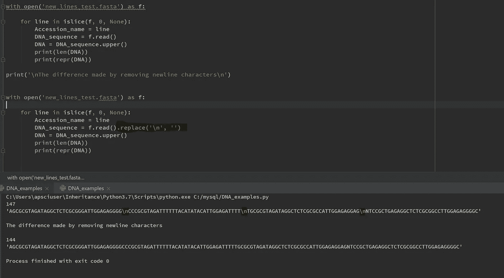
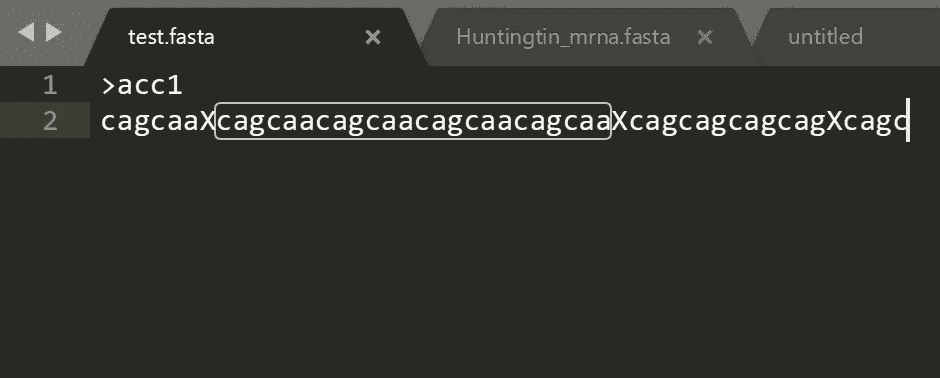
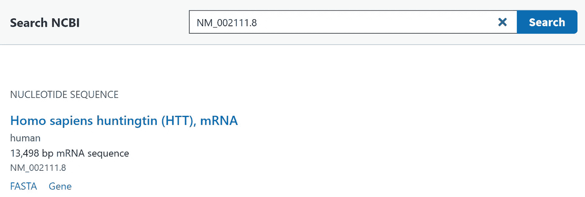
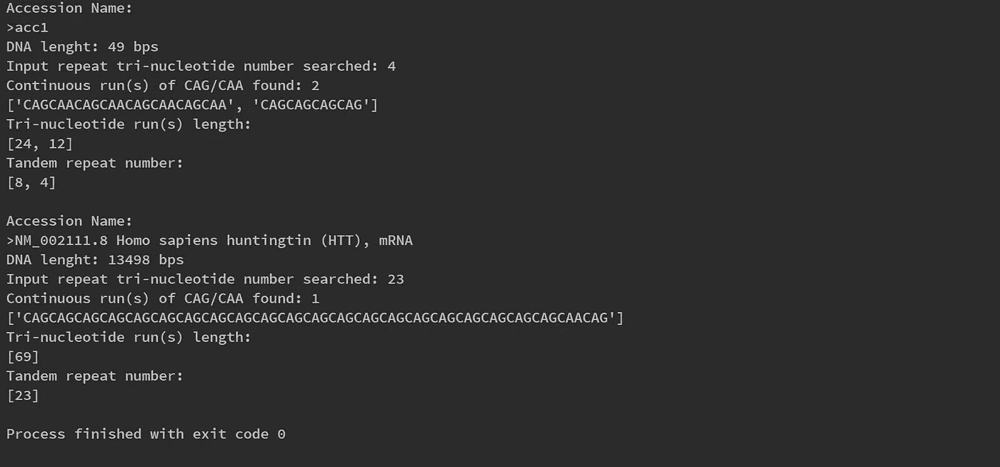

# 用 Python 编写探索人类遗传学的有用函数

> 原文：<https://towardsdatascience.com/writing-useful-functions-to-explore-human-genetics-with-python-3e135540ea0?source=collection_archive---------20----------------------->

## 简单的 Python 函数有助于深入了解人类疾病

Image Courtesy of [National Cancer Institute](https://unsplash.com/@nci) Via Unsplash

# Python 和序列数据示例

许多人类遗传性神经退行性疾病，如亨廷顿氏病(HD ),与特定基因中三核苷酸重复数量的增加有关。在遗传学中，密码子，一种三核苷酸重复，编码氨基酸，蛋白质的组成部分。具体而言，在亨廷顿氏病中，病理严重性与 CAA 或 CAG 密码子重复的数量相关。这些密码子指定了氨基酸谷氨酰胺，它是 20 个小构件之一。因此，HD 属于统称为多聚谷氨酰胺(polyQ)疾病的一组疾病。

超过 35 个串联重复序列实际上就确定了这种疾病，而这种基因的健康变体有大约 6-35 个串联重复序列。

幸运的是，Python 可以用来编写简单的函数来研究 mRNA 转录物，组装蛋白质所需的指令模板，并确定 CAA/CAG 密码子串联重复的数量。

# 目标:

在生物学领域，我们很幸运，我们可能感兴趣的许多文件都是基于文本的文件，这些文件来自 NCBI 等数据库。这意味着我们可以将它们视为普通的 Python 字符串。

对于我将在这里演示的函数，我希望输出内容尽可能丰富。

具体来说，我想分析一个典型的编码亨廷顿蛋白的 mRNA 转录本的 FASTA 文件。在遗传学中，FASTA 文件是一个简单的文件，文件头包含序列的唯一标识符，序列本身位于文件头之下，如下所示:

> FASTAheader

AGCTCGATACGAGA

我想检索并计算出该文件的登录号或标识符，序列的 DNA 长度。重要的是，我希望用户为要在文件中搜索的 CAA/CAG 密码子选择他们自己的串联重复数，并让输出通知用户 CAA/CAG 密码子在输入串联数以上的连续运行次数，这些串联序列是什么，以及每次运行中发现多少重复。

# 入门指南

首先让我们在一小段 DNA 序列上练习。我特意截取了这个带有“X”的 DNA 序列，以中断连续的 CAG/CAA 密码子运行。

首先，我使用。upper()方法。然后我使用 regex 模块，在这里我搜索出现三次或更多次的 CAG 或 CAA 密码子。管道字符|代表 or，花括号给出了需要查找这些序列的次数限制(在这里，逗号后面的上限被去掉了)。

因此，在这个例子中，我想找到在 DNA 串中出现三次以上的 CAA/CAG 序列，这意味着如果满足这个要求，应该找到长度至少为 9 的 DNA。然后，我遍历找到的匹配，保存在变量 pattern_match 中，并打印满足这个标准的序列。为了清楚起见，我还将这些序列附加到一个新列表中，并打印它们的长度。

找到 2 次运行，并且两次运行都高于至少 9 次运行的最小阈值。

# 使用文件

为了打开文件，我使用 open 函数，使用 with 语句。然后我将文件切片，因为我不希望 FASTA 文件的登录名称(头)影响我的 DNA 计数。这意味着我需要在元素 0 处对文件进行切片，这将删除文件头，然后读取切片后的文件 f，小心地删除任何新的行字符。

*-下图显示了不删除新行字符的影响。这些字符会破坏 CAG/CAA 的连续运行，并给 DNA 增加额外的长度，这将不能代表序列数据。*

The impact of forgetting to remove new-line characters; the sequence is artificially longer and not representative of the sequence data.

然后我使用如上所述的 re.finditer 方法。为了让这个代码片段工作，有必要导入 islice 和 re。

从 itertools 进口 islice
进口 re

下面显示的是脚本和控制台输出。如图所示，显示了登录名称，随后是序列长度，发现了多少个大于 3 的 CAA/CAG 游程，这些游程的序列及其各自的长度和串联重复数。

然而，这段代码可以提供更多的信息，也更容易解释。例如，在每一部分之前打印一条消息，告知用户输出代表什么。此外，这段代码有点不灵活，因为它只适用于“test.fasta ”,并检查 CAA/CAG 的连续运行 3 次或更多次。为了改进这个脚本，最方便的选择是将它转换成一个函数。

The output in the console is hard to interpret, and could include informative text beside.

# 功能创建

现在代码的主体已经写好了，创建一个函数不需要太多额外的工作。按照规定，用户应该能够自己选择的两个参数应该是要分析的 DNA 文件和串联重复的限制。

我定义了函数 huntington_tandem_repeat_dna，并在括号内给了函数两个参数。dna 参数是打开的文件，tri_nucleotide_repeat_num 的默认值为 3，以防用户决定不指定串联重复编号。

为了测试这个函数，让我们测试两种情况。一个是我创建的虚拟测试文件，用扩展名. fasta 保存。我已经在这个文件中包含了 2 个连续的 CAG/CAA 密码子。一个是 24 个碱基对长，另一个是 12 个。我已经包含了这个文件来验证函数是否按预期工作。

Boxed: The boxed section refers to a a 24 base pair segment, comprised of 8 tandem runs of CAA/CAG codons.

我正在运行的文件在我的本地目录中，因此我只指定了它们的相对路径。

我运行的另一个 DNA 样本是 mRNA 序列。在这里，我想确保在分析文件时，碱基对的数量是匹配的。NCBI 数据库告诉我序列长度应该是 13，498bp，当用这个 dna 文件调用**Huntington _ tandem _ repeat _ DNA**函数时，这确实得到了确认。除此之外，两种情况下的登录名称都匹配，这证明一切都按预期进行。

The output in the console is explicit.

# 摘要

兜了一圈，原来的目的已经达到了。该函数读取文件并给出清晰易懂的有用输出。

选择上图所示的第二个示例，我们可以清楚地看到，DNA 长度为 13，498 bps，用户已经搜索了 23 次或更多次 CAG/CAA 连续运行，但只找到一次符合该标准的运行。匹配的序列被打印出来，连同它的长度，以及包含该运行的串联重复的数目。

该功能现在完全可以扩展，例如处理多个文件并将输出写入任何特定的目的地，如果用户想要添加这种额外的功能。

我希望这篇文章展示了用 Python 编写函数是如何洞察人类遗传疾病的。更多代码示例，请关注我的 [linkedIn](https://www.linkedin.com/in/stephen-fordham-3262aa172/) 和 M [edium](https://medium.com/@stephenfordham) 。