# 深度学习完全初学者指南:卷积神经网络和图像分类

> 原文：<https://towardsdatascience.com/wtf-is-image-classification-8e78a8235acb?source=collection_archive---------0----------------------->

## 在几分钟内攻克 CNN 和图像分类的基础知识

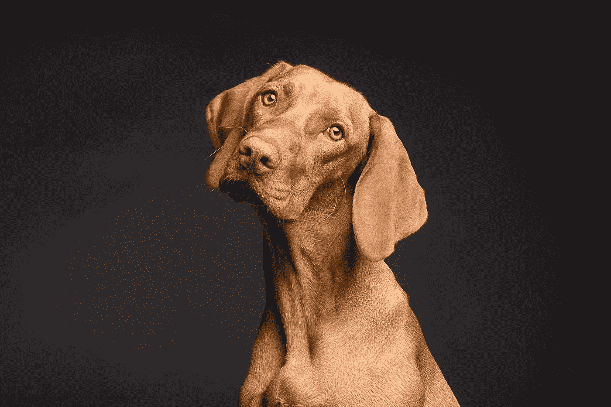

Image by VislazFotosas via [Pixabay](http://pixabay.com)

> “我很早就注意到的一件事是，你不会把将要拍出来的东西放进照片里。或者反过来，出来的不是你放进去的。”
> 
> ― **黛安·阿勃斯**

你最喜欢的社交网络上弹出通知，有人发布了一张可能有你的照片。

没错。

这是你有史以来最差的照片。

GIF via [GIPHY](https://giphy.com/gifs/4wpr7XmetlW6Y)

那是怎么发生的？

**图像分类**！

卷积神经网络(CNN)是**深度学习神经网络**的一类。CNN 代表了图像识别的巨大突破。它们最常用于分析视觉图像，并且经常在图像分类的幕后工作。从脸书的照片标签到无人驾驶汽车，它们都是一切事物的核心。从医疗保健到安全，他们都在幕后努力工作。

他们又快又有效率。但是它们是如何工作的呢？

图像分类是获取一个**输入**(像一张图片)并输出一个**类**(像“猫”)或一个**概率**输入是一个特定的类(“这个输入有 90%的概率是一只猫”)。你可以看着一张照片，知道你正在看一张你自己的可怕的照片，但是计算机怎么能学会这样做呢？

用卷积神经网络！

美国有线电视新闻网

*   卷积层
*   ReLU 层
*   池层
*   完全连接的层

一个经典的 CNN 架构应该是这样的:

**输入- >卷积- > ReLU - >卷积- > ReLU - >汇集- >
ReLU - >卷积- > ReLU - >汇集- >全连接**

CNN **卷积**(非卷积…)学习输入数据的特征，并使用 2D 卷积层。这意味着这种类型的网络是处理 2D 图像的理想选择。与其他图像分类算法相比，CNN 实际上很少使用预处理。这意味着他们可以**学习**其他算法中必须手工制作的过滤器。CNN 可以用于大量的应用，从图像和视频识别、图像分类和推荐系统到自然语言处理和医学图像分析。

CNN 受到生物过程的启发。他们基于 Hubel 和 Wiesel 在 60 年代对猫和猴子的视觉所做的一些很酷的研究。CNN 的连接模式来自他们对视觉皮层组织的研究。在哺乳动物的眼睛中，单个神经元只在感受野对视觉刺激做出反应，这是一个受限制的区域。不同区域的感受野部分重叠，从而覆盖整个视野。这就是 CNN 的工作方式！


Image by NatWhitePhotography on [Pixabay](http://pixabay.com)

CNN 有输入层、输出层和隐藏层。隐藏层通常由卷积层、ReLU 层、池层和全连接层组成。

*   卷积层对输入应用卷积运算。这将信息传递到下一层。
*   汇集将神经元簇的输出组合成下一层中的单个神经元。
*   完全连接的层将一层中的每个神经元连接到下一层中的每个神经元。

在卷积层中，神经元仅接收来自前一层的子区域的输入。在完全连接的层中，每个神经元接收来自前一层的每个元素的*输入。*

CNN 的工作原理是从图像中提取特征。这消除了手动特征提取的需要。特征没有经过训练！它们是在网络对一组图像进行训练时学习的。这使得深度学习模型对于计算机视觉任务来说极其准确。CNN 通过几十或几百个隐藏层学习特征检测。每一层都增加了所学特征的复杂性。

GIF via [GIPHY](https://gph.is/1bviWQm)

## 美国有线电视新闻网

*   从输入图像开始
*   对其应用许多不同的过滤器以创建特征地图
*   应用 ReLU 函数来增加非线性
*   将池化图层应用于每个要素地图
*   将合并的图像展平为一个长矢量。
*   将向量输入到完全连接的人工神经网络中。
*   通过网络处理要素。最后的全连接层提供了我们所追求的类的“投票”。
*   通过前向传播和后向传播训练很多很多个时代。这一过程一直重复，直到我们拥有一个定义明确的神经网络，该网络具有经过训练的权重和特征检测器。

## 这意味着什么呢？

在这个过程的最开始，输入图像被分解成像素。

GIF via [GIPHY](https://giphy.com/gifs/l0HlMr2G3EKFgpUY0)

对于黑白图像，这些像素被解释为 2D 阵列(例如，2x2 像素)。每个像素的值都在 0 到 255 之间。(零全黑，255 全白。灰度存在于这些数字之间。)基于这些信息，计算机可以开始处理这些数据。

对于彩色图像，这是一个包含蓝色层、绿色层和红色层的 3D 阵列。每一种颜色都有自己的值，在 0 到 255 之间。可以通过组合三层中每一层的值来找到颜色。

# CNN 的基本组成部分是什么？

## **卷积**

卷积步骤的主要目的是从输入图像中提取特征。卷积层总是 CNN 的第一步。

您有一个输入图像、一个特征检测器和一个特征图。你把滤镜一个像素一个像素地应用到输入图像上。你可以通过矩阵相乘来实现。

假设你有一个手电筒和一张气泡纸。你的手电筒照亮了一个 5 个泡泡 x 5 个泡泡的区域。要查看整张纸，你可以用手电筒扫过每个 5x5 的正方形，直到看到所有的气泡。

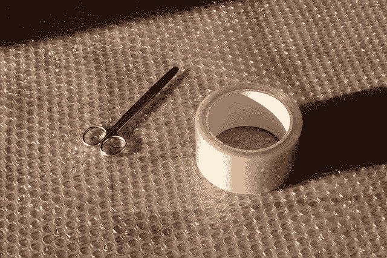

Photo by stux on [Pixabay](http://pixabay.com)

手电筒发出的光是你的**滤镜**，你滑过的区域是**感受野**。滑过感受野的光是你的手电筒**回旋**。您的过滤器是一组数字(也称为权重或参数)。手电筒发出的光在行进过程中滑动的距离(你是在一次一排气泡上移动滤镜吗？两个？)被称为**步幅**。例如，步幅为 1 意味着您一次移动一个像素的滤镜。大会是一步两个脚印。

滤镜的深度必须与输入的深度相同，所以如果我们看的是彩色图像，深度应该是 3。这使得该滤波器的尺寸为 5x5x3。在每个位置，滤镜将滤镜中的值与像素中的原始值相乘。这是元素式乘法。将乘法相加，得到一个数。如果您从气泡包装的左上角开始，这个数字代表左上角。现在你移动你的过滤器到下一个位置，重复这个过程。你最终得到的数组叫做**特性图**或者**激活图**！您可以使用多个过滤器，这样可以更好地保留空间关系。

GIF via [GIPHY](https://giphy.com/gifs/blog-daniel-keypoints-i4NjAwytgIRDW)

您将指定过滤器数量、过滤器大小、网络架构等参数。CNN 在训练过程中自己学习滤波器的值。您有许多选项可以用来为您的任务制作最佳的图像分类器。您可以选择用零填充输入矩阵(**零填充**)，将过滤器应用于输入图像矩阵的边界元素。这也允许您控制特征地图的大小。加零填充是**宽卷积**。不加补零是**窄卷积**。

这基本上就是我们检测图像的方式！我们不会查看图像的每一个像素。我们看到像帽子、红色连衣裙、纹身等特征。每时每刻都有如此多的信息进入我们的眼睛，我们不可能处理其中的每一个像素。我们允许我们的模型做同样的事情。

这样的结果就是卷积后的**特征图**。它比原始输入图像小。这使得处理起来更加容易和快速。我们会失去信息吗？一些，是的。但同时，特征检测器的目的是检测特征，这正是它的作用。

我们创建了许多特征地图来得到我们的第一个卷积层。这允许我们识别程序可以用来学习的许多不同的特征。

可以用不同的值设置特征检测器，以获得不同的结果。例如，可以应用能够锐化和聚焦图像或者模糊图像的过滤器。这将对所有的价值给予同等的重视。您可以进行边缘增强、边缘检测等操作。您可以通过应用不同的特征检测器来创建不同的特征地图。计算机能够确定哪些过滤器最有意义并应用它们。

这里的主要目的是找到图像中的要素，将它们放入要素地图中，并仍然保留像素之间的空间关系。这一点很重要，这样像素才不会变得混乱。

## 让我们想象一下这个东西！

> 向我的小朋友问好:


Photo by Kirgiz03 on [Pixabay](http://pixabay.com)

我们要用这个家伙作为我们的输入图像。

我们会让他黑白分明

```
import cv2
import matplotlib.pyplot as plt
%matplotlib inlineimg_path = 'data/pixabay_Kirgiz03.jpg'# Load color image 
bgr_img = cv2.imread(img_path)# Convert to grayscale
gray_img = cv2.cvtColor(bgr_img, cv2.COLOR_BGR2GRAY)# Normalize, rescale entries to lie in [0,1]
gray_img = gray_img.astype("float32")/255# Plot image
plt.imshow(gray_img, cmap='gray')
plt.show()
```

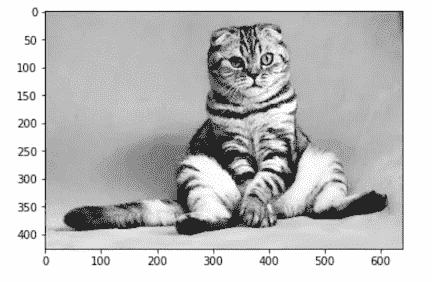

让我们定义并可视化我们的过滤器

```
import numpy as npfilter_vals = np.array([[-1, -1, 1, 1], [-1, -1, 1, 1], [-1, -1, 1, 1], [-1, -1, 1, 1]])print('Filter shape: ', filter_vals.shape)
```

**滤镜形状:(4，4)**

```
# Define four different filters, all of which are linear combinations of the `filter_vals` defined abovefilter_1 = filter_vals
filter_2 = -filter_1
filter_3 = filter_1.T
filter_4 = -filter_3
filters = np.array([filter_1, filter_2, filter_3, filter_4])# Print out the values of filter 1 as an example
print('Filter 1: \n', filter_1)
```

我们看到:

```
**Filter 1: 
 [[-1 -1  1  1]
 [-1 -1  1  1]
 [-1 -1  1  1]
 [-1 -1  1  1]]**
```

这是我们的四个过滤器的可视化

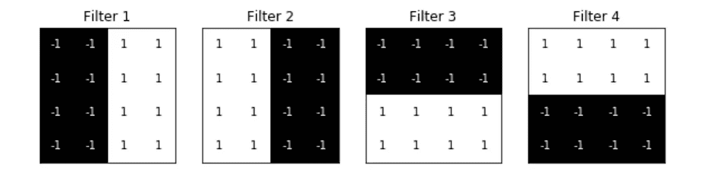

现在让我们定义一个卷积层(我现在很喜欢 PyTorch，所以这就是我们在这里使用的。)

```
import torch
import torch.nn as nn
import torch.nn.functional as F

# Neural network with one convolutional layer with four filters
class Net(nn.Module):

    def __init__(self, weight):
        super(Net, self).__init__()
        # Initializes the weights of the convolutional layer to be the weights of the 4 defined filters
        k_height, k_width = weight.shape[2:]
        # Assumes there are 4 grayscale filters
        self.conv = nn.Conv2d(1, 4, kernel_size=(k_height, k_width), bias=False)
        self.conv.weight = torch.nn.Parameter(weight)def forward(self, x):
        # Calculates the output of a convolutional layer pre- and post-activation
        conv_x = self.conv(x)
        activated_x = F.relu(conv_x)

        # Returns both layers
        return conv_x, activated_x

# Instantiate the model and set the weights
weight = torch.from_numpy(filters).unsqueeze(1).type(torch.FloatTensor)
model = Net(weight)# Print out the layer in the network
print(model)
```

我们走着瞧

```
**Net(
  (conv): Conv2d(1, 4, kernel_size=(4, 4), stride=(1, 1), bias=False)
)**
```

再多加一点代码

```
def viz_layer(layer, n_filters= 4):
    fig = plt.figure(figsize=(20, 20))

    for i in range(n_filters):
        ax = fig.add_subplot(1, n_filters, i+1, xticks=[], yticks=[])
        # Grab layer outputs
        ax.imshow(np.squeeze(layer[0,i].data.numpy()), cmap='gray')
        ax.set_title('Output %s' % str(i+1))
```

然后再多一点

```
# Plot original image
plt.imshow(gray_img, cmap='gray')# Visualize all of the filters
fig = plt.figure(figsize=(12, 6))
fig.subplots_adjust(left=0, right=1.5, bottom=0.8, top=1, hspace=0.05, wspace=0.05)
for i in range(4):
    ax = fig.add_subplot(1, 4, i+1, xticks=[], yticks=[])
    ax.imshow(filters[i], cmap='gray')
    ax.set_title('Filter %s' % str(i+1))# Convert the image into an input tensor
gray_img_tensor = torch.from_numpy(gray_img).unsqueeze(0).unsqueeze(1)# Get the convolutional layer (pre and post activation)
conv_layer, activated_layer = model(gray_img_tensor)# Visualize the output of a convolutional layer
viz_layer(conv_layer)
```

我们可以在应用 ReLu 激活函数之前可视化卷积层的输出！

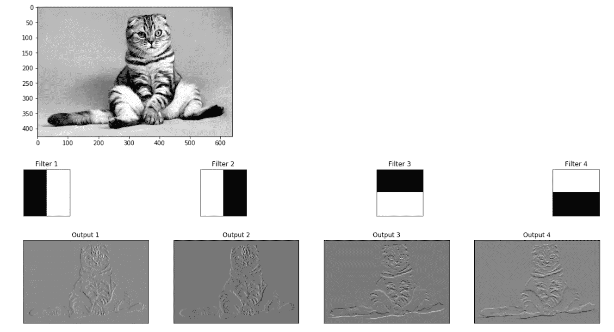

现在让我们使用 Sobel 算子作为边缘检测滤波器来创建一个自定义内核。Sobel 滤波器非常常用于边缘检测。它在寻找图像中的强度模式方面做得很好。对图像应用 Sobel 滤波器是一种在 x 或 y 方向上分别对图像的导数进行近似的方法。

我们将把我们的小家伙转换成灰度进行过滤

```
gray = cv2.cvtColor(image, cv2.COLOR_RGB2GRAY)plt.imshow(gray, cmap='gray')
```


开始了。

```
# 3x3 array for edge detection
sobel_y = np.array([[ -1, -2, -1], 
                   [ 0, 0, 0], 
                   [ 1, 2, 1]])sobel_x = np.array([[ -1, 0, 1], 
                   [ 0, 0, 0], 
                   [ 1, 2, 1]])

filtered_image = cv2.filter2D(gray, -1, sobel_y)plt.imshow(filtered_image, cmap='gray')
```

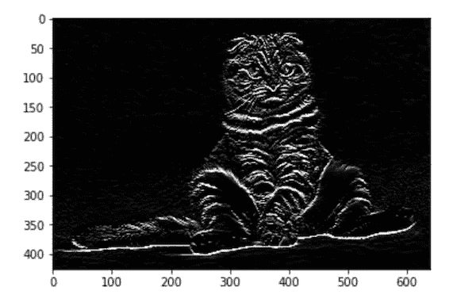

*想看看数学吗？看看* [*卷积神经网络简介*](https://web.stanford.edu/class/cs231a/lectures/intro_cnn.pdf) *作者吴建新*

## ReLU 层

ReLU(校正线性单位)层是我们卷积层的另一个步骤。您正在将一个**激活** **函数**应用到您的特征地图上，以增加网络中的非线性。这是因为图像本身是高度非线性的！它通过将负值设置为零来从激活图中移除负值。

卷积是一种线性运算，包括元素间的矩阵乘法和加法。我们希望 CNN 了解的真实世界数据将是非线性的。我们可以用 ReLU 这样的操作来说明这一点。您可以使用其他操作，如 **tanh** 或 **sigmoid** 。然而，ReLU 是一个受欢迎的选择，因为它可以更快地训练网络，而不会对泛化精度产生任何重大影响。

*查看 C.-C. Jay Kuo* [*用数学模型理解卷积神经网络*](https://arxiv.org/abs/1609.04112) *。*

*想深入挖掘？试试何等* [*深究整流器:在 ImageNet 分类上超越人类水平的表现*](https://arxiv.org/abs/1502.01852) *。*

*如果你需要更多关于* [*激活函数的基础知识，你可以在这里找到*](/simply-deep-learning-an-effortless-introduction-45591a1c4abb) *！*

这是我们的小伙伴在 ReLU 激活功能将所有负像素值变成黑色后的样子

```
viz_layer(activated_layer)
```

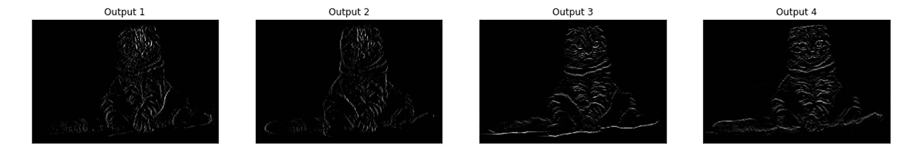

## 联营

您最不希望看到的是网络在确切位置的确切阴影中查找某个特定要素。那对一个好的 CNN 来说没用！您想要翻转、旋转、挤压等的图像。您想要同一事物的大量照片，以便您的网络可以在所有图像中识别一个对象(比如说，一只豹子)。无论大小或位置如何。无论光线如何，无论斑点数量多少，无论豹子是在熟睡还是在撕咬猎物。你要**空间方差**！你需要灵活性。这就是联营的意义所在。

池逐渐减小输入表示的大小。这使得检测图像中的物体成为可能，无论它们位于何处。池有助于减少所需参数的数量和所需的计算量。这也有助于控制**过度拟合**。

过度拟合有点像你在没有理解信息的情况下，在考试前记忆超级具体的细节。当你记住细节的时候，你可以在家里用你的抽认卡做得很好。但是，如果给你提供新的信息，你将无法通过真正的测试。

(另一个例子:如果你的训练数据中的所有狗都有斑点和深色眼睛，你的网络将认为，对于要被分类为狗的图像，它必须有斑点和深色眼睛。如果你用同样的训练数据来测试你的数据，它将会对狗进行惊人的正确分类！但是，如果你的输出只有“狗”和“猫”，而你的网络呈现的新图像包含，比如说，一只罗威纳犬和一只哈士奇犬，它很可能会把罗威纳犬和哈士奇犬都归类为猫。可以看出问题了！)

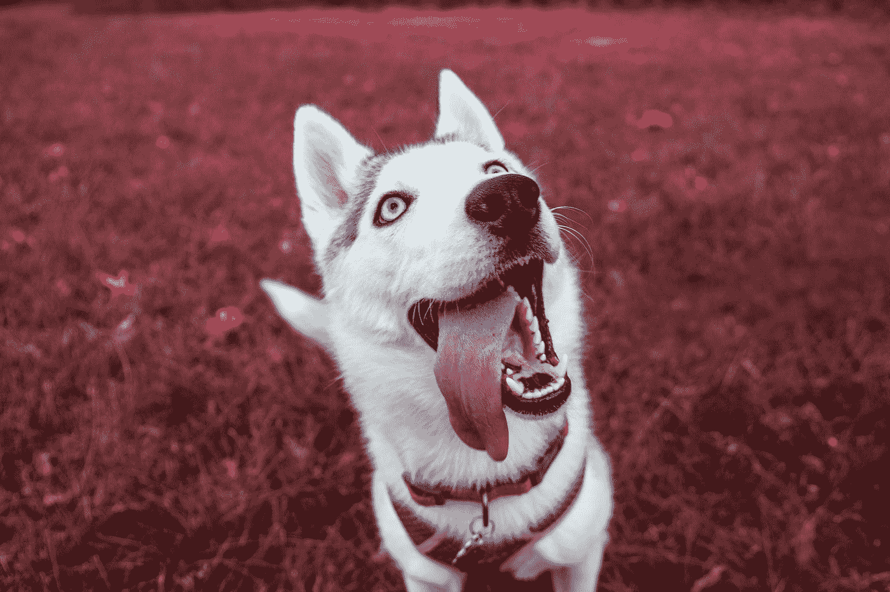

Photo by [Hybrid](https://unsplash.com/@_hybrid_?utm_source=medium&utm_medium=referral) on [Unsplash](https://unsplash.com?utm_source=medium&utm_medium=referral)

如果没有方差，对于与训练数据不完全匹配的图像，您的网络将毫无用处。**永远，永远，永远把你的训练和测试数据分开**！如果你用你训练过的数据进行测试，你的网络会记住这些信息！当引入任何新数据时，它会做得很糟糕。

> 过度合身并不酷。

因此，对于这一步，你采取**特征地图**，应用**池层**，结果是**池特征地图**。

最常见的池例子是**最大池**。在 max pooling 中，输入图像被划分为一组不重叠的区域。每个区域的输出是每个区域的最大值。这使得尺寸更小，参数更少。

最大池化就是获取图像中每个点的最大值。这去掉了 75%的非特征信息。通过取像素的最大值，你就考虑到了失真。如果要素向左或向右旋转一点点，合并后的要素将保持不变。你在减少尺寸和参数。这很好，因为这意味着模型不会过度适应这些信息。

你可以使用**平均池**或**总和池**，但它们并不是常见的选择。在实践中，最大池往往比两者都表现得更好。在 max pooling 中，您将获得最大的像素值。在平均池中，取图像中该点所有像素值的平均值。(实际上，现在有一种趋势是使用更小的过滤器或完全放弃池层。这是对代表人数大幅减少的回应。)

*想多了解一下为什么你会选择最大池，为什么你会喜欢两个像素的步长？看看张秀坤·舍雷尔等人。a1，* [*用于对象识别的卷积架构中的池操作评估*](http://ais.uni-bonn.de/papers/icann2010_maxpool.pdf) *。*

如果你去[这里](http://scs.ryerson.ca/~aharley/vis/conv/flat.html)你可以看到一个非常有趣的卷积层的 2D 可视化。在屏幕左侧的框中画一个数字，然后真正地浏览输出。您可以看到卷积和汇集层以及猜测。尝试将鼠标悬停在单个像素上，以便可以看到应用滤镜的位置。

现在我们有了一个输入图像、一个应用的卷积层和一个应用的池层。

让我们来看一看池层的输出！

我们在这里:

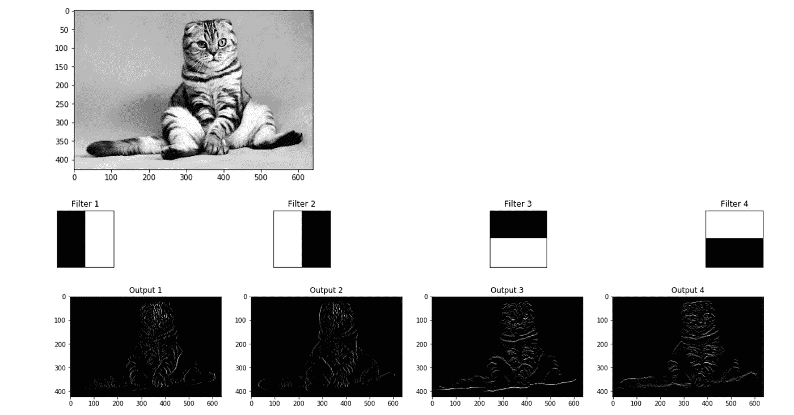

汇集图层将上图中的要素地图作为输入，并减少这些地图的维度。它通过构建一个新的、更小的图像来实现这一点，该图像仅包含给定内核区域中的最大(最亮)值。

看到图像是如何改变大小的了吗？

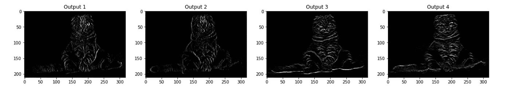

很酷，对吧？

## 变平

这是一个非常简单的步骤。您将汇集的要素地图展平为一列连续的数字(一个长向量)。这使得该信息成为人工神经网络的输入层，用于进一步处理。

## 全连接层

在这一步，我们将一个**人工神经网络**添加到我们的卷积神经网络中。(不确定人工神经网络？你可以在这里了解他们！)

人工神经网络的主要目的是将我们的特征组合成更多的属性。这些将更准确地预测类别。这结合了可以更好地预测类的特征和属性。

在这一步，计算误差，然后反向传播。权重和特征检测器被调整以帮助优化模型的性能。然后这个过程一次又一次的发生。我们的网络就是这样训练数据的！

当有一个以上的神经元时，输出神经元是如何工作的？

首先，我们必须了解什么样的权重应用于连接输出的突触。我们想知道哪些先前的神经元对输出是重要的。

例如，如果您有两个输出类，一个是猫的，一个是狗的，则读取“0”的神经元绝对不能确定该特征属于猫。一个读到“1”的神经元绝对确定这个特征属于一只猫。在最终完全连接的层中，神经元将读取 0 和 1 之间的值。这意味着不同层次的确定性。值 0.9 表示 90%的确定性。

当一个特征被识别出来时，猫的神经元就知道这个图像是一只猫。他们说数学上相当于，“这些是我的神经元！我应该被触发了！”如果这种情况发生多次，网络就会知道当某些特征被激活时，这个图像就是一只猫。

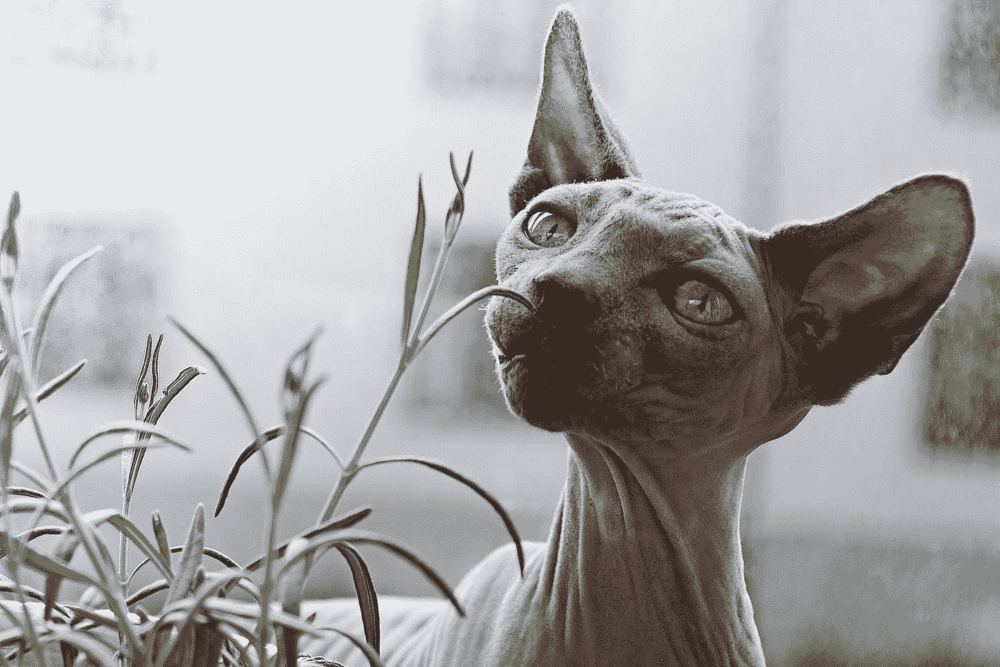

Photo by [Linnea Sandbakk](https://unsplash.com/@linneasandbakk?utm_source=medium&utm_medium=referral) on [Unsplash](https://unsplash.com?utm_source=medium&utm_medium=referral)

通过大量的迭代，猫神经元知道当某些特征被激活时，图像就是一只猫。例如，狗的神经元知道当某些其他特征被激发时，这个图像就是一只狗。例如，狗神经元再次了解到，“大湿鼻子”神经元和“软耳朵”神经元对狗神经元有很大的贡献。它赋予“大湿鼻子”神经元和“软耳朵”神经元更大的权重。狗神经元学会或多或少忽略“胡须”神经元和“猫虹膜”神经元。猫神经元学会给予像“胡须”和“猫虹膜”这样的神经元更大的权重。

(好吧，实际上并没有“大湿鼻子”或“胡须”神经元。但是检测到的特征确实具有特定类别的区别特征。)


Photo by [Noémi Macavei-Katócz](https://unsplash.com/@noemiphotography?utm_source=medium&utm_medium=referral) on [Unsplash](https://unsplash.com?utm_source=medium&utm_medium=referral)

一旦训练好网络，你就可以传入一幅图像，神经网络将能够非常确定地确定该图像的图像分类概率。

全连接层是传统的多层感知器。它在输出层使用一个分类器。分类器通常是 softmax 激活函数。完全连接意味着前一层中的每个神经元都连接到下一层中的每个神经元。这一层的目的是什么？使用来自前一层的输出的特征来基于训练数据对输入图像进行分类。

一旦你的网络建立并运行，你可以看到，例如，你有 95%的可能性你的图像是一只狗，5%的可能性你的图像是一只猫。


Photo by Alexas_Fotos on [Pixabay](http://pixabay.com)

为什么这些数字加起来都是 1.0？(0.95 + 0.05)

没有任何东西表明这两个输出是相互联系的。是什么让他们联系在一起？本质上，它们不会，但是当我们引入 softmax 函数时，它们会。这使值介于 0 和 1 之间，并使它们相加为 1 (100%)。(你可以在[维基百科](https://en.wikipedia.org/wiki/Softmax_function)上阅读所有相关内容。)softmax 函数获取分数向量，并将其压缩为 0 到 1 之间的值的向量，这些值的总和为 1。

应用 softmax 函数后，可以应用损失函数。交叉熵通常与 softmax 密切相关。我们希望最小化损失函数，以便最大化网络性能。

在反向传播的开始，你的输出值会很小。这就是为什么你可能会选择交叉熵损失。梯度会非常低，神经网络很难开始向正确的方向调整。使用交叉熵有助于网络评估甚至一个微小的错误，并更快地达到最佳状态。

*想要更多吗？检查*

*   *这段* [*视频由杰弗里·辛顿*](https://www.youtube.com/watch?v=mlaLLQofmR8) *在 softmax 函数上*
*   [*对交叉熵损失的友好介绍*](https://rdipietro.github.io/friendly-intro-to-cross-entropy-loss/) *作者 Rob DiPietro*
*   [*如何实现一个神经网络间奏曲 2*](https://peterroelants.github.io/posts/cross-entropy-softmax/) *作者彼得·罗伦茨*

## 现在怎么办？

在这一点上，一切都是通过许多许多时代的向前和向后传播来训练的。我们最终得到了一个定义非常明确的神经网络，所有的权重和特征都经过了训练。现在我们有了可以识别和分类图像的东西！([不确定正向传播和反向传播？查看这里的绝对基础知识](/simply-deep-learning-an-effortless-introduction-45591a1c4abb)！)

## 刚刚发生了什么？

我们从输入图像开始，应用多种不同的特征来创建特征图。我们应用了 ReLU 来增加非线性，并对每个特征地图应用了汇集层。(我们这样做是为了确保我们的图像中有空间差异，减少图像的大小，避免模型过度适应数据，同时仍然保留我们想要的特征。)我们将所有汇集的图像展平成一个长向量。我们将向量输入到完全连接的人工神经网络中。这是通过网络处理所有要素的地方。这给了我们最终的全连接层，它提供了我们所追求的类的“投票”。所有这些都是通过前向传播和反向传播来训练的，直到我们最终得到了一个定义良好的神经网络，其中训练了权重和特征检测器。

现在我们可以识别和分类图像了！


Photo by [Lucas Sankey](https://unsplash.com/@lucassankey?utm_source=medium&utm_medium=referral) on [Unsplash](https://unsplash.com?utm_source=medium&utm_medium=referral)

您正在朝着能够做到这一点的方向前进:

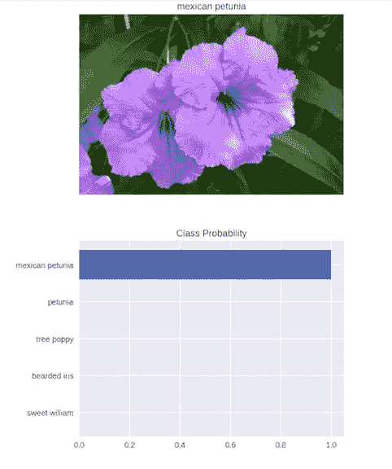

(你想那样做吗？这里有一个清晰完整的蓝图，可以用 PyTorch 创建一个极其精确的图像分类器！你可以创建一个图像分类器，它可以非常确定地告诉你你正在看的是哪种花！)

*想了解更多？结账*

*   [*吴建新*](https://web.stanford.edu/class/cs231a/lectures/intro_cnn.pdf) 卷积神经网络导论
*   Yann LeCun 的原创文章， [*基于梯度的学习应用于文档识别*](http://yann.lecun.com/exdb/publis/pdf/lecun-01a.pdf)
*   [*你需要了解的九篇深度学习论文(了解 CNN 第三部分)*](https://adeshpande3.github.io/The-9-Deep-Learning-Papers-You-Need-To-Know-About.html) *作者 Adit Deshpande*

**感谢关注** [**新手、新手和新手深度学习**](/intro-to-deep-learning-c025efd92535) **系列的第 3 部分！**

*你可以在这里找到第一部分:* [*深度学习简介*](/intro-to-deep-learning-c025efd92535)

[](/intro-to-deep-learning-c025efd92535) [## 深度学习简介

### 新手、新手和新手的神经网络。

towardsdatascience.com](/intro-to-deep-learning-c025efd92535) 

*和这里的第二部分:* [*人工网络完全初学者指南*](/simply-deep-learning-an-effortless-introduction-45591a1c4abb)

[](/simply-deep-learning-an-effortless-introduction-45591a1c4abb) [## 深度学习完全初学者指南:人工神经网络

### 深度学习入门！在 15 分钟内攻克人工神经网络的基础知识

towardsdatascience.com](/simply-deep-learning-an-effortless-introduction-45591a1c4abb) 

如果你对这些信息做了什么了不起的事情，请在下面的回复中告诉我，或者发推特 [@annebonnerdata](https://twitter.com/annebonnerdata) ！