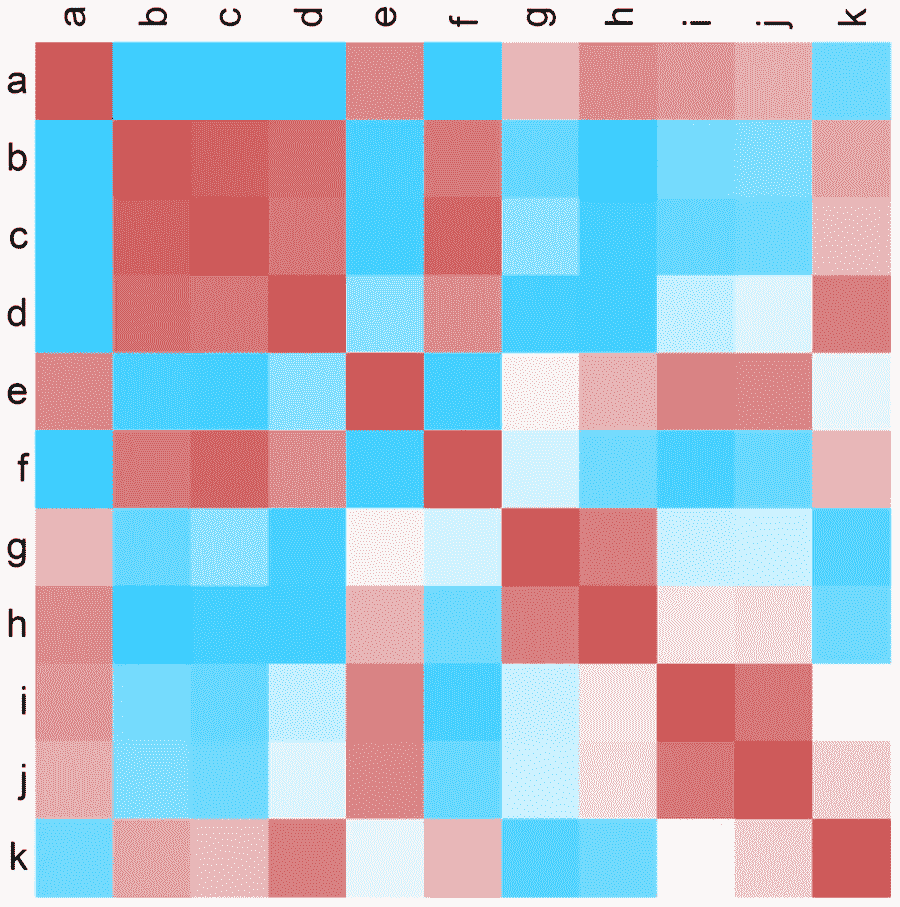

# XᵀX、协方差、相关和余弦矩阵

> 原文：<https://towardsdatascience.com/x%E1%B5%80x-covariance-correlation-and-cosine-matrices-d2230997fb7?source=collection_archive---------19----------------------->

## 几种常见关联矩阵的计算方法

Below, we’ll unpack the calculations underlying plots like these

有没有遇到过这样的情况，您需要在没有函数帮助的情况下为动态数据得出成对的协方差、相关性或余弦矩阵？大概不会。

尽管如此，还是有必要看看这些矩阵是如何计算的，因为它们各自的计算有一些明显的共性。这一切的中心是 XᵀX 矩阵。在这里，您可以将 X 视为您收集的一些数据，其中每一列是不同的度量，每一行是不同的主题。

*   取 X 的转置并将其乘以自身，得到平方和叉积矩阵(ssCP)，其中 SS 落在对角线上，叉积落在非对角线上。
*   将 X 居中，将其转置与其自身相乘，然后除以 n-1(其中 n = X 中的行数)得到方差-协方差矩阵，其中方差在对角线上，协方差在非对角线上。
*   将 X 标准化，将其转置乘以自身，然后除以 n-1(其中 n = X 中的行数)得到变量对之间的皮尔逊相关。
*   单位缩放 X 并将其转置与其自身相乘，导致变量对之间的余弦相似性

下面，我们将通过创建一个基于用户输入输出上述矩阵之一的函数来说明刚才查看的内容。

现在，我们可以通过创建一些数据并计算前面提到的关联来测试它。

**平方和叉积**

**方差-协方差**

**皮尔逊相关**

**余弦相似度**

我们将加载库“philentropy”来检查我们的工作，因为它包含许多有用的距离函数。请注意，我们正在转置
我们的数据，因为该函数的默认行为是对所有*行*进行成对
比较。

总之，我们已经展示了 XᵀX 可以被操纵来导出许多我们日常使用的常见关联矩阵。希望你下次运行相关性或检查数据集中变量之间的余弦距离时，记住这一点！