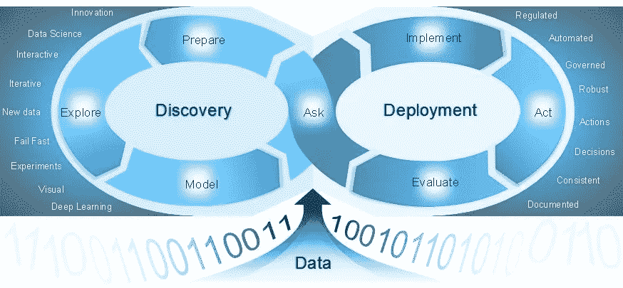

# X-AI，黑盒和水晶球

> 原文：<https://towardsdatascience.com/x-ai-black-boxes-and-crystal-balls-fd27a00752ec?source=collection_archive---------24----------------------->

## 内部人工智能

## [可信人工智能之路](http://go.sas.com/9bnhdb)

在我们通往可信人工智能的道路上，我在我的[上一篇博客](/algorithms-the-illusion-of-neutrality-8438f9ca8471?source=friends_link&sk=7a6c8948fb22dd92db75218baf6e4ac6)中讨论了偏见的问题，它如何从人类传播到机器，它如何被人工智能应用放大，在现实世界中对个人和企业的影响，以及主动解决这个问题的重要性。今天，我将讨论所谓的“黑箱”模型的可解释性和透明性问题。

# 在可解释性和准确性之间做出选择？

要信任，你必须理解。人与人之间的关系就是如此。当涉及到采用增强人类能力的系统来产生洞察力和做出决策时也是如此。这是人类和机器之间的合作关系。像所有的伙伴关系一样，信任是关键。

也许毫不奇怪，人工智能和机器学习(ML)算法的可解释性已经成为该领域中讨论和研究最多的主题之一。

一个算法是**可解释的**意味着什么？这意味着该系统可以传达关于其内部工作方式、其学习的模式和其提供的结果的有用信息。可解释性是可解释性的一个更柔和、更轻松的版本。如果我们可以看到正在发生的事情，如果我们可以根据输入变量合理地预测结果，即使我们不一定知道系统是如何做出决定的，那么系统就是可解释的。

一些模型类型，如决策树和线性回归，非常简单、透明且易于理解。我们知道改变输入将如何影响预测的结果，我们可以证明每个预测。

Photo by [Alina Grubnyak](https://unsplash.com/@alinnnaaaa?utm_source=medium&utm_medium=referral) on [Unsplash](https://unsplash.com?utm_source=medium&utm_medium=referral)

不幸的是，赋予深度神经网络、随机森林或梯度推进机器等“黑盒”模型非凡预测能力的复杂性也让它们非常难以理解(和信任)。任何人工智能技术的运作本质上都是不透明的，即使对计算机科学家来说也是如此。从本质上来说，深度学习是一个特别暗的黑匣子。

用于训练这些模型的大量数据使问题变得更糟，很难找出哪些数据点对结果的影响比其他数据点更大。ML 算法随着时间的推移而发展的事实也使事情变得困难，因为算法不断地从新数据中学习。

归根结底，这是准确性和可解释性之间的权衡。问题是我们准备在这两个问题上做出多大的妥协。不幸的是，我们还没有达到既高度准确又完全透明的模型，尽管我们正在朝着这个方向前进。

# 总是很重要吗？

The number **42** is, in The Hitchhiker’s Guide to the Galaxy by Douglas Adams, the “Answer to the Ultimate Question of **Life**, the Universe, and Everything”, but what good is knowing the answer when it’s unclear why it is the answer?? — Photo by [Mark König](https://unsplash.com/@markkoenig?utm_source=medium&utm_medium=referral) on [Unsplash](https://unsplash.com?utm_source=medium&utm_medium=referral)

对黑箱模型的怀疑和不信任越来越多。因此，工程师和数据科学家正在努力解决可解释性问题。监管机构也在调查此事。2018 年,《欧盟一般数据保护条例》( GDPR)引入了个人的一些基本权利，即被告知自动决策，反对这些决策的输出，以及获得有关所涉逻辑的一些有意义的信息。然而，它没有引入可解释的权利。最近，欧盟任命了一个专家小组来解决这个复杂的问题。这一努力已经导致了可信人工智能的[高级指南](https://ec.europa.eu/futurium/en/ai-alliance-consultation/guidelines#Top)的发布。

可解释性肯定是最重要的，但是**它真的总是那么重要吗？**

在这篇精彩的[文章](https://science.sciencemag.org/content/364/6435/26)中，Elizabeth A. Holm 以一种更平衡的观点为黑盒模型辩护，至少在三种情况下:

1.  当错误答案的成本相对于正确答案的价值较低时(例如，针对目标广告)
2.  当它产生最佳结果时(从提供医疗诊断帮助到驾驶自动驾驶汽车)
3.  当它激发和引导人类探究时(例如通过带来以前没有预料到的洞察力和提出新的问题)

# 人工智能采用的必要条件

然而，在大多数其他情况下，可解释性是确保采用人工智能应用的必要条件。

如果你不知道它是如何工作的，你怎么能相信它呢？

实现预测的高度准确性不足以证明最大似然算法缺乏可解释性。

让我们以医疗保健行业为例。

Photo by [National Cancer Institute](https://unsplash.com/@nci?utm_source=medium&utm_medium=referral) on [Unsplash](https://unsplash.com?utm_source=medium&utm_medium=referral)

人工智能在医疗保健等领域的潜在好处是巨大的。例如，计算机视觉可以用来帮助医生从扫描中识别肿瘤，提高诊断的准确性。类似的技术可以用来在任何症状出现之前预测疾病。然而，如果这些系统不能向医生和患者提供某种程度的解释，它们注定会失败。毕竟，谁会在意仅仅依靠计算机预测就开始具有挑战性副作用的侵入性手术或治疗呢？

2015 年，纽约西奈山医院(Mount Sinai Hospital)的一个研究小组将深度学习技术应用于该医院拥有 70 万份患者记录的庞大数据库。数百个变量被用来训练一个名为“深度病人”的系统。事实证明，它在预测癌症或精神疾病等疾病方面非常有效。在没有任何专家指导的情况下，Deep Patient 发现了隐藏在医院数据中的模式，这些模式似乎表明人们何时会出现这些情况。挑战在于这个工具不能提供任何关于它如何得出结论的线索。如果没有基本原理，系统做出的预测根本就不可用。

许多人和组织都在忙于人工智能和人工智能的实验，推动这项技术能够实现的边界。然而，我预测只有能够提供某种程度的可解释性和透明性的系统才能生存。

# 打开黑盒

幸运的是，有办法让黑盒更加透明，算法技术可以提高 ML 的可解释性。

Photo by [Justin Clark](https://unsplash.com/@imjustintime?utm_source=medium&utm_medium=referral) on [Unsplash](https://unsplash.com?utm_source=medium&utm_medium=referral)

最基本的方法是使用代理方法。通常难以解释的 ML 模型被用作更易解释的模型类型的基准。

更复杂的方法包括应用建模后诊断技术，例如:

*   **变量重要性** (VI)，了解顶级输入变量。
*   **部分相关图** (PDP)，用于测量特性对 ML 模型预测结果的边际影响。
*   **个体条件期望** (ICE)，类似于 PDP，但针对个体数据实例，并在本地级别提供更多粒度。
*   **局部可解释的模型不可知解释** (LIME)，为特定预测提供解释。这是一种与模型无关的技术，用于通过改变输入并观察预测如何变化来理解模型。
*   沙普利重视 (SHAP)，这是一种在博弈论中使用的技术，用于确定合作游戏中的每个玩家对其成功做出了多大贡献。在建模过程中，每个 SHAP 值测量模型中每个要素对预测的负面或正面贡献。

我突然发现，为了解决复杂性问题，我们最终增加了另一层复杂性。然而，这似乎是让黑匣子变得更加透明和可信所需的代价，因此也更有用。也许主要的挑战不是技术，而是数据科学和工程团队的文化和实践。一切都取决于他们是否愿意和准备好将可解释性需求融入到人工智能应用的设计、开发和部署中。

# 透明，不可解释

在人工智能中创造透明和信任超越了黑盒模型的解释能力。这只是从数据、发现、部署到决策的端到端分析生命周期的一个方面。

Traceability & Lineage across the entire analytics life-cycle

过程和工具需要能够建立数据、模型和决策的可追溯性和谱系。这是建立对 AI 信任的先决条件。这通常也是 It 合规性或法规要求。

致力于可信人工智能的组织必须能够回答许多问题。

**关于数据**

*   我们用什么数据来训练模型？
*   它是从哪里来的？
*   我们能相信它吗？
*   我们有法律依据来处理这些数据吗(尤其是当它包含个人或敏感数据时)？
*   数据有多好？质量够好吗？
*   它对人工智能应用程序的目的有代表性吗？它能包含多少偏见？我们是否发现了任何歧视性变量或可能与歧视性变量相关联的变量(例如，邮编有时可能与种族相关联)？

**关于分析模型**

*   模型是否有完整的文档和版本控制？
*   在这些模型的设计和开发过程中做了哪些假设？
*   我们有受控的环境和自动化的过程来部署和测试模型吗？
*   模型在整个分析生命周期中具有完全的可追溯性吗？
*   我们是否有一个正式的流程来度量模型的准确性和性能？

**关于人工智能驱动的决策**

*   使用模型的输出做出了什么决定？
*   什么数据被用来做决定？我们能相信这些数据吗？
*   这些决策对业务成果和客户有什么影响？
*   我们有从使用点(在现实世界中做出决策的地方)到数据科学和工程团队的反馈回路吗？

构建可信的人工智能应用远远超出了模型的可解释性。它要求我们在所使用的技术、组织和业务流程中遵循透明原则。这必须是一项深思熟虑、积极主动的努力，以确保数据驱动的创新伴随着有效的商业成果和人工智能技术的道德使用。

更多信息，请阅读我关于这个主题的另外两篇博客:

*   [算法，中立的假象](/algorithms-the-illusion-of-neutrality-8438f9ca8471?source=friends_link&sk=7a6c8948fb22dd92db75218baf6e4ac6)
*   [伦理学，技术的新前沿](/ethics-the-new-frontier-of-technology-815454f0d158?source=friends_link&sk=f659b80ca31c9694abab235664b0c935)