# 播客的 x 射线

> 原文：<https://towardsdatascience.com/x-ray-for-podcasts-65289a36d9e4?source=collection_archive---------21----------------------->


Photo by [Priscilla Du Preez](https://unsplash.com/@priscilladupreez?utm_source=medium&utm_medium=referral) on [Unsplash](https://unsplash.com?utm_source=medium&utm_medium=referral)

## 如何在没有标签的情况下识别不同的扬声器

亚马逊为 Kindle 和视频提供了一个工具，它称之为“X 射线”,让你获得关于手边场景的额外信息。这些信息包括出现的角色，并有助于在一本书的各个部分之间导航，或者深入到一个模糊熟悉的演员的电影记录中。

人们可能会想象，生产这样一种服务的需求需要某种形式的标记(要么完全用手工，要么用分类器)。然而，如果我们可以完全不用任何标签劳动就能推断出分裂，这不是很酷吗？有了这个，我们就可以计算出角色抢尽风头的程度、时间和持续时间，以及不断变化的对话动态。


X-Ray for Video on Amazon Prime. Pretty pretty good

我选择看音频——比视频简单，但也是类似视频任务的一个组成部分。为了测试一个简单的基本情况，我选择了一个包含两个人之间缓慢交替对话的播客，并在[# 123-识别&诚实](https://samharris.org/podcasts/123-identity-honesty/)中看到了山姆·哈里斯和以斯拉·克莱恩的聊天——两个不同的男性声音，我们的耳朵可以毫不费力地分辨出来。最终产品应该是这样的:

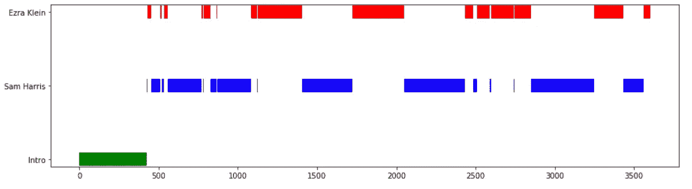

The final audio X-Ray

# **1。创建“块”来标记**

用 [scipy](https://docs.scipy.org/doc/scipy-0.14.0/reference/generated/scipy.io.wavfile.read.html) 读入音频是一件轻而易举的事——单声道音频只是一个按时间顺序排列的 1D 数组。我们现在考虑改变用于存储我们将标记的数据“块”的窗口大小的权衡。这里的采样频率 *Fs* 是标准的 44.1 kHz，这意味着我们的数组大小为 44，100 * N，块时间 *N* 秒。窗口越小，时间位置就越精确，并且语音相互干扰的可能性就越小。

但是更长的时间窗也有助于识别声音——而不仅仅是尖锐的元音。我们可能会怀疑这涉及到在足够长的时间内观察某种平均音色。基于这次讨论中冗长的发言时间，五秒钟最终给出了良好的结果(如果有更多的中断，这可能是太大了)。

在频率分辨率上也有更基本的妥协(认为更短的时间窗给出更宽的谱峰)。但是这种现象只有在我们为*整个组块提取频谱时才是重要的。如果我们分析共同告知组块标签的子组块，我们可以避开这一点(这正是我所做的)。*

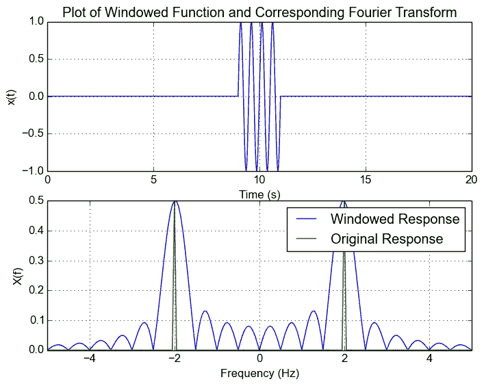

Chunking audio has the same effect as applying a rectangular window — it changes the green peak to the blue peaks. The frequency resolution in a discrete Fourier transform is proportional to *Fs*/*N*. Source [http://saadahmad.ca/fft-spectral-leakage-and-windowing/](http://saadahmad.ca/fft-spectral-leakage-and-windowing/)

> 傅立叶变换是连接“倒易坐标”的数学。它的缩放特性抓住了我们在许多物理现象中观察到的折衷，例如在频谱分析中(频率分辨率与时间精度)；[夫琅和费衍射](https://en.wikipedia.org/wiki/Fraunhofer_diffraction)(狭缝间距越小，衍射图样越宽)；[量子力学中的不确定性](https://en.wikipedia.org/wiki/Uncertainty_principle)(我们确定的位置越精确，动量的不确定性就越大)。

# **2。音频功能**

信号的时间成分并不能揭示声音的本质特征。声波只是空气中的压力扰动，这些扰动的周期性确实揭示了频域中的某种特征。每个块的快速傅立叶变换( [FFT](https://docs.scipy.org/doc/scipy/reference/generated/scipy.fftpack.fft.html) )完成了这个任务，并产生了下面描述的频谱。

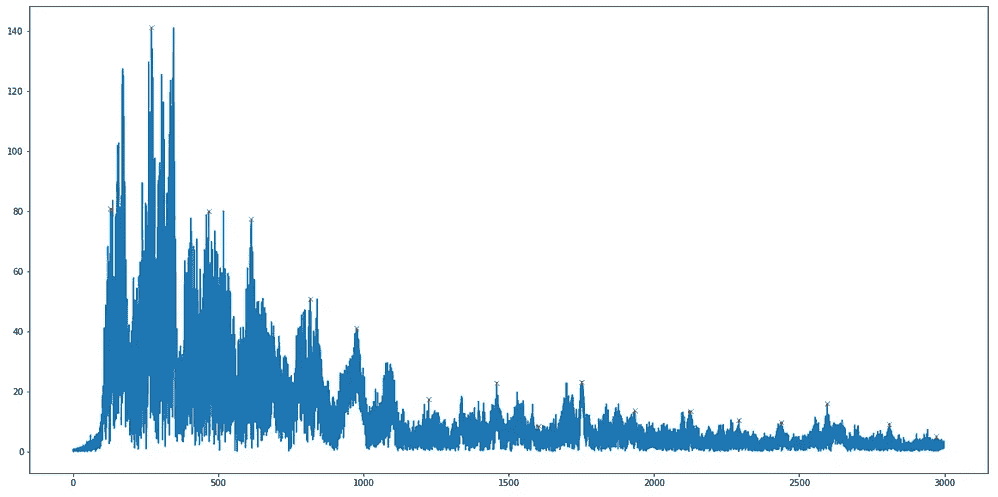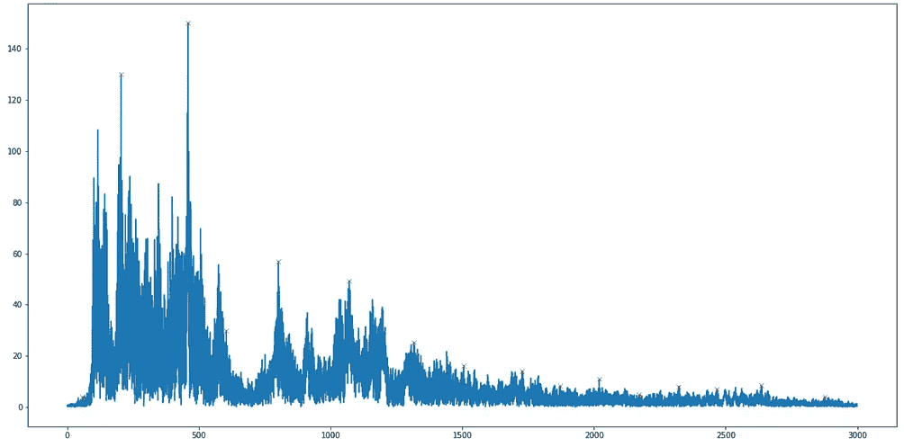

Frequency spectra for Ezra Klein (left) at 30:00–30:05 and Sam Harris (right) at 16:40–16:45\. We actually only need the positive terms since for purely real input the output coefficients are “Hermitian-symmetric” i.e. every complex conjugate appears and these correspond to redundant negative-frequencies

这些频谱显然是非常密集和高维的，因此我们可以使用男性音域的[带宽来进行粗略的截止。](https://en.wikipedia.org/wiki/Voice_frequency)

fs/N represents the unit element change in frequency as we move between elements in the FFT spectrum

这降低了频谱的维数，但回想一下，每个频率分量实际上有两个值，一个实部和一个虚部。当我们观察光谱时，我们看到的是两部分的数量级。然而，傅立叶变换中的相位(两部分的比率)承载了图像和音频的大部分信号。

我们可以通过交叉 Ezra 和 Sam 剪辑之间的幅度和相位来测试这一点，下面是一些(未标准化的)突变剪辑。

Doing naughty things with audio

Original and mutant clips of crossed real/imaginary parts and magnitudes/phases between two chunks

此时，我们可以将幅度和相位的结构传递给一个降维算法(见第 4 节)来可视化输出。这是我最初做的产生两个非常模糊的组，它也不是很快。

librosa 库有多个[函数](https://librosa.github.io/librosa/feature.html)用于从频谱中提取特征(如“质心”、能量分布等)。)或时间序列(如过零率)。我们也可以考虑使用 [scipy.signal](https://docs.scipy.org/doc/scipy/reference/signal.html) 来检测频率峰值和峰值宽度。**然而，我们选择的特征必须是特定于通过音色以音高不变的方式分离声音的任务**。如果问题集中在音高检测上，我们会选择区分音高而不是音色的特征。

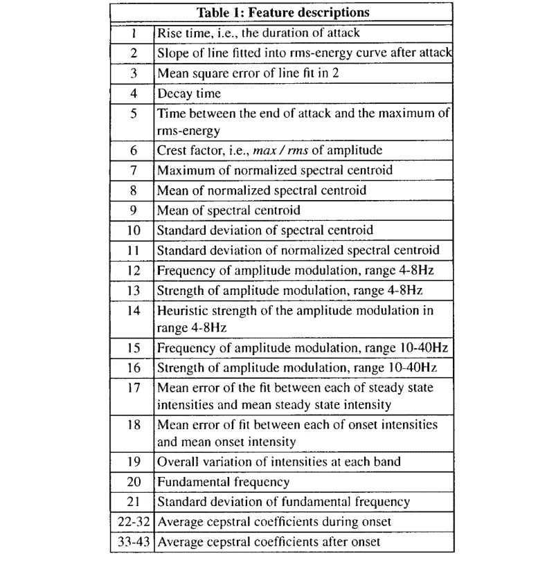

Examples of audio features as described in Eronen, Antti & Klapuri, Anssi. (2000), Musical instrument recognition using cepstral features and temporal features

换句话说，我们必须确保选择的特征不会精确地“指纹化”数据——我们需要更模糊的东西。我们转向在这方面证明最成功的特性——Mel 频率倒谱系数(MFCCs)。

# **3。提取梅尔频率倒谱系数**

MFCCs 最初被开发用来表示人类声道发出的声音。它利用 Mel 标度，即频率的对数变换，旨在捕捉人类对声音的非线性感知，从而降低对较高频率差异的敏感度。这意味着 MFCC 向量之间的较大距离与较大的感知变化相关，因此可以更稳健地捕捉音色，而不仅仅是音高。[这](https://medium.com/linagoralabs/computing-mfccs-voice-recognition-features-on-arm-systems-dae45f016eb6)和[这](https://haythamfayek.com/2016/04/21/speech-processing-for-machine-learning.html)比我能更好地深入他们的计算机制，所以我将避免在这里这样做。

自动语音识别任务通常查看 12–20 个倒谱系数，第 0 个系数可以被丢弃，因为它仅传达平均功率的恒定偏移，与整体频谱形状无关。通过选取 15 个系数并去掉 0 阶，我的结果还不错。

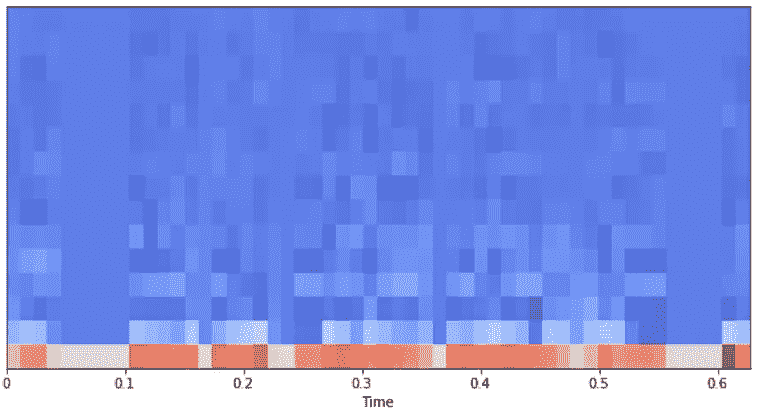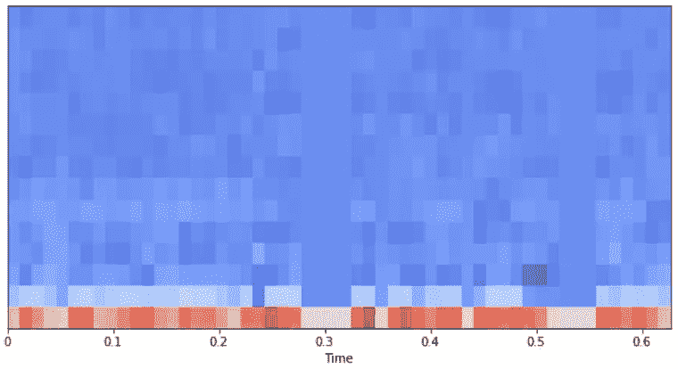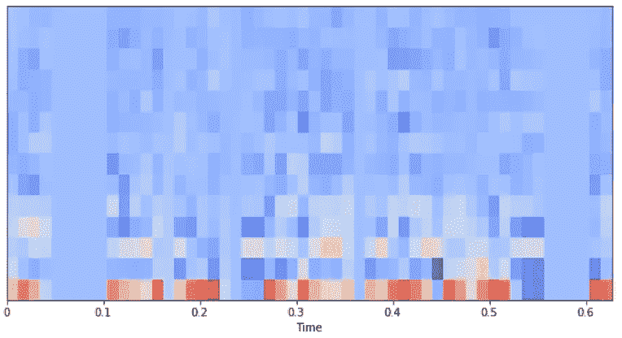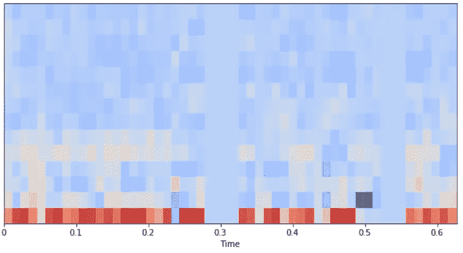

MFCC spectrogram for Ezra Klein (left) at 30:00–30:05 and Sam Harris (right) at 16:40–16:45\. Removing the 0th order coefficient in the top row gives the bottom row which exhibits a smaller range between the coefficients

MFCC 提取涉及“成帧”或“开窗”，在输入上应用滑动窗口，很像[短时傅立叶变换](https://en.wikipedia.org/wiki/Short-time_Fourier_transform)，以产生几百组 15 个系数(在每个音频块内)，每个连续帧一个。这里的基本原理是，我们希望保留信号在暂时稳定时出现的频率轮廓。如果我们对整个块进行傅立叶变换，这些可能会丢失(正如我最初所做的)。

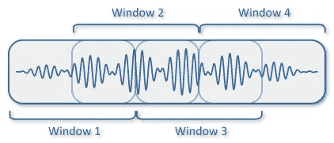

**Framing** within a single “chunk” of audio being identified. Consecutive frames are often set to overlap partially

当分析音频的小窗口时，一些附加的傅立叶理论在这里是值得考虑的。模拟不连续性，如方波的尖角，需要许多高频项。如果我们在整个音频中创建尖锐的仓，我们可以预期边缘处的不连续性会产生[杂散高频成分](https://en.wikipedia.org/wiki/Gibbs_phenomenon)以及[频谱泄漏](https://en.wikipedia.org/wiki/Spectral_leakage)，因此使用[窗口函数](https://docs.scipy.org/doc/scipy-0.14.0/reference/generated/scipy.signal.hamming.html)使边缘逐渐变细是有意义的。

从光谱计算 MFCCs 的过程具有大大降低输入维数的额外好处。在每一帧中，我们采集大量样本(这里是 2048 个)，将这些样本减少到每帧 15 个系数。最终的特征向量是从所有这些帧的系数的平均值建立的。增加方差并不能改善结果。

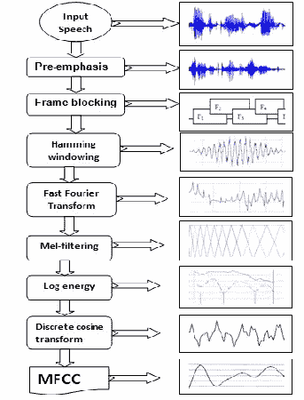

The process for extracting MFCCs. Mel filter banks have a triangular bandwidth response on a Mel-scale and there are typically 40 of them. Source: [https://www.ijser.org/paper/Performance-analysis-of-isolated-Bangla-speech-recognition-system-using-Hidden-Markov-Model.html](https://www.ijser.org/paper/Performance-analysis-of-isolated-Bangla-speech-recognition-system-using-Hidden-Markov-Model.html)

# **4。维度缩减**

**PCA** 是事实上的降维主力——一种快速、确定性的线性变换，当沿着最大方差的特征向量分离数据时，它可以保留数据的**全局**结构。例如，如果我们[对 MNIST 数字](https://github.com/lmcinnes/umap)进行分组，我们将会看到 1 的聚类的质心远离 0，而 4，7，9 的聚类相对较近。然而，我们不能假设在高维空间中邻近的邻居也是紧密的。

一种更现代的方法是 **tSNE** ，这是一种受益于保留**局部**结构的随机技术——它将邻居放置在高维空间中彼此靠近，但以一些全局结构为代价。例如，分组 MNIST 数字时，我们看到干净孤立的簇，而 PCA 产生连续的拖尾。


UMAP and tSNE on different datasets. The global structure in the MNIST dataset is apparent

[**UMAP**](https://github.com/lmcinnes/umap) 是一种较新的技术，能够捕捉全局结构(à la PCA)和局部结构(à la tSNE)。它也比最好的多核 tSNE 实现快得多(在 MNIST 上快 13 倍)，并且还可以提供定制的距离函数。在这个双音问题中，降维技术的决策可能不太重要，但获得一些实践经验也是很好的。一旦 MFCCs 进行第一阶段的缩减，对 3600 个块 x 15 个系数的处理时间非常快。

# 5.**结果**

下图显示的不是两个不同的集群，而是三个！每个点的颜色表示进入播客的时间，边连接连续的块。因此，深蓝色的点表示这段介绍可能是在不同的时间，用不同的设备或在不同的环境下录制的。这里好看的是 Sam 打开的介绍集群(深蓝色)更接近他的对话集群。如果我们移除一些较高的 MFCC 系数(8+)的话，这两个集群实际上可以被包含在内，尽管代价是 Sam 和 Ezra 之间的全局分离。

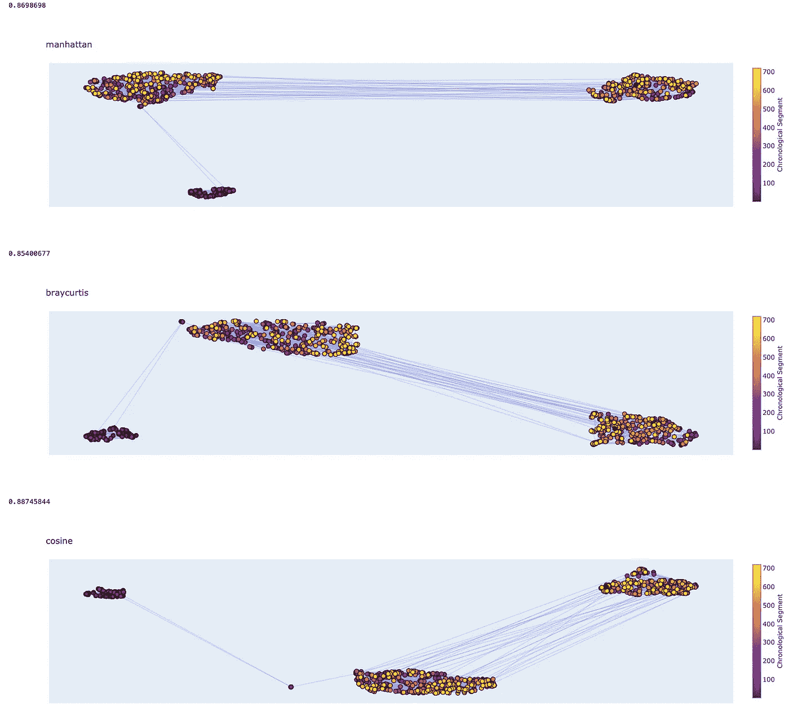

The three distance metrics I saw perform the most reliably for this task of the many UMAP has built in were manhattan, braycurtis and cosine. Silhouette scores above each plot were used for light guidance on clustering performance. A small dark blue cluster appears sometimes given different MFCC parametric configurations

在这里，我们可以对 k=3 个聚类应用 kmeans，通过监听每个聚类中的点，将每个点映射到三个标签中的一个。但是将每个点链接到它的音频块以便点击播放不是很好吗？这将有助于聚类的*验证*，并回答诸如“一个聚类中最接近另一个聚类的点是否代表具有两种声音的组块”之类的问题。使用[破折号](https://plot.ly/dash/)和 plotly 以及一些 javascript 和一个[第三方库](https://github.com/jimmybow/visdcc)，这被证明是令人惊讶的挑战，但不是不可克服的。

总之…结果！

Dash app with plotly and some javascript. Note the final point selected that is being tugged by both clusters features both Ezra **and** Sam (braycurtis distance metric used)

不会太寒酸吧？现在我们有了我们的 kmeans 标签，我们可以计算经常引用的辩论统计数据，发言持续时间。

```
**Sam Harris**    365 chunks
**Ezra Klein**    272 chunks
**Intro**          85 chunks
```

除了介绍之外，Sam 讲了 57%的时间！毕竟这是他的播客。再加上每个数据块的时间成分，这是一个相当令人满意的最终产品:对话的 X 射线时间线。在 2500s 的 Sam 阶段的交换频率表明这个部分特别有趣/激烈。


The final audio X-Ray, again

# 密码

我整理了我的笔记本，可以在[这个要点](https://gist.github.com/jpryda/7e57e6ce3cf57308aed85478c1ec3975)中找到

# **参考文献**

 [## mfcc

### 信号的 mel 倒谱系数(MFCCs)是一个很小的特征集(通常大约 10-20 ),它…

musicinformationretrieval.com](https://musicinformationretrieval.com/mfcc.html) [](https://haythamfayek.com/2016/04/21/speech-processing-for-machine-learning.html) [## 机器学习的语音处理:滤波器组，梅尔频率倒谱系数(MFCCs)

### 语音处理在任何语音系统中都起着重要的作用，无论是自动语音识别(ASR)还是语音识别系统

haythamfayek.com](https://haythamfayek.com/2016/04/21/speech-processing-for-machine-learning.html) [](https://medium.com/@LeonFedden/comparative-audio-analysis-with-wavenet-mfccs-umap-t-sne-and-pca-cb8237bfce2f) [## 使用 Wavenet、MFCCs、UMAP、t-SNE 和 PCA 进行比较音频分析

### 这篇文章是关于一个探索二维音频数据集的项目。我涵盖了一些有趣的算法，如…

medium.com](https://medium.com/@LeonFedden/comparative-audio-analysis-with-wavenet-mfccs-umap-t-sne-and-pca-cb8237bfce2f) [](https://medium.com/linagoralabs/computing-mfccs-voice-recognition-features-on-arm-systems-dae45f016eb6) [## 在 ARM 系统上计算 MFCCs 语音识别特征

### 我在 Linagora 的 R&D 部门做 LinTO 项目的实习生。你认识林托吗？如果没有，你应该！林托…

medium.com](https://medium.com/linagoralabs/computing-mfccs-voice-recognition-features-on-arm-systems-dae45f016eb6)