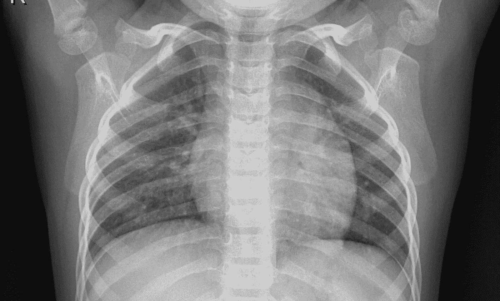
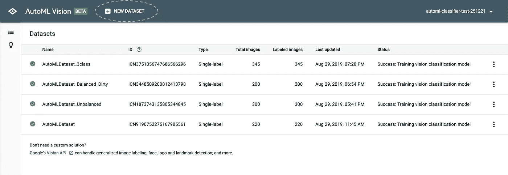
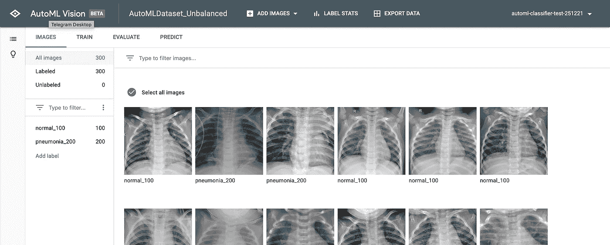
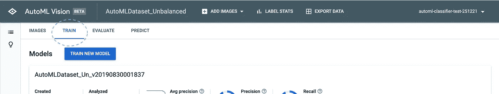
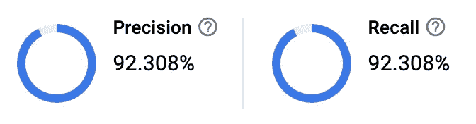
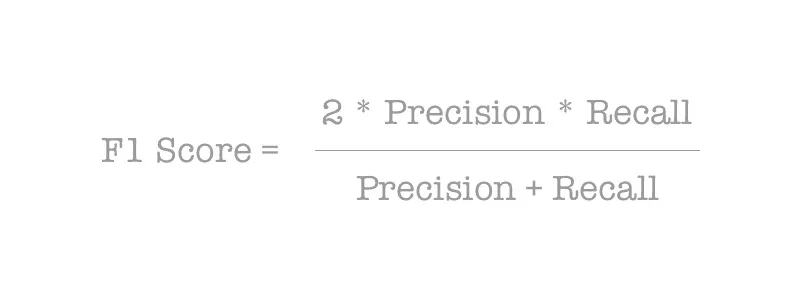
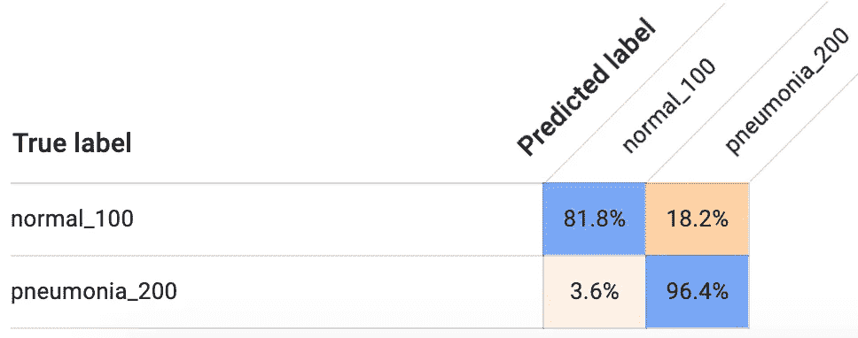
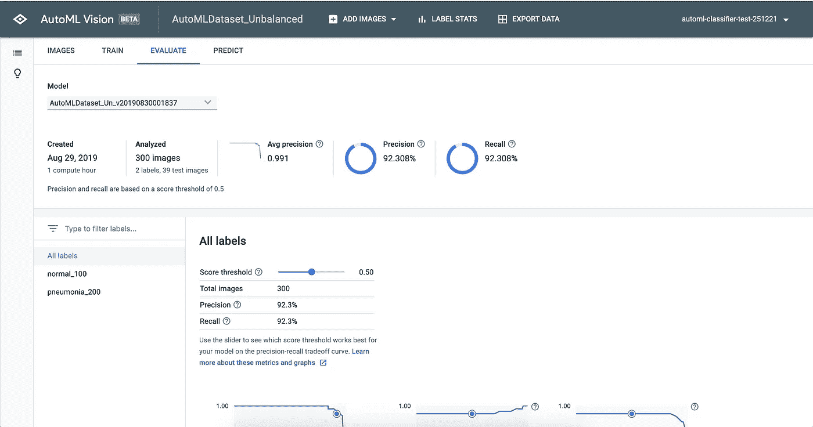
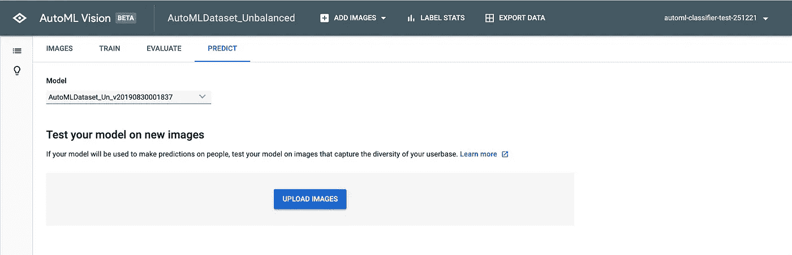
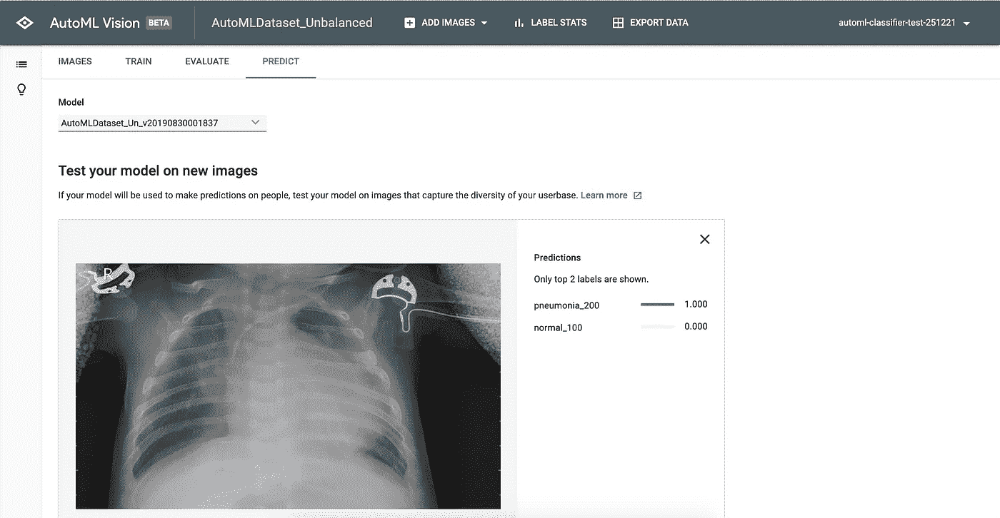

# x 射线图像分类:简单的方法

> 原文：<https://towardsdatascience.com/x-ray-image-classification-the-easy-way-69665448604a?source=collection_archive---------20----------------------->

## 使用谷歌云 AutoML

Chest x-ray of a healthy child

> “人工智能将比人类历史上任何东西都更能改变世界。不止电。”—人工智能甲骨文和风险投资家李开复博士，2018

随着[人工智能(AI)](https://en.wikipedia.org/wiki/Artificial_intelligence) 和[机器学习(ML)](https://en.wikipedia.org/wiki/Machine_learning) 的快速进步，以及我未婚夫自愿分享的人工智能每日文摘，我认为是时候深入了解并亲自看看到底是怎么回事了。我尤其感兴趣的是，如何巧妙地将人工智能融入产品开发对话，以及如何应用它来打造人们喜爱的产品。毕竟，如果你不知道某样东西有什么能力，你怎么能真正用它来创新呢？

虽然我获得了计算机科学学士学位，但我不是人工智能、人工智能或深度学习方面的专家。你也不需要成为一个专家来开始。在这篇文章中，我将分享如何使用神经网络进行图像分类的“简单方法”。注意，图像分类不同于图像检测和图像识别[1]。我将从如何创建数据集开始，然后这将被用作建立机器学习模型的输入。请记住，这不是唯一的方法，而是学习如何用神经网络进行图像分类的起点，特别是如果你是人工智能领域的新手。

> 你知道吗？深度神经网络最适合进行图像分类。

在我们开始之前，这里有一些我们将使用的例子的背景。下面使用的 x 光图像是儿童的。这个图像分类项目的目的是帮助医疗专业人员快速识别患有肺炎的儿童。

# 创建数据集

数据集是数据的集合。这是正确的关键部分，因为它是你的模型建立的基础。如果它不在数据中，模型就不会学习它不知道的东西。为了训练机器学习模型，高质量的数据集是必不可少的，因为数据定义了模型的行为和性能。

## 数据定义了模型

仅仅拥有大量数据并不等于拥有高质量的数据集。归结起来就是拥有“正确的数据”。这意味着数据必须:

*   反映真实世界的例子
*   捕捉模型可能遇到的所有变化/场景示例— *常见、罕见以及介于两者之间的所有情况。*
*   使用多样化的例子*(例如，不要只使用背景中有雪的狗的图片，因为模型可能会将雪背景与狗联系起来，但实际上我们希望模型检测的是狗而不是雪)*
*   保持平衡— *如果一个类/类别的例子比另一个多，那么训练好的模型表现会很差。*
*   随着新的例子或变化的出现而定期更新，以便模型也知道这些。

## 数据拟合

我们还需要确保数据集涵盖所有必要的用例。缺乏足够的用例可能会导致模型训练不足。创建数据集时应该问自己的问题:

*   我需要多少数据？
*   我需要什么类型的数据？
*   数据集中有足够的变化来涵盖所有的例子吗？
*   数据是否准确完整地反映了所有相关的用例？

回到我们的儿童 x 射线图像数据集示例，它应该包含以下内容:

*   每个儿童年龄(有或没有肺炎症状)的 x 光片数量均衡
*   曝光时间范围不同的均衡数量的 x 射线图像(有和没有肺炎症状)
*   包含可能与肺炎相混淆的其他诊断的 x 射线图像

除了有一个多样化的数据集，有各种各样的正面和反面的例子，我们还需要有与每个例子相关联的标签。如果数据集尚未被标注，则需要先对其进行标注，然后才能将其用作构建模型的输入。你可以自己给数据集贴标签，也可以付费完成。

> “在现代人工智能中，数据决定一切。人工智能软件的智能取决于用来训练它的数据。如果系统中白人男性比黑人女性多得多，那么识别黑人女性的能力就会更差。”— [《纽约时报》](https://www.nytimes.com/2018/02/09/technology/facial-recognition-race-artificial-intelligence.html)

一定要注意不平衡的数据集，它们会在你的模型中引入不必要的偏差。不平衡数据集是指一个或多个标签的示例明显多于或少于其他标签的数据集。给数据集加标签后，检查与每个标签相关联的示例数量，以确保每个标签都有相同数量的示例。如果你看到一个特定的标签只有几个例子，而其他的有十几个，那么当这个模型用于现实世界时，你很可能会观察到一些偏差。一旦您对数据集的覆盖范围感到满意，就该构建模型了。

# 建立模型

有两种方法可以建立模型:(1)自动 ML 和(2)定制建模。“自动化 ML”是一项付费服务，这意味着它很容易上手，并且对于快速开发或模型原型制作来说很便宜。然而，它很难扩展，并且提供商可以访问敏感数据。另一方面，“定制建模”对于无限的用例是完全可定制的，并且可以完全控制用于调整模型的参数。但缺点是入门成本高，需要机器学习专业知识。在线自动化 ML 服务，如谷歌云和 IBD 沃森，使任何人都可以通过简单地提供高质量的标签数据集来快速创建模型。

在我们开始构建我们的模型之前，定义我们期望从这个模型中得到的业务目标和结果是很重要的。还要考虑你希望你的模型具有的性能水平。作为一个开始的基准，我们可以在这项任务中使用人的表现。如果模型能比人类做得更好，那么我会说模型处于一个不错的状态。现在，让我们建立一个模型。

## 1.训练模型

如前所述，数据定义了模型的行为和性能，包括其功效和准确性。因此，坏数据会导致坏模型。例如，如果你给一个模型输入一个训练数据中没有的图像，它将不会被正确分类。

对于我们的 X 射线示例，我们将使用 Google Cloud AutoML Vision 来训练模型。我们将使用 Kaggle [2]中已经准备好的数据集。首先，点击“新建数据集”上传带标签的数据集:

1.0 Look for the “New Dataset” button in dotted blue circle

数据上传后，您的屏幕应该如下所示:

1.1 A data set uploaded successfully

接下来，我们将使用此数据集训练模型，方法是转到“train”选项卡，然后单击“Train model”。

1.2 Look for “Train Model” button within the “Train” tab.

请注意，该数据集将被自动划分为用于训练、测试和验证模型的数据集，因为用于训练模型的数据不应用于测试或验证模型。

在完成模型训练后，我们需要了解这个模型“有多好”。我们将深入研究分析模型结果的方法，也就是*输出*。

## 2.评估模型

为了理解我们模型的质量，我们需要测量它的性能。为此，通常使用以下指标:

*   **精度**是正确预测占预测总数的百分比。
*   **Recall** 是实际实例总数中正确预测的百分比(又名真实标签，[基本事实](https://en.wikipedia.org/wiki/Ground_truth)正面)。

2.0 Example of precision and recall for an [unbalanced data set](https://www.datascience.com/blog/imbalanced-data)

*   **F1 得分**是准确率和召回率的加权平均值；这既考虑了[的误报又考虑了](https://en.wikipedia.org/wiki/False_positives_and_false_negatives)的漏报。请注意，F1 分数也可以从下面的混淆矩阵中计算出来。

2.1 F1 Score Equation

*   **混淆矩阵**是描述模型的性能，特别强调模型哪里是正确的(见蓝色)和/或失败的(见橙色)。

2.2 The confusion matrix for the same unbalanced data set from above

回到我们停止使用 AutoML Vision 训练模型的地方，转到数据集的“评估”选项卡，查看模型的性能。它应该是这样的:

2.3 Model evaluation

如果您向下滚动，您将看到更多指标(如混淆矩阵)，还可以看到每个特定标签的绩效指标。

没有训练一个模型一次就得到“完美模型”的说法。这是一个反复的过程。因此，如果您对结果不满意，您有两个选择:1)改进数据，2)实现自定义模型。我强烈建议您首先考虑改进数据，一旦您无法获得任何更好的结果，才考虑实现您自己的模型。在这一点上，您将会更好地理解为什么您的模型没有达到预期。尽管如此，如果有一个高质量的数据集，AutoML 提供的模型可能会让您达到一个不错的水平。

## 3.模型预测

最后，让我们看看模型在新图像下的表现。转到“预测”选项卡，上传未在训练/测试数据集中使用的图像。

3.0 Look for “Upload images” button within the “Predict” tab

一旦做出预测，您的屏幕应该看起来像这样:

3.1 A model’s prediction on a new child x-ray image

恭喜你，你已经完成了你的第一个模型！

# 你自己试试

您现在已经准备好亲自尝试图像分类。没有比亲自尝试更好的学习方法了。

请注意，谷歌云提供价值 300 美元的免费试用，帮助您入门。因此，它不会花费你任何东西。

**这里有一些资源可以帮助你开始:**

*   [1] [用 ML 进行图像检测、识别和分类](https://azati.ai/image-detection-recognition-and-classification-with-machine-learning/)
*   [2] [儿童胸部 x 线照片来自 Kaggle](https://www.kaggle.com/paultimothymooney/chest-xray-pneumonia/version/2)
*   [云汽车视觉初学者指南](https://cloud.google.com/vision/automl/)
*   [云汽车](https://cloud.google.com/automl/)

欢迎在下面的评论中分享你的想法。