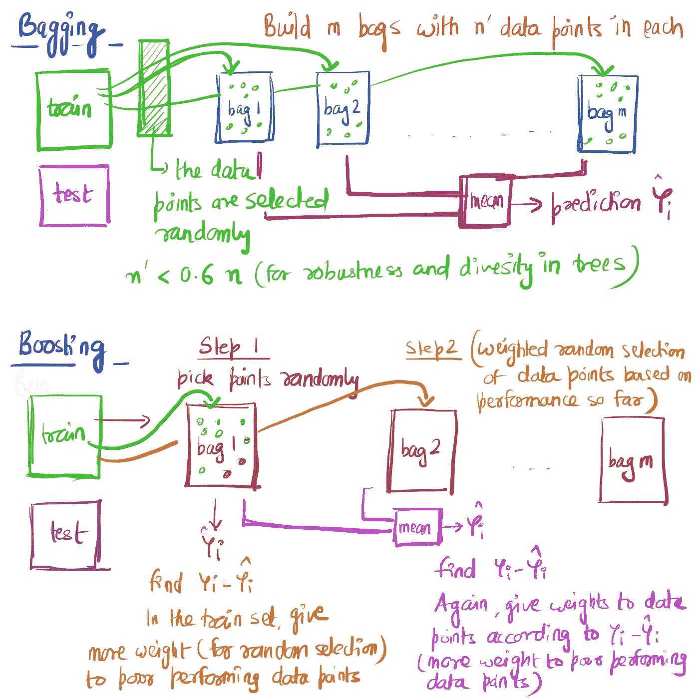
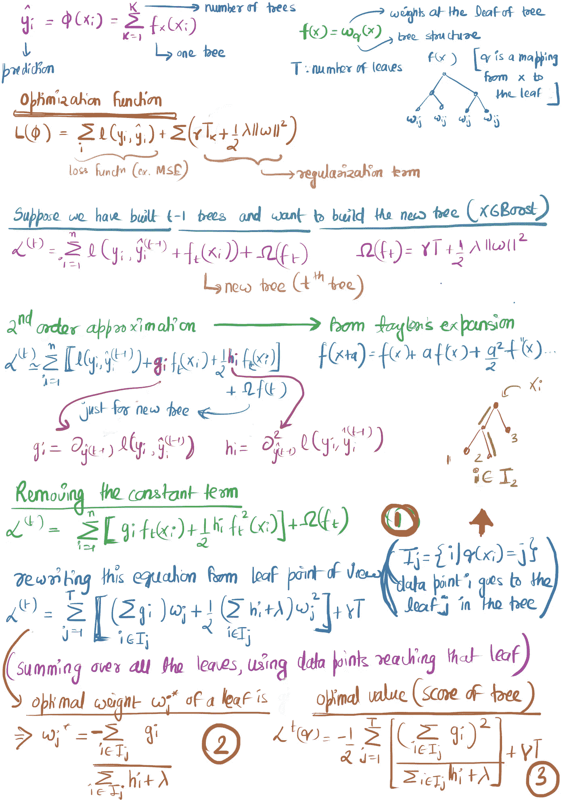
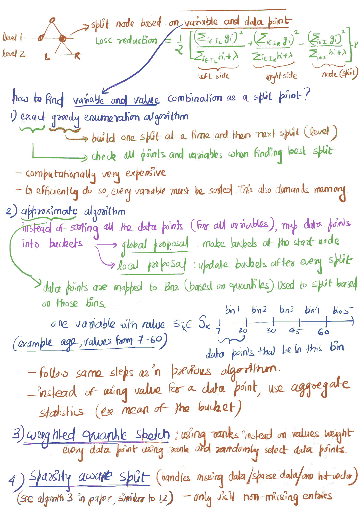

# XGBoost:直观的解释

> 原文：<https://towardsdatascience.com/xgboost-an-intuitive-explanation-88eb32a48eff?source=collection_archive---------23----------------------->

我们都知道 XGBoost 是如何凭借性能和速度在 Kaggle 比赛中称霸的。这个博客是关于理解 XGBoost 是如何工作的(试着解释一下研究论文)。这篇博客不是关于如何编码/实现 XGboost 或者如何调优它的超参数。

XGBoost 代表 e**X**treme**G**radient**Boost**ing。首先，回顾一下图 1 中的装袋和增压。它解释了 bagging(引导聚合)和 boosting(自适应 Boosting)。更准确地说，助推是如何添加到装袋的想法。在装袋过程中，随机选择不同袋子的数据点，并以相等的概率进行替换。在 boosting 中，基于迄今为止的模型性能来选择数据点。当创建一个新的包时，表现为**差**的数据点被赋予更多的权重。基于该重量，拾取数据点(轮盘赌类型选择)。XGBoost 基于类似的 boosting 思想(非随机地构造新的树)。

Figure 1\. Bagging vs Boosting

类似于 boosting，我们在 XGBoost 中基于模型到目前为止的性能构建一个新的树。图 2 给出了构建新树背后的符号和数学。

Figure 2\. Building a new Tree in XGBoost

上面的步骤显示了当树按顺序构建时(像在 boosting 中)，如何计算新的**树的权重。如果我们知道树的结构 *q* ，我们就可以在方程(3)中获得根的权重和得分函数。**但是我们不知道 *q*** 并且不可能枚举和尝试每一个树形结构。在寻找树的过程中，在树性能和计算工作量之间有一个折衷(取决于算法)。论文中提到的算法的要点如图 3 所示。**

Figure 3\. Finding the tree structure **q**

这是本文的前三部分。第 4 节涉及系统设计(更多的是从数据工程师的角度，我个人没有这方面的专业知识)。第 5 节讨论以前的工作，第 6 节显示 XGBoost 性能评估。

XGBoost 的开发者做了大量的工作**超越了**仅仅是开发一个新的算法来构建树。其中包括:

1.  他们使它们在计算上高效(这使得扩展 XGBoost 和在非花哨的计算设备上实现成为可能)。
2.  XGBoost 可以处理缺失和稀疏的数据
3.  它基于并行和分布式计算(可以在短时间内处理数百万个数据点，允许快速的模型探索)

**参考文献:**
[XGBoost:一个可扩展的树提升系统](http://dmlc.cs.washington.edu/xgboost.html)(原文)
[机器学习掌握](https://machinelearningmastery.com/gentle-introduction-xgboost-applied-machine-learning/)(解释 XGBoost 的优点)
[谈 XGBoost 陈](https://www.youtube.com/watch?v=Vly8xGnNiWs&feature=emb_logo)(XGBoost 的主要作者)
[打包](https://www.youtube.com/watch?v=2Mg8QD0F1dQ) (Udacity 视频)
[提升](https://www.youtube.com/watch?v=GM3CDQfQ4sw) (Udacity 视频)

我希望这篇博客对理解 XGBoost 背后的逻辑有所帮助。如果有错误或不清楚的地方，请写信给 ucdavis.edu 的 ashnayak

*原载于 2019 年 12 月 17 日 https://medium.com**的*[T22。](https://medium.com/@ashutoshnayakkgp/xgboost-an-intuitive-explanation-9843b4ac4509)