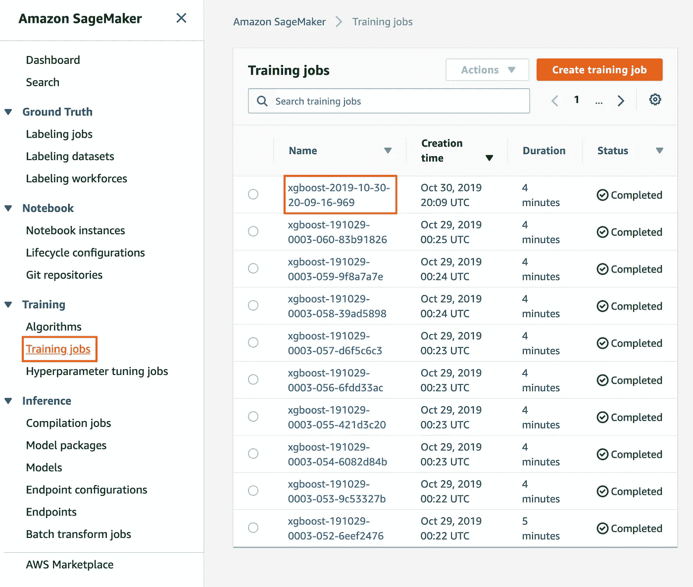
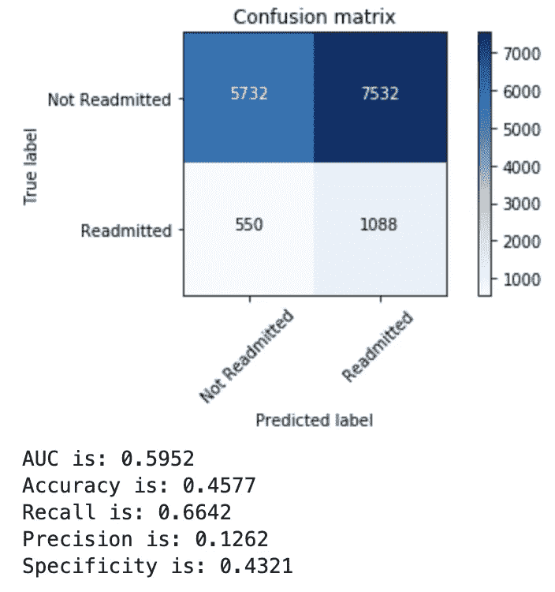
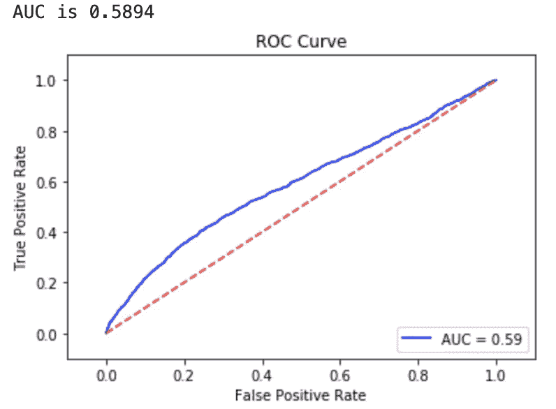

# 亚马逊 SageMaker 中的 XGBoost

> 原文：<https://towardsdatascience.com/xgboost-in-amazon-sagemaker-28e5e354dbcd?source=collection_archive---------6----------------------->

## SageMaker 中 XGBoost 分类的完整演练

什么是 SageMaker？SageMaker 是亚马逊网络服务(AWS)的机器学习平台，在云中工作。它是完全托管的，允许用户在平台上执行整个数据科学工作流。在这篇文章中，我将向您展示如何从 AWS S3 调用您的数据，将您的数据上传到 S3 并绕过本地存储，训练模型，部署端点，执行预测，以及执行超参数调整。

*数据清理和特征工程代码来源于* [*这篇*](/predicting-hospital-readmission-for-patients-with-diabetes-using-scikit-learn-a2e359b15f0) *的博文，作者是 Andrew Long，他给出了使用其代码的完全许可。数据集可以在* [*这里找到*](https://archive.ics.uci.edu/ml/datasets/diabetes+130-us+hospitals+for+years+1999-2008) *。*

# 启动您的笔记本实例

前往你的 AWS 仪表板，找到 SageMaker，在左侧栏，点击“笔记本实例”。要创建实例，请单击橙色按钮“创建笔记本实例”。在这里，您可以选择实例名称、实例类型、弹性推理(根据需求和使用情况调整实例大小)以及其他安全特性。除非您的公司有特定的安全需求，否则我倾向于不考虑这些，只填写实例名。启动需要几分钟时间，在成功托管实例之后，AWS 为您提供了两个选项来编写代码；朱庇特笔记本或朱庇特实验室。

## 导入包

一旦您选择了其中一个选项，您将需要运行一些代码来准备好您的笔记本。

由您来决定是否导入前半个包，但是您需要导入后四个包才能开始。

## 从 S3 读取数据

从 S3 读取数据有几种不同的方法，为了尽可能简单，我们将使用`pd.read_csv`。

请注意，如果数据集位于没有文件夹的桶中，则不需要前缀。

# 数据清理和特征工程

由于这是一个 SageMaker 演练，而不是一个功能工程帖子，我将简要说明我采取了哪些步骤来准备数据集来训练我们的模型。

## 问题陈述

我们试图预测糖尿病患者是否会在最后一次就诊后 30 天内再次入院。这里的`OUTPUT_LABEL`将是我们的`readmitted`专栏。我们将那些有`<30`的标记为阳性，其余的标记为阴性。我们还:

*   放弃`discharge_dispositon_id`,因为有些价值观与死亡或临终关怀有关
*   删除了`encounter_id`和`patient_nbr`，因为它们是患者标识符
*   重新标记了`age`并将`weight`变成了一个二进制变量
*   仅取`medical_specialty`中的前 10 个值，并将其余值分组为`Other`
*   在`race`、`payer_code`和`medical_specialty`变量中填入 NaN 作为`UNK`
*   使用`pd.dummies()`对所有分类变量进行一键编码

我们最终得到 143 个特征，8 个数字特征和 135 个分类特征。

SageMaker 中 XGBoost 的一个非常重要的地方是，**你的** `**OUTPUT_LABEL**` **必须是训练和验证数据集中的第一列。**

我发现了一个非常有用的代码，将您的`OUTPUT_LABEL`移动到数据集的第一列，它是这样的:

# 培训/验证/测试

我们将数据集分成 70/15/15。一个好的做法是上传这些。csv 文件到 S3，分别在培训和验证文件夹下。您将需要培训和验证文件。

如果因为文件太大而耗尽了本地笔记本实例存储，可以使用以下代码绕过本地存储，直接上传到 S3。

接下来，您需要用导入的`sagemaker`库指定您的培训和验证文件。如果没有前缀(桶内文件夹)，可以删除第二个`{}`。

# 模型

## 培养

注意到我们没有安装和导入 XGBoost 吗？这是因为我们将使用 SageMaker 提供的预构建 XGBoost 容器。我们将导入包，设置我们的训练实例，并设置超参数，然后使模型适合我们的训练数据。

就是这样！恭喜你，如果你正确完成了以上步骤，你的模特应该正在训练！

## 估价

如果你不关心探索你的模型中的顶级特性(坏主意！)，可以跳过这第一段。在 SageMaker 的预构建 XGBoost 中绘制特性重要性不像在 XGBoost 库中那样简单。

首先，您需要找到培训作业名称，如果您使用上面的代码来启动培训作业，而不是在仪表板中手动启动，培训作业将类似于`xgboost-yyyy-mm-dd-##-##-##-###`。你可以在这里找到:

SageMaker 中可能有一行代码，您可以运行它来返回最新的作业名称，这将省去您去仪表板查找它的麻烦。如果你找到了，请告诉我！

在您找到培训工作名称之后，您将需要运行下面的代码来从 S3 下载模型工件到笔记本实例，然后使用`tarfile.open()`打开工件，提取它，然后使用`pickle`加载它。在 AWS SageMaker 研讨会上呆了三天后，这是我们找到的最好的解决方法。

然后，由于 XGBoost 使用无头数据帧，我们必须将特性名称追加回各个列。要绘制顶部特征，使用以下代码(`cols_input`是输入变量，不包括`OUTPUT_LABEL`):

我们现在将部署一个端点，它是您传递新的和看不见的数据(测试集)以获得预测的网关。

你的预测现在被存储为`predictions`数组。

使用您选择的阈值创建混淆矩阵:

您将阈值设置在第二行，高于该阈值的任何内容都将被归类为阳性。上面的代码会返回类似这样的结果。

最后但同样重要的是，让我们绘制你的 AUC！

# 超参数调谐

超参数调优工作也可以从 SageMaker 仪表板启动，但我喜欢在笔记本上做任何事情。从笔记本中启动超参数调整工作有许多不同的方法，但是在尝试了许多代码之后，我相信这是最简单的方法。

上面单元格的输出应该返回`InProgress`，这意味着您已经成功启动了一个贝叶斯超参数调优作业。请注意，max_parallel_jobs 设置为 10，在运行贝叶斯优化算法时，不应该超过这个值。我相信最大值是 30，但是设置在 10 以上会导致很多失败的工作，这是浪费时间和金钱。您也不需要指定 XGBoost 模型中的每个参数，如果您删除了一个参数，作业仍然会运行。

您将再次需要通过找到您的最佳执行模型的名称来下载模型工件。您可以通过转到仪表板中的“Hyperparameter tuning jobs ”,单击相应的调优作业，然后按客观指标(在本例中为 AUC)排序，复制最佳模型的名称，并使用您下载模型工件时使用的代码。下面是代码:

为了托管一个端点，您将需要附加到模型上，这是我们在第一次训练迭代中没有做的事情。我不确定为什么会出现这种情况，但是您需要运行这行代码，然后才能托管用于预测的端点。

请注意，该模型的名称与您找到的优化模型的名称相同。

# 结论

在本文中，我向您展示了:

*   如何启动您的笔记本实例
*   导入相关包
*   如何从 S3 读取数据
*   如何上传本地文件到 S3，如何上传到 S3 而不保存在本地
*   如何开始培训工作
*   如何下载您的模型工件，加载它，并提取模型中的顶级特性
*   如何部署端点并在测试集上获得预测
*   如何绘制混淆矩阵，获得模型度量和 AUC
*   如何启动超参数优化作业并获取优化后的模型

这是我第一次使用 SageMaker 进行这样的项目，我想分享一下我的工作流程和体验。感谢您阅读本文！

# 谢谢你看我的文章！

**如果你觉得这篇内容很有帮助，并想阅读我的其他内容，请随时关注我:** [Twitter](http://www.twitter.com/datascitips)
[insta gram](http://www.instagram.com/datascitips)
[脸书](http://www.facebook.com/datascitips)
**我发布了一些你可能会觉得有用的数据科学技巧和窍门！**