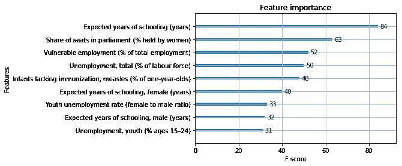

# XGBoost 简介:使用监督学习预测预期寿命

> 原文：<https://towardsdatascience.com/xgboost-predicting-life-expectancy-with-supervised-learning-1f61e0222f5f?source=collection_archive---------4----------------------->


A beautiful forest. So random! Source: [Pixabay](https://pixabay.com/photos/green-park-season-nature-outdoor-1072828/)

今天，我们将使用 XGBoost Boosted 树对官方人类发展指数数据集进行回归。谁说监督学习就是分类的？

# XGBoost:是什么？

XGBoost 是一个 Python 框架，它允许我们利用多核并行来训练增强树。它在 R 中也是可用的，尽管我们不会在这里讨论它。

# 任务:回归

提升树是一种用于回归的[机器学习](http://www.datastuff.tech/machine-learning/autoencoder-deep-learning-tensorflow-eager-api-keras/)模型。也就是说，给定一组输入和数字标签，他们将估计在给定相应输入的情况下输出标签的函数。

与分类不同，我们对标签感兴趣的是连续的值，而不是一组离散的类。

例如，我们可能希望根据一个人的体重和年龄来预测他的身高，而不是给他们贴上男性、女性或其他的标签。

对于每个决策树，我们将从根开始，根据决策的结果移动到左边或右边的子树。最后，我们将返回到达的叶子的值。

# XGBoost 的模型:什么是梯度增强树？

提升树类似于随机森林:它们是决策树的融合。然而，在我们预测的空间中，每片叶子将返回一个数字(或向量)。

对于分类，我们通常会返回落在每片叶子上的训练集元素的类的平均值。在回归中，我们通常会返回标签的平均值。

然而，在每个非叶节点上，树将做出决定:某个特征值和阈值之间的数字比较。

到目前为止，这只是一个退化森林。区别在哪里？

# 增强树与随机森林的区别

与随机森林不同，在训练增强树时，我们每次添加新树时都会更改标签。

对于每一棵新树，我们通过减去先前树的预测之和，再乘以一定的学习速率来更新标签。
这样，每棵树都将有效地学习纠正先前树的错误。

因此，在预测阶段，我们将简单地返回所有树的预测总和，乘以学习率。

这也意味着，与随机森林或袋装树木不同，如果我们任意增加树木的数量，这种模型**将**过度适应。然而，我们将学习如何解释这一点。

要了解更多关于助推树的知识，我强烈推荐你阅读 XGBoost 的[官方文档。他们教了我很多，并且用更好的图片更好地解释了基础知识。](https://xgboost.readthedocs.io/en/latest/tutorials/model.html)

如果你想更深入地研究这个模型，这本书[介绍统计学习](https://www.bookdepository.com/book/9781461471370/?a_aid=strikingloo&chan=ws)是我最终发现这些概念的书，我怎么推荐它都不为过。

# 结合 Python 使用 XGBoost

XGBoost 的 API 非常简单，但是我们还将了解一些它的超参数。然而，首先我将向你展示今天的任务。

# 今天的数据集:人类发展指数公共数据

人类发展指数数据集包含许多关于大多数国家几十年来发展水平的信息，涉及许多指标和领域。

对于今天的文章，我决定只看最近一年的数据:2017 年。这只是为了让事情保持最新。

我还必须执行一些数据整形和清理，以使原始数据集更易于管理，尤其是更易于使用。

本文的 GitHub 资源库是[，可以在这里找到](https://github.com/StrikingLoo/XGboost_HDI_analysis)，我鼓励您跟随 Jupyter 笔记本。然而，我会一直在这里添加最相关的片段。

# 用熊猫预处理数据

首先，我们将数据集读入内存。因为它包含一整列的年份，以及一行的国家和指标，所以管理起来相当麻烦。

我们将按照以下思路重塑它:

```
{country: {metric1: value1, metric2: value2, etc.}
   for country in countries }
```

这样我们就可以把它输入到 XGBoost 模型中。此外，由于所有这些指标都是数字的，因此在训练之前不再需要预处理。

这个片段去掉了具有 NaN 值的行，还告诉我们有 195 个不同的国家。

如果这些操作中的任何一个对你来说是新的，或者你在继续之前有任何困难，试着阅读我的[熊猫介绍](http://www.datastuff.tech/data-analysis/exploratory-data-analysis-pandas-seaborn/)。

为了查看数据集提供的所有可用的*指标*(指标)，我们将使用 *unique* 方法。

```
df['indicator_name'].unique()
```

有很多(97 个)，所以我不会在这里列出来。有些与健康有关，有些与教育有关，有些与经济有关，还有一些与女权有关。

我认为我们标签中最有趣的是预期寿命，因为我认为这是一个非常能说明一个国家的指标。

当然，您可以随意用不同的标签尝试相同的代码，并告诉我结果！

同样，从庞大的指标列表中，我只是手动选择了一些我认为与我们的标签相关(或不相关)的指标，但我们也可以选择其他指标。

下面是将我们形状怪异的数据集转换成更可口的东西的代码。

最后，在将我们的字典转换成数据帧后，我意识到它被调换了——它的列应该是它的行，反之亦然。我是这样解决的。

```
final_df = pd.DataFrame(indic).transpose()
```

# 特征相关性分析

我假设我选择的特征对回归有好处，但是这个假设仅仅是基于我的直觉。

所以我决定检查一下它是否符合统计数据。我是这样做相关矩阵的。

这是结果:


不出所料，出生时的预期寿命与疫苗接种高度相关。)，缺乏弱势就业，以及教育。

我希望模型使用这些相同的特征(显示最高或最低相关性的特征)来预测标签。

幸运的是，XGBoost 甚至为我们提供了 feature_importance 方法，来检查模型的预测基于什么。

这是增强树相对于神经网络的一个巨大优势，在神经网络中，向某人解释模型的决定可能非常困难，甚至说服我们自己模型是合理的也很困难。但稍后会详细介绍。

# 为 XGBoost 模型定型

终于要训练了！在所有这些处理之后，你会认为这部分会很复杂，对吗？但事实并非如此，这只是一个简单的方法调用。

我们将首先确保我们的训练和测试数据之间没有重叠。

现在，这就是你所期待的。这是训练 XGBoost 模型的代码。

您会注意到，实际训练模型的代码和生成预测的代码都非常简单。然而在此之前，有一点设置。您在那里看到的那些值是模型的超参数，它们将在训练或预测时指定某些行为。

# XGBoost 超参数初级读本

*max_depth* 指集合中每棵树允许的最大深度。如果此参数较大，树往往会更复杂，并且通常会更快地过度拟合(所有其他条件相同)。

*eta* 是我们的学习率。正如我前面所说的，在拟合下一棵树之前，它将乘以每棵树的输出，并且在之后做预测时也乘以总和。当设置为默认值 1 时，它不执行任何操作。如果设置为较小的数字，模型将需要更长的时间来收敛，但通常会更好地拟合数据(可能会过度拟合)。它的行为类似于神经网络的学习速率。

*colsample_bytree* 表示在生成分支时，每棵树有多少列可用。

它的默认值是 1，表示“全部”。潜在的，我们可能想把它设置成一个较低的值，这样所有的树就不会一遍又一遍地使用最好的特征。通过这种方式，模型对数据分布的变化变得更加稳健，并且过拟合也更少。

最后， *num_rounds* 指的是训练轮数:我们检查是否添加新树的实例。如果目标函数在多次迭代中没有改进，训练也将停止。

# 评估我们的结果

现在来看看模特有没有学会！

2017 年，预期寿命的标准差略高于 7(我检查了熊猫的描述)，所以 4 的均方根没有什么可嘲笑的！训练也非常快，尽管这个小数据集并没有真正利用 XGBoost 的多核能力。

然而，我觉得这个模型仍然不合适:这意味着它还没有发挥出全部潜力。

# 超参数调优:让我们迭代

既然我们认为我们不足，让我们尝试允许更复杂的树( *max_depth* = 6)，降低学习率( *eta* = 0.1)，并将训练轮数增加到 40。

这一次，使用相同的指标，我对结果非常满意！我们将测试集中的错误率降低到了 3.15！这还不到我们标签标准偏差的一半，在统计上应该是准确的。

想象一下，根据某个国家的一些统计数据，预测某人的预期寿命，误差幅度为 3 年。
(当然，这种解读是错误的，因为一个国家内预期寿命的差异肯定不为零。)

# 理解 XGBoost 的决策:特性的重要性

这个模型似乎相当准确。然而，它的决定是基于什么？为了帮助我们，XGBoost 给了我们 [*plot_importance*](https://xgboost.readthedocs.io/en/latest/python/python_api.html#xgboost.plot_importance) 方法。它将制作一个图表，按照重要性排列我们所有的特性(或者前 N 个最重要的特性，如果我们传递一个值给它的话)。

但是*重要性*是如何衡量的呢？

默认算法将测量我们的树的决策使用每个特征的百分比(使用某个特征的节点总数)，但是还有其他选项，并且它们都以不同的方式工作。

直到我读了这篇非常清晰的关于媒体的文章，我才真正理解了这一点，我只是将它链接起来，而不是试图对同一件事提出另一种解释。

在我们的例子中，第一个模型给出了这个图:



这意味着我们的假设是正确的:具有较高或较低相关性的特征也是最重要的特征。

这是性能更好的第二个模型的特征重要性图:


因此，这两个模型都是使用前三个特征最多的，尽管第一个模型似乎过于依赖预期受教育年限。干净利落。这种分析对其他模型来说有点困难。

# 结论

XGBoost 为我们提供了一个非常好的回归，甚至帮助我们理解它的预测是基于什么。

特征相关性分析帮助我们理论化哪些特征是最重要的，而现实与我们的期望相匹配。

最后，我认为重要的是要注意这种模型的训练速度有多快，尽管这个特殊的例子并不能很好地证明这一点。

将来，我想在更大的数据集上尝试 XGBoost。如果你能想到任何，让我知道！此外，这个数据集看起来对一些时间序列分析很有趣，但我对这些主题没有太多经验。在这方面，有什么书、文章或其他资源可以推荐给我吗？请在评论里告诉我！

*关注我上* [*中*](http://medium.com/@strikingloo) *或* [*推特*](http://twitter.com/strikingloo) *就知道下一篇文章什么时候出了。如果你今天学到了什么，请考虑在我的* [*个人网站*](http://strikingloo.github.io/wiki) *查看我正在做的事情和我最近的文章和笔记。*