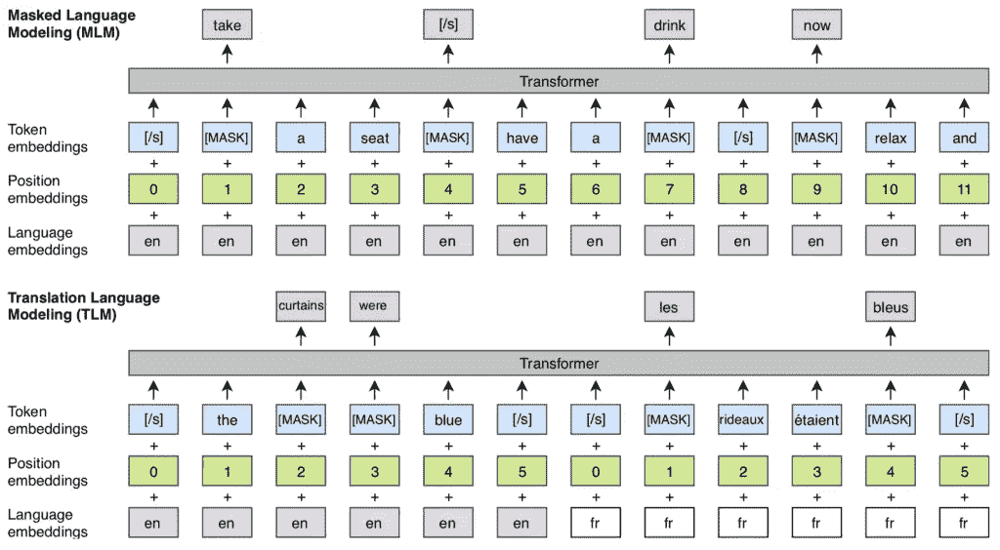
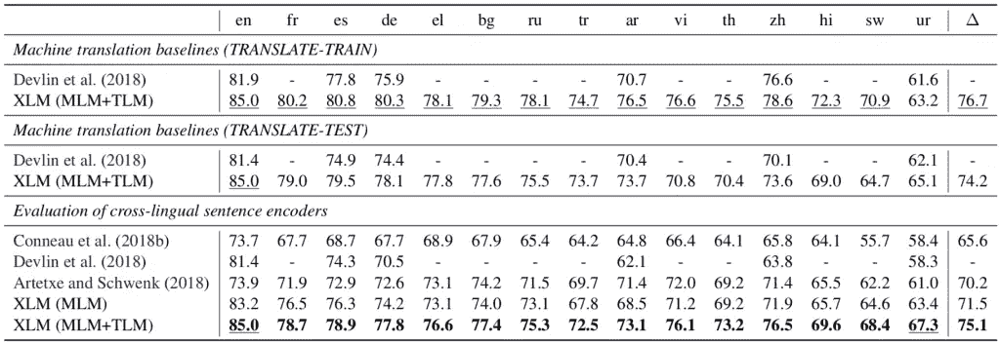
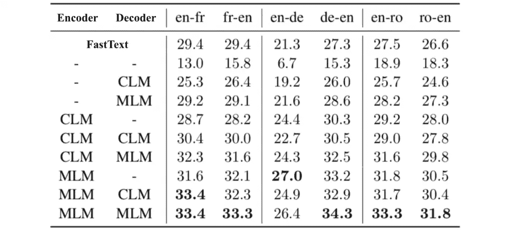

# XLM——增强跨语言语言模型的 BERT

> 原文：<https://towardsdatascience.com/xlm-enhancing-bert-for-cross-lingual-language-model-5aeed9e6f14b?source=collection_archive---------5----------------------->

## 跨语言语言模型预训练

注意模型，尤其是 BERT，在自然语言处理中，无论是在分类还是翻译任务中，都取得了令人鼓舞的结果。脸书·艾的一篇名为《XLM》的新论文提出了一个改进版本的 BERT，以在两种类型的任务中实现最先进的结果。

XLM 使用一种已知的预处理技术(BPE)和一种具有 BERT 的双语训练机制，以便学习不同语言中单词之间的关系。在跨语言分类任务(15 种语言的句子蕴涵)中，该模型优于其他模型，并且当预训练模型用于翻译模型的初始化时，显著提高了机器翻译。

# 背景

XLM 基于几个关键概念:

[2017 年发明的变形金刚](https://arxiv.org/abs/1706.03762)引入了一种注意力机制，可以同时处理整个文本输入，以学习单词(或子单词)之间的上下文关系。转换器包括两个部分——编码器，用于读取文本输入并生成其横向表示(例如，每个单词的向量),以及解码器，用于根据该表示生成翻译后的文本。关于变形金刚的深入评论可以在[这里](https://jalammar.github.io/illustrated-transformer/)找到。

虽然 vanilla Transformer 只有每个单词的有限上下文，即只有每个单词的前身，但在 2018 年，BERT 模型向前迈进了一步。它使用转换器的编码器来学习语言模型，方法是屏蔽(丢弃)一些单词，然后尝试预测它们，允许它使用整个上下文，即被屏蔽单词左右的单词。

由于注意力模块中所有标记的并发处理，该模型需要关于每个标记的位置的更多信息。通过基于其位置(例如正弦函数)向每个记号添加固定值(称为位置编码的步骤)，网络可以成功地学习记号之间的关系。我们对 BERT 的总结可以在[这里](https://www.lyrn.ai/2018/11/07/explained-bert-state-of-the-art-language-model-for-nlp/)找到。

2018 年， [Lample et al.](https://arxiv.org/abs/1804.07755) 提出了结合 Transformers 和基于统计短语模型(PBSMT)的翻译模型。后者是不同语言中成对短语的概率表。本文中的一个重要概念是回译，即把一个句子翻译成目标语言，然后再回到源语言。这个概念使得能够以监督的方式使用单语数据集，单语数据集比双语数据集更大、更常见。Lample 等人的结论之一是，标记嵌入的初始化对于模型的成功非常重要，尤其是在使用回译时。虽然作者使用 [FastText](https://github.com/facebookresearch/fastText) 使用了“简单”的单词嵌入，但他们认为“更强大的语言模型可能会进一步改善我们的结果”。

# XLM 是如何运作的

该论文提出了两个创新的想法——一种新的用于**多语言分类任务**的 BERT 训练技术和使用 BERT 作为**机器翻译模型**的初始化。

## 用于分类的跨语言 BERT

Tough BERT 接受过 100 多种语言的训练，它并没有针对多语言模型进行优化——大多数词汇没有在语言之间共享，因此共享的知识是有限的。为了克服这一点，XLM 对伯特做了如下修改:

首先，它不使用单词或字符作为模型的输入，而是使用字节对编码(BPE ),将输入拆分为所有语言中最常见的子单词，从而增加语言之间的共享词汇。这是一种常见的预处理算法，在这里可以找到它的摘要[。](https://www.lyrn.ai/2019/01/06/massively-multilingual-sentence-embeddings-for-zero-shot-transfer/#appendix-a-bpe)

其次，它以两种方式升级了 BERT 架构:

1.  每个训练样本都由两种语言的相同文本组成，而在 BERT 中，每个样本都是从一种语言构建的。与在 BERT 中一样，该模型的目标是预测屏蔽的标记，但是，在新的架构中，该模型可以使用一种语言的上下文来预测另一种语言的标记，因为不同的单词是每种语言中的屏蔽单词(它们是随机选择的)。
2.  该模型还分别接收语言 ID 和每种语言中的标记顺序，即位置编码。新的元数据帮助模型学习不同语言中相关标记之间的关系。

升级后的 BERT 被称为翻译语言建模(TLM)，而具有 BPE 输入的“普通”BERT 被称为屏蔽语言建模(MLM)。

完整的模型是通过训练 MLM 和 TLM 并在他们之间交替来训练的。

Comparison of a single language modeling (MLM) similar to BERT, and the proposed dual-language modeling (TLM). Source: [XLM](https://arxiv.org/abs/1901.07291)

为了评估该模型的贡献，本文使用包含 15 种语言句子的 XNLI 数据集，给出了该模型在句子蕴含任务(句子间关系分类)上的结果。在所有配置中，该模型明显优于其他著名模型，如 [Artetxe et al.](https://www.lyrn.ai/2019/01/06/massively-multilingual-sentence-embeddings-for-zero-shot-transfer/) 和 BERT——仅在英语上训练，在所有配置上测试(Zero-Shot)，在翻译成英语的数据上训练(Translate-Train)，在英语上训练，在翻译的数据上测试(Translate-Test)。这些结果被认为是最先进的。

Comparison of XNLI results (accuracy) of prominent models in different training and testing configurations. Each column represents a language. Source: [XLM](https://arxiv.org/abs/1901.07291)

## 用 MLM 初始化翻译模型

本文介绍了 BERT 的另一个贡献，更准确地说是 MLM 模型的贡献——作为一种更好的初始化技术用于 [Lample et al.](https://arxiv.org/abs/1804.07755) 翻译模型。不是使用快速文本嵌入，而是从预训练的 MLM 中获取标记的初始嵌入，并馈送到翻译模型中。

通过使用这些嵌入来初始化翻译模型(使用 Transformer)的编码器和解码器的令牌，翻译质量提高了 7 BLEU，如下表所示。

Translation results with different initialization techniques. CLM stands for Causal Language Modeling in which a given word is trained based only on the previous words and not using the masking technique. Source: [XLM](https://arxiv.org/abs/1901.07291)

注意:该论文还表明，训练跨语言语言模型对低资源语言非常有益，因为它们可以利用来自其他语言的数据，特别是主要由于 BPE 预处理而类似的语言。这个结论和 [Artetxe 等人](https://arxiv.org/abs/1812.10464)的结论类似(我们的总结可以在这里找到)。

# 计算注意事项

模型是在 PyTorch 中实现的，可以在这里找到，包括预训练的模型。训练是用 64 个 Volta GPUs 完成语言建模任务，8 个 GPU 完成翻译任务，尽管持续时间没有规定。在论文的第 5.1 节和第 5.2 节中可以找到确切的实施细节。

# 结论

正如最近的许多研究一样，这篇论文展示了语言模型和迁移学习，特别是 BERT，在许多 NLP 任务中提高性能的能力。通过使用简单而智能的 BERT 调整，它可以胜过其他跨语言分类模型，并显著改善翻译模型。

有趣的是，本文中使用的翻译模型和用于初始化的 MLM 模型都是基于 Transformer 的。可以肯定的是，我们会看到更多这种组合，比如使用新的 [Transformer-XL](https://www.lyrn.ai/2019/01/16/transformer-xl-sota-language-model/) 进行初始化。

*要了解最新的深度学习研究，请订阅我在* [*LyrnAI*](https://www.lyrn.ai) 上的简讯