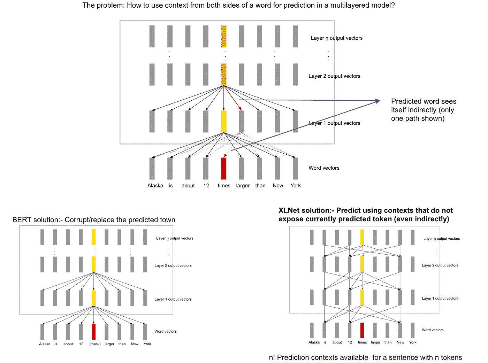
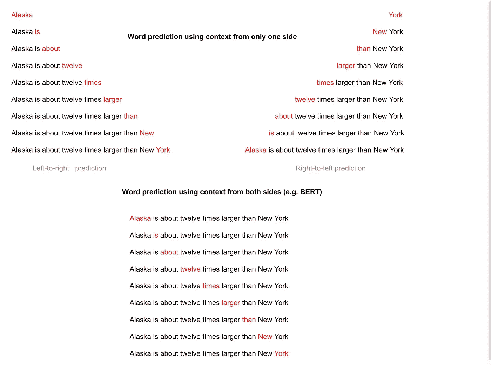
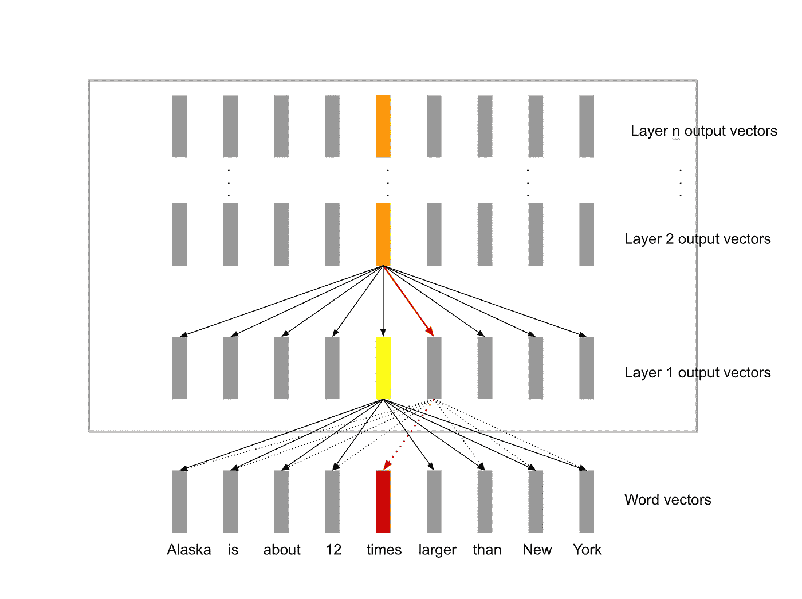
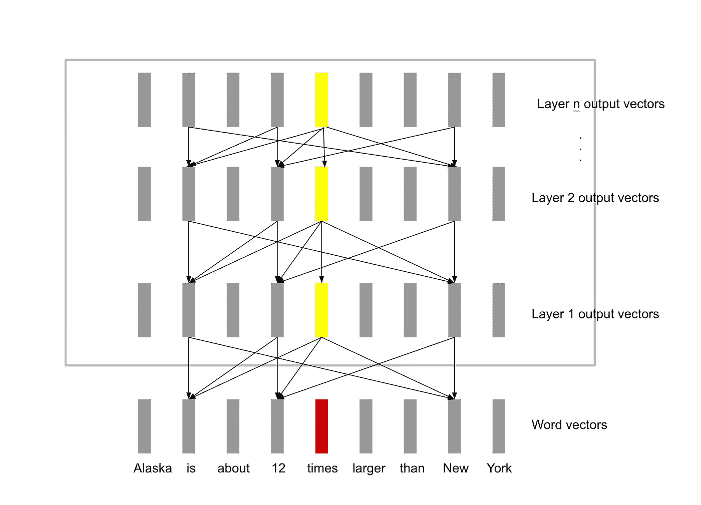
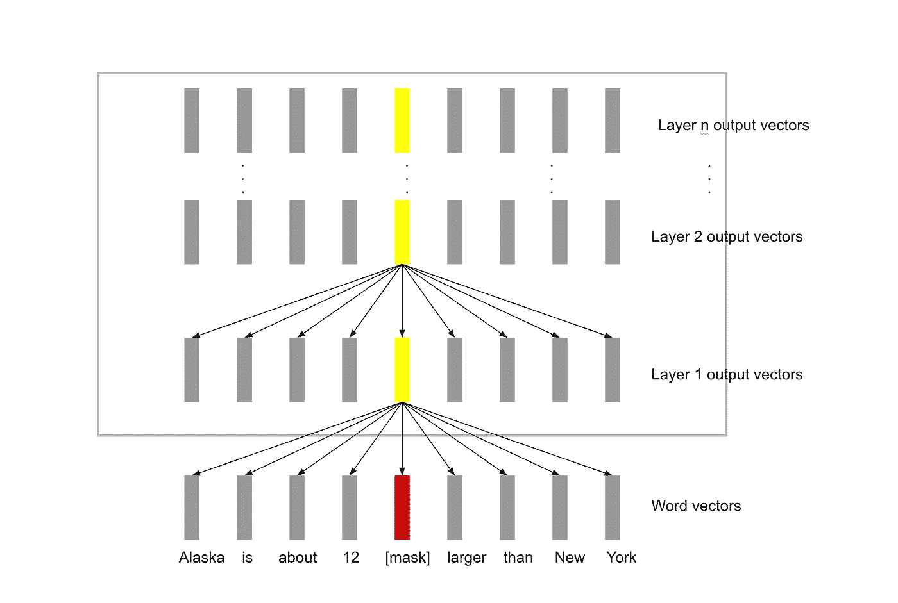
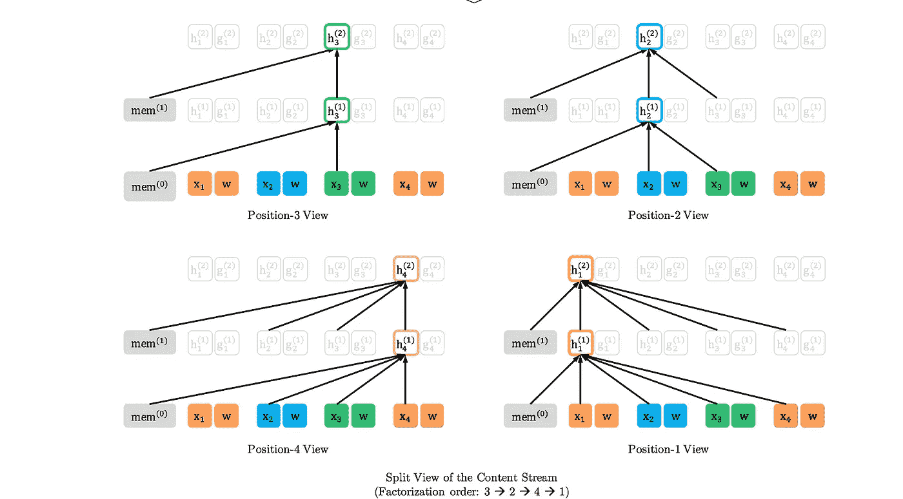
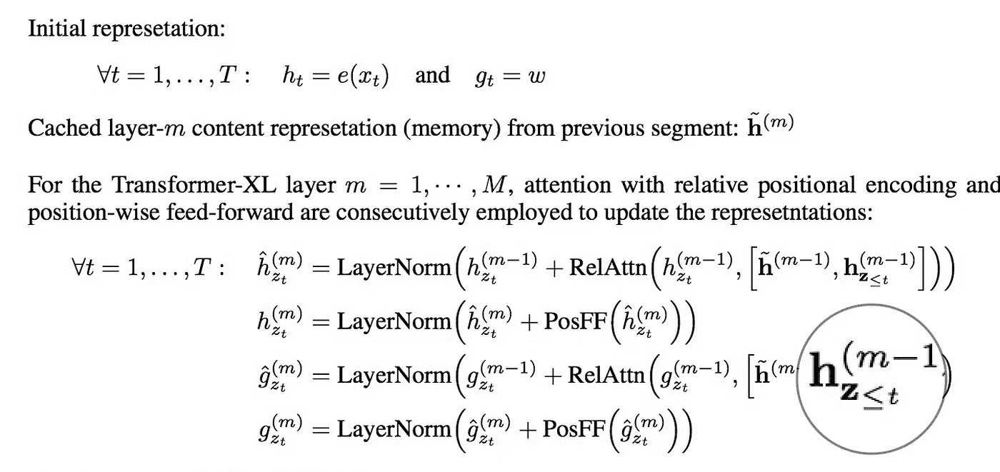

# XLNet——一个聪明的语言建模解决方案

> 原文：<https://towardsdatascience.com/xlnet-a-clever-language-modeling-solution-ab41e87798b0?source=collection_archive---------8----------------------->

## 创建捕捉深层双向上下文的单词表示

Language modeling with a deep model — the challenge and a solution

## TL；速度三角形定位法(dead reckoning)

通过在大型语料库中预测每个单词在其句子上下文中的概率分布，对语言中单词序列的概率分布进行无监督学习，已经被证明对于创建模型和单词表示是有用的，然后可以针对下游 NLP 任务对这些模型和单词表示进行微调。在为下游语法和语义任务微调模型时，两个因素似乎对提高性能起着关键作用:

*   ***一个词的表征是否捕捉到了该词在句子中的全部语境？*** 全语境是句子中一个单词前后的整个单词序列*(双向语境)*
*   模型是否是多层的，以输出一个单词的多个表示，每层一个？已经发现，来自模型的不同层的单词的表示对于下游的句法和语义任务是有用的

满足这两个设计因素提出了一个挑战*(下面详细描述)*，XLNet 通过一个巧妙的解决方案解决了这个问题。这使得 XLNet 在某种程度上比先前的现有技术模型 BERT 执行得更好，该模型满足上述两个要求，但有一些不足。然而，与 BERT 相比，XLNet 需要更多的计算能力和内存 *(GPU/TPU 内存)*。减少计算/内存需求等方面的改进是否会使 XLNet 在实际意义上足够好，以取代 BERT 在所有 NLP 任务中的优势，仍有待观察。)。

**创建深度双向上下文表示的挑战**

语言建模，本质上是通过在大型语料库中预测单词在句子上下文中的概率分布来学习语言中单词序列的概率分布，可以通过多种方式完成，如下图所示

*   通过从左到右或从右到左扫描句子，使用前面的所有单词预测下一个单词。
*   使用句子中单词周围的所有单词预测单词。

在上面的任何一种情况下，都要考虑句子中单词的顺序*(或位置)**(忽略位置会将其退化为单词袋模型，如 word2vec、Glove 等。)*

在下游任务中，利用单词周围的所有单词来预测单词的模型往往比单侧上下文预测模型做得更好，正如人们直观地预期的那样——双向上下文比仅来自一侧的上下文拥有更多的信息。

预测单词在句子中的位置，如下图所示，比如单词“times”涉及*(不考虑语言模型类型)*，为其计算一个向量作为其邻居的函数，但不包括其本身*(如果我们包括单词本身，预测就变得微不足道)*。学习过程本质上是“拖动”那些相邻的向量，使得计算的向量*(预测)*在那个位置更接近实际的单词向量。代表“时间”的单词 vector 反过来又涉及到对它的邻居的预测，例如“阿拉斯加”。因此，在一般意义上，训练过程部分地基于它们的位置，以不同的数量拖动一起出现的单词，并且该过程*(神奇地)*倾向于将语义上接近的单词一起带到高维空间*(该过程与 word2vec 之类的* [*单词袋模型中发生的事情惊人地接近，尽管在这种模型中不考虑位置*](https://www.quora.com/How-does-word2vec-work-Can-someone-walk-through-a-specific-example/answer/Ajit-Rajasekharan) *)。*此外，该模型在训练期间学习参数，使其能够为句子中的单词创建上下文敏感的嵌入，包括在训练期间从未见过的单词*(在像 BERT 和 XLNet 这样的模型中)*。

Language modeling choices — one-sided context vs full context of both sides to predict a word

然而，如果我们向模型添加多个层来创建单词的深层表示，那么训练一个使用来自两侧的上下文的模型会带来挑战。这在下面基于注意力的模型的图示中是显而易见的——使用单词两侧的上下文来预测单词将间接使得能够从第二层起看到单词本身。

例如，在基于注意力的模型的第 1 层中,“时间”的向量的组成是其所有邻居的加权和，不包括其自身。即第一层的输出计算为“时间”*(黄色显示)*不包括“时间”。然而，在第 2 层中，来自第 1 层的隐藏状态的加权和间接包括“时间”的向量，通过与“黄色”向量相邻的所有隐藏状态向量*(为了避免混乱，只有一个间接路径显示为红色)*

The problem of using bidirectional context in a multilayered setting — Prediction of vector for word “times” can see the vector for “times” indirectly from layer 2 onwards — the red arrow path is one example of the “times” vector indirectly seeing itself

我们可以通过在层 1 中为“时间”选择隐藏状态周围的隐藏状态的子集，来避免字预测在多层模型中间接看到自身的问题，使得它们不依赖于“时间”的字向量。这种手工制作的实例如下所示

A hand crafted dependency path where a token’s prediction (“times”) does not see itself in a multilayered model

然而，为了在单词“times”的预测中捕获整个双向上下文，我们需要双向上下文的更多子集来训练模型，其中单词看不到它自己。

XLNet 通过巧妙地选择像上面手工制作的这样的子集上下文来解决这个问题，这样一个单词在被预测时就不会“看到自己”。在上面的例子中，我们有 9 个单词*(现在假设这些单词没有被进一步分成子词，也就是说它们在词汇表中是存在的)*。我们有 9 个！排列——362，880。如果我们从这个排列中取样，选择一个排列，比如 612934578，然后应用下面的规则

*   从序列 612934578 中一次选取一个数字，并通过仅使用序列*中在该数字之前的所有字向量来计算该位置的第 1 层向量(即，字 6 和 1 用于计算 2，字 6、1、2 和 9 用于计算 3 等等)。)*
*   为了说明挑选标记 5(“时间”)作为要预测的标记，使用在上面排列顺序中在它之前的所有标记，即单词 6、1、2、9、3 和 4，来计算“时间”的向量。
*   现在应用与上面相同的程序来计算第二层向量。例如，对应于 612934 处的令牌的层 1 中的那些向量输出以及“时间”的层 1 中的隐藏状态，来计算“时间”的层 2 向量。
*   通过使用不允许在置换序列*(注意，该置换序列可以包括句子中预测单词两侧的单词)*中位于它之前的单词看到它的规则，并且只有在置换序列中位于它之前的那些单词才被单词在其预测中使用，该模型确保预测的单词永远不会被间接看到，而不管模型中的层数如何。

要注意的一个关键点是，置换序列仅用于决定向量计算中涉及哪些记号。句子中单词的顺序是不变的——每个单词的位置都是由一个相对位置编码方案固定的*(我们稍后将回到这一点)*。

总之，通过使用单词的双向上下文的子集来预测单词在句子中的位置，并考虑到使用上面的排列扫描规则单词本身是看不见的，我们可以避免单词在多层上下文中看见自己。然而，这种方案要求我们采样足够多的排列，以便我们充分利用双向上下文。这在计算上仍然很昂贵，所以只对句子中单词的子集进行预测*(这是模型中的超参数****K****)*——在论文中，句子中大约 1/6 (~16%)的单词被预测。有趣的是，这与 BERT 中预测的句子中的单词数量大致相同。

然而，BERT 通过屏蔽/破坏那些预测的单词来避开这个问题。在每一层对句子中所有单词的计算预测是 BERT 中几个常数的矩阵乘法。相比之下，XLNet 必须对它采样的每个置换和置换序列中的每个位置进行乘法运算。

BERT corrupts/replaces ~15% of tokens with another token [mask]. In the illustration “time” is replaced by “[mask]”. The prediction of “time” cannot see it either directly or indirectly since it has been replaced. The hidden states adjacent to the yellow shaded vector in layer 1 see all the word vectors including the masked one in the input — it is not explicitly shown to avoid clutter

然而，BERT 的屏蔽方法有几个缺点，这是 XLNet 中没有的。

*   如果“New”和“York”在上面的句子中被屏蔽，那么“New”的预测将独立于“York ”,反之亦然。虽然这看起来像是一个人为的例子，但 XLNet 并没有做出这样的假设，这可能是它在某些任务中表现优于 BERT 的部分原因。这也许是 XLNet 在答案是短语的问答任务中表现更好的原因之一。
*   另一个是“屏蔽”标记是人为引入输入的标记，它只在训练期间出现，而不是微调。所以这里有一个差异。

基于置换的依赖规则来捕获双向上下文可能是 XLNet 的独特之处。它还利用先前的 work Transformer XL 来处理长句，通过跨固定段转移状态*(做了微小的修改以确保位置信息是相对的而不是绝对的)*。XLNet 缓存段中的图层状态，以便在后续段中重用。这使得 XLNet 能够处理任意长的句子。相比之下，BERT 只能处理固定长度的数据段。尽管人们可以在 BERT 中选择任意长的固定长度段，但由于 GPU/TPU 内存要求，这变得不切实际。

最后，这是基于置换的依赖性规则的实现细节-为了使用在置换序列中位于单词之前的项来预测单词，需要将被预测的目标位置的位置信息纳入预测中，以使用相同的邻居集合来消除两个位置处的预测的歧义。此外，虽然用于预测位置的隐藏状态向量不能包括该位置处的单词向量，但是我们还需要一个在预测其他向量时包括该位置的隐藏状态向量。这需要模型为每个位置学习两个向量，h 和 g，如下所示。 *h* 是下面层中的字向量和其他隐藏状态向量的函数。 *g* 是隐藏状态向量和预测单词的位置信息的函数。

The figure above from [XLNet](https://arxiv.org/pdf/1906.08237.pdf) paper shows the computation of the hidden states for a word that looks at itself in addition to a subset of its neighbors. Note these vectors are not predicted. They are used in the computation of the hidden vectors g, taking into account not to include hidden state vectors that see that see the word being predicted. This is accomplished using the permutation sequence rule described earlier

The figure above from [XLNet](https://arxiv.org/pdf/1906.08237.pdf) paper shows computation of the hidden vectors “g” that are predicted. Note g1 in layer 1 is only dependent on its position info (w) and not its vector x1\. Also g1 in layer 2 is dependent on hidden states h2 h3 and h4, all of which did not see x1 because of the permutation order 3,2,4,1\. 1 cannot be seen by 3,2,4 because they precede it in the sequence 3,2,4,1

## 试用模型

考虑到在评估任务上微调模型所需的计算和内存资源*(具有足够板载内存的 GPU/TPUs)*，这可能对我们许多人来说有点挑战，这与 BERT *(我们可以在单个 GPU 机器上对 BERT 进行微调，以完成 NER 任务，平均大约需要一两个小时)*。有一个[笔记本](https://colab.research.google.com/github/zihangdai/xlnet/blob/master/notebooks/colab_imdb_gpu.ipynb)来测试分类任务*上的模型(我只能在批量为 2 的情况下运行它，并获得 90%的准确率——他们报告在批量为 8 的情况下准确率为 92%)。最近有一个 pytorch 版本,这将有助于理解这个模型是如何工作的。*

奇怪的是，像 NER *(BERT 是 NER 目前的最新技术)*这样的序列标记任务没有基准测试结果——也许我们很快就会看到一些标记任务的结果。

**下面的部分可以跳过。**

*为什么单词不能在预测中看到自己？*

仅使用左侧上下文预测下一个单词*的语言模型的最大似然估计(例如，给定单词“Alaska 大约是 12”，预测“times”)。*

Equation from [XLNet](https://arxiv.org/pdf/1906.08237.pdf) paper. This essentially says find those parameters theta, that maximizes the probability of the word “times” given “Alaska is about 12”.

需要注意的关键点是，h 的计算是“times”之前所有单词的函数，而不是它本身。如果我们在 h 的计算中也包括“时间”,模型可以轻松地学习，给定 e(xt)是“时间”的嵌入。

BERT 的屏蔽目标不包括单词本身，而仅包括替换的屏蔽标记。然后，给定损坏的句子“阿拉斯加比纽约大大约 12[mask]”*(假设只有一个令牌被屏蔽)*，它预测实际的单词“times”

Equation from [XLNet](https://arxiv.org/pdf/1906.08237.pdf) paper. The BERT objective. mt is 1 only for masked tokens in a sentence which is about 15% of words. Note H includes all words but the predicted word is replaced by the mask token. e(xt) is the embedding for the word “times”. The goal is to choose theta so that H(x^) is close to the embedding for “times” given all the words in the corrupted sentence.

本质上，BERT 通过用屏蔽的标记替换预测的单词并在训练过程中重建它们，绕过了看见本身的问题。然而，H 的计算包括仅在预训练期间出现的掩码标记。

XLNet 每次预测单词时都使用双向上下文的子集，但通过确保“g”的计算只包括看不到被预测单词的标记来避免“看到自己”的问题 *(g 是它周围的标记子集和预测单词位置的函数)*。同样，很容易看到，如果 g 是被预测单词的函数，学习问题变得微不足道，给定 e(x)包括要预测的标记的嵌入。

Equation from [XLNet](https://arxiv.org/pdf/1906.08237.pdf) paper. XLNet prediction of token at a position.

上式中的 g 计算如下

Equation from [XLNet](https://arxiv.org/pdf/1906.08237.pdf) paper. The highlighted state vector must be a strict inequality in the subscript — must be a typo (unless I am missing something very basic). **Updated 11 July 2019.** One of the paper authors confirmed this was a typo and said it will be fixed in a revision (thank you Zhilin for responding to my mail)

## 参考

1.  [XLNet:面向语言理解的广义自回归预训练，杨等，2019 年 6 月](https://arxiv.org/pdf/1906.08237.pdf)
2.  [Transformer-XL:超越定长语境的专注语言模型，戴子航等，2019 年 1 月](https://arxiv.org/pdf/1901.02860.pdf)
3.  [BERT:用于语言理解的深度双向转换器的预训练，Devlin 等人，2018 年 10 月](https://arxiv.org/abs/1810.04805)
4.  [基于 BERT 模型的回顾](/a-review-of-bert-based-models-4ffdc0f15d58)
5.  [解构伯特](/deconstructing-bert-reveals-clues-to-its-state-of-art-performance-in-nlp-tasks-76a7e828c0f1)

*手动从 Quora*[*https://qr.ae/TWtVmo*](https://qr.ae/TWtVmo)*(自动导入因故失败)*