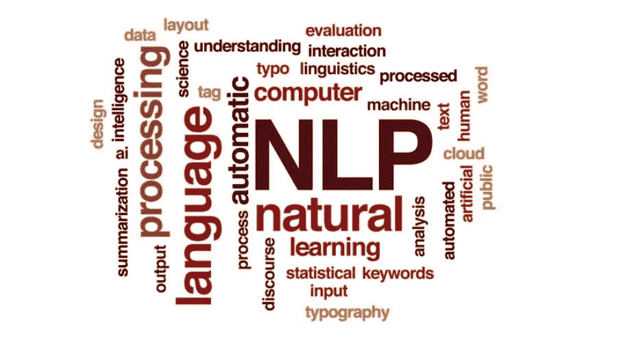
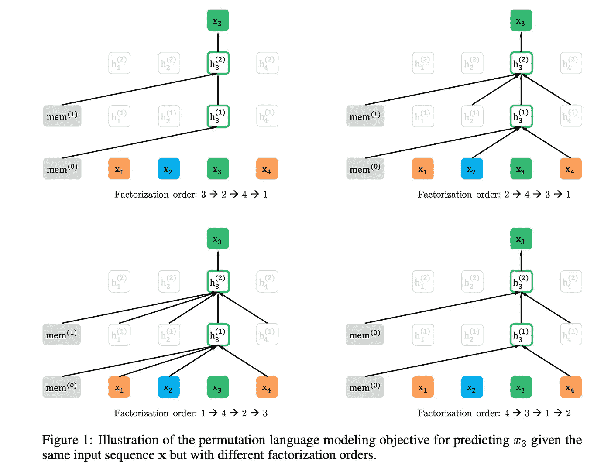
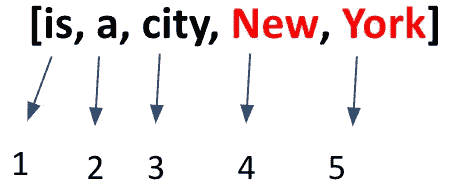

# XLNET 深入浅出的解释！！

> 原文：<https://towardsdatascience.com/xlnet-explained-in-simple-terms-255b9fb2c97c?source=collection_archive---------7----------------------->

在这篇文章中，我很高兴带你了解谷歌大脑和 CMU 最近发表的自然语言理解算法——XLNET。该算法是 NLP 中的一个突破，因为它在 20 个不同的任务中超过了最先进的 [BERT 算法](/bert-explained-state-of-the-art-language-model-for-nlp-f8b21a9b6270)。来吧，让我们探索这种新算法能为世界带来什么！！

这篇文章的结构如下-

*   通过伯特简介，
*   理解伯特的缺点
*   了解变压器架构
*   深入 XLNET

# 伯特建筑

BERT 代表“来自变压器的双向编码器表示”。它是一种神经网络架构，可以使用[转换器](https://ai.googleblog.com/2017/08/transformer-novel-neural-network.html)对文本数据中的双向上下文进行建模。

**什么是双向的？**

*   传统方法在给定前“n”个记号的情况下预测当前记号，或者在给定当前记号之后的所有记号的情况下预测当前记号。
*   在预测当前标记时，没有一种方法一次获取前一个和下一个标记。
*   BERT 克服了这个缺点，因为它考虑了前一个和下一个标记来预测当前标记。这个属性被称为“双向的”。

双向性是通过一种叫做“屏蔽语言建模”的现象实现的。该模型是预先训练的，可以用于一套令牌和句子级别的任务。

**什么是蒙面语言建模(MLM)？**

为了实现双向表示，输入句子中 15%的标记被随机屏蔽。变压器被训练来预测屏蔽字。例如，考虑句子——“猫坐在墙上”。伯特的输入将是“面具上的猫”。

BERT 也适用于下一个句子预测任务，因为它是用成对的句子预先训练的，其中句子 B 有 50%的时间跟随 A，而其他时间不跟随。一旦该模型被预先训练，它就被微调用于特定的应用，例如问题回答、句子完成、检查两个句子的语义等价等。

**伯特的缺点**

BERT 算法有两个主要的局限性。他们是

1.  BERT 用掩码破坏输入，并且遭受预训练-微调差异。在实际应用中，我们没有被屏蔽的输入。伯特在现实中是如何处理的还不清楚。
2.  BERT 忽略了屏蔽位置之间的相关性。例如，考虑句子“纽约是一座城市”，输入给 BERT 的是“[MASK] [MASK]是一座城市”。伯特的目标是

> *log p(New |是城市)+ log p(York |是城市)*

从上面的函数可以看出，学习“New”和“York”之间没有依赖关系。因此，BERT 可以得出类似“新旧金山是一座城市”的预测。

# 变压器架构

XLNET 将最先进的自回归模型 Transformer-XL 的思想整合到预训练中。Transformer 是 google 用于语言翻译的模型。基本都是围绕着“注意力”展开的。这是一个编码器-解码器模型，其中你将一个序列映射到另一个序列——英语到法语。要将英语中的句子翻译成法语，解码器需要查看**整个句子**以在任意时间点选择性地从中提取信息(因为英语中的标记顺序不需要与法语中的相同)。因此，**编码器的所有隐藏状态**对于解码器都是可用的。

解码器如何知道在任何一点应该查找哪个隐藏状态？

它通过**加权**编码器的每个隐藏状态。权重由简单的前馈神经网络确定。在本文的术语中，这些被称为注意力权重，或*值*。这里有一个[链接](https://jalammar.github.io/visualizing-neural-machine-translation-mechanics-of-seq2seq-models-with-attention/)到注意力权重的精彩解释。本文中使用的一些术语是

*   Query (Q) —解码器的隐藏状态。
*   Keys (K) —编码器的隐藏状态。
*   值(V) —处理查询时的注意力权重。

两个重要的东西从 Transformer-XL 集成到 XLNET 中。

*   位置编码——跟踪每个标记在序列中的位置(在后面的章节中将会知道为什么我们要这样做)
*   段重现(segment recurrence )-缓存每层内存中第一个段的隐藏状态，并相应地更新注意力。它允许每个段重用内存。

现在，我们好钻研 XLNET:)

# XL net——NLU 的广义自回归模型

XLNET 是一个广义的自回归模型，其中下一个令牌依赖于所有先前的令牌。XLNET 是“通用的”，因为它通过一种称为“置换语言建模”的机制来捕获双向上下文。它集成了自回归模型和双向上下文建模的思想，同时克服了 BERT 的缺点。它在 20 个任务上超过了 BERT，通常在问题回答、自然语言推理、情感分析和文档排序等任务上超过 BERT 很多。

**置换语言建模(PLM)**

PLM 是通过对句子中所有可能的单词排列训练一个自回归模型来捕捉双向上下文的思想。XLNET 不是固定的左右或左右建模，而是在序列的所有可能排列上最大化期望对数似然。在期望中，每个位置学习利用来自所有位置的上下文信息，从而捕获双向上下文。不需要[屏蔽]，输入数据也不会被破坏。

上图展示了 PLM。假设我们正在学习 x3(句子中第三个位置的标记)。PLM 训练了一个自回归模型，其中包含句子中标记的各种排列，因此在所有这些排列结束时，我们将学习 x3，给定句子中的所有其他单词。在上图中，我们可以看到下一层仅将置换序列中 x3 之前的标记作为输入。这样也实现了自回归。

【XLNET 和 BERT 的比较

例如，考虑“纽约是一个城市”这一行，我们需要预测“纽约”。让我们假设当前的排列是

伯特将彼此独立地预测记号 4 和 5。而 XLNET 作为一个自回归模型，按照序列的顺序进行预测。即首先预测令牌 4，然后预测令牌 5。

在这种情况下，XLNET 将计算

log P(New | **是座城市** ) + log P(York | **New，是座城市**)

而伯特会减少到

log P(New | **是城市** ) + log P(York | **是城市**)

# XLNET 是如何用变压器实现的？

我们看到 transformer 查看整个句子的隐藏表示来进行预测。为了实现 XLNET，转换器被调整为只看**要预测的**之前的**标记的隐藏表示。回想一下，当输入模型时，我们嵌入了每个标记的位置信息。假设如果要预测令牌 3，则后续层**

*   **无法**从输入层访问令牌 3 的内容。
*   **能不能**只访问它之前的令牌的内容，只访问令牌 3 的位置信息。

当计算关注度时，根据上述原理更新 Q、K 和 V。

# 使用 XLNET 进行的实验

以下是本文作者测试 XLNET 的数据集。

*   RACE 数据集—来自英语考试的 100K 个问题，XLNET 在准确性上超过最佳模型 7.6 个点。
*   SQuAD —阅读理解任务— XLNET 比 BERT 高出 7 分。
*   文本分类——在各种数据集上明显优于 BERT(更多详细信息，请参见论文)。
*   GLUE 数据集—包含 9 个 NLU 任务—纸上报告的数字，XLNET 优于 BERT。
*   ClueWeb09-B 数据集——用于评估文档排序的性能，XLNET 优于 BERT。

# 结论

我希望你喜欢阅读这篇博客。如果你有任何问题，请在下面发表。

*原载于 2019 年 8 月 1 日*[*【https://medium.com】*](https://medium.com/@av2845/xlnet-at-a-quick-glance-to-begin-with-f97b1834baaf)*。*